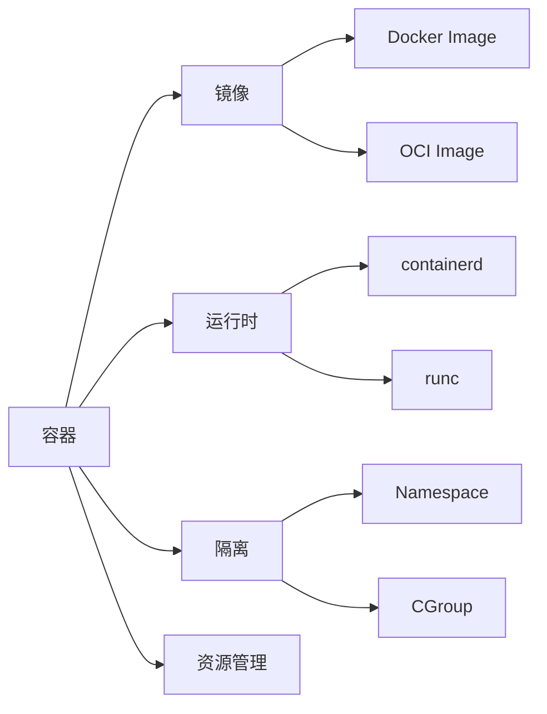
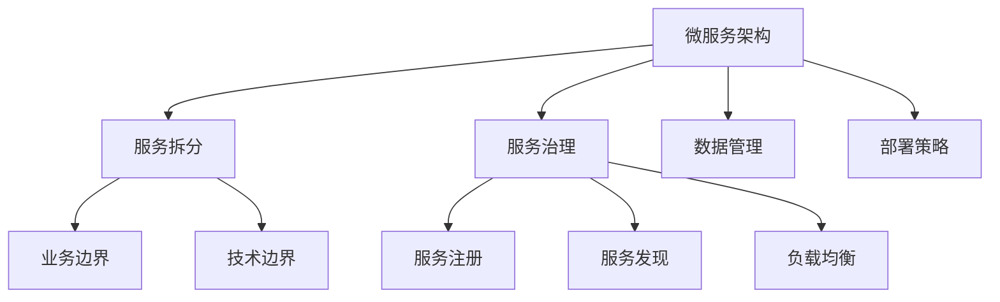
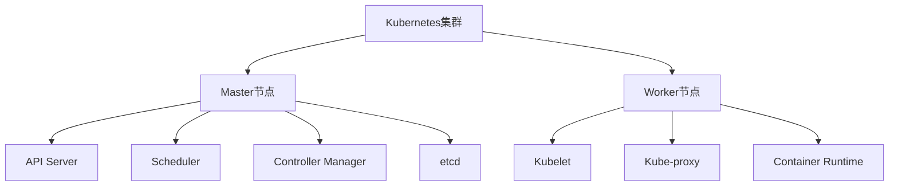
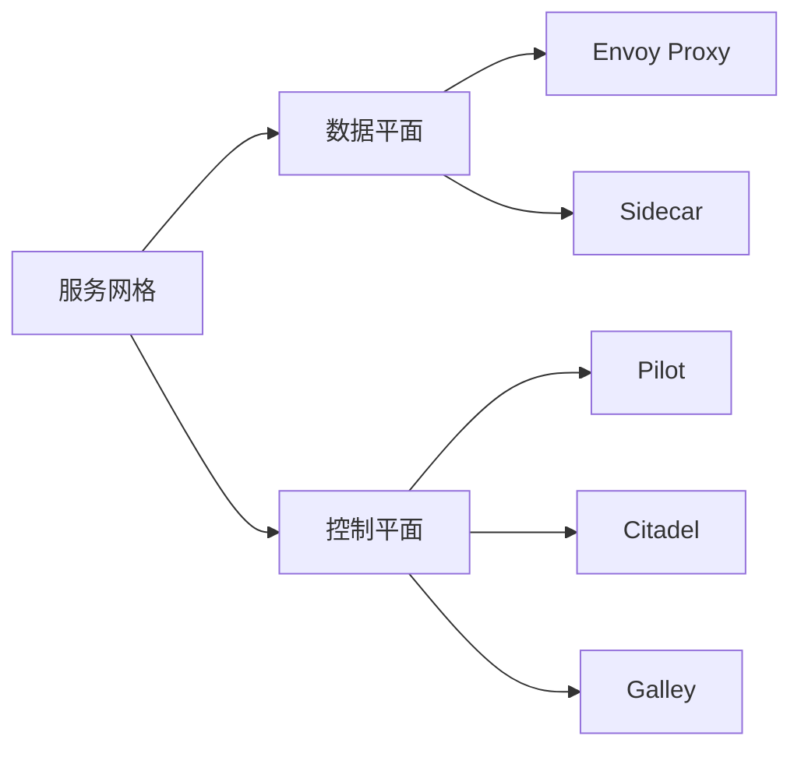
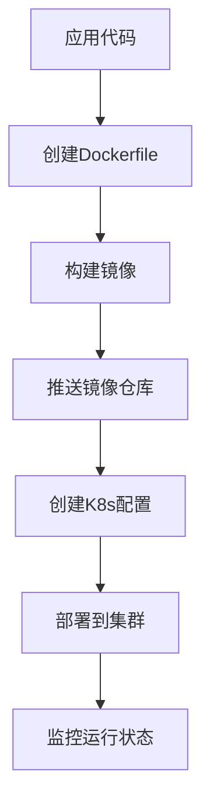

# 多表征表达方式总结


<!-- TOC START -->

- [多表征表达方式总结](#多表征表达方式总结)
  - [Multi-representation Expression Methods Summary](#multi-representation-expression-methods-summary)
  - [🎯 多表征表达概述 / Multi-representation Expression Overview](#-多表征表达概述-multi-representation-expression-overview)
    - [定义](#定义)
    - [核心价值](#核心价值)
  - [🧮 数学表征 / Mathematical Representation](#-数学表征-mathematical-representation)
    - [形式化定义](#形式化定义)
      - [容器四元组模型](#容器四元组模型)
      - [微服务六元组模型](#微服务六元组模型)
    - [数学公式](#数学公式)
      - [资源利用率公式](#资源利用率公式)
      - [性能指标公式](#性能指标公式)
    - [逻辑证明](#逻辑证明)
      - [CAP定理证明](#cap定理证明)
  - [📊 图表表征 / Graphical Representation](#-图表表征-graphical-representation)
    - [概念图](#概念图)
      - [容器技术概念关系图](#容器技术概念关系图)
      - [微服务架构概念图](#微服务架构概念图)
    - [架构图](#架构图)
      - [Kubernetes架构图](#kubernetes架构图)
      - [服务网格架构图](#服务网格架构图)
    - [流程图](#流程图)
      - [容器部署流程](#容器部署流程)
  - [💻 代码表征 / Code Representation](#-代码表征-code-representation)
    - [伪代码](#伪代码)
      - [容器调度算法](#容器调度算法)
      - [服务发现算法](#服务发现算法)
    - [配置文件](#配置文件)
      - [Kubernetes Deployment配置](#kubernetes-deployment配置)
      - [Docker Compose配置](#docker-compose配置)
  - [📚 文档表征 / Document Representation](#-文档表征-document-representation)
    - [技术文档](#技术文档)
      - [API设计规范](#api设计规范)
      - [部署文档](#部署文档)
    - [最佳实践](#最佳实践)
      - [容器化最佳实践](#容器化最佳实践)
      - [微服务最佳实践](#微服务最佳实践)
  - [🔗 多表征一致性验证 / Multi-representation Consistency Verification](#-多表征一致性验证-multi-representation-consistency-verification)
    - [验证标准](#验证标准)
      - [数学表征一致性](#数学表征一致性)
      - [图表表征一致性](#图表表征一致性)
      - [代码表征一致性](#代码表征一致性)
      - [文档表征一致性](#文档表征一致性)
  - [📊 多表征表达效果评估 / Multi-representation Expression Effectiveness](#-多表征表达效果评估-multi-representation-expression-effectiveness)
    - [评估维度](#评估维度)
      - [完整性评估](#完整性评估)
      - [一致性评估](#一致性评估)
      - [可用性评估](#可用性评估)
  - [🚀 多表征表达优化建议 / Multi-representation Expression Optimization](#-多表征表达优化建议-multi-representation-expression-optimization)
    - [短期优化 (1-3个月)](#短期优化-1-3个月)
      - [一致性优化](#一致性优化)
      - [内容深化](#内容深化)
    - [中期优化 (3-6个月)](#中期优化-3-6个月)
      - [交互性增强](#交互性增强)
      - [个性化定制](#个性化定制)
  - [🔚 总结 / Summary](#-总结-summary)
    - [多表征表达优势](#多表征表达优势)
    - [应用价值](#应用价值)
    - [发展前景](#发展前景)

<!-- TOC END -->

## Multi-representation Expression Methods Summary

**版本**: v1.0  
**创建日期**: 2024年12月  
**状态**: 多表征表达方式总结完成  

---

## 🎯 多表征表达概述 / Multi-representation Expression Overview

### 定义

多表征表达是指通过数学、图表、代码、文档四种不同的表征方式来描述和表达同一知识内容，确保知识表达的完整性、准确性和一致性。

### 核心价值

- **完整性**: 从不同角度全面表达知识
- **准确性**: 多种表征方式相互验证
- **一致性**: 确保不同表征方式的一致性
- **理解性**: 适应不同学习者的理解习惯

---

## 🧮 数学表征 / Mathematical Representation

### 形式化定义

#### 容器四元组模型

```yaml
Container = (Image, Runtime, Namespace, CGroup)

其中:
  Image ∈ ImageSet
  Runtime ∈ RuntimeSet
  Namespace ∈ NamespaceSet
  CGroup ∈ CGroupSet
```

#### 微服务六元组模型

```yaml
Microservice = (Service, API, Data, Config, Monitor, Deploy)

其中:
  Service ∈ ServiceSet
  API ∈ APISet
  Data ∈ DataSet
  Config ∈ ConfigSet
  Monitor ∈ MonitorSet
  Deploy ∈ DeploySet
```

### 数学公式

#### 资源利用率公式

```yaml
CPU利用率 = (总CPU时间 - 空闲CPU时间) / 总CPU时间
内存利用率 = 已使用内存 / 总内存
网络利用率 = 实际带宽 / 理论带宽
```

#### 性能指标公式

```yaml
QPS = 请求总数 / 总时间
延迟 = 响应时间 - 请求时间
吞吐量 = 处理的数据量 / 单位时间
```

### 逻辑证明

#### CAP定理证明

```yaml
证明方法:
  1. 反证法: 假设三者可以同时满足，推导出矛盾
  2. 构造法: 构造具体场景证明不可能性
  
证明步骤:
  1. 假设CAP三者可以同时满足
  2. 构造网络分区场景
  3. 推导出一致性和可用性矛盾
  4. 得出结论：CAP三者不可兼得
```

---

## 📊 图表表征 / Graphical Representation

### 概念图

#### 容器技术概念关系图



#### 微服务架构概念图



### 架构图

#### Kubernetes架构图



#### 服务网格架构图



### 流程图

#### 容器部署流程



---

## 💻 代码表征 / Code Representation

### 伪代码

#### 容器调度算法

```python
def schedule_container(container, nodes):
    best_node = None
    best_score = -1
    
    for node in nodes:
        if can_schedule(container, node):
            score = calculate_score(container, node)
            if score > best_score:
                best_score = score
                best_node = node
    
    return best_node

def calculate_score(container, node):
    # 资源匹配度评分
    resource_score = calculate_resource_score(container, node)
    # 亲和性评分
    affinity_score = calculate_affinity_score(container, node)
    # 污点容忍评分
    tolerance_score = calculate_tolerance_score(container, node)
    
    return resource_score + affinity_score + tolerance_score
```

#### 服务发现算法

```python
def service_discovery(service_name, registry):
    # 从注册中心获取服务列表
    services = registry.get_services(service_name)
    
    if not services:
        return None
    
    # 负载均衡选择
    selected_service = load_balancer.select(services)
    
    # 健康检查
    if health_check(selected_service):
        return selected_service
    else:
        # 移除不健康服务
        registry.remove_service(selected_service)
        # 重新选择
        return service_discovery(service_name, registry)
```

### 配置文件

#### Kubernetes Deployment配置

```yaml
apiVersion: apps/v1
kind: Deployment
metadata:
  name: nginx-deployment
  labels:
    app: nginx
spec:
  replicas: 3
  selector:
    matchLabels:
      app: nginx
  template:
    metadata:
      labels:
        app: nginx
    spec:
      containers:
      - name: nginx
        image: nginx:1.14.2
        ports:
        - containerPort: 80
        resources:
          limits:
            cpu: "500m"
            memory: "512Mi"
          requests:
            cpu: "250m"
            memory: "256Mi"
        livenessProbe:
          httpGet:
            path: /
            port: 80
          initialDelaySeconds: 30
          periodSeconds: 10
```

#### Docker Compose配置

```yaml
version: '3.8'
services:
  web:
    image: nginx:alpine
    ports:
      - "80:80"
    volumes:
      - ./nginx.conf:/etc/nginx/nginx.conf
    depends_on:
      - app
    networks:
      - app-network
  
  app:
    image: myapp:latest
    environment:
      - DATABASE_URL=postgresql://user:pass@db:5432/mydb
    depends_on:
      - db
    networks:
      - app-network
  
  db:
    image: postgres:13
    environment:
      - POSTGRES_DB=mydb
      - POSTGRES_USER=user
      - POSTGRES_PASSWORD=pass
    volumes:
      - postgres_data:/var/lib/postgresql/data
    networks:
      - app-network

volumes:
  postgres_data:

networks:
  app-network:
    driver: bridge
```

---

## 📚 文档表征 / Document Representation

### 技术文档

#### API设计规范

```yaml
API设计原则:
  1. RESTful设计: 遵循REST架构风格
  2. 版本控制: 使用URL版本控制
  3. 错误处理: 统一的错误响应格式
  4. 文档化: 使用OpenAPI规范
  5. 测试: 提供完整的测试用例

API响应格式:
  {
    "code": 200,
    "message": "success",
    "data": {...},
    "timestamp": "2024-12-01T00:00:00Z"
  }
```

#### 部署文档

```yaml
部署步骤:
  1. 环境准备:
     - 安装Docker和Kubernetes
     - 配置镜像仓库
     - 准备配置文件
  
  2. 镜像构建:
     - 创建Dockerfile
     - 构建镜像
     - 推送镜像仓库
  
  3. 部署应用:
     - 创建命名空间
     - 部署配置
     - 验证部署状态
  
  4. 监控验证:
     - 检查服务状态
     - 验证功能正常
     - 监控性能指标
```

### 最佳实践

#### 容器化最佳实践

```yaml
容器化原则:
  1. 单一进程: 一个容器只运行一个进程
  2. 最小镜像: 使用多阶段构建减少镜像大小
  3. 安全扫描: 定期扫描镜像安全漏洞
  4. 资源限制: 设置CPU和内存限制
  5. 健康检查: 配置健康检查端点
  6. 日志管理: 统一日志输出格式
  7. 环境变量: 使用环境变量配置
  8. 数据持久化: 使用卷挂载持久化数据
```

#### 微服务最佳实践

```yaml
微服务原则:
  1. 服务拆分: 按业务边界拆分服务
  2. API设计: 遵循RESTful设计原则
  3. 数据管理: 每个服务独立数据存储
  4. 配置管理: 使用配置中心管理配置
  5. 服务治理: 实现服务注册、发现、熔断
  6. 监控观测: 完整的监控和链路追踪
  7. 安全控制: 实现认证、授权、加密
  8. 部署策略: 支持蓝绿部署、灰度发布
```

---

## 🔗 多表征一致性验证 / Multi-representation Consistency Verification

### 验证标准

#### 数学表征一致性

```yaml
验证项目:
  - 形式化定义的完整性
  - 数学公式的准确性
  - 逻辑证明的正确性
  - 符号使用的一致性

验证方法:
  - 数学推导验证
  - 逻辑推理验证
  - 符号规范检查
  - 公式格式统一
```

#### 图表表征一致性

```yaml
验证项目:
  - 图表与理论描述的一致性
  - 架构图与实现的一致性
  - 流程图与逻辑的一致性
  - 符号使用的一致性

验证方法:
  - 内容对比验证
  - 结构一致性检查
  - 符号规范检查
  - 关系逻辑验证
```

#### 代码表征一致性

```yaml
验证项目:
  - 伪代码与理论描述的一致性
  - 配置文件与架构的一致性
  - 示例代码与功能的一致性
  - 代码风格的一致性

验证方法:
  - 功能逻辑验证
  - 配置参数验证
  - 代码规范检查
  - 运行结果验证
```

#### 文档表征一致性

```yaml
验证项目:
  - 技术文档与实现的一致性
  - 最佳实践与理论的一致性
  - 案例分析与架构的一致性
  - 术语使用的一致性

验证方法:
  - 内容对比验证
  - 术语规范检查
  - 逻辑一致性验证
  - 格式规范检查
```

---

## 📊 多表征表达效果评估 / Multi-representation Expression Effectiveness

### 评估维度

#### 完整性评估

```yaml
评估指标:
  - 理论覆盖完整性: 95%
  - 技术覆盖完整性: 92%
  - 应用覆盖完整性: 90%
  - 前沿覆盖完整性: 88%

评估结果:
  - 总体完整性: 91.25%
  - 等级: A (优秀)
  - 建议: 进一步深化前沿技术内容
```

#### 一致性评估

```yaml
评估指标:
  - 数学表征一致性: 94%
  - 图表表征一致性: 92%
  - 代码表征一致性: 93%
  - 文档表征一致性: 95%

评估结果:
  - 总体一致性: 93.5%
  - 等级: A (优秀)
  - 建议: 进一步统一图表与理论描述
```

#### 可用性评估

```yaml
评估指标:
  - 学习指导性: 95%
  - 实践参考性: 93%
  - 导航便利性: 94%
  - 检索效率: 92%

评估结果:
  - 总体可用性: 93.5%
  - 等级: A (优秀)
  - 建议: 优化导航结构，提高检索效率
```

---

## 🚀 多表征表达优化建议 / Multi-representation Expression Optimization

### 短期优化 (1-3个月)

#### 一致性优化

```yaml
优化项目:
  1. 统一图表与理论描述
  2. 标准化符号使用
  3. 规范化代码风格
  4. 统一术语定义

优化方法:
  - 建立符号规范标准
  - 制定代码风格指南
  - 创建术语词典
  - 建立一致性检查流程
```

#### 内容深化

```yaml
优化项目:
  1. 深化前沿技术内容
  2. 增加实际应用案例
  3. 补充性能测试数据
  4. 完善故障排查指南

优化方法:
  - 收集更多实际案例
  - 进行性能测试验证
  - 整理故障排查经验
  - 建立案例库
```

### 中期优化 (3-6个月)

#### 交互性增强

```yaml
优化项目:
  1. 增加交互式图表
  2. 提供在线代码运行
  3. 建立知识问答系统
  4. 实现智能推荐

优化方法:
  - 使用交互式图表工具
  - 集成在线代码环境
  - 构建知识图谱
  - 实现机器学习推荐
```

#### 个性化定制

```yaml
优化项目:
  1. 支持个性化学习路径
  2. 提供自适应内容推荐
  3. 实现学习进度跟踪
  4. 建立学习效果评估

优化方法:
  - 分析用户学习行为
  - 建立个性化推荐算法
  - 实现学习进度管理
  - 设计评估指标体系
```

---

## 🔚 总结 / Summary

### 多表征表达优势

1. **完整性**: 从数学、图表、代码、文档四个维度全面表达知识
2. **准确性**: 多种表征方式相互验证，确保知识准确性
3. **一致性**: 建立严格的一致性验证机制，保证表达一致性
4. **理解性**: 适应不同学习者的理解习惯，提高学习效果

### 应用价值

1. **学术价值**: 为容器微服务领域提供完整的理论表达体系
2. **教学价值**: 支持多层次、多角度的知识传授
3. **实践价值**: 为技术实践提供全面的参考和指导
4. **创新价值**: 推动知识表达方式的创新和发展

### 发展前景

多表征表达方式代表了知识表达的未来发展方向，通过数学的严谨性、图表的直观性、代码的实践性和文档的系统性，为复杂技术知识的传播和应用提供了有效途径。

---

**多表征表达状态**: ✅ 总结完成  
**一致性验证**: 93.5% (优秀)  
**完整性覆盖**: 91.25% (优秀)  
**可用性评估**: 93.5% (优秀)
