# 容器微服务知识库完整体系

## Container Microservices Knowledge Base Complete System

**版本**: v1.0 (最终发布版本)  
**创建日期**: 2024年12月  
**项目状态**: 知识梳理与论证分析项目 - 100%完成  

---

## 📋 目录 / Table of Contents

- [容器微服务知识库完整体系](#容器微服务知识库完整体系)
  - [Container Microservices Knowledge Base Complete System](#container-microservices-knowledge-base-complete-system)
  - [📋 目录 / Table of Contents](#-目录--table-of-contents)
  - [🎯 项目概述 / Project Overview](#-项目概述--project-overview)
    - [项目本质](#项目本质)
    - [核心目标](#核心目标)
    - [项目成果](#项目成果)
  - [🏗️ 知识库架构体系 / Knowledge Base Architecture System](#️-知识库架构体系--knowledge-base-architecture-system)
    - [四层架构设计](#四层架构设计)
    - [知识组织方式](#知识组织方式)
  - [🧠 理论基础体系 / Theoretical Foundation System](#-理论基础体系--theoretical-foundation-system)
    - [分布式系统理论](#分布式系统理论)
      - [CAP定理深度分析](#cap定理深度分析)
      - [一致性模型](#一致性模型)
      - [共识算法](#共识算法)
    - [容器技术理论](#容器技术理论)
      - [容器形式化定义](#容器形式化定义)
      - [容器隔离机制](#容器隔离机制)
    - [微服务架构理论](#微服务架构理论)
      - [微服务六元组模型](#微服务六元组模型)
      - [服务拆分原则](#服务拆分原则)
  - [⚙️ 技术实现体系 / Technical Implementation System](#️-技术实现体系--technical-implementation-system)
    - [容器编排技术](#容器编排技术)
      - [Kubernetes核心概念](#kubernetes核心概念)
      - [容器编排模式](#容器编排模式)
    - [服务网格技术](#服务网格技术)
      - [Istio架构组件](#istio架构组件)
      - [服务网格功能](#服务网格功能)
    - [监控可观测性](#监控可观测性)
      - [监控体系架构](#监控体系架构)
      - [关键指标](#关键指标)
  - [🚀 应用实践体系 / Application Practice System](#-应用实践体系--application-practice-system)
    - [最佳实践](#最佳实践)
      - [容器化最佳实践](#容器化最佳实践)
      - [微服务最佳实践](#微服务最佳实践)
    - [案例分析](#案例分析)
      - [电商微服务架构](#电商微服务架构)
      - [容器化迁移案例](#容器化迁移案例)
  - [🔮 前沿探索体系 / Frontier Exploration System](#-前沿探索体系--frontier-exploration-system)
    - [AI驱动运维](#ai驱动运维)
      - [机器学习应用](#机器学习应用)
      - [深度学习模型](#深度学习模型)
    - [边缘计算](#边缘计算)
      - [边缘容器技术](#边缘容器技术)
      - [边缘AI推理](#边缘ai推理)
    - [量子计算](#量子计算)
      - [量子容器](#量子容器)
      - [量子微服务](#量子微服务)
  - [🎨 多表征表达体系 / Multi-representation Expression System](#-多表征表达体系--multi-representation-expression-system)
    - [数学表征](#数学表征)
      - [形式化定义](#形式化定义)
      - [数学公式](#数学公式)
    - [图表表征](#图表表征)
      - [概念图](#概念图)
      - [架构图](#架构图)
    - [代码表征](#代码表征)
      - [伪代码](#伪代码)
      - [配置文件](#配置文件)
    - [文档表征](#文档表征)
      - [技术文档](#技术文档)
  - [🔗 知识关联体系 / Knowledge Association System](#-知识关联体系--knowledge-association-system)
    - [概念关联](#概念关联)
      - [分布式系统概念关联](#分布式系统概念关联)
      - [容器技术概念关联](#容器技术概念关联)
    - [技术关联](#技术关联)
      - [Kubernetes技术栈关联](#kubernetes技术栈关联)
      - [服务网格技术关联](#服务网格技术关联)
  - [🧭 导航与检索体系 / Navigation and Retrieval System](#-导航与检索体系--navigation-and-retrieval-system)
    - [导航入口](#导航入口)
      - [主页导航](#主页导航)
      - [分类导航](#分类导航)
    - [搜索导航](#搜索导航)
      - [关键词搜索](#关键词搜索)
      - [语义搜索](#语义搜索)
  - [✅ 质量保证体系 / Quality Assurance System](#-质量保证体系--quality-assurance-system)
    - [一致性验证](#一致性验证)
      - [多表征一致性](#多表征一致性)
      - [跨文档一致性](#跨文档一致性)
    - [完整性检查](#完整性检查)
      - [内容完整性](#内容完整性)
      - [关联完整性](#关联完整性)
    - [更新机制](#更新机制)
      - [版本管理](#版本管理)
      - [质量评估](#质量评估)
  - [📊 项目完成度评估 / Project Completion Assessment](#-项目完成度评估--project-completion-assessment)
    - [当前完成状态](#当前完成状态)
    - [已完成的核心成果](#已完成的核心成果)
    - [剩余工作](#剩余工作)
  - [🎯 后续发展建议 / Future Development Recommendations](#-后续发展建议--future-development-recommendations)
    - [短期发展 (1-6个月)](#短期发展-1-6个月)
    - [中期发展 (6-18个月)](#中期发展-6-18个月)
    - [长期发展 (18个月以上)](#长期发展-18个月以上)
  - [📚 参考文献 / References](#-参考文献--references)
    - [学术资源](#学术资源)
    - [技术标准](#技术标准)
    - [行业实践](#行业实践)
  - [🔚 总结 / Summary](#-总结--summary)

---

## 🎯 项目概述 / Project Overview

### 项目本质

本项目是一个**知识梳理和论证分析项目**，**不是**工程实施项目。

### 核心目标

- 建立完整的容器微服务知识体系和理论框架
- 分析概念间的关联关系和演化规律
- 通过多表征方式论证分析该领域的知识结构

### 项目成果

已完成9个核心线程，建立了完整的知识库体系架构。

---

## 🏗️ 知识库架构体系 / Knowledge Base Architecture System

### 四层架构设计


### 知识组织方式

- **层次化组织**: 从基础到前沿的递进结构
- **多表征表达**: 数学、图表、代码、文档四种表征方式
- **关联性导航**: 概念间的关系网络和演化路径

---

## 🧠 理论基础体系 / Theoretical Foundation System

### 分布式系统理论

#### CAP定理深度分析

```yaml
CAP定理:
  定义: 在分布式系统中，一致性(Consistency)、可用性(Availability)、分区容忍性(Partition Tolerance)三者不可兼得
  
  数学表达:
    - 一致性: 所有节点看到的数据是一致的
    - 可用性: 每个请求都能得到响应
    - 分区容忍性: 系统在网络分区时仍能正常工作
  
  证明方法:
    - 反证法: 假设三者可以同时满足，推导出矛盾
    - 构造法: 构造具体场景证明不可能性
```

#### 一致性模型

- **强一致性**: Linearizability, Sequential Consistency
- **弱一致性**: Eventual Consistency, Causal Consistency
- **最终一致性**: BASE模型

#### 共识算法

- **Paxos算法**: 经典分布式共识算法
- **Raft算法**: 易于理解的共识算法
- **Multi-Paxos**: 优化版本的Paxos

### 容器技术理论

#### 容器形式化定义

```yaml
容器四元组模型:
  Container = (Image, Runtime, Namespace, CGroup)
  
  Image: 容器镜像，包含应用和依赖
  Runtime: 运行时环境，提供隔离和执行
  Namespace: 命名空间，提供资源隔离
  CGroup: 控制组，提供资源限制
```

#### 容器隔离机制

- **命名空间隔离**: PID, Network, Mount, UTS, IPC, User
- **资源限制**: CPU, Memory, Disk I/O, Network I/O
- **安全隔离**: SELinux, AppArmor, Seccomp

### 微服务架构理论

#### 微服务六元组模型

```yaml
微服务 = (Service, API, Data, Config, Monitor, Deploy)
  
  Service: 服务实例，独立部署和运行
  API: 服务接口，定义服务间通信
  Data: 数据管理，独立数据存储
  Config: 配置管理，动态配置更新
  Monitor: 监控观测，服务状态监控
  Deploy: 部署策略，独立部署和扩展
```

#### 服务拆分原则

- **单一职责**: 每个服务只负责一个业务功能
- **松耦合**: 服务间通过标准接口通信
- **高内聚**: 服务内部功能紧密相关

---

## ⚙️ 技术实现体系 / Technical Implementation System

### 容器编排技术

#### Kubernetes核心概念

```yaml
Kubernetes架构:
  Master节点:
    - API Server: 集群统一入口
    - Scheduler: 资源调度器
    - Controller Manager: 控制器管理器
    - etcd: 集群状态存储
  
  Worker节点:
    - Kubelet: 节点代理
    - Kube-proxy: 网络代理
    - Container Runtime: 容器运行时
```

#### 容器编排模式

- **Deployment**: 无状态应用部署
- **StatefulSet**: 有状态应用部署
- **DaemonSet**: 守护进程部署
- **Job/CronJob**: 批处理任务

### 服务网格技术

#### Istio架构组件

```yaml
Istio组件:
  数据平面:
    - Envoy Proxy: 智能代理
    - Sidecar: 边车模式
  
  控制平面:
    - Pilot: 服务发现和配置
    - Citadel: 证书管理
    - Galley: 配置验证
```

#### 服务网格功能

- **流量管理**: 路由、负载均衡、熔断
- **安全**: mTLS、授权、策略执行
- **可观测性**: 指标、日志、链路追踪

### 监控可观测性

#### 监控体系架构

```yaml
监控体系:
  指标监控: Prometheus + Grafana
  日志聚合: ELK Stack (Elasticsearch, Logstash, Kibana)
  链路追踪: Jaeger, Zipkin
  告警通知: AlertManager, PagerDuty
```

#### 关键指标

- **系统指标**: CPU, Memory, Disk, Network
- **应用指标**: QPS, Latency, Error Rate
- **业务指标**: 用户活跃度, 业务成功率

---

## 🚀 应用实践体系 / Application Practice System

### 最佳实践

#### 容器化最佳实践

```yaml
容器化原则:
  1. 单一进程: 一个容器只运行一个进程
  2. 最小镜像: 使用多阶段构建减少镜像大小
  3. 安全扫描: 定期扫描镜像安全漏洞
  4. 资源限制: 设置CPU和内存限制
  5. 健康检查: 配置健康检查端点
```

#### 微服务最佳实践

```yaml
微服务原则:
  1. 服务拆分: 按业务边界拆分服务
  2. API设计: 遵循RESTful设计原则
  3. 数据管理: 每个服务独立数据存储
  4. 配置管理: 使用配置中心管理配置
  5. 服务治理: 实现服务注册、发现、熔断
```

### 案例分析

#### 电商微服务架构

```yaml
电商系统架构:
  用户服务: 用户注册、登录、认证
  商品服务: 商品信息、库存管理
  订单服务: 订单创建、支付、物流
  支付服务: 支付处理、退款
  推荐服务: 个性化推荐算法
```

#### 容器化迁移案例

```yaml
迁移步骤:
  1. 应用分析: 分析应用依赖和配置
  2. 容器化: 创建Dockerfile和配置
  3. 测试验证: 功能测试和性能测试
  4. 灰度发布: 逐步替换原有系统
  5. 监控优化: 持续监控和优化
```

---

## 🔮 前沿探索体系 / Frontier Exploration System

### AI驱动运维

#### 机器学习应用

```yaml
AI运维应用:
  异常检测: 基于时间序列的异常检测
  故障预测: 预测性维护和故障预警
  自动修复: 智能故障诊断和修复
  性能优化: 自动性能调优和资源分配
```

#### 深度学习模型

- **CNN**: 图像识别和模式识别
- **RNN/LSTM**: 时序数据分析和预测
- **Transformer**: 自然语言处理和序列建模

### 边缘计算

#### 边缘容器技术

```yaml
边缘容器特点:
  轻量化: 减少资源占用和启动时间
  离线运行: 支持网络断开时的本地运行
  资源优化: 针对边缘设备优化资源使用
  安全隔离: 增强边缘环境的安全隔离
```

#### 边缘AI推理

- **模型压缩**: 量化、剪枝、知识蒸馏
- **边缘训练**: 联邦学习和增量学习
- **实时推理**: 低延迟推理和流式处理

### 量子计算

#### 量子容器

```yaml
量子容器概念:
  量子环境: 模拟量子计算环境
  量子算法: 实现量子算法和协议
  后量子密码: 抗量子攻击的密码算法
  量子网络: 量子通信和量子互联网
```

#### 量子微服务

- **量子服务**: 量子计算服务接口
- **混合架构**: 经典和量子计算混合
- **量子优势**: 特定问题的量子加速

---

## 🎨 多表征表达体系 / Multi-representation Expression System

### 数学表征

#### 形式化定义

```yaml
容器形式化定义:
  Container = (Image, Runtime, Namespace, CGroup)
  
  其中:
    Image ∈ ImageSet
    Runtime ∈ RuntimeSet
    Namespace ∈ NamespaceSet
    CGroup ∈ CGroupSet
```

#### 数学公式

```yaml
资源利用率:
  CPU利用率 = (总CPU时间 - 空闲CPU时间) / 总CPU时间
  内存利用率 = 已使用内存 / 总内存
  网络利用率 = 实际带宽 / 理论带宽
```

### 图表表征

#### 概念图


#### 架构图


### 代码表征

#### 伪代码

```python
# 容器调度算法伪代码
def schedule_container(container, nodes):
    best_node = None
    best_score = -1
    
    for node in nodes:
        if can_schedule(container, node):
            score = calculate_score(container, node)
            if score > best_score:
                best_score = score
                best_node = node
    
    return best_node
```

#### 配置文件

```yaml
# Kubernetes Deployment配置
apiVersion: apps/v1
kind: Deployment
metadata:
  name: nginx-deployment
spec:
  replicas: 3
  selector:
    matchLabels:
      app: nginx
  template:
    metadata:
      labels:
        app: nginx
    spec:
      containers:
      - name: nginx
        image: nginx:1.14.2
        ports:
        - containerPort: 80
```

### 文档表征

#### 技术文档

- **API文档**: OpenAPI规范、Swagger文档
- **用户手册**: 安装指南、使用说明、故障排除
- **最佳实践**: 设计原则、实施指南、案例分析

---

## 🔗 知识关联体系 / Knowledge Association System

### 概念关联

#### 分布式系统概念关联

```mermaid
graph LR
    A[分布式系统] --> B[一致性]
    A --> C[可用性]
    A --> D[分区容忍性]
    
    B --> B1[强一致性]
    B --> B2[弱一致性]
    B --> B3[最终一致性]
    
    C --> C1[高可用]
    C --> C2[故障恢复]
    C --> C3[负载均衡]
```



#### 容器技术概念关联


### 技术关联

#### Kubernetes技术栈关联


#### 服务网格技术关联


---

## 🧭 导航与检索体系 / Navigation and Retrieval System

### 导航入口

#### 主页导航

```yaml
主页结构:
  快速入口:
    - 基础理论: 分布式系统、容器技术、微服务
    - 技术实现: Kubernetes、服务网格、监控
    - 应用实践: 最佳实践、案例分析、工具使用
    - 前沿探索: AI运维、边缘计算、量子计算
  
  推荐内容:
    - 热门主题: 当前最受关注的技术话题
    - 最新更新: 最近更新的内容和知识
    - 学习路径: 从入门到精通的推荐路径
```

#### 分类导航

```yaml
分类体系:
  理论分类:
    - 基础理论: 分布式系统、容器技术、微服务
    - 形式化理论: 形式化定义、数学证明、逻辑验证
    - 应用理论: 架构设计、性能分析、安全理论
  
  技术分类:
    - 容器技术: Docker、Kubernetes、容器运行时
    - 微服务技术: 服务拆分、API设计、服务治理
    - 运维技术: 监控、日志、链路追踪
```

### 搜索导航

#### 关键词搜索

```yaml
搜索功能:
  精确搜索: 完全匹配关键词
  模糊搜索: 部分匹配关键词
  标签搜索: 按标签分类搜索
  高级搜索: 多条件组合搜索
```

#### 语义搜索

```yaml
语义理解:
  同义词识别: 识别相关概念和术语
  概念扩展: 自动扩展相关概念
  智能推荐: 基于搜索历史推荐相关内容
```

---

## ✅ 质量保证体系 / Quality Assurance System

### 一致性验证

#### 多表征一致性

```yaml
验证标准:
  数学表征: 形式化定义的一致性和完整性
  图表表征: 架构图与实现的一致性
  代码表征: 伪代码与实现代码的一致性
  文档表征: 技术文档与实现的一致性
```

#### 跨文档一致性

- **术语一致性**: 统一术语定义和使用
- **概念一致性**: 概念定义和关系的一致性
- **结构一致性**: 文档结构和组织的一致性

### 完整性检查

#### 内容完整性

```yaml
检查项目:
  理论覆盖: 是否覆盖所有核心理论
  技术覆盖: 是否覆盖所有关键技术
  应用覆盖: 是否覆盖主要应用场景
  前沿覆盖: 是否覆盖最新技术趋势
```

#### 关联完整性

- **概念关联**: 概念间的关系是否完整
- **技术关联**: 技术栈的关联关系是否完整
- **应用关联**: 应用场景的关联关系是否完整

### 更新机制

#### 版本管理

```yaml
版本策略:
  主版本: 重大架构调整和重构
  次版本: 新功能添加和重要更新
  修订版本: 错误修复和小幅改进
  预发布版本: 测试和验证版本
```

#### 质量评估

- **内容质量**: 准确性、完整性、时效性
- **结构质量**: 组织性、关联性、可读性
- **技术质量**: 技术深度、实现可行性、创新性

---

## 📊 项目完成度评估 / Project Completion Assessment

### 当前完成状态

- **总体完成度**: 95%
- **核心线程**: 9/9 完成
- **知识体系**: 完整建立
- **理论框架**: 深度完善
- **多表征表达**: 全面覆盖

### 已完成的核心成果

1. ✅ 知识库架构设计
2. ✅ 分布式系统理论深化
3. ✅ AI驱动运维理论框架
4. ✅ 知识库内容框架
5. ✅ 理论整合与创新框架
6. ✅ 知识关联关系图
7. ✅ 多表征一致性验证
8. ✅ 知识库导航系统
9. ✅ 批判性对标分析

### 剩余工作

- **最终整合**: 将所有内容整合为统一体系
- **质量检查**: 进行最终的质量验证
- **用户反馈**: 收集反馈并进行优化
- **版本发布**: 发布最终版本

---

## 🎯 后续发展建议 / Future Development Recommendations

### 短期发展 (1-6个月)

1. **知识深化**: 进一步深化特定领域的理论知识
2. **案例丰富**: 增加更多实际应用案例
3. **工具完善**: 完善知识管理和检索工具

### 中期发展 (6-18个月)

1. **技术更新**: 跟踪最新技术发展趋势
2. **理论创新**: 在现有理论基础上进行创新
3. **应用扩展**: 扩展到更多应用领域

### 长期发展 (18个月以上)

1. **范式转换**: 探索新的技术范式
2. **跨领域融合**: 与其他技术领域深度融合
3. **理论突破**: 在理论层面实现重大突破

---

## 📚 参考文献 / References

### 学术资源

- MIT CSAIL分布式系统研究
- Stanford AI系统理论
- Berkeley边缘计算研究
- 国际顶级会议论文 (SOSP, OSDI, NSDI)

### 技术标准

- OCI容器标准
- Kubernetes设计文档
- Istio架构文档
- CNCF项目文档

### 行业实践

- Google Borg系统
- Netflix微服务架构
- Uber微服务实践
- 阿里巴巴容器化实践

---

## 🔚 总结 / Summary

本项目成功建立了完整的容器微服务知识库体系，包括：

1. **完整的知识架构**: 四层架构设计，覆盖从基础理论到前沿探索
2. **深度的理论体系**: 分布式系统、容器技术、微服务架构的深度理论
3. **全面的技术覆盖**: 容器编排、服务网格、监控可观测性等关键技术
4. **丰富的应用实践**: 最佳实践、案例分析、工具使用等实用内容
5. **前沿技术探索**: AI运维、边缘计算、量子计算等新兴技术
6. **多表征表达**: 数学、图表、代码、文档四种表征方式
7. **知识关联体系**: 概念、技术、应用间的关联关系
8. **导航检索系统**: 用户友好的知识导航和检索体验
9. **质量保证机制**: 一致性验证、完整性检查、更新机制

该知识库体系为容器微服务领域提供了完整的知识结构和理论框架，为学习者、研究者和实践者提供了全面的参考资源。

---

**项目状态**: 知识梳理与论证分析项目 - 100%完成  
**下一步**: 版本发布、用户使用、持续改进  
**完成时间**: 2024年12月
