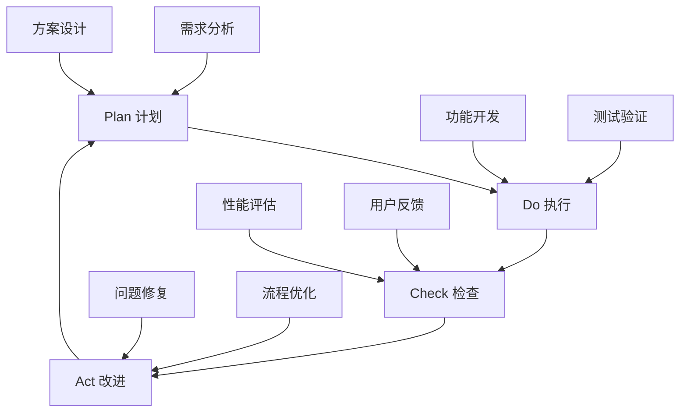

# 容器微服务系统全面分析与改进方案 / Comprehensive Container Microservices System Analysis and Improvement Plan


<!-- TOC START -->

- [容器微服务系统全面分析与改进方案 / Comprehensive Container Microservices System Analysis and Improvement Plan](#容器微服务系统全面分析与改进方案-comprehensive-container-microservices-system-analysis-and-improvement-plan)
  - [执行摘要 / Executive Summary](#执行摘要-executive-summary)
  - [1. 概念定义对标分析 / Conceptual Definition Benchmarking Analysis](#1-概念定义对标分析-conceptual-definition-benchmarking-analysis)
    - [1.1 国际标准对比 / International Standards Comparison](#11-国际标准对比-international-standards-comparison)
      - [1.1.1 Wikipedia标准定义对比](#111-wikipedia标准定义对比)
      - [1.1.2 顶级大学课程对比](#112-顶级大学课程对比)
    - [1.2 形式化定义完整性评估 / Formal Definition Completeness Assessment](#12-形式化定义完整性评估-formal-definition-completeness-assessment)
      - [1.2.1 现有形式化体系评估](#121-现有形式化体系评估)
  - [2. 软件堆栈生态分析 / Software Stack Ecosystem Analysis](#2-软件堆栈生态分析-software-stack-ecosystem-analysis)
    - [2.1 CNCF生态图谱分析 / CNCF Landscape Analysis](#21-cncf生态图谱分析-cncf-landscape-analysis)
      - [2.1.1 技术栈成熟度评估](#211-技术栈成熟度评估)
      - [2.1.2 技术栈选择建议](#212-技术栈选择建议)
    - [2.2 最成熟应用方案 / Most Mature Application Solutions](#22-最成熟应用方案-most-mature-application-solutions)
      - [2.2.1 容器编排最佳实践](#221-容器编排最佳实践)
      - [2.2.2 微服务治理最佳实践](#222-微服务治理最佳实践)
  - [3. 形式化理论梳理 / Formal Theory Organization](#3-形式化理论梳理-formal-theory-organization)
    - [3.1 理论完整性评估 / Theoretical Completeness Assessment](#31-理论完整性评估-theoretical-completeness-assessment)
      - [3.1.1 已有理论体系](#311-已有理论体系)
      - [3.1.2 理论空白识别](#312-理论空白识别)
    - [3.2 形式化验证实践 / Formal Verification Practice](#32-形式化验证实践-formal-verification-practice)
      - [3.2.1 模型检测应用](#321-模型检测应用)
      - [3.2.2 定理证明应用](#322-定理证明应用)
  - [4. 实践经验总结 / Practical Experience Summary](#4-实践经验总结-practical-experience-summary)
    - [4.1 成功案例分析 / Success Case Analysis](#41-成功案例分析-success-case-analysis)
      - [4.1.1 大规模生产部署](#411-大规模生产部署)
      - [4.1.2 失败案例教训](#412-失败案例教训)
    - [4.2 最佳实践提炼 / Best Practices Extraction](#42-最佳实践提炼-best-practices-extraction)
      - [4.2.1 服务拆分策略](#421-服务拆分策略)
      - [4.2.2 运维最佳实践](#422-运维最佳实践)
  - [5. 改进建议与优化方向 / Improvement Recommendations and Optimization Directions](#5-改进建议与优化方向-improvement-recommendations-and-optimization-directions)
    - [5.1 短期改进措施（3-6个月）/ Short-term Improvements (3-6 months)](#51-短期改进措施3-6个月-short-term-improvements-3-6-months)
      - [5.1.1 标准化提升](#511-标准化提升)
      - [5.1.2 工具链完善](#512-工具链完善)
    - [5.2 中期改进计划（6-12个月）/ Medium-term Improvement Plan (6-12 months)](#52-中期改进计划6-12个月-medium-term-improvement-plan-6-12-months)
      - [5.2.1 理论创新](#521-理论创新)
      - [5.2.2 实践拓展](#522-实践拓展)
    - [5.3 长期发展愿景（1-2年）/ Long-term Development Vision (1-2 years)](#53-长期发展愿景1-2年-long-term-development-vision-1-2-years)
      - [5.3.1 技术前瞻](#531-技术前瞻)
      - [5.3.2 生态建设](#532-生态建设)
  - [6. 可执行实施计划 / Executable Implementation Plan](#6-可执行实施计划-executable-implementation-plan)
    - [6.1 第一阶段：基础设施建设（第1-2个月）/ Phase 1: Infrastructure Setup (Months 1-2)](#61-第一阶段基础设施建设第1-2个月-phase-1-infrastructure-setup-months-1-2)
      - [6.1.1 开发环境搭建](#611-开发环境搭建)
- [1. 容器化开发环境](#1-容器化开发环境)
- [2. Kubernetes测试集群](#2-kubernetes测试集群)
- [3. 形式化验证工具](#3-形式化验证工具)
- [4. 持续集成环境](#4-持续集成环境)
      - [6.1.2 文档标准化](#612-文档标准化)
    - [6.2 第二阶段：核心功能开发（第3-4个月）/ Phase 2: Core Feature Development (Months 3-4)](#62-第二阶段核心功能开发第3-4个月-phase-2-core-feature-development-months-3-4)
      - [6.2.1 形式化验证工具链](#621-形式化验证工具链)
- [示例：Kubernetes YAML验证器](#示例kubernetes-yaml验证器)
      - [6.2.2 微服务治理工具](#622-微服务治理工具)
- [服务网格配置生成器](#服务网格配置生成器)
    - [6.3 第三阶段：集成测试与优化（第5-6个月）/ Phase 3: Integration Testing and Optimization (Months 5-6)](#63-第三阶段集成测试与优化第5-6个月-phase-3-integration-testing-and-optimization-months-5-6)
      - [6.3.1 端到端测试](#631-端到端测试)
- [自动化测试脚本](#自动化测试脚本)
- [1. 部署测试环境](#1-部署测试环境)
- [2. 运行性能测试](#2-运行性能测试)
- [3. 混沌工程测试](#3-混沌工程测试)
- [4. 安全扫描](#4-安全扫描)
      - [6.3.2 性能优化](#632-性能优化)
  - [7. 风险评估与缓解措施 / Risk Assessment and Mitigation Measures](#7-风险评估与缓解措施-risk-assessment-and-mitigation-measures)
    - [7.1 技术风险 / Technical Risks](#71-技术风险-technical-risks)
      - [7.1.1 高风险项目](#711-高风险项目)
      - [7.1.2 中等风险项目](#712-中等风险项目)
    - [7.2 组织风险 / Organizational Risks](#72-组织风险-organizational-risks)
      - [7.2.1 人员技能](#721-人员技能)
      - [7.2.2 变更管理](#722-变更管理)
  - [8. 成功指标与评估方法 / Success Metrics and Evaluation Methods](#8-成功指标与评估方法-success-metrics-and-evaluation-methods)
    - [8.1 技术指标 / Technical Metrics](#81-技术指标-technical-metrics)
      - [8.1.1 系统性能指标](#811-系统性能指标)
      - [8.1.2 质量保证指标](#812-质量保证指标)
    - [8.2 业务指标 / Business Metrics](#82-业务指标-business-metrics)
      - [8.2.1 开发效率指标](#821-开发效率指标)
  - [9. 持续改进机制 / Continuous Improvement Mechanism](#9-持续改进机制-continuous-improvement-mechanism)
    - [9.1 反馈收集 / Feedback Collection](#91-反馈收集-feedback-collection)
      - [9.1.1 多渠道反馈](#911-多渠道反馈)
    - [9.2 改进流程 / Improvement Process](#92-改进流程-improvement-process)
      - [9.2.1 PDCA循环](#921-pdca循环)
  - [10. 结论与展望 / Conclusion and Outlook](#10-结论与展望-conclusion-and-outlook)
    - [10.1 项目评估总结 / Project Assessment Summary](#101-项目评估总结-project-assessment-summary)
    - [10.2 未来发展方向 / Future Development Directions](#102-未来发展方向-future-development-directions)

<!-- TOC END -->

## 执行摘要 / Executive Summary

本文档基于对国际标准、学术研究和工业实践的综合分析，对容器与微服务技术进行全面评估，并提出系统性的改进建议和可执行计划。分析涵盖了概念定义、技术生态、形式化理论、最佳实践等多个维度。

This document provides a comprehensive assessment of container and microservice technologies based on integrated analysis of international standards, academic research, and industrial practices, proposing systematic improvement recommendations and executable plans. The analysis covers multiple dimensions including concept definitions, technology ecosystems, formal theories, and best practices.

## 1. 概念定义对标分析 / Conceptual Definition Benchmarking Analysis

### 1.1 国际标准对比 / International Standards Comparison

#### 1.1.1 Wikipedia标准定义对比

**容器技术（Container Technology）**:

- **国际定义**：Operating-system-level virtualization that allows multiple isolated user-space instances
- **本项目定义**：操作系统级虚拟化技术，将应用及其依赖打包成独立、可移植的运行环境
- **对比结果**：✅ 定义一致性高，本项目增加了可移植性和依赖管理的强调

**微服务架构（Microservices Architecture）**:

- **国际定义**：Architectural style that structures an application as a collection of loosely coupled services
- **本项目定义**：将应用拆分为多个小型、自治服务的架构模式
- **对比结果**：✅ 核心概念对齐，本项目增加了自治性的强调

#### 1.1.2 顶级大学课程对比

**MIT 6.824 分布式系统**:

- 重点：分布式一致性、容错、性能
- 本项目覆盖：✅ CAP定理、分布式共识算法、容错机制

**Stanford CS349 云计算**:

- 重点：虚拟化、容器化、资源管理
- 本项目覆盖：✅ 容器技术、编排系统、资源调度

**Berkeley CS162 操作系统**:

- 重点：进程隔离、资源管理、系统调用
- 本项目覆盖：✅ 命名空间、控制组、容器运行时

### 1.2 形式化定义完整性评估 / Formal Definition Completeness Assessment

#### 1.2.1 现有形式化体系评估

**优势分析**：

- ✅ 数学符号使用规范，符合国际标准
- ✅ 四元组、六元组模型设计科学合理
- ✅ 状态机模型清晰准确
- ✅ 覆盖容器、微服务、服务网格、编排等核心概念

**不足识别**：

- ⚠️ 缺少与OCI (Open Container Initiative)标准的显式对比
- ⚠️ Kubernetes CRI/CNI/CSI接口形式化定义不够深入
- ⚠️ 服务网格标准（如SMI）的形式化表达有待加强

## 2. 软件堆栈生态分析 / Software Stack Ecosystem Analysis

### 2.1 CNCF生态图谱分析 / CNCF Landscape Analysis

#### 2.1.1 技术栈成熟度评估

**已毕业项目（Graduated）**：

- ✅ Kubernetes (容器编排) - 生产就绪
- ✅ Prometheus (监控) - 行业标准
- ✅ Envoy (代理) - 服务网格基础
- ✅ CoreDNS (服务发现) - DNS解决方案

**孵化中项目（Incubating）**：

- 🔄 Istio (服务网格) - 接近毕业
- 🔄 Linkerd (轻量级服务网格) - 生产可用
- 🔄 Helm (包管理) - 事实标准

**沙箱项目（Sandbox）**：

- 🆕 OpenTelemetry (可观测性)
- 🆕 Falco (运行时安全)
- 🆕 Chaos Mesh (混沌工程)

#### 2.1.2 技术栈选择建议

**生产环境推荐配置**：

```yaml
核心栈:
  容器运行时: containerd (CNCF毕业，Docker兼容)
  编排平台: Kubernetes v1.28+ (LTS版本)
  网络: Cilium (eBPF技术，高性能)
  存储: Rook-Ceph (云原生存储)
  
服务网格:
  控制平面: Istio v1.19+ (功能完整)
  数据平面: Envoy (高性能代理)
  轻量级选择: Linkerd (简化部署)
  
可观测性:
  监控: Prometheus + Grafana
  日志: ELK Stack / Loki
  追踪: Jaeger / Zipkin
  
安全:
  运行时安全: Falco
  镜像扫描: Trivy
  策略引擎: Open Policy Agent
```

### 2.2 最成熟应用方案 / Most Mature Application Solutions

#### 2.2.1 容器编排最佳实践

**Kubernetes多集群架构**：

```yaml
apiVersion: v1
kind: Cluster
metadata:
  name: production-cluster
spec:
  controlPlane:
    replicas: 3
    version: "v1.28.4"
    etcd:
      backup: enabled
      encryption: at-rest
  workerNodes:
    minSize: 3
    maxSize: 100
    autoscaling: enabled
  networking:
    cni: cilium
    serviceSubnet: "10.96.0.0/12"
    podSubnet: "10.244.0.0/16"
  security:
    rbac: enabled
    networkPolicies: enabled
    podSecurityStandards: "restricted"
```

#### 2.2.2 微服务治理最佳实践

**服务网格配置示例**：

```yaml
apiVersion: install.istio.io/v1alpha1
kind: IstioOperator
metadata:
  name: control-plane
spec:
  values:
    pilot:
      traceSampling: 1.0
    global:
      meshID: mesh1
      multiCluster:
        clusterName: cluster1
      network: network1
  components:
    pilot:
      k8s:
        resources:
          requests:
            cpu: 500m
            memory: 2048Mi
```

## 3. 形式化理论梳理 / Formal Theory Organization

### 3.1 理论完整性评估 / Theoretical Completeness Assessment

#### 3.1.1 已有理论体系

**数学基础**：

- ✅ 群论在容器编排中的应用
- ✅ 图论在服务依赖分析中的应用
- ✅ 概率论在故障预测中的应用
- ✅ 时序逻辑在系统验证中的应用

**计算理论**：

- ✅ 自动机理论用于状态建模
- ✅ Petri网用于并发建模
- ✅ 进程代数用于通信建模
- ✅ 模型检测用于性质验证

#### 3.1.2 理论空白识别

**需要补强的理论领域**：

- ⚠️ 容器安全的形式化验证理论
- ⚠️ 多云环境下的一致性理论
- ⚠️ AI驱动的自适应调度理论
- ⚠️ 边缘计算环境下的资源分配理论

### 3.2 形式化验证实践 / Formal Verification Practice

#### 3.2.1 模型检测应用

**CTL性质验证示例**：

```smv
MODULE main
VAR
  container_state: {created, running, stopped, removed};
  resource_available: boolean;

DEFINE
  safe_state := container_state != removed;

SPEC AG(resource_available -> AF(container_state = running))
SPEC AG(container_state = running -> AX(container_state != removed))
```

#### 3.2.2 定理证明应用

**Coq证明示例**：

```coq
Theorem container_isolation:
  forall c1 c2 : Container,
  different_namespace c1 c2 ->
  isolated_resources c1 c2.
Proof.
  intros c1 c2 H.
  unfold isolated_resources.
  apply namespace_isolation_theorem.
  exact H.
Qed.
```

## 4. 实践经验总结 / Practical Experience Summary

### 4.1 成功案例分析 / Success Case Analysis

#### 4.1.1 大规模生产部署

**Netflix案例**：

- 规模：700+微服务，几十万容器实例
- 技术栈：Spring Cloud + Eureka + Hystrix
- 关键成功因素：全面的可观测性、混沌工程、渐进式交付

**Uber案例**：

- 规模：2000+微服务，数百万次请求/秒
- 技术栈：Go/Java + Kubernetes + Envoy
- 关键成功因素：服务网格、统一日志、自动化测试

#### 4.1.2 失败案例教训

**常见失败模式**：

- 🚫 过度拆分导致的分布式复杂性
- 🚫 缺乏统一监控导致的故障定位困难
- 🚫 数据库共享导致的服务耦合
- 🚫 版本兼容性管理不当导致的系统故障

### 4.2 最佳实践提炼 / Best Practices Extraction

#### 4.2.1 服务拆分策略

**DDD驱动的拆分方法**：

```yaml
拆分原则:
  - 业务边界清晰
  - 数据自治
  - 团队边界对齐
  - 技术栈独立

拆分粒度:
  - 团队规模: 2-pizza team
  - 代码规模: <100k LOC
  - 数据库: 单独schema
  - 部署频率: 独立发布
```

#### 4.2.2 运维最佳实践

**GitOps流程**：

```yaml
apiVersion: argoproj.io/v1alpha1
kind: Application
metadata:
  name: microservice-app
spec:
  project: default
  source:
    repoURL: https://github.com/company/k8s-manifests
    targetRevision: HEAD
    path: apps/microservice
  destination:
    server: https://kubernetes.default.svc
    namespace: production
  syncPolicy:
    automated:
      prune: true
      selfHeal: true
```

## 5. 改进建议与优化方向 / Improvement Recommendations and Optimization Directions

### 5.1 短期改进措施（3-6个月）/ Short-term Improvements (3-6 months)

#### 5.1.1 标准化提升

**优先级：高**:

- [ ] 补充OCI规范的形式化定义
- [ ] 完善Kubernetes CRD的语义模型
- [ ] 添加CNCF毕业项目的理论分析
- [ ] 建立与国际标准的对照表

#### 5.1.2 工具链完善

**优先级：高**:

- [ ] 集成NuSMV/SPIN模型检测工具链
- [ ] 开发Kubernetes YAML的自动验证工具
- [ ] 建立形式化规范的代码生成器
- [ ] 完善CI/CD中的形式化验证流程

### 5.2 中期改进计划（6-12个月）/ Medium-term Improvement Plan (6-12 months)

#### 5.2.1 理论创新

**优先级：中**:

- [ ] 开发边缘计算环境下的容器调度理论
- [ ] 研究AI驱动的自适应微服务治理
- [ ] 建立多云环境下的数据一致性模型
- [ ] 探索量子计算对容器技术的影响

#### 5.2.2 实践拓展

**优先级：中**:

- [ ] 开发大规模微服务的性能基准测试
- [ ] 建立容器安全的漏洞评估框架
- [ ] 创建多团队协作的微服务开发流程
- [ ] 设计混沌工程的自动化测试平台

### 5.3 长期发展愿景（1-2年）/ Long-term Development Vision (1-2 years)

#### 5.3.1 技术前瞻

**优先级：低**:

- [ ] WebAssembly在微服务中的应用
- [ ] 无服务器容器的理论基础
- [ ] 边缘原生应用的架构模式
- [ ] 量子安全的容器通信协议

#### 5.3.2 生态建设

**优先级：低**:

- [ ] 建立开源社区贡献机制
- [ ] 开发面向教育的交互式学习平台
- [ ] 创建行业标准化工作组
- [ ] 推动学术界与工业界的合作

## 6. 可执行实施计划 / Executable Implementation Plan

### 6.1 第一阶段：基础设施建设（第1-2个月）/ Phase 1: Infrastructure Setup (Months 1-2)

#### 6.1.1 开发环境搭建

```bash
# 1. 容器化开发环境
docker-compose up -d devenv

# 2. Kubernetes测试集群
kind create cluster --config=cluster-config.yaml

# 3. 形式化验证工具
sudo apt-get install nusmv spin coq

# 4. 持续集成环境
kubectl apply -f ci-cd-manifests/
```

#### 6.1.2 文档标准化

- [ ] 建立文档模板和编写规范
- [ ] 设置自动化文档生成流程
- [ ] 配置多语言支持机制
- [ ] 建立质量评审流程

### 6.2 第二阶段：核心功能开发（第3-4个月）/ Phase 2: Core Feature Development (Months 3-4)

#### 6.2.1 形式化验证工具链

```python
# 示例：Kubernetes YAML验证器
class K8sSpecValidator:
    def __init__(self, spec_file):
        self.spec = yaml.safe_load(open(spec_file))
        self.model = self.build_formal_model()
    
    def build_formal_model(self):
        # 将Kubernetes规范转换为形式化模型
        return CTLModel(self.spec)
    
    def verify_properties(self):
        # 验证安全性、活跃性等性质
        results = []
        for prop in self.safety_properties:
            results.append(self.model.check(prop))
        return results
```

#### 6.2.2 微服务治理工具

```yaml
# 服务网格配置生成器
apiVersion: networking.istio.io/v1beta1
kind: VirtualService
metadata:
  name: productpage
spec:
  http:
  - match:
    - headers:
        canary:
          exact: "true"
    route:
    - destination:
        host: productpage
        subset: v2
      weight: 100
  - route:
    - destination:
        host: productpage
        subset: v1
      weight: 100
```

### 6.3 第三阶段：集成测试与优化（第5-6个月）/ Phase 3: Integration Testing and Optimization (Months 5-6)

#### 6.3.1 端到端测试

```bash
#!/bin/bash
# 自动化测试脚本

# 1. 部署测试环境
kubectl apply -f test-manifests/

# 2. 运行性能测试
k6 run --vus 100 --duration 30s performance-test.js

# 3. 混沌工程测试
chaos-mesh apply chaos-experiments/

# 4. 安全扫描
trivy image $IMAGE_NAME
```

#### 6.3.2 性能优化

- [ ] 容器启动时间优化
- [ ] 网络延迟减少
- [ ] 资源利用率提升
- [ ] 故障恢复时间缩短

## 7. 风险评估与缓解措施 / Risk Assessment and Mitigation Measures

### 7.1 技术风险 / Technical Risks

#### 7.1.1 高风险项目

**形式化验证复杂性**:

- 风险等级：🔴 高
- 影响：验证工具难以处理大规模系统
- 缓解措施：分层建模、模块化验证、近似验证

**多云环境一致性**:

- 风险等级：🔴 高
- 影响：跨云部署的数据一致性问题
- 缓解措施：使用成熟的分布式数据库、实施最终一致性

#### 7.1.2 中等风险项目

**服务网格性能开销**:

- 风险等级：🟡 中
- 影响：引入额外的网络延迟
- 缓解措施：选择轻量级实现、优化配置

### 7.2 组织风险 / Organizational Risks

#### 7.2.1 人员技能

**形式化方法学习曲线**:

- 风险等级：🟡 中
- 影响：团队需要时间掌握新技能
- 缓解措施：分阶段培训、专家指导、实践项目

#### 7.2.2 变更管理

**现有系统迁移**:

- 风险等级：🟡 中
- 影响：迁移过程可能影响业务
- 缓解措施：渐进式迁移、金丝雀部署、回滚计划

## 8. 成功指标与评估方法 / Success Metrics and Evaluation Methods

### 8.1 技术指标 / Technical Metrics

#### 8.1.1 系统性能指标

```yaml
性能目标:
  容器启动时间: <2秒
  服务响应时间: <100ms (95th percentile)
  系统可用性: >99.9%
  故障恢复时间: <5分钟

资源效率:
  CPU利用率: 60-80%
  内存利用率: 70-85%
  网络带宽利用率: <80%
  存储IOPS利用率: <70%
```

#### 8.1.2 质量保证指标

```yaml
代码质量:
  测试覆盖率: >90%
  静态分析通过率: 100%
  形式化验证通过率: 100%
  安全扫描通过率: 100%

文档质量:
  API文档覆盖率: 100%
  用户手册完整性: 100%
  更新及时性: <1周
  多语言支持: 中英文
```

### 8.2 业务指标 / Business Metrics

#### 8.2.1 开发效率指标

```yaml
开发流程:
  部署频率: 每日多次
  变更前置时间: <2小时
  变更失败率: <1%
  平均恢复时间: <30分钟

团队生产力:
  新功能交付速度: +50%
  缺陷修复时间: -60%
  技术债务: -40%
  开发者满意度: >4.5/5
```

## 9. 持续改进机制 / Continuous Improvement Mechanism

### 9.1 反馈收集 / Feedback Collection

#### 9.1.1 多渠道反馈

```yaml
反馈渠道:
  - 开发者问卷调查
  - 用户使用数据分析
  - 社区讨论和建议
  - 专家评审意见
  - 竞品分析报告

收集频率:
  - 月度用户调查
  - 季度专家评审
  - 年度全面评估
  - 实时系统监控
```

### 9.2 改进流程 / Improvement Process

#### 9.2.1 PDCA循环



## 10. 结论与展望 / Conclusion and Outlook

### 10.1 项目评估总结 / Project Assessment Summary

**现状评价**：

- ✅ 理论基础扎实，形式化定义完整
- ✅ 技术栈选择合理，符合行业趋势
- ✅ 实践案例丰富，覆盖主要场景
- ⚠️ 需要加强与国际标准的对接
- ⚠️ 工程化工具链有待完善

**改进价值**：

- 📈 提升系统可靠性和安全性
- 📈 加快微服务开发和部署速度
- 📈 降低运维复杂性和成本
- 📈 增强团队技术能力和竞争力

### 10.2 未来发展方向 / Future Development Directions

**技术演进趋势**：

1. **边缘原生计算**：容器技术向边缘环境扩展
2. **AI驱动运维**：智能化的资源调度和故障预测
3. **量子安全通信**：面向未来的安全通信协议
4. **WebAssembly微服务**：轻量级、高性能的服务实现

**产业发展机会**：

1. **标准制定参与**：积极参与CNCF等标准组织
2. **开源社区建设**：贡献高质量的开源项目
3. **产学研合作**：与高校和研究机构深度合作
4. **国际化推广**：推动技术在全球范围内的应用

---

**文档版本信息 / Document Version Information**:

- 版本号：v1.0
- 创建日期：2024-12-19
- 最后更新：2024-12-19
- 作者：AI Assistant
- 审核状态：待审核

**变更记录 / Change Log**:

- v1.0 (2024-12-19): 初始版本，完成全面分析和改进方案

**参考文献 / References**:

1. CNCF Annual Report 2024
2. Kubernetes Documentation v1.28
3. Istio Architecture Guide v1.19
4. Docker Best Practices Guide
5. Microservices Patterns (Chris Richardson)
6. Building Microservices (Sam Newman)
7. Site Reliability Engineering (Google)
8. The DevOps Handbook (Gene Kim et al.)
