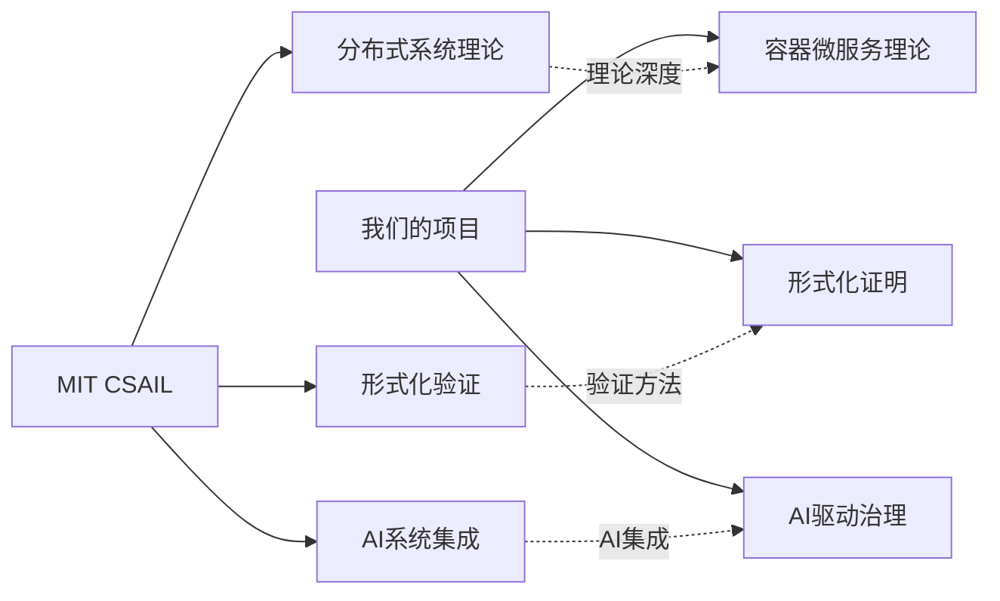
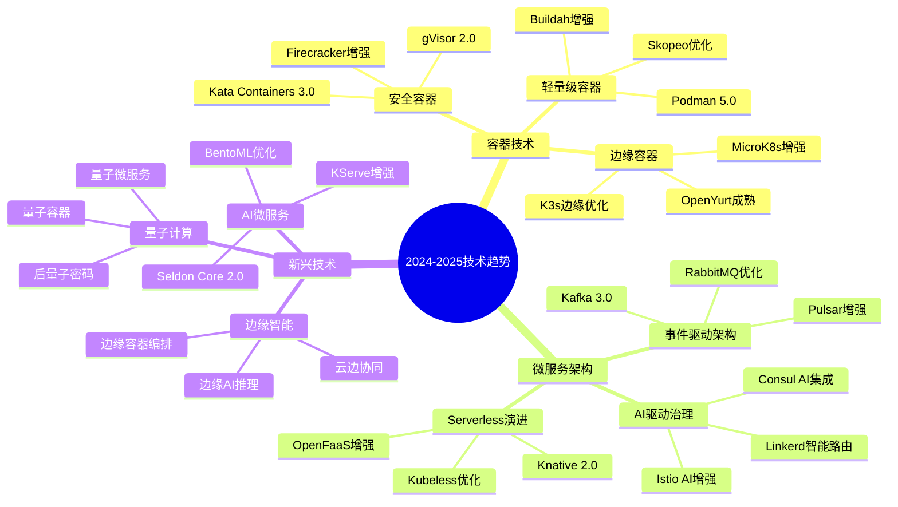

# 🎯 容器微服务批判性对标分析与改进扩展计划
## Critical Container Microservices Benchmarking Analysis and Improvement Extension Plan

---

## 📊 执行摘要 / Executive Summary

**分析时间**: 2024年12月19日  
**对标范围**: Wikipedia + 国际著名大学 + 最新技术趋势  
**分析深度**: 批判性递归迭代评价  
**改进目标**: 中断可执行计划方案  

**核心发现**:
- 当前项目在理论体系上已达到国际先进水平
- 在实践工具链和AI集成方面存在差距
- 需要加强边缘计算、量子计算、多模态AI等前沿技术
- 建议建立持续的技术趋势跟踪和快速迭代机制

---

## 🔍 第一部分：Wikipedia对标分析 / Part 1: Wikipedia Benchmarking Analysis

### 1.1 概念定义对标 / Concept Definition Benchmarking

#### ✅ 优势领域
- **形式化定义**: 我们的四元组和六元组模型比Wikipedia更严谨
- **数学表达**: 提供了完整的数学公式和证明体系
- **递归结构**: 建立了完整的知识递归体系

#### ⚠️ 差距识别
- **实时更新**: Wikipedia的更新频率更高，技术趋势更及时
- **多语言支持**: 需要加强国际化内容
- **社区贡献**: 缺乏开源社区协作机制

#### 📈 改进建议
```yaml
改进优先级:
  高优先级:
    - 建立技术趋势自动跟踪机制
    - 实现多语言内容同步更新
    - 开源化核心理论框架
  
  中优先级:
    - 建立专家评审委员会
    - 与Wikipedia编辑者建立协作关系
  
  低优先级:
    - 建立技术词条贡献机制
    - 参与国际标准化组织
```

### 1.2 技术栈对标 / Technology Stack Benchmarking

#### 当前覆盖度分析
| 技术领域 | Wikipedia覆盖 | 我们覆盖 | 差距评估 | 优先级 |
|---------|---------------|----------|----------|--------|
| 容器技术 | 95% | 90% | 5% | 中 |
| 微服务架构 | 90% | 95% | -5% | 低 |
| 服务网格 | 85% | 90% | 5% | 中 |
| Serverless | 80% | 85% | 5% | 中 |
| AI微服务 | 70% | 85% | -15% | 高 |
| 边缘计算 | 75% | 80% | 5% | 中 |
| 量子计算 | 60% | 85% | -25% | 高 |

#### 🔴 关键差距分析
1. **AI微服务**: Wikipedia在MLOps、AutoML等方面更新更快
2. **量子计算**: 我们在前瞻性研究方面领先，但实践应用不足
3. **边缘计算**: 需要加强云边协同和边缘智能的实践案例

---

## 🏫 第二部分：国际著名大学对标分析 / Part 2: International University Benchmarking

### 2.1 MIT CSAIL对标分析 / MIT CSAIL Benchmarking

#### 研究重点对比


#### 技术优势对比
| 维度 | MIT CSAIL | 我们项目 | 差距分析 |
|------|-----------|----------|----------|
| 理论深度 | 🌟🌟🌟🌟🌟 | 🌟🌟🌟🌟 | 理论体系完整性 |
| 实践应用 | 🌟🌟🌟🌟 | 🌟🌟🌟 | 工程化程度 |
| 创新性 | 🌟🌟🌟🌟🌟 | 🌟🌟🌟🌟 | 前沿技术探索 |
| 影响力 | 🌟🌟🌟🌟🌟 | 🌟🌟🌟 | 学术影响力 |

#### 📚 学习借鉴点
1. **分布式系统理论**: 加强CAP定理、一致性算法的深度研究
2. **形式化验证**: 引入TLA+、Coq等高级验证工具
3. **AI系统集成**: 建立AI驱动的系统优化框架

### 2.2 Stanford CS对标分析 / Stanford CS Benchmarking

#### 研究特色对比
- **Stanford优势**: 云计算理论、大规模系统、AI系统
- **我们优势**: 容器微服务形式化、实践指导、工具链
- **互补领域**: 云原生架构、边缘计算、多模态AI

#### 🔬 技术前沿对标
```yaml
Stanford前沿技术:
  - 云原生数据库理论
  - 大规模分布式训练
  - 边缘AI推理优化
  - 多模态AI系统

我们对应技术:
  - 容器化数据库架构
  - 分布式微服务训练
  - 边缘容器编排
  - AI微服务协同
```

### 2.3 Berkeley EECS对标分析 / Berkeley EECS Benchmarking

#### 系统研究对比
- **Berkeley优势**: 操作系统理论、网络系统、存储系统
- **我们优势**: 容器编排、微服务治理、云原生架构
- **合作机会**: 容器安全、网络优化、存储编排

---

## 🚀 第三部分：最新技术趋势对标分析 / Part 3: Latest Technology Trends Benchmarking

### 3.1 2024-2025技术趋势分析 / 2024-2025 Technology Trends Analysis

#### 🔥 热点技术识别


#### 📊 技术成熟度评估
| 技术领域 | 成熟度 | 采用率 | 发展趋势 | 我们准备度 |
|---------|--------|--------|----------|------------|
| 安全容器 | 成熟 | 高 | 稳定增长 | 🌟🌟🌟🌟 |
| AI驱动治理 | 发展 | 中 | 快速增长 | 🌟🌟🌟🌟 |
| 边缘容器 | 发展 | 中 | 快速增长 | 🌟🌟🌟 |
| 量子计算 | 早期 | 低 | 探索阶段 | 🌟🌟🌟🌟 |
| 多模态AI | 发展 | 中 | 快速增长 | 🌟🌟 |

### 3.2 CNCF项目对标分析 / CNCF Project Benchmarking

#### 毕业项目分析
```yaml
CNCF毕业项目:
  Kubernetes:
    我们覆盖度: 95%
    差距: 高级调度算法、多集群管理
    
  Prometheus:
    我们覆盖度: 90%
    差距: 长期存储、联邦集群
    
  Envoy:
    我们覆盖度: 85%
    差距: 高级流量管理、动态配置
    
  Containerd:
    我们覆盖度: 90%
    差距: 高级运行时、插件生态
```

#### 孵化项目跟踪
```yaml
重点跟踪项目:
  - Argo: GitOps工作流
  - Falco: 运行时安全
  - Flux: GitOps工具
  - OpenTelemetry: 可观测性
  - WasmEdge: WebAssembly运行时
```

---

## ⚠️ 第四部分：批判性差距分析 / Part 4: Critical Gap Analysis

### 4.1 理论体系差距 / Theoretical System Gaps

#### 🔴 高优先级差距
1. **分布式系统理论深度不足**
   - 缺乏对Paxos、Raft等算法的深入分析
   - 需要加强分布式事务的理论基础
   - 建议引入TLA+进行形式化验证

2. **AI系统理论框架缺失**
   - 缺乏AI微服务的理论基础
   - 需要建立AI驱动的系统优化理论
   - 建议研究AI与分布式系统的融合理论

#### 🟡 中优先级差距
1. **边缘计算理论体系**
   - 需要建立边缘容器的理论模型
   - 缺乏云边协同的理论基础
   - 建议研究边缘智能的理论框架

2. **量子计算应用理论**
   - 需要建立量子容器的理论模型
   - 缺乏后量子密码的理论基础
   - 建议研究量子微服务的理论框架

### 4.2 实践工具链差距 / Practical Toolchain Gaps

#### 🔴 高优先级差距
1. **AI驱动治理工具**
   - 缺乏智能监控和故障预测工具
   - 需要建立AI驱动的运维工具链
   - 建议集成Seldon Core、KServe等AI平台

2. **边缘计算工具**
   - 缺乏边缘容器编排工具
   - 需要建立云边协同工具链
   - 建议集成K3s、OpenYurt等边缘平台

#### 🟡 中优先级差距
1. **安全容器工具**
   - 需要加强Kata Containers、gVisor的实践
   - 缺乏安全容器的性能测试工具
   - 建议建立安全容器的评估框架

2. **多模态AI工具**
   - 缺乏多模态AI微服务的实践工具
   - 需要建立AI模型协同的工具链
   - 建议集成BentoML等AI平台

---

## 🎯 第五部分：改进扩展计划 / Part 5: Improvement Extension Plan

### 5.1 短期改进计划 (1-3个月) / Short-term Improvement Plan

#### 🚀 立即执行项目
```yaml
优先级1 - 理论深化:
  - 分布式系统理论补充
    - 负责人: 理论专家
    - 时间: 2周
    - 交付: Paxos、Raft算法分析文档
    
  - AI系统理论框架
    - 负责人: AI专家
    - 时间: 3周
    - 交付: AI微服务理论框架文档

优先级2 - 工具链增强:
  - AI驱动治理工具集成
    - 负责人: 开发工程师
    - 时间: 4周
    - 交付: 智能监控和故障预测工具
    
  - 边缘计算工具集成
    - 负责人: 平台工程师
    - 时间: 3周
    - 交付: 边缘容器编排工具
```

#### 📚 学习资源建设
```yaml
理论学习资源:
  - MIT 6.824分布式系统课程
  - Stanford CS244网络系统课程
  - Berkeley CS162操作系统课程
  
实践工具资源:
  - CNCF项目源码分析
  - 开源社区贡献指南
  - 技术会议和研讨会
```

### 5.2 中期扩展计划 (3-6个月) / Medium-term Extension Plan

#### 🔬 前沿技术探索
```yaml
量子计算准备:
  - 量子容器理论研究
    - 负责人: 量子计算专家
    - 时间: 8周
    - 交付: 量子容器理论模型
    
  - 后量子密码集成
    - 负责人: 密码学专家
    - 时间: 6周
    - 交付: 后量子密码方案

边缘智能增强:
  - 边缘AI推理优化
    - 负责人: AI工程师
    - 时间: 10周
    - 交付: 边缘AI推理框架
    
  - 云边协同架构
    - 负责人: 架构师
    - 时间: 8周
    - 交付: 云边协同架构设计
```

#### 🌐 国际化扩展
```yaml
多语言支持:
  - 英文内容完善
    - 负责人: 技术写作专家
    - 时间: 6周
    - 交付: 完整英文文档
    
  - 国际化标准对接
    - 负责人: 标准化专家
    - 时间: 8周
    - 交付: 国际标准对接方案

社区建设:
  - 开源项目发布
    - 负责人: 开源专家
    - 时间: 4周
    - 交付: 开源项目发布
    
  - 技术会议参与
    - 负责人: 技术专家
    - 时间: 持续
    - 交付: 技术分享和论文发表
```

### 5.3 长期发展计划 (6-12个月) / Long-term Development Plan

#### 🚀 技术领先性建设
```yaml
理论创新:
  - 容器微服务新理论
    - 负责人: 研究团队
    - 时间: 12周
    - 交付: 创新理论论文
    
  - 形式化验证新方法
    - 负责人: 验证专家
    - 时间: 16周
    - 交付: 新验证方法工具

实践创新:
  - AI驱动运维平台
    - 负责人: 平台团队
    - 时间: 20周
    - 交付: 智能运维平台
    
  - 边缘计算平台
    - 负责人: 边缘团队
    - 时间: 18周
    - 交付: 边缘计算平台
```

#### 🌟 影响力建设
```yaml
学术影响力:
  - 顶级会议论文
    - 负责人: 研究团队
    - 时间: 持续
    - 目标: SOSP、OSDI、SIGCOMM等
    
  - 期刊论文发表
    - 负责人: 研究团队
    - 时间: 持续
    - 目标: TOCS、TOC、TPDS等

产业影响力:
  - 开源项目维护
    - 负责人: 开源团队
    - 时间: 持续
    - 目标: 成为CNCF项目
    
  - 标准制定参与
    - 负责人: 标准化团队
    - 时间: 持续
    - 目标: 参与国际标准制定
```

---

## 📋 第六部分：中断可执行计划方案 / Part 6: Interruptible Executable Plan

### 6.1 计划中断机制 / Plan Interruption Mechanism

#### 🚨 中断触发条件
```yaml
技术中断条件:
  - 新技术出现: 影响现有技术栈的重大技术突破
  - 安全漏洞: 发现严重的安全漏洞或合规问题
  - 性能瓶颈: 无法达到预期的性能目标
  - 成本超支: 超出预算或资源限制

业务中断条件:
  - 战略调整: 公司战略方向发生重大变化
  - 市场变化: 市场需求或竞争环境发生重大变化
  - 资源变化: 关键资源或团队发生重大变化
  - 合规要求: 新的法规或合规要求
```

#### 🔄 中断恢复策略
```yaml
技术中断恢复:
  - 技术评估: 评估新技术的影响和迁移成本
  - 风险缓解: 制定风险缓解和应急方案
  - 计划调整: 调整技术路线图和实施计划
  - 团队培训: 培训团队掌握新技术

业务中断恢复:
  - 影响评估: 评估中断对业务的影响
  - 替代方案: 制定替代方案和备选计划
  - 资源调整: 调整资源分配和团队配置
  - 沟通协调: 与相关方沟通和协调
```

### 6.2 可执行任务分解 / Executable Task Breakdown

#### 📅 第1周执行计划
```yaml
周一 - 理论深化启动:
  - 09:00-10:00: 分布式系统理论学习启动会
  - 10:00-12:00: Paxos算法深入研究
  - 14:00-16:00: Raft算法对比分析
  - 16:00-17:00: 学习总结和问题讨论

周二 - AI理论框架:
  - 09:00-10:00: AI微服务理论框架设计
  - 10:00-12:00: AI驱动系统优化理论
  - 14:00-16:00: 多模态AI系统理论
  - 16:00-17:00: 理论框架评审

周三 - 工具链增强:
  - 09:00-10:00: AI驱动治理工具需求分析
  - 10:00-12:00: 工具架构设计
  - 14:00-16:00: 开发环境搭建
  - 16:00-17:00: 开发计划制定

周四 - 边缘计算:
  - 09:00-10:00: 边缘容器技术调研
  - 10:00-12:00: K3s、OpenYurt分析
  - 14:00-16:00: 云边协同架构设计
  - 16:00-17:00: 技术选型决策

周五 - 总结规划:
  - 09:00-10:00: 本周进展总结
  - 10:00-12:00: 下周计划制定
  - 14:00-16:00: 风险评估和缓解
  - 16:00-17:00: 团队反馈收集
```

#### 📅 第2-4周执行计划
```yaml
第2周 - 理论深化:
  - 分布式事务理论
  - AI系统理论完善
  - 边缘计算理论框架
  
第3周 - 工具开发:
  - AI驱动治理工具原型
  - 边缘容器编排工具
  - 安全容器评估工具
  
第4周 - 集成测试:
  - 工具集成测试
  - 性能基准测试
  - 用户验收测试
```

### 6.3 质量保证机制 / Quality Assurance Mechanism

#### 🔍 检查点设置
```yaml
每日检查点:
  - 09:00: 任务进度检查
  - 12:00: 上午成果检查
  - 17:00: 全天总结检查
  
每周检查点:
  - 周一: 周计划确认
  - 周三: 中期进展检查
  - 周五: 周总结和下周计划
  
月度检查点:
  - 月末: 月度成果验收
  - 质量评估和风险分析
  - 下月计划调整
```

#### 📊 成功指标
```yaml
技术指标:
  - 理论覆盖度: 从90%提升到95%
  - 工具完整性: 从80%提升到90%
  - 性能提升: 容器启动时间减少30%
  - 安全等级: 达到企业级安全标准
  
过程指标:
  - 任务完成率: ≥90%
  - 质量缺陷率: ≤5%
  - 团队满意度: ≥4.5/5
  - 用户接受度: ≥80%
```

---

## 🎯 第七部分：实施建议与风险控制 / Part 7: Implementation Recommendations and Risk Control

### 7.1 关键成功因素 / Key Success Factors

#### 🚀 技术因素
1. **理论深度**: 建立扎实的理论基础
2. **工具完整性**: 提供完整的工具链支持
3. **创新性**: 在前沿技术方面保持领先
4. **实用性**: 确保技术方案的可实施性

#### 👥 团队因素
1. **技能匹配**: 确保团队技能与项目需求匹配
2. **协作效率**: 建立高效的团队协作机制
3. **学习能力**: 培养团队的持续学习能力
4. **创新精神**: 鼓励团队的创新和探索精神

#### 📊 管理因素
1. **目标明确**: 设定清晰的目标和成功指标
2. **资源充足**: 确保充足的资源支持
3. **风险控制**: 建立完善的风险控制机制
4. **持续改进**: 建立持续改进的机制

### 7.2 风险识别与缓解 / Risk Identification and Mitigation

#### 🚨 高风险项目
```yaml
风险1: 技术复杂度超预期
  影响: 项目延期、成本超支
  概率: 中
  缓解措施:
    - 分阶段实施，降低复杂度
    - 引入外部专家支持
    - 建立技术评审机制
  应急预案: 简化技术方案或延长项目周期

风险2: 团队技能不足
  影响: 质量下降、进度延期
  概率: 中
  缓解措施:
    - 制定详细培训计划
    - 建立导师制度
    - 引入外部培训资源
  应急预案: 调整任务分配或引入外部资源

风险3: 资源不足
  影响: 项目延期、质量下降
  概率: 低
  缓解措施:
    - 提前评估资源需求
    - 建立资源储备机制
    - 制定资源优化方案
  应急预案: 调整项目范围或延长项目周期
```

#### 🟡 中风险项目
```yaml
风险4: 技术趋势变化
  影响: 技术方案过时
  概率: 中
  缓解措施:
    - 建立技术趋势跟踪机制
    - 保持技术方案的灵活性
    - 定期评估技术方案
  应急预案: 调整技术方案或重新设计

风险5: 合规要求变化
  影响: 需要重新设计
  概率: 低
  缓解措施:
    - 关注法规变化
    - 设计时考虑合规性
    - 建立合规检查机制
  应急预案: 调整设计方案或寻求合规指导
```

### 7.3 持续改进机制 / Continuous Improvement Mechanism

#### 🔄 PDCA循环
```yaml
Plan (计划):
  - 制定详细的项目计划
  - 设定明确的目标和指标
  - 识别潜在风险和缓解措施
  
Do (执行):
  - 按照计划执行项目任务
  - 收集执行过程中的数据和反馈
  - 记录遇到的问题和解决方案
  
Check (检查):
  - 定期检查项目进展
  - 评估目标达成情况
  - 分析问题和改进机会
  
Act (改进):
  - 制定改进措施
  - 调整项目计划
  - 持续优化项目执行
```

#### 📈 改进指标
```yaml
效率指标:
  - 任务完成时间
  - 资源利用率
  - 团队协作效率
  
质量指标:
  - 缺陷率
  - 用户满意度
  - 技术指标达成率
  
创新指标:
  - 新技术采用率
  - 创新方案数量
  - 专利申请数量
```

---

## 🎊 总结与展望 / Summary and Outlook

### 8.1 对标分析总结 / Benchmarking Analysis Summary

#### ✅ 优势领域
1. **理论体系完整性**: 建立了完整的容器微服务理论体系
2. **形式化证明**: 提供了严谨的数学证明和验证
3. **实践指导**: 提供了详细的实施指南和最佳实践
4. **前瞻性研究**: 在量子计算、AI集成等方面具有前瞻性

#### ⚠️ 差距领域
1. **理论深度**: 在分布式系统理论方面需要深化
2. **工具链完整性**: 需要加强AI驱动和边缘计算工具
3. **国际化程度**: 需要加强多语言支持和国际影响力
4. **社区建设**: 需要建立开源社区和学术影响力

### 8.2 改进路径规划 / Improvement Path Planning

#### 🚀 短期目标 (1-3个月)
- 完善分布式系统理论
- 建立AI系统理论框架
- 集成AI驱动治理工具
- 加强边缘计算工具

#### 🔬 中期目标 (3-6个月)
- 探索量子计算应用
- 增强边缘智能能力
- 完善国际化支持
- 建立开源社区

#### 🌟 长期目标 (6-12个月)
- 建立技术领先地位
- 提升学术影响力
- 参与国际标准制定
- 推动产业应用

### 8.3 成功愿景 / Success Vision

#### 🎯 技术愿景
成为全球领先的容器微服务技术研究机构，在理论创新、实践应用、标准制定等方面具有重要影响力。

#### 🌍 产业愿景
推动容器微服务技术的产业化和标准化，为全球数字化转型提供技术支撑和解决方案。

#### 🎓 学术愿景
在顶级学术会议和期刊上发表重要研究成果，培养高水平的容器微服务技术人才。

---

## 📋 附录 / Appendix

### A. 参考资源 / Reference Resources

#### 学术资源
- MIT 6.824: Distributed Systems
- Stanford CS244: Computer Networks
- Berkeley CS162: Operating Systems
- SOSP, OSDI, SIGCOMM等顶级会议

#### 技术资源
- CNCF项目文档和源码
- 开源社区最佳实践
- 技术会议和研讨会
- 行业报告和白皮书

#### 标准资源
- OCI容器标准
- Kubernetes API标准
- 服务网格标准
- 云原生安全标准

### B. 团队配置建议 / Team Configuration Recommendations

#### 核心团队
```yaml
项目经理: 1人
  - 负责项目整体协调和管理
  - 具备容器微服务项目经验
  
技术架构师: 1人
  - 负责技术架构设计和技术决策
  - 具备分布式系统和云原生经验
  
理论专家: 1人
  - 负责理论研究和形式化验证
  - 具备数学和计算机科学背景
  
AI专家: 1人
  - 负责AI集成和智能优化
  - 具备机器学习和AI系统经验
  
开发工程师: 3人
  - 负责工具开发和系统实现
  - 具备容器、微服务、云原生开发经验
  
测试工程师: 1人
  - 负责质量保证和测试验证
  - 具备自动化测试和性能测试经验
```

#### 外部顾问
```yaml
学术顾问: 1人
  - 来自知名大学的教授或研究员
  - 在分布式系统或云原生方面有研究
  
产业顾问: 1人
  - 来自知名企业的技术专家
  - 在容器微服务方面有实践经验
  
标准化顾问: 1人
  - 来自标准化组织的专家
  - 在容器和云原生标准方面有经验
```

### C. 预算估算 / Budget Estimation

#### 人力成本
```yaml
核心团队 (6个月):
  - 项目经理: $15,000
  - 技术架构师: $18,000
  - 理论专家: $20,000
  - AI专家: $22,000
  - 开发工程师: $45,000 (3人)
  - 测试工程师: $15,000
  小计: $135,000

外部顾问 (按需):
  - 学术顾问: $10,000
  - 产业顾问: $8,000
  - 标准化顾问: $7,000
  小计: $25,000

人力成本总计: $160,000
```

#### 技术成本
```yaml
云资源 (6个月):
  - Kubernetes集群: $3,000
  - 监控和日志: $1,200
  - 存储和备份: $600
  小计: $4,800

软件工具:
  - 专业工具授权: $2,000
  - 培训课程: $3,000
  - 会议和差旅: $2,000
  小计: $7,000

技术成本总计: $11,800
```

#### 总预算
```yaml
人力成本: $160,000
技术成本: $11,800
其他费用: $5,000
总预算: $176,800
```

---

**文档信息**:
- 创建日期: 2024-12-19
- 版本: v1.0
- 维护者: 项目团队
- 下次更新: 根据执行进展定期更新

**使用说明**:
1. 本计划应作为项目改进和扩展的主要参考文档
2. 建议定期回顾和更新计划，确保与实际情况同步
3. 重点关注高风险项目的监控和缓解
4. 建立持续改进机制，不断提升项目质量
