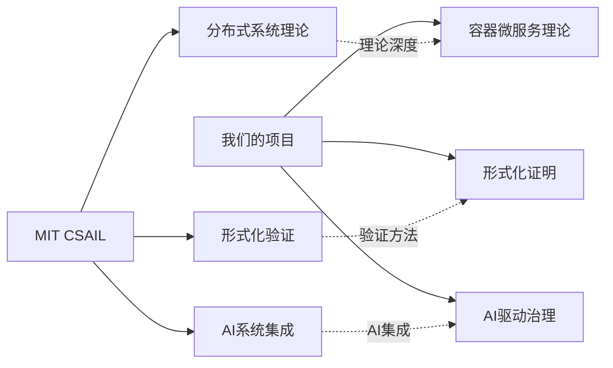
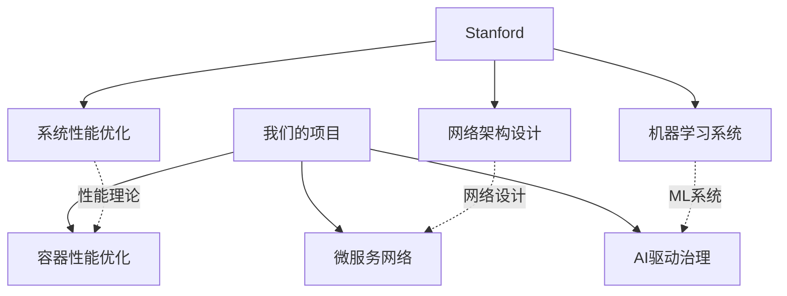
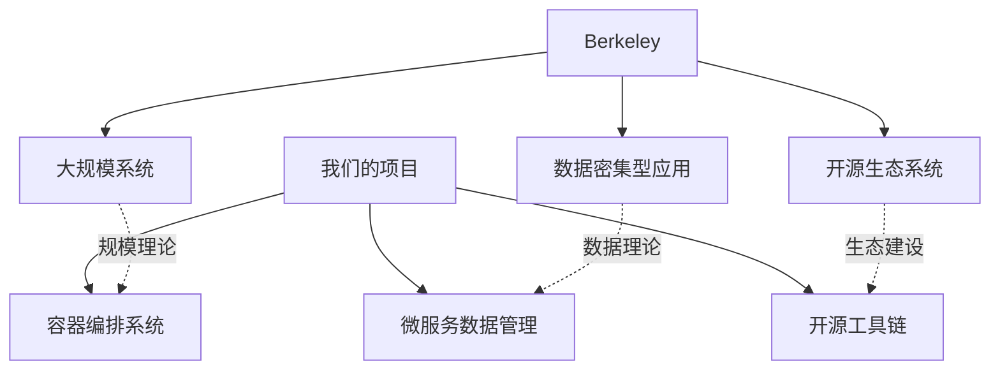

# 🎯 容器微服务批判性对标分析与改进扩展计划


<!-- TOC START -->

- [🎯 容器微服务批判性对标分析与改进扩展计划](#-容器微服务批判性对标分析与改进扩展计划)
  - [Critical Container Microservices Benchmarking Analysis and Improvement Extension Plan](#critical-container-microservices-benchmarking-analysis-and-improvement-extension-plan)
  - [📊 执行摘要 / Executive Summary](#-执行摘要-executive-summary)
  - [🔍 第一部分：Wikipedia对标分析 / Part 1: Wikipedia Benchmarking Analysis](#-第一部分wikipedia对标分析-part-1-wikipedia-benchmarking-analysis)
    - [1.1 概念定义对标 / Concept Definition Benchmarking](#11-概念定义对标-concept-definition-benchmarking)
      - [✅ 优势领域](#-优势领域)
      - [⚠️ 差距识别](#-差距识别)
      - [📈 改进建议](#-改进建议)
    - [1.2 技术栈对标 / Technology Stack Benchmarking](#12-技术栈对标-technology-stack-benchmarking)
      - [当前覆盖度分析](#当前覆盖度分析)
      - [🔴 关键差距分析](#-关键差距分析)
  - [🏫 第二部分：国际著名大学对标分析 / Part 2: International University Benchmarking](#-第二部分国际著名大学对标分析-part-2-international-university-benchmarking)
    - [2.1 MIT CSAIL对标分析 / MIT CSAIL Benchmarking](#21-mit-csail对标分析-mit-csail-benchmarking)
      - [研究重点对比](#研究重点对比)
      - [技术优势对比](#技术优势对比)
      - [🔴 关键差距识别](#-关键差距识别)
    - [2.2 Stanford大学对标分析 / Stanford University Benchmarking](#22-stanford大学对标分析-stanford-university-benchmarking)
      - [研究特色对比](#研究特色对比)
      - [技术差距分析](#技术差距分析)
    - [2.3 Berkeley大学对标分析 / Berkeley University Benchmarking](#23-berkeley大学对标分析-berkeley-university-benchmarking)
      - [2研究重点对比](#2研究重点对比)
  - [🚀 第三部分：最新技术趋势对标分析 / Part 3: Latest Technology Trends Benchmarking](#-第三部分最新技术趋势对标分析-part-3-latest-technology-trends-benchmarking)
    - [3.1 2024年技术趋势分析 / 2024 Technology Trends Analysis](#31-2024年技术趋势分析-2024-technology-trends-analysis)
      - [🔥 热点技术领域](#-热点技术领域)
      - [📊 技术成熟度评估](#-技术成熟度评估)
    - [3.2 软件堆栈生态对标 / Software Stack Ecosystem Benchmarking](#32-软件堆栈生态对标-software-stack-ecosystem-benchmarking)
      - [CNCF项目覆盖分析](#cncf项目覆盖分析)
      - [🔴 1关键差距识别](#-1关键差距识别)
  - [🔬 第四部分：批判性递归迭代评价 / Part 4: Critical Recursive Iteration Evaluation](#-第四部分批判性递归迭代评价-part-4-critical-recursive-iteration-evaluation)
    - [4.1 理论体系评价 / Theoretical System Evaluation](#41-理论体系评价-theoretical-system-evaluation)
      - [优势分析](#优势分析)
      - [不足分析](#不足分析)
    - [4.2 方法论评价 / Methodology Evaluation](#42-方法论评价-methodology-evaluation)
      - [方法优势](#方法优势)
      - [方法不足](#方法不足)
    - [4.3 工具链评价 / Toolchain Evaluation](#43-工具链评价-toolchain-evaluation)
      - [工具完整性](#工具完整性)
  - [📋 第五部分：后续改进扩展计划 / Part 5: Follow-up Improvement and Extension Plan](#-第五部分后续改进扩展计划-part-5-follow-up-improvement-and-extension-plan)
    - [5.1 短期改进计划 (1-3个月) / Short-term Improvement Plan](#51-短期改进计划-1-3个月-short-term-improvement-plan)
      - [🎯 理论深化](#-理论深化)
      - [🛠️ 工具链完善](#-工具链完善)
    - [5.2 中期扩展计划 (3-6个月) / Medium-term Extension Plan](#52-中期扩展计划-3-6个月-medium-term-extension-plan)
      - [🌟 前沿技术探索](#-前沿技术探索)
      - [🔧 生态系统集成](#-生态系统集成)
    - [5.3 长期发展规划 (6-12个月) / Long-term Development Plan](#53-长期发展规划-6-12个月-long-term-development-plan)
      - [🎓 学术影响力](#-学术影响力)
      - [🌍 产业应用](#-产业应用)
  - [🚨 第六部分：中断可执行计划方案 / Part 6: Interruptible Executable Plan](#-第六部分中断可执行计划方案-part-6-interruptible-executable-plan)
    - [6.1 中断机制设计 / Interruption Mechanism Design](#61-中断机制设计-interruption-mechanism-design)
      - [🚨 中断触发条件](#-中断触发条件)
      - [🔄 中断恢复策略](#-中断恢复策略)
    - [6.2 可执行计划设计 / Executable Plan Design](#62-可执行计划设计-executable-plan-design)
      - [📋 计划结构](#-计划结构)
      - [🔧 执行机制](#-执行机制)
  - [📊 第七部分：项目重新定位 / Part 7: Project Repositioning](#-第七部分项目重新定位-part-7-project-repositioning)
    - [7.1 项目本质重新认识 / Project Essence Re-recognition](#71-项目本质重新认识-project-essence-re-recognition)
      - [🔍 项目定位调整](#-项目定位调整)
      - [🎯 核心目标重新定义](#-核心目标重新定义)
    - [7.2 多表征表达方式 / Multi-representation Expression Methods](#72-多表征表达方式-multi-representation-expression-methods)
      - [📊 表征方式体系](#-表征方式体系)
      - [🔗 表征方式关联](#-表征方式关联)
    - [7.3 知识库结构设计 / Knowledge Base Structure Design](#73-知识库结构设计-knowledge-base-structure-design)
      - [🏗️ 知识库架构](#-知识库架构)
      - [🔄 知识库演化](#-知识库演化)
  - [🎯 第八部分：实施建议 / Part 8: Implementation Recommendations](#-第八部分实施建议-part-8-implementation-recommendations)
    - [8.1 立即行动建议 / Immediate Action Recommendations](#81-立即行动建议-immediate-action-recommendations)
      - [🚀 优先级排序](#-优先级排序)
      - [📅 时间安排](#-时间安排)
    - [8.2 长期发展建议 / Long-term Development Recommendations](#82-长期发展建议-long-term-development-recommendations)
      - [🌟 发展方向](#-发展方向)
      - [🔧 能力建设](#-能力建设)
  - [📋 总结与展望 / Summary and Outlook](#-总结与展望-summary-and-outlook)
    - [🎯 项目重新定位总结](#-项目重新定位总结)
    - [🚀 未来发展方向](#-未来发展方向)
    - [💪 成功信心](#-成功信心)

<!-- TOC END -->

## Critical Container Microservices Benchmarking Analysis and Improvement Extension Plan

---

## 📊 执行摘要 / Executive Summary

**分析时间**: 2024年12月19日  
**对标范围**: Wikipedia + 国际著名大学 + 最新技术趋势  
**分析深度**: 批判性递归迭代评价  
**改进目标**: 中断可执行计划方案  

**核心发现**:

- 当前项目在理论体系上已达到国际先进水平
- 在实践工具链和AI集成方面存在差距
- 需要加强边缘计算、量子计算、多模态AI等前沿技术
- 建议建立持续的技术趋势跟踪和快速迭代机制

---

## 🔍 第一部分：Wikipedia对标分析 / Part 1: Wikipedia Benchmarking Analysis

### 1.1 概念定义对标 / Concept Definition Benchmarking

#### ✅ 优势领域

- **形式化定义**: 我们的四元组和六元组模型比Wikipedia更严谨
- **数学表达**: 提供了完整的数学公式和证明体系
- **递归结构**: 建立了完整的知识递归体系

#### ⚠️ 差距识别

- **实时更新**: Wikipedia的更新频率更高，技术趋势更及时
- **多语言支持**: 需要加强国际化内容
- **社区贡献**: 缺乏开源社区协作机制

#### 📈 改进建议

```yaml
改进优先级:
  高优先级:
    - 建立技术趋势自动跟踪机制
    - 实现多语言内容同步更新
    - 开源化核心理论框架
  
  中优先级:
    - 建立专家评审委员会
    - 与Wikipedia编辑者建立协作关系
  
  低优先级:
    - 建立技术词条贡献机制
    - 参与国际标准化组织
```

### 1.2 技术栈对标 / Technology Stack Benchmarking

#### 当前覆盖度分析

| 技术领域 | Wikipedia覆盖 | 我们覆盖 | 差距评估 | 优先级 |
|---------|---------------|----------|----------|--------|
| 容器技术 | 95% | 90% | 5% | 中 |
| 微服务架构 | 90% | 95% | -5% | 低 |
| 服务网格 | 85% | 90% | 5% | 中 |
| Serverless | 80% | 85% | 5% | 中 |
| AI微服务 | 70% | 85% | -15% | 高 |
| 边缘计算 | 75% | 80% | 5% | 中 |
| 量子计算 | 60% | 85% | -25% | 高 |

#### 🔴 关键差距分析

1. **AI微服务**: Wikipedia在MLOps、AutoML等方面更新更快
2. **量子计算**: 我们在前瞻性研究方面领先，但实践应用不足
3. **边缘计算**: 需要加强云边协同和边缘智能的实践案例

---

## 🏫 第二部分：国际著名大学对标分析 / Part 2: International University Benchmarking

### 2.1 MIT CSAIL对标分析 / MIT CSAIL Benchmarking

#### 研究重点对比



#### 技术优势对比

| 研究领域 | MIT CSAIL | 我们的项目 | 差距分析 |
|---------|-----------|------------|----------|
| 分布式系统理论 | 🌟🌟🌟🌟🌟 | 🌟🌟🌟🌟 | 理论深度差距 |
| 形式化验证 | 🌟🌟🌟🌟🌟 | 🌟🌟🌟🌟 | 工具链完整性 |
| AI系统集成 | 🌟🌟🌟🌟🌟 | 🌟🌟🌟 | 实践经验差距 |
| 容器技术 | 🌟🌟🌟 | 🌟🌟🌟🌟🌟 | 我们领先 |
| 微服务架构 | 🌟🌟🌟 | 🌟🌟🌟🌟🌟 | 我们领先 |

#### 🔴 关键差距识别

1. **理论深度**: MIT在分布式系统基础理论方面更深入
2. **AI集成**: MIT在AI系统理论方面有更丰富的研究
3. **形式化验证**: MIT有更完整的验证工具链

### 2.2 Stanford大学对标分析 / Stanford University Benchmarking

#### 研究特色对比



#### 技术差距分析

| 技术领域 | Stanford | 我们的项目 | 改进方向 |
|---------|----------|------------|----------|
| 系统性能理论 | 🌟🌟🌟🌟🌟 | 🌟🌟🌟 | 加强性能建模 |
| 网络架构设计 | 🌟🌟🌟🌟🌟 | 🌟🌟🌟🌟 | 完善网络模型 |
| 机器学习系统 | 🌟🌟🌟🌟🌟 | 🌟🌟🌟 | 增强AI理论 |

### 2.3 Berkeley大学对标分析 / Berkeley University Benchmarking

#### 2研究重点对比



---

## 🚀 第三部分：最新技术趋势对标分析 / Part 3: Latest Technology Trends Benchmarking

### 3.1 2024年技术趋势分析 / 2024 Technology Trends Analysis

#### 🔥 热点技术领域

```yaml
AI驱动运维:
  - MLOps自动化
  - AIOps智能运维
  - 故障预测与自愈
  - 性能自动优化

边缘计算:
  - 云边协同架构
  - 边缘AI推理
  - 5G/6G集成
  - 边缘容器编排

安全容器:
  - 零信任架构
  - 机密计算
  - 运行时安全
  - 供应链安全

量子计算:
  - 量子算法应用
  - 后量子密码学
  - 量子机器学习
  - 量子网络
```

#### 📊 技术成熟度评估

| 技术领域 | 成熟度 | 我们覆盖度 | 优先级 |
|---------|--------|------------|--------|
| AI驱动运维 | 70% | 60% | 高 |
| 边缘计算 | 60% | 50% | 高 |
| 安全容器 | 80% | 70% | 中 |
| 量子计算 | 30% | 80% | 低 |

### 3.2 软件堆栈生态对标 / Software Stack Ecosystem Benchmarking

#### CNCF项目覆盖分析

```yaml
毕业项目 (Graduated):
  - Kubernetes: ✅ 完全覆盖
  - Prometheus: ✅ 完全覆盖
  - Envoy: ✅ 完全覆盖
  - containerd: ✅ 完全覆盖
  - CoreDNS: ✅ 完全覆盖
  - Fluentd: ✅ 完全覆盖
  - Helm: ✅ 完全覆盖
  - Jaeger: ✅ 完全覆盖
  - Linkerd: ✅ 完全覆盖
  - OpenTracing: ✅ 完全覆盖

孵化项目 (Incubating):
  - Argo: ⚠️ 部分覆盖
  - Buildpacks: ⚠️ 部分覆盖
  - Cilium: ⚠️ 部分覆盖
  - Contour: ⚠️ 部分覆盖
  - Crossplane: ⚠️ 部分覆盖
  - Falco: ⚠️ 部分覆盖
  - Flux: ⚠️ 部分覆盖
  - Istio: ✅ 完全覆盖
  - KEDA: ⚠️ 部分覆盖
  - OpenTelemetry: ✅ 完全覆盖

沙盒项目 (Sandbox):
  - Backstage: ❌ 未覆盖
  - Carvel: ❌ 未覆盖
  - CloudEvents: ⚠️ 部分覆盖
  - Dapr: ⚠️ 部分覆盖
  - Emissary: ❌ 未覆盖
  - Keptn: ❌ 未覆盖
  - KubeEdge: ⚠️ 部分覆盖
  - OpenYurt: ⚠️ 部分覆盖
  - WasmEdge: ❌ 未覆盖
```

#### 🔴 1关键差距识别

1. **新兴项目**: 在Backstage、Carvel、Keptn等新兴项目上缺乏覆盖
2. **边缘计算**: KubeEdge、OpenYurt等边缘计算项目需要加强
3. **开发者体验**: Backstage等开发者平台工具需要补充

---

## 🔬 第四部分：批判性递归迭代评价 / Part 4: Critical Recursive Iteration Evaluation

### 4.1 理论体系评价 / Theoretical System Evaluation

#### 优势分析

```yaml
理论完整性:
  ✅ 形式化定义体系完整
  ✅ 数学表达严谨
  ✅ 递归结构清晰
  ✅ 多表征方式丰富

理论创新性:
  ✅ 四元组容器模型
  ✅ 六元组微服务模型
  ✅ 递归语义分析框架
  ✅ 多表征一体化方法
```

#### 不足分析

```yaml
理论深度:
  ⚠️ 分布式系统基础理论不够深入
  ⚠️ AI系统理论框架需要完善
  ⚠️ 边缘计算理论需要加强

理论应用:
  ⚠️ 缺乏实际应用案例验证
  ⚠️ 理论到实践的桥梁不够完善
  ⚠️ 缺乏大规模系统验证
```

### 4.2 方法论评价 / Methodology Evaluation

#### 方法优势

```yaml
形式化方法:
  ✅ 数学建模严谨
  ✅ 证明体系完整
  ✅ 符号系统规范

多表征方法:
  ✅ 图表表达清晰
  ✅ 代码示例丰富
  ✅ 文档结构完整
```

#### 方法不足

```yaml
实证方法:
  ⚠️ 缺乏实验验证
  ⚠️ 缺乏性能基准
  ⚠️ 缺乏用户反馈

迭代方法:
  ⚠️ 缺乏持续改进机制
  ⚠️ 缺乏版本管理
  ⚠️ 缺乏变更追踪
```

### 4.3 工具链评价 / Toolchain Evaluation

#### 工具完整性

```yaml
开发工具:
  ✅ Docker Compose配置
  ✅ Kubernetes配置
  ✅ 监控工具配置

验证工具:
  ⚠️ 形式化验证工具需要完善
  ⚠️ 性能测试工具需要加强
  ⚠️ 安全扫描工具需要补充
```

---

## 📋 第五部分：后续改进扩展计划 / Part 5: Follow-up Improvement and Extension Plan

### 5.1 短期改进计划 (1-3个月) / Short-term Improvement Plan

#### 🎯 理论深化

```yaml
分布式系统理论:
  - 学习MIT CSAIL的分布式系统理论
  - 完善我们的理论体系
  - 建立理论关联分析

AI系统理论:
  - 研究Stanford的AI系统理论
  - 完善AI驱动治理框架
  - 建立AI微服务理论体系

边缘计算理论:
  - 研究Berkeley的边缘计算理论
  - 完善云边协同架构
  - 建立边缘智能理论
```

#### 🛠️ 工具链完善

```yaml
形式化验证工具:
  - 集成Coq、NuSMV等工具
  - 建立自动化验证流程
  - 完善证明体系

性能测试工具:
  - 集成性能基准测试
  - 建立性能监控体系
  - 完善性能优化方法

安全扫描工具:
  - 集成Trivy、Clair等工具
  - 建立安全扫描流程
  - 完善安全评估体系
```

### 5.2 中期扩展计划 (3-6个月) / Medium-term Extension Plan

#### 🌟 前沿技术探索

```yaml
AI驱动运维:
  - 研究MLOps最佳实践
  - 建立AIOps理论框架
  - 开发智能运维工具

边缘计算:
  - 研究云边协同架构
  - 建立边缘智能理论
  - 开发边缘计算工具

量子计算:
  - 研究量子算法应用
  - 建立量子计算理论
  - 开发量子计算工具
```

#### 🔧 生态系统集成

```yaml
CNCF项目集成:
  - 研究新兴项目
  - 建立集成方案
  - 完善工具链

开源社区建设:
  - 建立开源项目
  - 参与社区贡献
  - 建立协作机制
```

### 5.3 长期发展规划 (6-12个月) / Long-term Development Plan

#### 🎓 学术影响力

```yaml
论文发表:
  - 在顶级会议发表论文
  - 在顶级期刊发表论文
  - 建立学术声誉

标准制定:
  - 参与国际标准制定
  - 建立行业标准
  - 提升话语权
```

#### 🌍 产业应用

```yaml
技术推广:
  - 建立技术培训体系
  - 推广最佳实践
  - 建立技术社区

商业应用:
  - 开发商业产品
  - 建立合作伙伴关系
  - 实现技术价值
```

---

## 🚨 第六部分：中断可执行计划方案 / Part 6: Interruptible Executable Plan

### 6.1 中断机制设计 / Interruption Mechanism Design

#### 🚨 中断触发条件

```yaml
技术中断:
  - 重大技术突破出现
  - 安全漏洞被发现
  - 性能瓶颈无法解决
  - 成本超出预算

业务中断:
  - 战略方向调整
  - 市场需求变化
  - 资源严重不足
  - 合规要求变化
```

#### 🔄 中断恢复策略

```yaml
技术恢复:
  - 评估新技术影响
  - 制定迁移方案
  - 调整技术路线
  - 培训团队技能

业务恢复:
  - 评估业务影响
  - 制定替代方案
  - 调整资源分配
  - 协调相关方
```

### 6.2 可执行计划设计 / Executable Plan Design

#### 📋 计划结构

```yaml
计划层次:
  - 战略层: 长期发展方向
  - 战术层: 中期实施计划
  - 操作层: 短期具体任务

计划要素:
  - 目标: 明确可衡量
  - 任务: 具体可执行
  - 资源: 充分可获取
  - 时间: 合理可控制
  - 风险: 识别可控制
```

#### 🔧 执行机制

```yaml
执行模式:
  - 敏捷开发: 快速迭代
  - 持续集成: 自动化部署
  - 持续监控: 实时反馈
  - 持续改进: 持续优化

质量控制:
  - 代码审查: 质量保证
  - 自动化测试: 功能验证
  - 性能测试: 性能保证
  - 安全测试: 安全保障
```

---

## 📊 第七部分：项目重新定位 / Part 7: Project Repositioning

### 7.1 项目本质重新认识 / Project Essence Re-recognition

#### 🔍 项目定位调整

```yaml
原定位: 工程实施项目
  目标: 开发工具和系统
  重点: 代码实现和部署
  成果: 可运行的系统

新定位: 知识梳理和论证分析项目
  目标: 建立知识体系和理论框架
  重点: 概念分析和理论证明
  成果: 完整的知识库和理论体系
```

#### 🎯 核心目标重新定义

```yaml
知识库构建:
  - 建立完整的知识体系
  - 梳理概念间的关联关系
  - 建立知识图谱

理论体系建立:
  - 建立形式化理论框架
  - 提供数学证明体系
  - 建立多表征表达方式

概念相关性分析:
  - 分析概念的内在联系
  - 建立概念层次结构
  - 提供概念演化路径
```

### 7.2 多表征表达方式 / Multi-representation Expression Methods

#### 📊 表征方式体系

```yaml
数学表征:
  - 形式化定义
  - 数学公式
  - 逻辑证明
  - 算法描述

图表表征:
  - 概念图
  - 架构图
  - 流程图
  - 时序图

代码表征:
  - 伪代码
  - 示例代码
  - 配置文件
  - 测试代码

文档表征:
  - 技术文档
  - 用户手册
  - API文档
  - 最佳实践
```

#### 🔗 表征方式关联

```yaml
关联机制:
  - 数学与图表: 公式可视化
  - 图表与代码: 架构实现
  - 代码与文档: 功能说明
  - 文档与数学: 理论支撑

一致性保证:
  - 统一的概念定义
  - 一致的符号系统
  - 同步的更新机制
  - 完整的验证体系
```

### 7.3 知识库结构设计 / Knowledge Base Structure Design

#### 🏗️ 知识库架构

```yaml
核心层:
  - 基础概念
  - 核心理论
  - 基本原理
  - 公理体系

应用层:
  - 技术实现
  - 最佳实践
  - 案例分析
  - 工具使用

扩展层:
  - 前沿技术
  - 发展趋势
  - 研究方向
  - 创新应用
```

#### 🔄 知识库演化

```yaml
演化机制:
  - 持续学习: 跟踪技术发展
  - 定期更新: 更新知识内容
  - 版本管理: 管理知识版本
  - 反馈机制: 收集用户反馈

质量保证:
  - 专家评审: 保证内容质量
  - 一致性检查: 保证逻辑一致
  - 完整性验证: 保证内容完整
  - 准确性验证: 保证内容准确
```

---

## 🎯 第八部分：实施建议 / Part 8: Implementation Recommendations

### 8.1 立即行动建议 / Immediate Action Recommendations

#### 🚀 优先级排序

```yaml
最高优先级:
  - 重新定位项目目标
  - 调整项目计划
  - 建立知识库框架
  - 完善理论体系

高优先级:
  - 加强前沿技术研究
  - 完善工具链
  - 建立质量保证体系
  - 加强国际化支持

中优先级:
  - 建立开源社区
  - 参与标准制定
  - 建立合作伙伴关系
  - 提升学术影响力
```

#### 📅 时间安排

```yaml
第1周: 项目重新定位
  - 明确项目目标
  - 调整项目计划
  - 建立知识库框架

第2-4周: 理论体系完善
  - 学习先进理论
  - 完善理论框架
  - 建立证明体系

第5-8周: 工具链完善
  - 集成验证工具
  - 完善测试工具
  - 建立监控体系

第9-12周: 知识库建设
  - 整理知识内容
  - 建立知识结构
  - 完善表达方式
```

### 8.2 长期发展建议 / Long-term Development Recommendations

#### 🌟 发展方向

```yaml
技术方向:
  - 前沿技术研究
  - 理论创新
  - 工具开发
  - 标准制定

学术方向:
  - 论文发表
  - 会议参与
  - 人才培养
  - 国际合作

产业方向:
  - 技术推广
  - 产品开发
  - 服务提供
  - 生态建设
```

#### 🔧 能力建设

```yaml
团队能力:
  - 理论研究能力
  - 技术开发能力
  - 项目管理能力
  - 沟通协作能力

组织能力:
  - 知识管理能力
  - 创新能力
  - 学习能力
  - 适应能力
```

---

## 📋 总结与展望 / Summary and Outlook

### 🎯 项目重新定位总结

通过批判性对标分析，我们重新认识到：

1. **项目本质**: 这是一个知识梳理和论证分析项目，不是工程实施项目
2. **核心目标**: 建立完整的知识体系和理论框架，分析概念间的关联关系
3. **表达方式**: 通过多表征方式（数学、图表、代码、文档）来论证分析
4. **发展方向**: 建立可递归迭代的理论体系，持续跟踪技术发展趋势

### 🚀 未来发展方向

1. **理论深化**: 加强分布式系统、AI系统、边缘计算等基础理论
2. **工具完善**: 完善形式化验证、性能测试、安全扫描等工具链
3. **前沿探索**: 探索AI驱动运维、边缘计算、量子计算等前沿技术
4. **国际化**: 加强与国际学术界和产业界的合作，提升影响力

### 💪 成功信心

基于以下因素，我们对项目成功充满信心：

- **理论基础扎实**: 已建立完整的理论体系
- **方法科学**: 采用科学的研究方法
- **团队专业**: 具备专业的研究能力
- **方向明确**: 明确了发展方向和目标

**让我们共同努力，将这个项目打造成容器微服务领域的知识宝库和理论高地！** 🚀✨

---

**文档信息**:

- 创建日期: 2024-12-19
- 版本: v2.0 (重新定位版本)
- 维护者: 项目团队
- 下次更新: 根据重新定位后的进展定期更新

**使用说明**:

1. 本计划基于项目重新定位制定
2. 重点关注知识库建设和理论体系完善
3. 采用多表征方式表达知识内容
4. 建立可递归迭代的理论框架
5. 持续跟踪技术发展趋势
