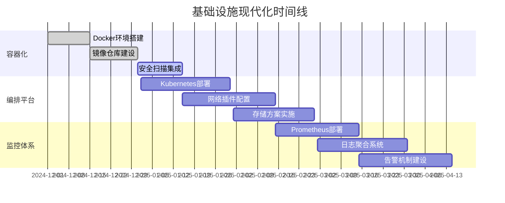
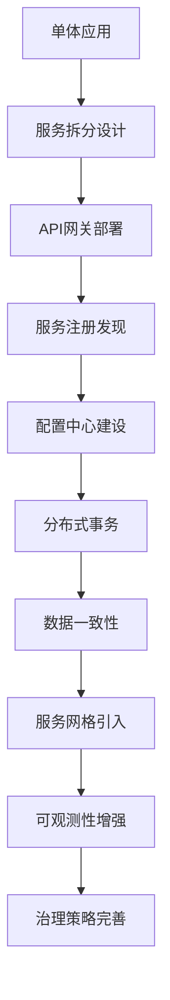
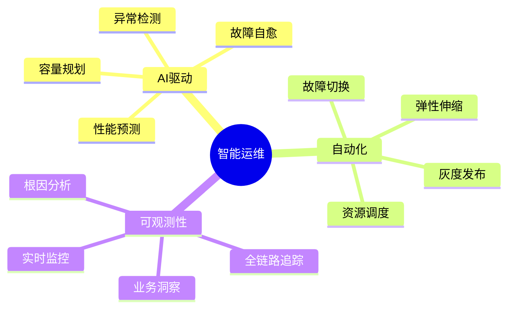
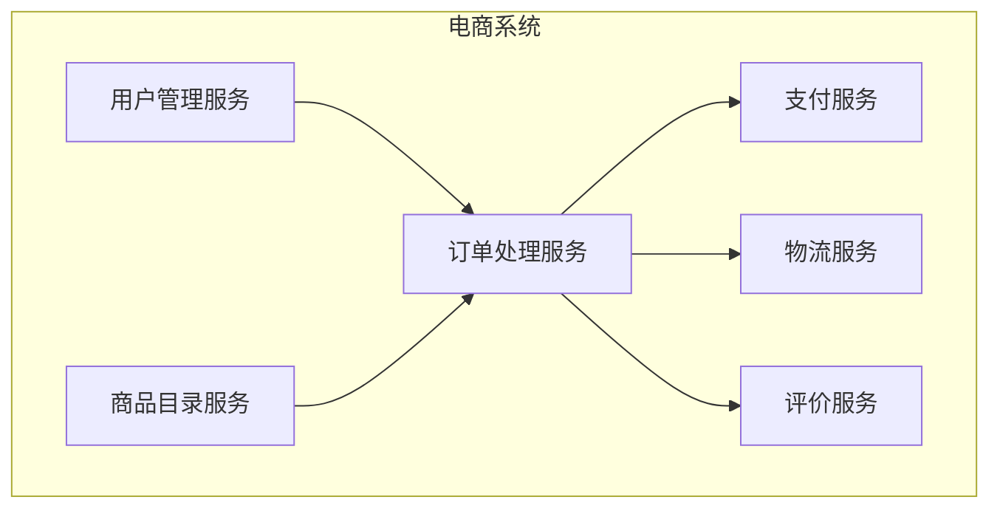
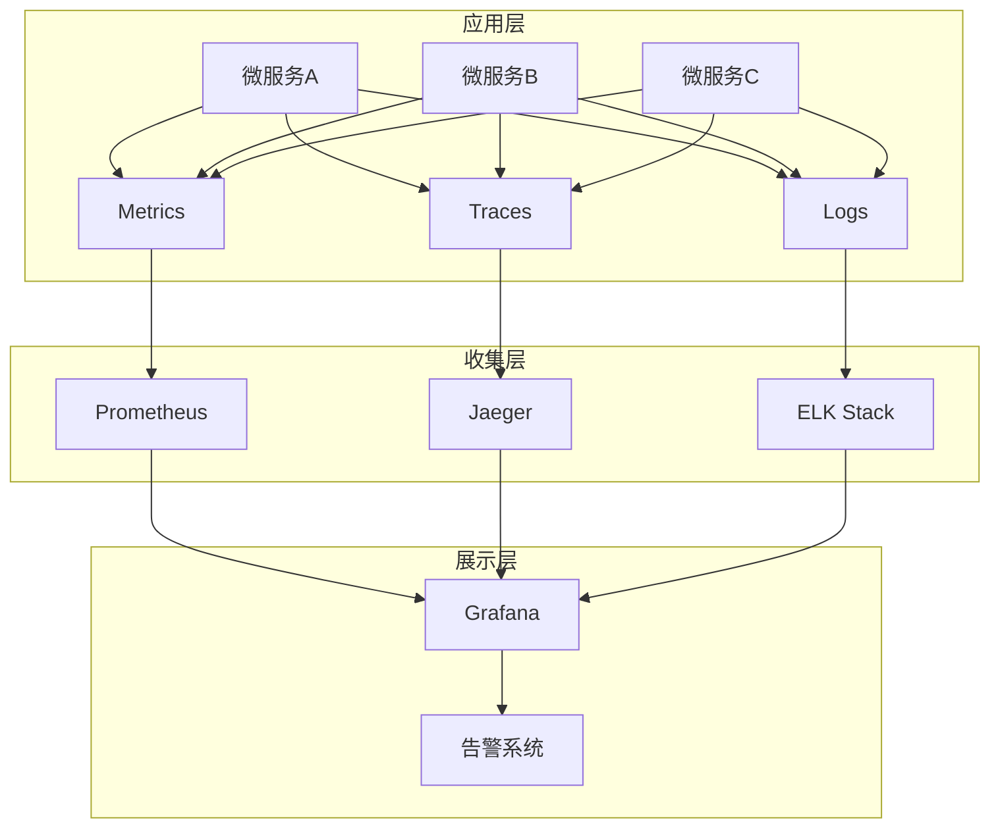
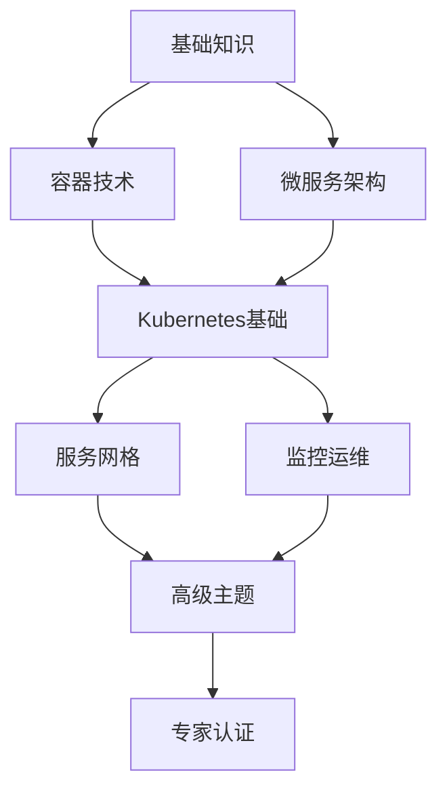

# 容器微服务技术路线图与实施指南 / Container Microservices Technology Roadmap and Implementation Guide

## 概述 / Overview

本文档提供了容器与微服务技术的发展路线图和详细实施指南，旨在为团队提供清晰的技术演进方向和具体的实施步骤。

This document provides a development roadmap and detailed implementation guide for container and microservice technologies, aiming to provide teams with a clear direction for technology evolution and specific implementation steps.

## 🗺️ 技术路线图 / Technology Roadmap

### 阶段一：基础设施现代化 (0-6个月) / Phase 1: Infrastructure Modernization (0-6 months)



**关键成果物**：

- ✅ 标准化容器镜像
- ✅ 生产级Kubernetes集群
- ✅ 完整监控告警体系
- ✅ 自动化部署流水线

### 阶段二：微服务架构实施 (6-12个月) / Phase 2: Microservices Architecture Implementation (6-12 months)



**实施优先级**：

1. 🔴 **高优先级**: API网关、服务注册发现、配置中心
2. 🟡 **中优先级**: 分布式事务、数据一致性解决方案
3. 🟢 **低优先级**: 服务网格、高级治理功能

### 阶段三：智能化运维 (12-18个月) / Phase 3: Intelligent Operations (12-18 months)



## 🔧 实施指南 / Implementation Guide

### 1. 容器化改造指南 / Containerization Guide

#### 1.1 应用容器化评估

**评估维度**：

```yaml
评估清单:
  技术可行性:
    - 依赖项复杂度: [简单/中等/复杂]
    - 状态存储方式: [无状态/文件状态/数据库状态]
    - 网络通信模式: [HTTP/TCP/UDP/混合]
    - 资源消耗情况: [CPU密集型/内存密集型/IO密集型]
  
  业务影响:
    - 用户体验影响: [无/轻微/显著]
    - 数据迁移复杂度: [简单/中等/复杂]
    - 停机时间要求: [可接受/不可接受]
    - 回滚风险评估: [低/中/高]

  资源投入:
    - 开发人员技能: [熟悉/一般/不熟悉]
    - 时间投入估算: [天/周/月]
    - 基础设施成本: [增加/持平/减少]
    - 培训成本: [低/中/高]
```

#### 1.2 容器化实施步骤

**步骤1: 环境准备**:

```bash
# 1. 安装Docker环境
curl -fsSL https://get.docker.com -o get-docker.sh
sudo sh get-docker.sh

# 2. 配置镜像仓库
docker login your-registry.com

# 3. 设置开发环境
cat > Dockerfile.dev << EOF
FROM node:16-alpine
WORKDIR /app
COPY package*.json ./
RUN npm ci --only=development
COPY . .
EXPOSE 3000
CMD ["npm", "run", "dev"]
EOF
```

**步骤2: 镜像构建优化**:

```dockerfile
# 多阶段构建示例
FROM node:16-alpine AS builder
WORKDIR /app
COPY package*.json ./
RUN npm ci --only=production

FROM node:16-alpine AS runtime
RUN addgroup -g 1001 -S nodejs
RUN adduser -S nextjs -u 1001
WORKDIR /app
COPY --from=builder /app/node_modules ./node_modules
COPY --from=builder /app/package.json ./package.json
USER nextjs
EXPOSE 3000
CMD ["npm", "start"]
```

**步骤3: 安全配置**:

```yaml
# kubernetes security context
apiVersion: v1
kind: Pod
spec:
  securityContext:
    runAsNonRoot: true
    runAsUser: 1001
    fsGroup: 2000
  containers:
  - name: app
    securityContext:
      allowPrivilegeEscalation: false
      readOnlyRootFilesystem: true
      capabilities:
        drop:
        - ALL
    resources:
      requests:
        memory: "128Mi"
        cpu: "100m"
      limits:
        memory: "256Mi"
        cpu: "200m"
```

### 2. 微服务拆分指南 / Microservices Decomposition Guide

#### 2.1 拆分策略选择

**按业务领域拆分（推荐）**：



**拆分决策矩阵**：

```yaml
评估维度:
  业务边界:
    - 功能内聚性: [高/中/低]
    - 数据关联度: [强/中/弱]
    - 变更频率: [频繁/一般/稳定]
    - 团队边界: [明确/模糊]
  
  技术考量:
    - 性能要求: [高/中/低]
    - 可用性要求: [99.9%/99.95%/99.99%]
    - 扩展性需求: [水平/垂直/混合]
    - 技术栈差异: [大/中/小]

  运维复杂度:
    - 部署复杂度: [简单/中等/复杂]
    - 监控难度: [易/中/难]
    - 故障排查: [容易/一般/困难]
    - 数据一致性: [强一致/最终一致/BASE]
```

#### 2.2 服务间通信设计

**同步通信模式**：

```python
# RESTful API设计
from fastapi import FastAPI, HTTPException
from pydantic import BaseModel

app = FastAPI()

class UserRequest(BaseModel):
    username: str
    email: str

class UserResponse(BaseModel):
    id: int
    username: str
    email: str
    created_at: datetime

@app.post("/users", response_model=UserResponse)
async def create_user(user: UserRequest):
    # 用户创建逻辑
    pass

@app.get("/users/{user_id}", response_model=UserResponse)
async def get_user(user_id: int):
    # 用户查询逻辑
    pass
```

**异步通信模式**：

```python
# 事件驱动架构
import asyncio
from dataclasses import dataclass
from typing import List, Callable

@dataclass
class Event:
    type: str
    data: dict
    timestamp: datetime

class EventBus:
    def __init__(self):
        self.handlers: Dict[str, List[Callable]] = {}
    
    def subscribe(self, event_type: str, handler: Callable):
        if event_type not in self.handlers:
            self.handlers[event_type] = []
        self.handlers[event_type].append(handler)
    
    async def publish(self, event: Event):
        if event.type in self.handlers:
            tasks = [handler(event) for handler in self.handlers[event.type]]
            await asyncio.gather(*tasks)
```

### 3. 服务网格实施指南 / Service Mesh Implementation Guide

#### 3.1 Istio部署配置

**安装Istio**：

```bash
# 1. 下载Istio
curl -L https://istio.io/downloadIstio | sh -
cd istio-*
export PATH=$PWD/bin:$PATH

# 2. 安装Istio控制平面
istioctl install --set values.defaultRevision=default

# 3. 启用自动注入
kubectl label namespace default istio-injection=enabled
```

**流量管理配置**：

```yaml
# VirtualService配置
apiVersion: networking.istio.io/v1beta1
kind: VirtualService
metadata:
  name: productpage
spec:
  hosts:
  - productpage
  http:
  - match:
    - headers:
        canary:
          exact: "true"
    route:
    - destination:
        host: productpage
        subset: v2
      weight: 100
  - route:
    - destination:
        host: productpage
        subset: v1
      weight: 100
---
# DestinationRule配置
apiVersion: networking.istio.io/v1beta1
kind: DestinationRule
metadata:
  name: productpage
spec:
  host: productpage
  subsets:
  - name: v1
    labels:
      version: v1
  - name: v2
    labels:
      version: v2
```

#### 3.2 安全策略配置

**mTLS配置**：

```yaml
# 启用严格模式mTLS
apiVersion: security.istio.io/v1beta1
kind: PeerAuthentication
metadata:
  name: default
  namespace: production
spec:
  mtls:
    mode: STRICT
---
# 授权策略
apiVersion: security.istio.io/v1beta1
kind: AuthorizationPolicy
metadata:
  name: productpage-viewer
  namespace: production
spec:
  selector:
    matchLabels:
      app: productpage
  rules:
  - from:
    - source:
        principals: ["cluster.local/ns/production/sa/bookinfo-productpage"]
  - to:
    - operation:
        methods: ["GET"]
```

### 4. 监控和可观测性指南 / Monitoring and Observability Guide

#### 4.1 监控架构设计



#### 4.2 指标体系设计

**应用指标**：

```python
from prometheus_client import Counter, Histogram, Gauge, start_http_server
import time

# 业务指标
REQUEST_COUNT = Counter('app_requests_total', 'Total requests', ['method', 'endpoint'])
REQUEST_LATENCY = Histogram('app_request_duration_seconds', 'Request latency')
ACTIVE_CONNECTIONS = Gauge('app_active_connections', 'Active connections')

# 装饰器用于自动记录指标
def monitor_requests(func):
    def wrapper(*args, **kwargs):
        start_time = time.time()
        REQUEST_COUNT.labels(method='GET', endpoint='/api/users').inc()
        
        try:
            result = func(*args, **kwargs)
            return result
        finally:
            REQUEST_LATENCY.observe(time.time() - start_time)
    
    return wrapper

@monitor_requests
def get_users():
    # 业务逻辑
    pass
```

**系统指标配置**：

```yaml
# Prometheus配置
global:
  scrape_interval: 15s
  evaluation_interval: 15s

rule_files:
  - "alert_rules.yml"

scrape_configs:
  - job_name: 'kubernetes-pods'
    kubernetes_sd_configs:
    - role: pod
    relabel_configs:
    - source_labels: [__meta_kubernetes_pod_annotation_prometheus_io_scrape]
      action: keep
      regex: true
    - source_labels: [__meta_kubernetes_pod_annotation_prometheus_io_path]
      action: replace
      target_label: __metrics_path__
      regex: (.+)

alerting:
  alertmanagers:
  - static_configs:
    - targets:
      - alertmanager:9093
```

#### 4.3 告警规则配置

```yaml
# 告警规则示例
groups:
- name: microservices.rules
  rules:
  - alert: HighErrorRate
    expr: |
      (
        rate(http_requests_total{status=~"5.."}[5m]) /
        rate(http_requests_total[5m])
      ) > 0.1
    for: 5m
    labels:
      severity: warning
    annotations:
      summary: "High error rate detected"
      description: "Error rate is {{ $value | humanizePercentage }} for service {{ $labels.service }}"

  - alert: HighLatency
    expr: |
      histogram_quantile(0.95,
        rate(http_request_duration_seconds_bucket[5m])
      ) > 0.5
    for: 10m
    labels:
      severity: critical
    annotations:
      summary: "High latency detected"
      description: "95th percentile latency is {{ $value }}s for service {{ $labels.service }}"
```

### 5. 安全实施指南 / Security Implementation Guide

#### 5.1 容器安全最佳实践

**镜像安全**：

```dockerfile
# 使用最小化基础镜像
FROM alpine:3.18

# 创建非特权用户
RUN addgroup -g 1001 -S appgroup && \
    adduser -u 1001 -S appuser -G appgroup

# 安装必要的安全更新
RUN apk update && apk upgrade && \
    apk add --no-cache ca-certificates && \
    rm -rf /var/cache/apk/*

# 复制应用文件
COPY --chown=appuser:appgroup app /app

# 切换到非特权用户
USER appuser

# 设置只读根文件系统
VOLUME ["/tmp"]
```

**镜像扫描流程**：

```bash
#!/bin/bash
# 镜像安全扫描脚本

IMAGE_NAME=$1
SCAN_RESULT_FILE="scan-results.json"

# 使用Trivy扫描镜像
trivy image --format json --output $SCAN_RESULT_FILE $IMAGE_NAME

# 检查高危漏洞
HIGH_VULNS=$(cat $SCAN_RESULT_FILE | jq '.Results[].Vulnerabilities[]? | select(.Severity=="HIGH") | length')
CRITICAL_VULNS=$(cat $SCAN_RESULT_FILE | jq '.Results[].Vulnerabilities[]? | select(.Severity=="CRITICAL") | length')

if [ "$CRITICAL_VULNS" -gt 0 ]; then
    echo "FAILED: Critical vulnerabilities found: $CRITICAL_VULNS"
    exit 1
elif [ "$HIGH_VULNS" -gt 5 ]; then
    echo "WARNING: High vulnerabilities found: $HIGH_VULNS"
    exit 1
else
    echo "PASSED: Security scan completed successfully"
    exit 0
fi
```

#### 5.2 Kubernetes安全配置

**Pod安全策略**：

```yaml
apiVersion: v1
kind: Pod
metadata:
  name: secure-app
spec:
  securityContext:
    runAsNonRoot: true
    runAsUser: 1001
    runAsGroup: 3000
    fsGroup: 2000
    seccompProfile:
      type: RuntimeDefault
  containers:
  - name: app
    image: myapp:latest
    securityContext:
      allowPrivilegeEscalation: false
      readOnlyRootFilesystem: true
      capabilities:
        drop:
        - ALL
        add:
        - NET_BIND_SERVICE
    volumeMounts:
    - name: tmp
      mountPath: /tmp
    - name: cache
      mountPath: /app/cache
  volumes:
  - name: tmp
    emptyDir: {}
  - name: cache
    emptyDir: {}
```

**网络策略**：

```yaml
apiVersion: networking.k8s.io/v1
kind: NetworkPolicy
metadata:
  name: app-network-policy
spec:
  podSelector:
    matchLabels:
      app: myapp
  policyTypes:
  - Ingress
  - Egress
  ingress:
  - from:
    - namespaceSelector:
        matchLabels:
          name: frontend
    - podSelector:
        matchLabels:
          role: api-gateway
    ports:
    - protocol: TCP
      port: 8080
  egress:
  - to:
    - namespaceSelector:
        matchLabels:
          name: database
    ports:
    - protocol: TCP
      port: 5432
  - to: []
    ports:
    - protocol: UDP
      port: 53
```

### 6. 性能优化指南 / Performance Optimization Guide

#### 6.1 容器性能优化

**资源限制优化**：

```yaml
apiVersion: v1
kind: Pod
spec:
  containers:
  - name: app
    resources:
      requests:
        memory: "256Mi"
        cpu: "250m"
      limits:
        memory: "512Mi"
        cpu: "500m"
    # JVM优化配置
    env:
    - name: JAVA_OPTS
      value: |
        -XX:InitialRAMPercentage=50.0
        -XX:MaxRAMPercentage=75.0
        -XX:+UseG1GC
        -XX:+UseContainerSupport
        -XX:MaxGCPauseMillis=200
```

**启动时间优化**：

```dockerfile
# 多阶段构建优化
FROM maven:3.8-openjdk-17 AS builder
WORKDIR /app
COPY pom.xml .
RUN mvn dependency:go-offline -B
COPY src ./src
RUN mvn package -DskipTests

FROM openjdk:17-jre-slim
# 使用AppCDS优化启动时间
RUN java -Xshare:dump
COPY --from=builder /app/target/app.jar /app.jar
# 预编译热点代码
RUN java -XX:ArchiveClassesAtExit=app.jsa -jar /app.jar --warmup
ENTRYPOINT ["java", "-XX:SharedArchiveFile=app.jsa", "-jar", "/app.jar"]
```

#### 6.2 网络性能优化

**服务网格优化**：

```yaml
# Istio代理资源优化
apiVersion: install.istio.io/v1alpha1
kind: IstioOperator
spec:
  values:
    global:
      proxy:
        resources:
          requests:
            cpu: 10m
            memory: 40Mi
          limits:
            cpu: 2000m
            memory: 1024Mi
    sidecarInjectorWebhook:
      defaultTemplates: [sidecar, builtin-gateway]
  meshConfig:
    defaultConfig:
      proxyStatsMatcher:
        inclusionRegexps:
        - ".*outlier_detection.*"
        - ".*circuit_breakers.*"
        - ".*upstream_rq_retry.*"
        - ".*_cx_.*"
        exclusionRegexps:
        - ".*osconfig.*"
```

### 7. 故障排查指南 / Troubleshooting Guide

#### 7.1 常见问题诊断

**容器启动失败**：

```bash
# 1. 检查Pod状态
kubectl get pods -o wide

# 2. 查看详细事件
kubectl describe pod <pod-name>

# 3. 检查容器日志
kubectl logs <pod-name> -c <container-name> --previous

# 4. 进入容器调试
kubectl exec -it <pod-name> -- /bin/sh

# 5. 检查资源使用
kubectl top pods
kubectl top nodes
```

**网络连接问题**：

```bash
# 1. 检查服务端点
kubectl get endpoints <service-name>

# 2. 测试DNS解析
kubectl run -it --rm debug --image=busybox --restart=Never -- nslookup <service-name>

# 3. 测试网络连接
kubectl run -it --rm debug --image=nicolaka/netshoot --restart=Never -- bash
# 在容器内执行
curl -v http://<service-name>:<port>
```

#### 7.2 性能问题分析

**CPU和内存分析**：

```bash
# 1. 查看资源使用趋势
kubectl top pods --sort-by=cpu
kubectl top pods --sort-by=memory

# 2. 检查资源限制
kubectl describe pod <pod-name> | grep -A 10 "Limits"

# 3. 分析应用性能
# 使用pprof分析Go应用
go tool pprof http://localhost:6060/debug/pprof/profile

# 使用JProfiler分析Java应用
java -agentpath:/path/to/jprofiler/bin/linux-x64/libjprofilerti.so=port=8849 -jar app.jar
```

## 📚 培训和能力建设 / Training and Capability Building

### 培训路径设计



### 实践项目建议

**初级项目**：

- [ ] 将简单Web应用容器化
- [ ] 使用Docker Compose编排多服务应用
- [ ] 配置基础的监控和日志

**中级项目**：

- [ ] 在Kubernetes上部署微服务应用
- [ ] 实施服务发现和配置管理
- [ ] 配置Istio服务网格

**高级项目**：

- [ ] 实现多集群部署
- [ ] 构建CI/CD流水线
- [ ] 实施混沌工程测试

---

**文档版本信息**:

- 版本: v1.0
- 创建日期: 2024-12-19
- 最后更新: 2024-12-19
- 维护者: 技术团队
- 适用范围: 容器微服务技术栈

**使用建议**:

1. 建议按阶段推进，避免一次性实施所有功能
2. 重视团队培训和技能建设
3. 建立完善的监控和告警机制
4. 定期回顾和优化技术方案
