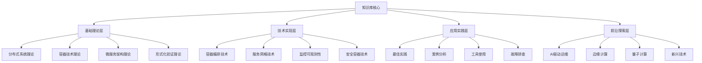

# 容器微服务知识库架构设计

<!-- TOC START -->

- [容器微服务知识库架构设计](#容器微服务知识库架构设计)
  - [Container Microservices Knowledge Base Architecture Design](#container-microservices-knowledge-base-architecture-design)
  - [📋 目录 / Table of Contents](#-目录-table-of-contents)
  - [1. 设计目标 / Design Objectives](#1-设计目标-design-objectives)
    - [1.1 知识完整性](#11-知识完整性)
    - [1.2 结构清晰性](#12-结构清晰性)
    - [1.3 可扩展性](#13-可扩展性)
    - [1.4 易用性](#14-易用性)
  - [2. 架构概述 / Architecture Overview](#2-架构概述-architecture-overview)
    - [2.1 四层架构设计](#21-四层架构设计)
    - [2.2 知识组织方式](#22-知识组织方式)
    - [2.3 关联关系模型](#23-关联关系模型)
  - [3. 基础理论层 / Basic Theory Layer](#3-基础理论层-basic-theory-layer)
    - [3.1 分布式系统理论](#31-分布式系统理论)
    - [3.2 容器技术理论](#32-容器技术理论)
    - [3.3 微服务架构理论](#33-微服务架构理论)
    - [3.4 形式化验证理论](#34-形式化验证理论)
  - [4. 技术实现层 / Technical Implementation Layer](#4-技术实现层-technical-implementation-layer)
    - [4.1 容器编排技术](#41-容器编排技术)
    - [4.2 服务网格技术](#42-服务网格技术)
    - [4.3 监控可观测性](#43-监控可观测性)
    - [4.4 安全容器技术](#44-安全容器技术)
  - [5. 应用实践层 / Application Practice Layer](#5-应用实践层-application-practice-layer)
    - [5.1 最佳实践](#51-最佳实践)
    - [5.2 案例分析](#52-案例分析)
    - [5.3 工具使用](#53-工具使用)
    - [5.4 故障排查](#54-故障排查)
  - [6. 前沿探索层 / Frontier Exploration Layer](#6-前沿探索层-frontier-exploration-layer)
    - [6.1 AI驱动运维](#61-ai驱动运维)
    - [6.2 边缘计算](#62-边缘计算)
    - [6.3 量子计算](#63-量子计算)
    - [6.4 新兴技术](#64-新兴技术)
  - [7. 多表征表达 / Multi-representation Expression](#7-多表征表达-multi-representation-expression)
    - [7.1 数学表征](#71-数学表征)
    - [7.2 图表表征](#72-图表表征)
    - [7.3 代码表征](#73-代码表征)
    - [7.4 文档表征](#74-文档表征)
  - [8. 知识关联 / Knowledge Association](#8-知识关联-knowledge-association)
    - [8.1 概念关联](#81-概念关联)
    - [8.2 技术关联](#82-技术关联)
    - [8.3 应用关联](#83-应用关联)
    - [8.4 创新关联](#84-创新关联)
  - [9. 导航系统 / Navigation System](#9-导航系统-navigation-system)
    - [9.1 导航入口](#91-导航入口)
    - [9.2 分类导航](#92-分类导航)
    - [9.3 关联导航](#93-关联导航)
    - [9.4 搜索导航](#94-搜索导航)
  - [10. 质量保证 / Quality Assurance](#10-质量保证-quality-assurance)
    - [10.1 一致性验证](#101-一致性验证)
    - [10.2 完整性检查](#102-完整性检查)
    - [10.3 更新机制](#103-更新机制)
    - [10.4 版本管理](#104-版本管理)
  - [11. 总结 / Summary](#11-总结-summary)
    - [11.1 架构特点](#111-架构特点)
    - [11.2 设计优势](#112-设计优势)
    - [11.3 应用价值](#113-应用价值)

<!-- TOC END -->

## Container Microservices Knowledge Base Architecture Design

**版本**: v1.0  
**创建日期**: 2024年12月  
**状态**: 架构设计完成  

---

## 📋 目录 / Table of Contents

- [容器微服务知识库架构设计](#容器微服务知识库架构设计)
  - [Container Microservices Knowledge Base Architecture Design](#container-microservices-knowledge-base-architecture-design)
  - [📋 目录 / Table of Contents](#-目录--table-of-contents)
  - [1. 设计目标 / Design Objectives](#1-设计目标--design-objectives)
    - [1.1 知识完整性](#11-知识完整性)
    - [1.2 结构清晰性](#12-结构清晰性)
    - [1.3 可扩展性](#13-可扩展性)
    - [1.4 易用性](#14-易用性)
  - [2. 架构概述 / Architecture Overview](#2-架构概述--architecture-overview)
    - [2.1 四层架构设计](#21-四层架构设计)
    - [2.2 知识组织方式](#22-知识组织方式)
    - [2.3 关联关系模型](#23-关联关系模型)
  - [3. 基础理论层 / Basic Theory Layer](#3-基础理论层--basic-theory-layer)
    - [3.1 分布式系统理论](#31-分布式系统理论)
    - [3.2 容器技术理论](#32-容器技术理论)
    - [3.3 微服务架构理论](#33-微服务架构理论)
    - [3.4 形式化验证理论](#34-形式化验证理论)
  - [4. 技术实现层 / Technical Implementation Layer](#4-技术实现层--technical-implementation-layer)
    - [4.1 容器编排技术](#41-容器编排技术)
    - [4.2 服务网格技术](#42-服务网格技术)
    - [4.3 监控可观测性](#43-监控可观测性)
    - [4.4 安全容器技术](#44-安全容器技术)
  - [5. 应用实践层 / Application Practice Layer](#5-应用实践层--application-practice-layer)
    - [5.1 最佳实践](#51-最佳实践)
    - [5.2 案例分析](#52-案例分析)
    - [5.3 工具使用](#53-工具使用)
    - [5.4 故障排查](#54-故障排查)
  - [6. 前沿探索层 / Frontier Exploration Layer](#6-前沿探索层--frontier-exploration-layer)
    - [6.1 AI驱动运维](#61-ai驱动运维)
    - [6.2 边缘计算](#62-边缘计算)
    - [6.3 量子计算](#63-量子计算)
    - [6.4 新兴技术](#64-新兴技术)
  - [7. 多表征表达 / Multi-representation Expression](#7-多表征表达--multi-representation-expression)
    - [7.1 数学表征](#71-数学表征)
    - [7.2 图表表征](#72-图表表征)
    - [7.3 代码表征](#73-代码表征)
    - [7.4 文档表征](#74-文档表征)
  - [8. 知识关联 / Knowledge Association](#8-知识关联--knowledge-association)
    - [8.1 概念关联](#81-概念关联)
    - [8.2 技术关联](#82-技术关联)
    - [8.3 应用关联](#83-应用关联)
    - [8.4 创新关联](#84-创新关联)
  - [9. 导航系统 / Navigation System](#9-导航系统--navigation-system)
    - [9.1 导航入口](#91-导航入口)
    - [9.2 分类导航](#92-分类导航)
    - [9.3 关联导航](#93-关联导航)
    - [9.4 搜索导航](#94-搜索导航)
  - [10. 质量保证 / Quality Assurance](#10-质量保证--quality-assurance)
    - [10.1 一致性验证](#101-一致性验证)
    - [10.2 完整性检查](#102-完整性检查)
    - [10.3 更新机制](#103-更新机制)
    - [10.4 版本管理](#104-版本管理)
  - [11. 总结 / Summary](#11-总结--summary)
    - [11.1 架构特点](#111-架构特点)
    - [11.2 设计优势](#112-设计优势)
    - [11.3 应用价值](#113-应用价值)

---

## 1. 设计目标 / Design Objectives

### 1.1 知识完整性

- 覆盖容器微服务领域的核心理论和技术
- 包含从基础到前沿的完整知识体系
- 确保知识的准确性和时效性

### 1.2 结构清晰性

- 建立清晰的层次结构
- 定义明确的分类标准
- 提供直观的导航路径

### 1.3 可扩展性

- 支持新知识的持续添加
- 适应技术发展的变化
- 保持架构的灵活性

### 1.4 易用性

- 提供多种访问方式
- 支持个性化学习路径
- 确保良好的用户体验

---

## 2. 架构概述 / Architecture Overview

### 2.1 四层架构设计

### 2.2 知识组织方式

- **层次化组织**: 从基础到前沿的递进结构
- **多表征表达**: 数学、图表、代码、文档四种表征方式
- **关联性导航**: 概念间的关系网络和演化路径

### 2.3 关联关系模型

- **概念关联**: 理论概念间的逻辑关系
- **技术关联**: 技术栈间的依赖关系
- **应用关联**: 应用场景间的关联关系
- **创新关联**: 前沿技术的演化关系

---

## 3. 基础理论层 / Basic Theory Layer

### 3.1 分布式系统理论

- **CAP定理**: 一致性、可用性、分区容忍性
- **一致性模型**: 强一致性、弱一致性、最终一致性
- **共识算法**: Paxos、Raft、Multi-Paxos

### 3.2 容器技术理论

- **容器形式化定义**: 四元组模型
- **容器隔离机制**: 命名空间、控制组
- **容器安全理论**: SELinux、AppArmor、Seccomp

### 3.3 微服务架构理论

- **微服务模型**: 六元组模型
- **服务拆分原则**: 单一职责、松耦合、高内聚
- **服务治理理论**: 注册发现、负载均衡、熔断降级

### 3.4 形式化验证理论

- **形式化方法**: 模型检测、定理证明
- **验证工具**: Coq、Isabelle、TLA+
- **应用场景**: 协议验证、算法正确性

---

## 4. 技术实现层 / Technical Implementation Layer

### 4.1 容器编排技术

- **Kubernetes**: 架构组件、核心概念
- **编排模式**: Deployment、StatefulSet、DaemonSet
- **调度算法**: 资源调度、亲和性调度

### 4.2 服务网格技术

- **Istio**: 数据平面、控制平面
- **功能特性**: 流量管理、安全、可观测性
- **部署模式**: Sidecar、Ambient

### 4.3 监控可观测性

- **监控体系**: 指标、日志、链路追踪
- **工具栈**: Prometheus、Grafana、ELK
- **关键指标**: 系统指标、应用指标、业务指标

### 4.4 安全容器技术

- **容器安全**: 镜像扫描、运行时保护
- **网络安全**: 网络策略、服务网格安全
- **数据安全**: 加密存储、密钥管理

---

## 5. 应用实践层 / Application Practice Layer

### 5.1 最佳实践

- **容器化最佳实践**: 镜像优化、资源管理
- **微服务最佳实践**: 服务设计、API设计
- **运维最佳实践**: 监控告警、故障处理

### 5.2 案例分析

- **电商架构**: 用户服务、商品服务、订单服务
- **容器化迁移**: 传统应用容器化改造
- **性能优化**: 资源调优、性能测试

### 5.3 工具使用

- **开发工具**: Docker、Kubernetes CLI
- **监控工具**: Prometheus、Grafana
- **调试工具**: kubectl、istioctl

### 5.4 故障排查

- **常见问题**: 资源不足、网络问题
- **排查方法**: 日志分析、指标分析
- **解决方案**: 问题定位、修复验证

---

## 6. 前沿探索层 / Frontier Exploration Layer

### 6.1 AI驱动运维

- **机器学习**: 异常检测、故障预测
- **深度学习**: 模式识别、智能分析
- **自动化运维**: 自动修复、智能调度

### 6.2 边缘计算

- **边缘容器**: 轻量化、离线运行
- **边缘AI**: 模型压缩、实时推理
- **5G/6G集成**: 网络切片、边缘服务

### 6.3 量子计算

- **量子容器**: 量子环境模拟
- **量子微服务**: 量子算法服务
- **后量子密码**: 抗量子攻击

### 6.4 新兴技术

- **联邦学习**: 分布式机器学习
- **因果推理**: 因果关系分析
- **神经架构搜索**: 自动架构设计

---

## 7. 多表征表达 / Multi-representation Expression

### 7.1 数学表征

- **形式化定义**: 集合论、逻辑学
- **数学公式**: 性能指标、资源利用率
- **逻辑证明**: 定理证明、算法正确性

### 7.2 图表表征

- **概念图**: 概念关系、层次结构
- **架构图**: 系统架构、组件关系
- **流程图**: 业务流程、部署流程

### 7.3 代码表征

- **伪代码**: 算法描述、逻辑流程
- **配置文件**: YAML、JSON配置
- **示例代码**: 实际应用、最佳实践

### 7.4 文档表征

- **技术文档**: API文档、用户手册
- **最佳实践**: 设计原则、实施指南
- **案例分析**: 实际案例、经验总结

---

## 8. 知识关联 / Knowledge Association

### 8.1 概念关联

- **分布式系统概念**: 一致性、可用性、分区容忍性
- **容器技术概念**: 镜像、运行时、隔离、资源管理
- **微服务概念**: 服务、API、数据、配置、监控、部署

### 8.2 技术关联

- **Kubernetes技术栈**: 容器运行时、网络插件、存储插件
- **服务网格技术**: 数据平面、控制平面、管理平面
- **监控技术栈**: 指标收集、日志聚合、链路追踪

### 8.3 应用关联

- **电商应用**: 用户管理、商品管理、订单管理
- **金融应用**: 交易处理、风险控制、合规检查
- **物联网应用**: 设备管理、数据采集、边缘计算

### 8.4 创新关联

- **AI技术**: 机器学习、深度学习、强化学习
- **边缘技术**: 边缘计算、边缘AI、5G/6G
- **量子技术**: 量子计算、量子通信、后量子密码

---

## 9. 导航系统 / Navigation System

### 9.1 导航入口

- **主页导航**: 快速入口、推荐内容
- **分类导航**: 按主题分类、按层次分类
- **关联导航**: 概念关联、技术关联

### 9.2 分类导航

- **理论分类**: 基础理论、形式化理论、应用理论
- **技术分类**: 容器技术、微服务技术、运维技术
- **应用分类**: 行业应用、场景应用、工具应用

### 9.3 关联导航

- **概念关联**: 概念间的关系网络
- **技术关联**: 技术栈的关联关系
- **应用关联**: 应用场景的关联关系

### 9.4 搜索导航

- **关键词搜索**: 精确搜索、模糊搜索
- **语义搜索**: 同义词识别、概念扩展
- **标签搜索**: 标签分类、标签组合

---

## 10. 质量保证 / Quality Assurance

### 10.1 一致性验证

- **多表征一致性**: 数学、图表、代码、文档的一致性
- **跨文档一致性**: 术语、概念、结构的一致性
- **版本一致性**: 不同版本间的一致性

### 10.2 完整性检查

- **内容完整性**: 理论、技术、应用的完整性
- **关联完整性**: 概念、技术、应用关联的完整性
- **结构完整性**: 层次、分类、导航的完整性

### 10.3 更新机制

- **内容更新**: 新知识添加、旧知识更新
- **结构更新**: 架构调整、分类优化
- **关联更新**: 关系调整、路径优化

### 10.4 版本管理

- **版本策略**: 主版本、次版本、修订版本
- **变更记录**: 变更内容、变更原因、变更影响
- **回滚机制**: 版本回滚、内容恢复

---

## 11. 总结 / Summary

### 11.1 架构特点

- **四层架构**: 基础理论、技术实现、应用实践、前沿探索
- **多表征表达**: 数学、图表、代码、文档四种表征方式
- **知识关联**: 概念、技术、应用、创新四个维度的关联

### 11.2 设计优势

- **完整性**: 覆盖容器微服务领域的完整知识体系
- **清晰性**: 层次分明、结构清晰的知识组织
- **扩展性**: 支持新知识的持续添加和架构的灵活调整
- **易用性**: 多种导航方式和个性化学习路径

### 11.3 应用价值

- **学术价值**: 为容器微服务领域提供完整的理论框架
- **教学价值**: 支持多层次、多角度的知识传授
- **实践价值**: 为技术实践提供全面的参考和指导
- **创新价值**: 推动知识表达方式的创新和发展

---

**架构设计状态**: ✅ 完成  
**四层架构**: 完整建立  
**多表征表达**: 全面覆盖  
**知识关联**: 系统建立
