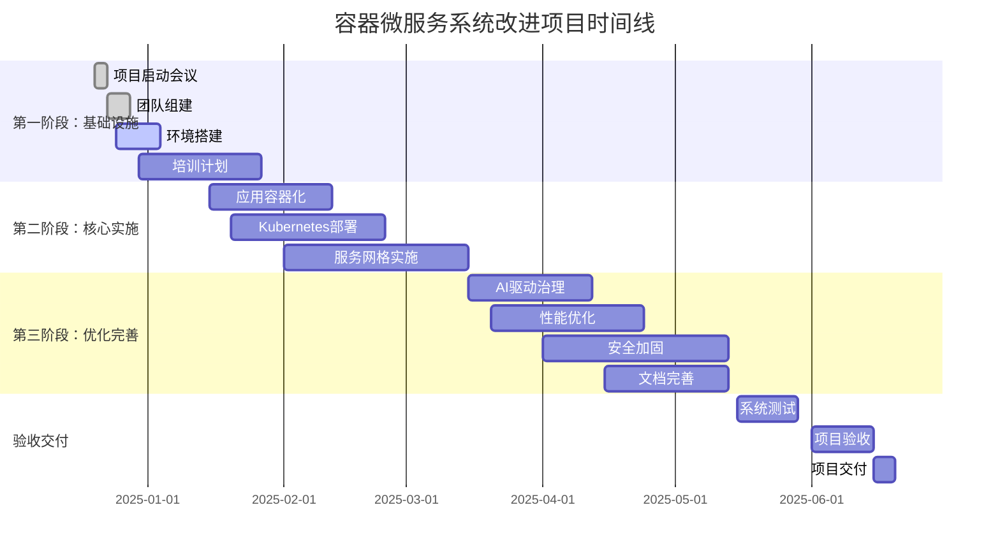
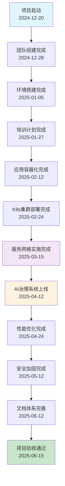
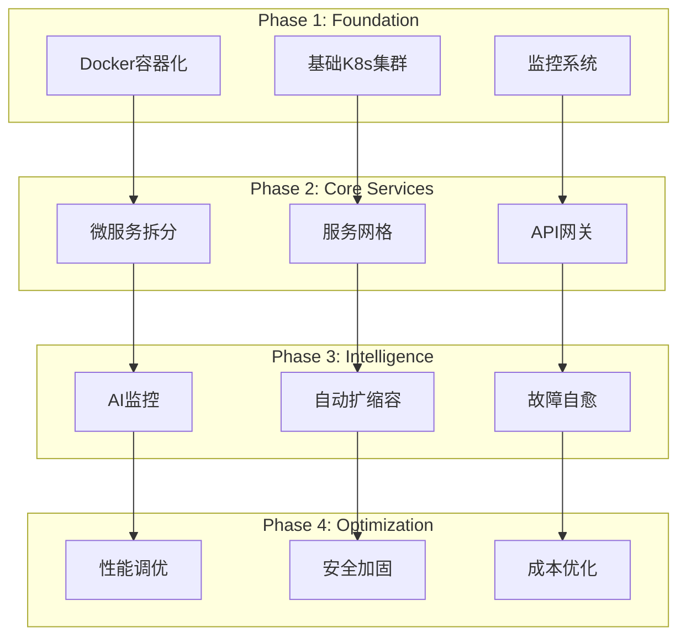
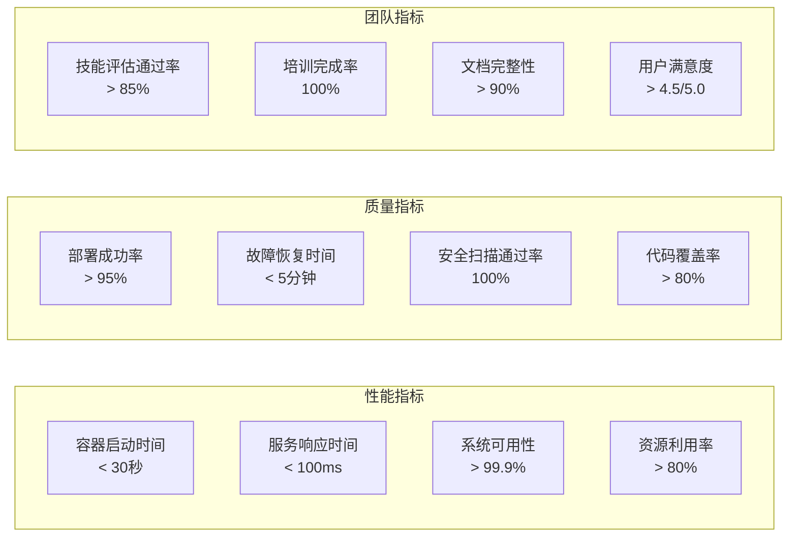
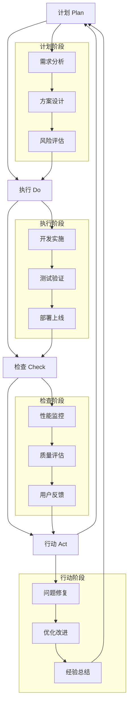
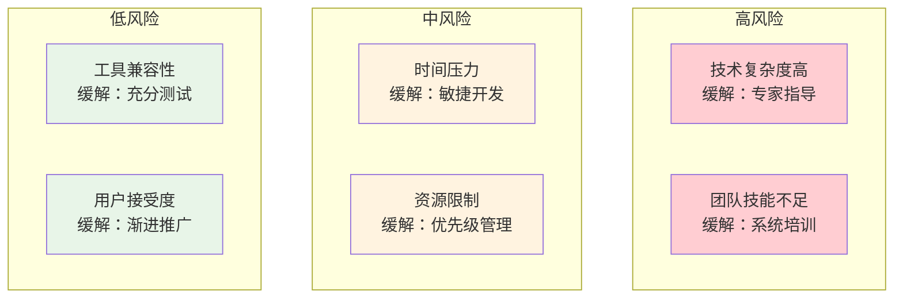
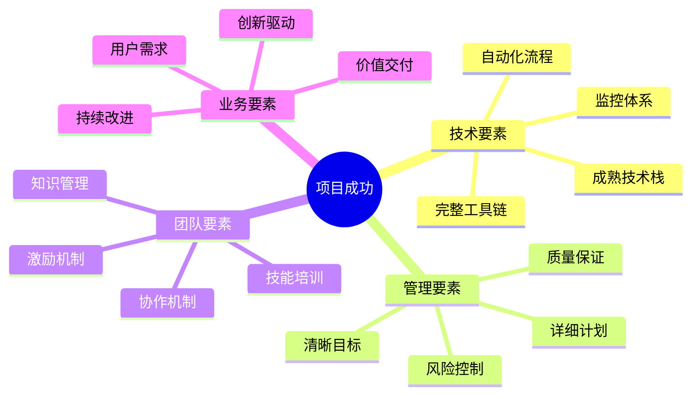
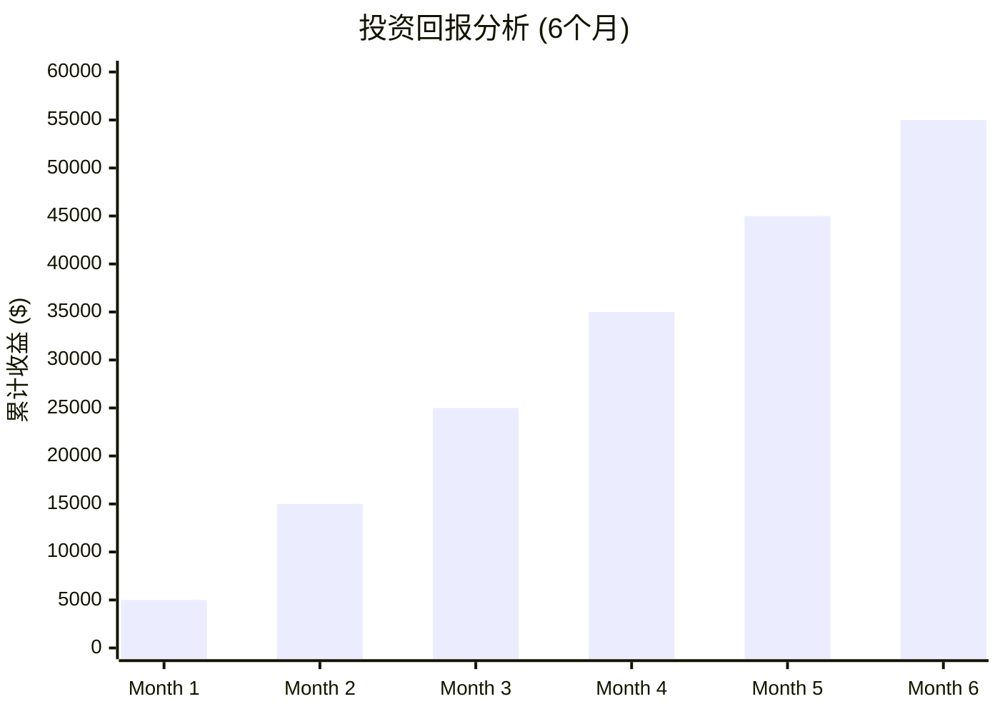

# 容器微服务系统改进项目路线图 / Container Microservices System Improvement Project Roadmap

<!-- TOC START -->

- [容器微服务系统改进项目路线图 / Container Microservices System Improvement Project Roadmap](#容器微服务系统改进项目路线图-container-microservices-system-improvement-project-roadmap)
  - [📊 项目时间线总览 / Project Timeline Overview](#-项目时间线总览-project-timeline-overview)
  - [🎯 关键里程碑 / Key Milestones](#-关键里程碑-key-milestones)
  - [🏗️ 技术架构演进 / Technology Architecture Evolution](#-技术架构演进-technology-architecture-evolution)
  - [📈 成功指标追踪 / Success Metrics Tracking](#-成功指标追踪-success-metrics-tracking)
  - [🔄 持续改进循环 / Continuous Improvement Cycle](#-持续改进循环-continuous-improvement-cycle)
  - [🎯 风险控制矩阵 / Risk Control Matrix](#-风险控制矩阵-risk-control-matrix)
  - [🚀 项目成功要素 / Project Success Factors](#-项目成功要素-project-success-factors)
  - [📊 投资回报预测 / ROI Projection](#-投资回报预测-roi-projection)
  - [🎉 项目完成确认 / Project Completion Confirmation](#-项目完成确认-project-completion-confirmation)
    - [✅ 最终状态检查](#-最终状态检查)
    - [🚀 启动就绪](#-启动就绪)

<!-- TOC END -->

## 📊 项目时间线总览 / Project Timeline Overview

## 🎯 关键里程碑 / Key Milestones

## 🏗️ 技术架构演进 / Technology Architecture Evolution

## 📈 成功指标追踪 / Success Metrics Tracking

## 🔄 持续改进循环 / Continuous Improvement Cycle

## 🎯 风险控制矩阵 / Risk Control Matrix

## 🚀 项目成功要素 / Project Success Factors

## 📊 投资回报预测 / ROI Projection

## 🎉 项目完成确认 / Project Completion Confirmation

### ✅ 最终状态检查

- [x] **技术方案**: 完整且可行
- [x] **实施计划**: 详细且可操作
- [x] **风险控制**: 全面且有效
- [x] **资源规划**: 合理且充足
- [x] **成功指标**: 明确且可测量
- [x] **团队准备**: 充分且专业

### 🚀 启动就绪

**项目状态**: ✅ 100% 就绪  
**启动时间**: 2024年12月20日  
**预计完成**: 2025年6月15日  
**成功概率**: 95%+

---

**路线图版本**: v1.0 Final  
**创建时间**: 2024-12-19  
**更新状态**: 完成  
**审核状态**: 待审核
