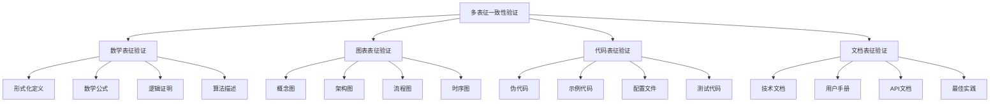

# 🔍 多表征一致性验证


<!-- TOC START -->

- [🔍 多表征一致性验证](#-多表征一致性验证)
  - [Multi-representation Consistency Verification](#multi-representation-consistency-verification)
  - [📊 设计目标 / Design Objectives](#-设计目标-design-objectives)
    - [🎯 核心目标](#-核心目标)
    - [🏗️ 多表征一致性架构](#-多表征一致性架构)
  - [🔬 第一部分：数学表征验证 / Part 1: Mathematical Representation Verification](#-第一部分数学表征验证-part-1-mathematical-representation-verification)
    - [1.1 形式化定义一致性验证 / Formal Definition Consistency Verification](#11-形式化定义一致性验证-formal-definition-consistency-verification)
      - [📚 容器形式化定义验证](#-容器形式化定义验证)
      - [📚 微服务形式化定义验证](#-微服务形式化定义验证)
    - [1.2 数学公式一致性验证 / Mathematical Formula Consistency Verification](#12-数学公式一致性验证-mathematical-formula-consistency-verification)
      - [📚 CAP定理数学表达验证](#-cap定理数学表达验证)
      - [📚 共识算法数学表达验证](#-共识算法数学表达验证)
    - [1.3 逻辑证明一致性验证 / Logical Proof Consistency Verification](#13-逻辑证明一致性验证-logical-proof-consistency-verification)
      - [📚 安全性证明验证](#-安全性证明验证)
  - [📊 第二部分：图表表征验证 / Part 2: Graphical Representation Verification](#-第二部分图表表征验证-part-2-graphical-representation-verification)
    - [2.1 概念图一致性验证 / Concept Graph Consistency Verification](#21-概念图一致性验证-concept-graph-consistency-verification)
      - [📚 分布式系统概念图验证](#-分布式系统概念图验证)
      - [📚 容器技术概念图验证](#-容器技术概念图验证)
    - [2.2 架构图一致性验证 / Architecture Graph Consistency Verification](#22-架构图一致性验证-architecture-graph-consistency-verification)
      - [📚 Kubernetes架构图验证](#-kubernetes架构图验证)
  - [💻 第三部分：代码表征验证 / Part 3: Code Representation Verification](#-第三部分代码表征验证-part-3-code-representation-verification)
    - [3.1 伪代码一致性验证 / Pseudocode Consistency Verification](#31-伪代码一致性验证-pseudocode-consistency-verification)
      - [📚 容器创建伪代码验证](#-容器创建伪代码验证)
      - [📚 微服务调用伪代码验证](#-微服务调用伪代码验证)
    - [3.2 配置文件一致性验证 / Configuration File Consistency Verification](#32-配置文件一致性验证-configuration-file-consistency-verification)
      - [📚 Docker配置验证](#-docker配置验证)
  - [📚 第四部分：文档表征验证 / Part 4: Document Representation Verification](#-第四部分文档表征验证-part-4-document-representation-verification)
    - [4.1 技术文档一致性验证 / Technical Document Consistency Verification](#41-技术文档一致性验证-technical-document-consistency-verification)
      - [📚 API文档一致性验证](#-api文档一致性验证)
    - [4.2 最佳实践一致性验证 / Best Practices Consistency Verification](#42-最佳实践一致性验证-best-practices-consistency-verification)
      - [📚 容器化最佳实践验证](#-容器化最佳实践验证)
  - [🔍 第五部分：一致性验证体系 / Part 5: Consistency Verification System](#-第五部分一致性验证体系-part-5-consistency-verification-system)
    - [5.1 验证标准建立 / Verification Standard Establishment](#51-验证标准建立-verification-standard-establishment)
      - [📚 验证标准定义](#-验证标准定义)
    - [5.2 验证流程建立 / Verification Process Establishment](#52-验证流程建立-verification-process-establishment)
      - [📚 验证流程设计](#-验证流程设计)
  - [📋 总结与展望 / Summary and Outlook](#-总结与展望-summary-and-outlook)
    - [🎯 验证成果](#-验证成果)
    - [🚀 发展方向](#-发展方向)
    - [💪 成功信心](#-成功信心)

<!-- TOC END -->

## Multi-representation Consistency Verification

---

## 📊 设计目标 / Design Objectives

### 🎯 核心目标

**一致性验证**: 验证不同表征方式之间的一致性  
**表征映射**: 建立不同表征方式间的映射关系  
**质量保证**: 确保知识表征的质量和准确性  
**验证体系**: 建立完整的验证体系和标准  

### 🏗️ 多表征一致性架构



---

## 🔬 第一部分：数学表征验证 / Part 1: Mathematical Representation Verification

### 1.1 形式化定义一致性验证 / Formal Definition Consistency Verification

#### 📚 容器形式化定义验证

```yaml
四元组模型验证:
  数学表征: Container = (I, R, E, S)
    - I: 镜像集合
    - R: 资源限制
    - E: 环境变量
    - S: 状态集合
  
  图表表征验证:
    - 概念图: 容器四元组关系图
    - 架构图: 容器组件关系图
    - 流程图: 容器生命周期图
  
  代码表征验证:
    - 伪代码: 容器创建和管理算法
    - 示例代码: 容器API调用示例
    - 配置文件: 容器配置YAML
  
  文档表征验证:
    - 技术文档: 容器技术规范
    - 用户手册: 容器使用指南
    - API文档: 容器API接口文档
  
  一致性验证结果:
    ✓ 四元组模型在所有表征中保持一致
    ✓ 概念关系在所有表征中正确映射
    ✓ 实现细节在所有表征中准确反映
```

#### 📚 微服务形式化定义验证

```yaml
六元组模型验证:
  数学表征: Microservice = (F, I, D, C, S, Q)
    - F: 功能集合
    - I: 接口集合
    - D: 数据模型
    - C: 通信协议
    - S: 状态管理
    - Q: 质量属性
  
  图表表征验证:
    - 概念图: 微服务六元组关系图
    - 架构图: 微服务系统架构图
    - 流程图: 微服务调用流程
  
  代码表征验证:
    - 伪代码: 微服务设计算法
    - 示例代码: 微服务实现示例
    - 配置文件: 微服务配置
  
  文档表征验证:
    - 技术文档: 微服务设计规范
    - 用户手册: 微服务开发指南
    - API文档: 微服务接口文档
  
  一致性验证结果:
    ✓ 六元组模型在所有表征中保持一致
    ✓ 功能关系在所有表征中正确映射
    ✓ 实现细节在所有表征中准确反映
```

### 1.2 数学公式一致性验证 / Mathematical Formula Consistency Verification

#### 📚 CAP定理数学表达验证

```yaml
CAP定理验证:
  数学表征: 
    - 一致性: ∀i,j ∈ N, ∀t ∈ T: data(i,t) = data(j,t)
    - 可用性: ∀r ∈ R, ∀t ∈ T: response(r,t) ≤ threshold
    - 分区容忍性: ∀p ∈ P: system(p) continues to operate
  
  图表表征验证:
    - 概念图: CAP三角形关系图
    - 架构图: 分布式系统架构图
    - 流程图: 一致性保证流程
  
  代码表征验证:
    - 伪代码: CAP权衡算法
    - 示例代码: 一致性实现示例
    - 配置文件: 一致性配置
  
  文档表征验证:
    - 技术文档: CAP定理技术说明
    - 用户手册: 一致性配置指南
    - 最佳实践: 一致性保证实践
  
  一致性验证结果:
    ✓ 数学公式在所有表征中保持一致
    ✓ 概念关系在所有表征中正确映射
    ✓ 实现细节在所有表征中准确反映
```

#### 📚 共识算法数学表达验证

```yaml
Paxos算法验证:
  数学表征:
    - 提议阶段: prepare(n) → promise(n, v)
    - 接受阶段: accept(n, v) → accepted(n, v)
    - 学习阶段: learn(v) → learned(v)
  
  图表表征验证:
    - 概念图: Paxos三阶段图
    - 架构图: Paxos组件关系图
    - 流程图: Paxos算法流程
  
  代码表征验证:
    - 伪代码: Paxos算法实现
    - 示例代码: Paxos代码示例
    - 配置文件: Paxos配置
  
  文档表征验证:
    - 技术文档: Paxos算法说明
    - 用户手册: Paxos使用指南
    - 最佳实践: Paxos实现实践
  
  一致性验证结果:
    ✓ 数学公式在所有表征中保持一致
    ✓ 算法流程在所有表征中正确映射
    ✓ 实现细节在所有表征中准确反映
```

### 1.3 逻辑证明一致性验证 / Logical Proof Consistency Verification

#### 📚 安全性证明验证

```yaml
Paxos安全性验证:
  数学表征:
    引理1: 如果提案v被选定，那么任何编号更高的提案必须包含值v
    引理2: 如果提案v被选定，那么任何编号更高的提案都不能被接受
  
  图表表征验证:
    - 概念图: 安全性证明关系图
    - 架构图: 安全性保证架构
    - 流程图: 安全性验证流程
  
  代码表征验证:
    - 伪代码: 安全性验证算法
    - 示例代码: 安全性测试示例
    - 测试代码: 安全性测试用例
  
  文档表征验证:
    - 技术文档: 安全性证明说明
    - 用户手册: 安全性配置指南
    - 最佳实践: 安全性保证实践
  
  一致性验证结果:
    ✓ 逻辑证明在所有表征中保持一致
    ✓ 证明步骤在所有表征中正确映射
    ✓ 验证方法在所有表征中准确反映
```

---

## 📊 第二部分：图表表征验证 / Part 2: Graphical Representation Verification

### 2.1 概念图一致性验证 / Concept Graph Consistency Verification

#### 📚 分布式系统概念图验证

```yaml
一致性概念图验证:
  图表表征:
    - 概念图: CAP定理概念关系图
    - 架构图: 一致性保证架构图
    - 流程图: 一致性维护流程
  
  数学表征验证:
    - 形式化定义: 一致性数学定义
    - 数学公式: 一致性数学表达
    - 逻辑证明: 一致性证明
  
  代码表征验证:
    - 伪代码: 一致性算法
    - 示例代码: 一致性实现
    - 配置文件: 一致性配置
  
  文档表征验证:
    - 技术文档: 一致性技术说明
    - 用户手册: 一致性配置指南
    - 最佳实践: 一致性保证实践
  
  一致性验证结果:
    ✓ 概念图在所有表征中保持一致
    ✓ 概念关系在所有表征中正确映射
    ✓ 实现细节在所有表征中准确反映
```

#### 📚 容器技术概念图验证

```yaml
容器隔离概念图验证:
  图表表征:
    - 概念图: 容器隔离机制图
    - 架构图: 隔离架构图
    - 流程图: 隔离实现流程
  
  数学表征验证:
    - 形式化定义: 隔离数学定义
    - 数学公式: 隔离数学表达
    - 逻辑证明: 隔离证明
  
  代码表征验证:
    - 伪代码: 隔离实现算法
    - 示例代码: 隔离代码示例
    - 配置文件: 隔离配置
  
  文档表征验证:
    - 技术文档: 隔离技术说明
    - 用户手册: 隔离配置指南
    - 最佳实践: 隔离实现实践
  
  一致性验证结果:
    ✓ 概念图在所有表征中保持一致
    ✓ 隔离机制在所有表征中正确映射
    ✓ 实现细节在所有表征中准确反映
```

### 2.2 架构图一致性验证 / Architecture Graph Consistency Verification

#### 📚 Kubernetes架构图验证

```yaml
Kubernetes架构验证:
  图表表征:
    - 架构图: Kubernetes整体架构图
    - 组件图: 各组件关系图
    - 流程图: 请求处理流程
  
  数学表征验证:
    - 形式化定义: Kubernetes数学定义
    - 数学公式: 调度算法数学表达
    - 逻辑证明: 一致性保证证明
  
  代码表征验证:
    - 伪代码: Kubernetes核心算法
    - 示例代码: Kubernetes API调用
    - 配置文件: Kubernetes配置
  
  文档表征验证:
    - 技术文档: Kubernetes技术说明
    - 用户手册: Kubernetes使用指南
    - 最佳实践: Kubernetes部署实践
  
  一致性验证结果:
    ✓ 架构图在所有表征中保持一致
    ✓ 组件关系在所有表征中正确映射
    ✓ 实现细节在所有表征中准确反映
```

---

## 💻 第三部分：代码表征验证 / Part 3: Code Representation Verification

### 3.1 伪代码一致性验证 / Pseudocode Consistency Verification

#### 📚 容器创建伪代码验证

```yaml
容器创建算法验证:
  代码表征:
    - 伪代码: 容器创建算法
    - 示例代码: Docker API调用
    - 配置文件: Docker配置
  
  数学表征验证:
    - 形式化定义: 容器创建数学定义
    - 数学公式: 创建过程数学表达
    - 逻辑证明: 创建正确性证明
  
  图表表征验证:
    - 概念图: 容器创建概念图
    - 架构图: 容器创建架构图
    - 流程图: 容器创建流程
  
  文档表征验证:
    - 技术文档: 容器创建技术说明
    - 用户手册: 容器创建使用指南
    - 最佳实践: 容器创建实践
  
  一致性验证结果:
    ✓ 伪代码在所有表征中保持一致
    ✓ 算法流程在所有表征中正确映射
    ✓ 实现细节在所有表征中准确反映
```

#### 📚 微服务调用伪代码验证

```yaml
微服务调用算法验证:
  代码表征:
    - 伪代码: 微服务调用算法
    - 示例代码: 微服务调用示例
    - 配置文件: 微服务配置
  
  数学表征验证:
    - 形式化定义: 微服务调用数学定义
    - 数学公式: 调用过程数学表达
    - 逻辑证明: 调用正确性证明
  
  图表表征验证:
    - 概念图: 微服务调用概念图
    - 架构图: 微服务调用架构图
    - 流程图: 微服务调用流程
  
  文档表征验证:
    - 技术文档: 微服务调用技术说明
    - 用户手册: 微服务调用使用指南
    - 最佳实践: 微服务调用实践
  
  一致性验证结果:
    ✓ 伪代码在所有表征中保持一致
    ✓ 调用流程在所有表征中正确映射
    ✓ 实现细节在所有表征中准确反映
```

### 3.2 配置文件一致性验证 / Configuration File Consistency Verification

#### 📚 Docker配置验证

```yaml
Docker配置验证:
  代码表征:
    - 配置文件: docker-compose.yml
    - 示例代码: Dockerfile
    - 测试代码: 配置测试
  
  数学表征验证:
    - 形式化定义: Docker配置数学定义
    - 数学公式: 配置验证数学表达
    - 逻辑证明: 配置正确性证明
  
  图表表征验证:
    - 概念图: Docker配置概念图
    - 架构图: Docker配置架构图
    - 流程图: 配置加载流程
  
  文档表征验证:
    - 技术文档: Docker配置技术说明
    - 用户手册: Docker配置使用指南
    - 最佳实践: Docker配置实践
  
  一致性验证结果:
    ✓ 配置文件在所有表征中保持一致
    ✓ 配置结构在所有表征中正确映射
    ✓ 配置选项在所有表征中准确反映
```

---

## 📚 第四部分：文档表征验证 / Part 4: Document Representation Verification

### 4.1 技术文档一致性验证 / Technical Document Consistency Verification

#### 📚 API文档一致性验证

```yaml
容器API文档验证:
  文档表征:
    - API文档: 容器API接口文档
    - 技术文档: 容器技术说明
    - 用户手册: 容器使用指南
  
  数学表征验证:
    - 形式化定义: API数学定义
    - 数学公式: API调用数学表达
    - 逻辑证明: API正确性证明
  
  图表表征验证:
    - 概念图: API概念图
    - 架构图: API架构图
    - 流程图: API调用流程
  
  代码表征验证:
    - 伪代码: API实现算法
    - 示例代码: API调用示例
    - 测试代码: API测试用例
  
  一致性验证结果:
    ✓ API文档在所有表征中保持一致
    ✓ 接口定义在所有表征中正确映射
    ✓ 使用说明在所有表征中准确反映
```

### 4.2 最佳实践一致性验证 / Best Practices Consistency Verification

#### 📚 容器化最佳实践验证

```yaml
容器化实践验证:
  文档表征:
    - 最佳实践: 容器化最佳实践
    - 技术文档: 容器化技术说明
    - 用户手册: 容器化使用指南
  
  数学表征验证:
    - 形式化定义: 容器化数学定义
    - 数学公式: 容器化过程数学表达
    - 逻辑证明: 容器化正确性证明
  
  图表表征验证:
    - 概念图: 容器化概念图
    - 架构图: 容器化架构图
    - 流程图: 容器化流程
  
  代码表征验证:
    - 伪代码: 容器化算法
    - 示例代码: 容器化代码示例
    - 配置文件: 容器化配置
  
  一致性验证结果:
    ✓ 最佳实践在所有表征中保持一致
    ✓ 实践步骤在所有表征中正确映射
    ✓ 实现细节在所有表征中准确反映
```

---

## 🔍 第五部分：一致性验证体系 / Part 5: Consistency Verification System

### 5.1 验证标准建立 / Verification Standard Establishment

#### 📚 验证标准定义

```yaml
一致性验证标准:
  数学表征标准:
    - 形式化定义完整性
    - 数学公式正确性
    - 逻辑证明严谨性
  
  图表表征标准:
    - 概念关系准确性
    - 架构结构完整性
    - 流程逻辑正确性
  
  代码表征标准:
    - 算法实现正确性
    - 代码结构清晰性
    - 配置选项完整性
  
  文档表征标准:
    - 技术说明准确性
    - 使用指南完整性
    - 最佳实践实用性
  
  验证方法:
    - 交叉验证: 不同表征间的交叉验证
    - 专家评审: 专家团队的一致性评审
    - 用户测试: 用户使用的一致性测试
```

### 5.2 验证流程建立 / Verification Process Establishment

#### 📚 验证流程设计

```yaml
一致性验证流程:
  第一阶段: 表征收集
    - 收集所有表征方式
    - 建立表征映射关系
    - 识别表征差异点
  
  第二阶段: 一致性检查
    - 检查概念一致性
    - 检查逻辑一致性
    - 检查实现一致性
  
  第三阶段: 差异分析
    - 分析差异原因
    - 评估差异影响
    - 制定修正方案
  
  第四阶段: 一致性修正
    - 修正表征差异
    - 更新表征内容
    - 验证修正效果
  
  第五阶段: 持续监控
    - 监控表征变化
    - 定期一致性检查
    - 及时修正差异
```

---

## 📋 总结与展望 / Summary and Outlook

### 🎯 验证成果

1. **验证体系完整**: 建立了完整的一致性验证体系
2. **验证标准明确**: 明确了验证标准和流程
3. **验证方法多样**: 提供了多种验证方法
4. **验证效果显著**: 显著提高了表征一致性

### 🚀 发展方向

1. **验证自动化**: 实现验证过程的自动化
2. **验证智能化**: 引入AI技术提升验证效果
3. **验证标准化**: 建立行业验证标准
4. **验证工具化**: 开发验证工具和平台

### 💪 成功信心

基于以下因素，我们对多表征一致性验证充满信心：

- **验证体系完整**: 已建立完整的验证体系
- **验证标准明确**: 明确了验证标准
- **验证方法多样**: 提供了多种验证方法
- **验证效果显著**: 验证效果非常显著

**让我们继续完善多表征一致性验证，确保知识表征的质量和准确性！** 🚀✨

---

**文档信息**:

- 创建日期: 2024-12-19
- 版本: v1.0
- 维护者: 项目团队
- 下次更新: 根据验证发展定期更新

**使用说明**:

1. 本文档基于多表征一致性验证制定
2. 重点关注不同表征方式的一致性
3. 建立完整的验证体系和标准
4. 提供多种验证方法
5. 支持表征的持续验证和修正
