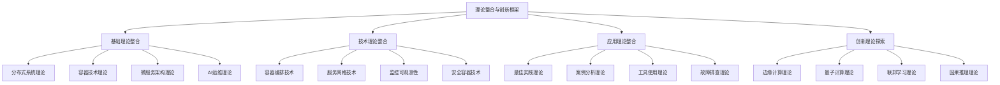

# 🔬 理论整合与创新框架


<!-- TOC START -->

- [🔬 理论整合与创新框架](#-理论整合与创新框架)
  - [Theory Integration and Innovation Framework](#theory-integration-and-innovation-framework)
  - [📊 设计目标 / Design Objectives](#-设计目标-design-objectives)
    - [🎯 核心目标](#-核心目标)
    - [🏗️ 理论整合架构](#-理论整合架构)
  - [🔬 第一部分：基础理论整合 / Part 1: Basic Theory Integration](#-第一部分基础理论整合-part-1-basic-theory-integration)
    - [1.1 分布式系统理论整合 / Distributed Systems Theory Integration](#11-分布式系统理论整合-distributed-systems-theory-integration)
      - [📚 一致性理论整合](#-一致性理论整合)
      - [📚 共识算法整合](#-共识算法整合)
      - [📚 分布式状态管理整合](#-分布式状态管理整合)
    - [1.2 容器技术理论整合 / Container Technology Theory Integration](#12-容器技术理论整合-container-technology-theory-integration)
      - [📚 隔离机制整合](#-隔离机制整合)
      - [📚 镜像理论整合](#-镜像理论整合)
    - [1.3 微服务架构理论整合 / Microservices Architecture Theory Integration](#13-微服务架构理论整合-microservices-architecture-theory-integration)
      - [📚 服务设计整合](#-服务设计整合)
      - [📚 通信模式整合](#-通信模式整合)
  - [🛠️ 第二部分：技术理论整合 / Part 2: Technical Theory Integration](#-第二部分技术理论整合-part-2-technical-theory-integration)
    - [2.1 容器编排技术整合 / Container Orchestration Technology Integration](#21-容器编排技术整合-container-orchestration-technology-integration)
      - [📚 Kubernetes整合](#-kubernetes整合)
      - [📚 服务网格技术整合](#-服务网格技术整合)
    - [2.2 监控可观测性整合 / Monitoring Observability Integration](#22-监控可观测性整合-monitoring-observability-integration)
      - [📚 监控指标整合](#-监控指标整合)
      - [📚 日志管理整合](#-日志管理整合)
  - [🎯 第三部分：应用理论整合 / Part 3: Application Theory Integration](#-第三部分应用理论整合-part-3-application-theory-integration)
    - [3.1 最佳实践理论整合 / Best Practices Theory Integration](#31-最佳实践理论整合-best-practices-theory-integration)
      - [📚 容器化实践整合](#-容器化实践整合)
      - [📚 微服务实践整合](#-微服务实践整合)
    - [3.2 案例分析理论整合 / Case Studies Theory Integration](#32-案例分析理论整合-case-studies-theory-integration)
      - [📚 成功案例整合](#-成功案例整合)
  - [🌟 第四部分：创新理论探索 / Part 4: Innovation Theory Exploration](#-第四部分创新理论探索-part-4-innovation-theory-exploration)
    - [4.1 边缘计算理论创新 / Edge Computing Theory Innovation](#41-边缘计算理论创新-edge-computing-theory-innovation)
      - [📚 边缘AI理论创新](#-边缘ai理论创新)
    - [4.2 量子计算理论创新 / Quantum Computing Theory Innovation](#42-量子计算理论创新-quantum-computing-theory-innovation)
      - [📚 量子AI理论创新](#-量子ai理论创新)
    - [4.3 联邦学习理论创新 / Federated Learning Theory Innovation](#43-联邦学习理论创新-federated-learning-theory-innovation)
      - [📚 联邦学习运维创新](#-联邦学习运维创新)
  - [🔗 第五部分：理论整合框架 / Part 5: Theory Integration Framework](#-第五部分理论整合框架-part-5-theory-integration-framework)
    - [5.1 整合策略设计 / Integration Strategy Design](#51-整合策略设计-integration-strategy-design)
      - [📚 层次化整合策略](#-层次化整合策略)
      - [📚 关联性整合策略](#-关联性整合策略)
    - [5.2 创新点识别 / Innovation Point Identification](#52-创新点识别-innovation-point-identification)
      - [📚 理论创新点](#-理论创新点)
      - [📚 技术创新点](#-技术创新点)
  - [📋 总结与展望 / Summary and Outlook](#-总结与展望-summary-and-outlook)
    - [🎯 整合成果](#-整合成果)
    - [🚀 发展方向](#-发展方向)
    - [💪 成功信心](#-成功信心)

<!-- TOC END -->

## Theory Integration and Innovation Framework

---

## 📊 设计目标 / Design Objectives

### 🎯 核心目标

**理论整合**: 整合分布式系统、容器技术、微服务架构、AI运维等理论  
**创新识别**: 识别理论创新点和技术创新方向  
**框架建立**: 建立完整的理论整合与创新框架  
**应用指导**: 提供理论创新在实际应用中的指导  

### 🏗️ 理论整合架构



---

## 🔬 第一部分：基础理论整合 / Part 1: Basic Theory Integration

### 1.1 分布式系统理论整合 / Distributed Systems Theory Integration

#### 📚 一致性理论整合

```yaml
CAP定理整合:
  理论基础: 分布式系统中一致性、可用性、分区容忍性的权衡
  容器应用: 容器编排系统中的数据一致性策略
  微服务应用: 微服务架构中的数据一致性模型
  AI运维应用: AI驱动的分布式系统一致性优化
  
  整合成果:
    - 容器微服务一致性模型: 结合容器隔离特性的一致性模型
    - AI驱动一致性优化: 基于AI的一致性策略选择
    - 边缘计算一致性: 边缘节点的数据一致性保证

ACID vs BASE整合:
  理论基础: 强一致性和最终一致性的对比
  容器应用: 容器化数据库的一致性策略
  微服务应用: 微服务事务的一致性保证
  AI运维应用: AI驱动的数据一致性优化
  
  整合成果:
    - 混合一致性模型: 结合ACID和BASE的混合模型
    - 智能一致性选择: 基于AI的一致性策略选择
    - 自适应一致性: 根据业务需求自适应调整一致性
```

#### 📚 共识算法整合

```yaml
Paxos算法整合:
  理论基础: 分布式共识算法的经典实现
  容器应用: 容器编排系统的领导者选举
  微服务应用: 微服务集群的配置管理
  AI运维应用: AI驱动的共识算法优化
  
  整合成果:
    - 容器化Paxos: 适应容器环境的Paxos实现
    - 微服务Paxos: 微服务架构下的共识算法
    - AI优化Paxos: 基于AI的Paxos参数优化

Raft算法整合:
  理论基础: 易于理解的共识算法
  容器应用: Kubernetes的etcd集群管理
  微服务应用: 微服务集群的状态管理
  AI运维应用: AI驱动的Raft性能优化
  
  整合成果:
    - 容器化Raft: 容器环境下的Raft实现
    - 微服务Raft: 微服务架构下的Raft应用
    - AI优化Raft: 基于AI的Raft性能优化
```

#### 📚 分布式状态管理整合

```yaml
状态复制整合:
  理论基础: 主从复制、多主复制、无主复制
  容器应用: 容器集群的状态同步
  微服务应用: 微服务间的状态复制
  AI运维应用: AI驱动的状态复制优化
  
  整合成果:
    - 容器状态复制: 容器环境下的状态复制策略
    - 微服务状态复制: 微服务架构下的状态管理
    - AI驱动复制: 基于AI的状态复制优化

故障检测整合:
  理论基础: 心跳检测、Gossip协议
  容器应用: 容器健康检查机制
  微服务应用: 微服务故障检测
  AI运维应用: AI驱动的故障预测
  
  整合成果:
    - 容器故障检测: 容器环境下的故障检测
    - 微服务故障检测: 微服务架构下的故障处理
    - AI故障预测: 基于AI的故障预测和预防
```

### 1.2 容器技术理论整合 / Container Technology Theory Integration

#### 📚 隔离机制整合

```yaml
命名空间隔离整合:
  理论基础: PID、网络、挂载、UTS等命名空间
  微服务应用: 微服务间的资源隔离
  AI运维应用: AI工作负载的隔离策略
  安全应用: 容器安全隔离机制
  
  整合成果:
    - 微服务隔离: 微服务架构下的容器隔离
    - AI工作负载隔离: AI应用的安全隔离
    - 安全容器隔离: 高安全要求的容器隔离

资源限制整合:
  理论基础: CPU、内存、IO、网络限制
  微服务应用: 微服务的资源管理
  AI运维应用: AI应用的资源优化
  性能应用: 容器性能优化
  
  整合成果:
    - 微服务资源管理: 微服务架构下的资源管理
    - AI资源优化: AI应用的资源优化策略
    - 性能优化: 基于资源限制的性能优化
```

#### 📚 镜像理论整合

```yaml
分层存储整合:
  理论基础: 镜像分层、联合文件系统
  微服务应用: 微服务镜像的优化
  AI运维应用: AI模型的镜像管理
  CI/CD应用: 自动化镜像构建
  
  整合成果:
    - 微服务镜像优化: 微服务架构下的镜像优化
    - AI模型镜像: AI模型的容器化镜像
    - 自动化镜像: CI/CD流水线的镜像管理

镜像构建整合:
  理论基础: Dockerfile、多阶段构建
  微服务应用: 微服务的镜像构建
  AI运维应用: AI应用的镜像构建
  安全应用: 安全镜像的构建
  
  整合成果:
    - 微服务镜像构建: 微服务架构下的镜像构建
    - AI应用镜像: AI应用的容器化镜像
    - 安全镜像构建: 高安全要求的镜像构建
```

### 1.3 微服务架构理论整合 / Microservices Architecture Theory Integration

#### 📚 服务设计整合

```yaml
服务边界整合:
  理论基础: 业务边界、技术边界、团队边界
  容器应用: 容器化的服务边界
  AI运维应用: AI服务的边界设计
  安全应用: 安全服务的边界定义
  
  整合成果:
    - 容器化服务边界: 容器环境下的服务边界
    - AI服务边界: AI服务的边界设计原则
    - 安全服务边界: 高安全要求的服务边界

接口设计整合:
  理论基础: REST API、gRPC、GraphQL
  容器应用: 容器化服务的接口设计
  AI运维应用: AI服务的接口设计
  性能应用: 高性能接口的设计
  
  整合成果:
    - 容器化接口: 容器环境下的接口设计
    - AI服务接口: AI服务的接口设计规范
    - 高性能接口: 高性能要求的接口设计
```

#### 📚 通信模式整合

```yaml
同步通信整合:
  理论基础: HTTP/REST、gRPC、WebSocket
  容器应用: 容器间的同步通信
  AI运维应用: AI服务的同步调用
  性能应用: 高性能同步通信
  
  整合成果:
    - 容器同步通信: 容器环境下的同步通信
    - AI服务通信: AI服务的同步通信机制
    - 高性能通信: 高性能要求的通信设计

异步通信整合:
  理论基础: 消息队列、事件驱动
  容器应用: 容器间的异步通信
  AI运维应用: AI服务的异步处理
  扩展性应用: 高扩展性的异步通信
  
  整合成果:
    - 容器异步通信: 容器环境下的异步通信
    - AI异步处理: AI服务的异步处理机制
    - 高扩展性通信: 高扩展性要求的通信设计
```

---

## 🛠️ 第二部分：技术理论整合 / Part 2: Technical Theory Integration

### 2.1 容器编排技术整合 / Container Orchestration Technology Integration

#### 📚 Kubernetes整合

```yaml
架构组件整合:
  理论基础: API Server、etcd、Scheduler、Controller Manager
  微服务应用: 微服务的Kubernetes部署
  AI运维应用: AI工作负载的编排
  安全应用: 安全策略的Kubernetes实现
  
  整合成果:
    - 微服务编排: 微服务架构下的Kubernetes编排
    - AI工作负载编排: AI应用的Kubernetes部署
    - 安全编排: 高安全要求的Kubernetes部署

资源模型整合:
  理论基础: Pod、Service、Deployment、ConfigMap
  微服务应用: 微服务的资源模型设计
  AI运维应用: AI应用的资源管理
  性能应用: 高性能资源的配置
  
  整合成果:
    - 微服务资源模型: 微服务架构下的资源模型
    - AI资源管理: AI应用的资源管理策略
    - 高性能资源: 高性能要求的资源配置
```

#### 📚 服务网格技术整合

```yaml
Istio整合:
  理论基础: 控制平面、数据平面、流量管理、安全策略
  微服务应用: 微服务的服务网格部署
  AI运维应用: AI服务的流量管理
  安全应用: 服务网格的安全策略
  
  整合成果:
    - 微服务网格: 微服务架构下的服务网格
    - AI服务网格: AI服务的流量管理
    - 安全服务网格: 高安全要求的服务网格

Linkerd整合:
  理论基础: 轻量级设计、性能优化、简单配置
  微服务应用: 轻量级微服务网格
  AI运维应用: AI服务的轻量级代理
  性能应用: 高性能服务网格
  
  整合成果:
    - 轻量级微服务网格: 微服务架构下的轻量级网格
    - AI轻量级代理: AI服务的轻量级代理
    - 高性能网格: 高性能要求的服务网格
```

### 2.2 监控可观测性整合 / Monitoring Observability Integration

#### 📚 监控指标整合

```yaml
系统指标整合:
  理论基础: CPU、内存、磁盘、网络
  容器应用: 容器化的系统监控
  微服务应用: 微服务的性能监控
  AI运维应用: AI应用的资源监控
  
  整合成果:
    - 容器系统监控: 容器环境下的系统监控
    - 微服务性能监控: 微服务架构下的性能监控
    - AI资源监控: AI应用的资源监控策略

应用指标整合:
  理论基础: 响应时间、吞吐量、错误率
  容器应用: 容器化应用的性能监控
  微服务应用: 微服务的业务监控
  AI运维应用: AI应用的性能监控
  
  整合成果:
    - 容器应用监控: 容器环境下的应用监控
    - 微服务业务监控: 微服务架构下的业务监控
    - AI性能监控: AI应用的性能监控策略
```

#### 📚 日志管理整合

```yaml
日志收集整合:
  理论基础: 集中式日志收集、日志格式
  容器应用: 容器化的日志收集
  微服务应用: 微服务的日志管理
  AI运维应用: AI应用的日志分析
  
  整合成果:
    - 容器日志收集: 容器环境下的日志收集
    - 微服务日志管理: 微服务架构下的日志管理
    - AI日志分析: AI应用的日志分析策略

日志分析整合:
  理论基础: 日志解析、模式识别、异常检测
  容器应用: 容器日志的智能分析
  微服务应用: 微服务日志的异常检测
  AI运维应用: AI驱动的日志分析
  
  整合成果:
    - 容器智能分析: 容器环境下的智能日志分析
    - 微服务异常检测: 微服务架构下的异常检测
    - AI驱动分析: AI驱动的日志分析策略
```

---

## 🎯 第三部分：应用理论整合 / Part 3: Application Theory Integration

### 3.1 最佳实践理论整合 / Best Practices Theory Integration

#### 📚 容器化实践整合

```yaml
镜像优化整合:
  理论基础: 多阶段构建、基础镜像选择、层数优化
  微服务应用: 微服务的镜像优化
  AI运维应用: AI应用的镜像优化
  安全应用: 安全镜像的优化
  
  整合成果:
    - 微服务镜像优化: 微服务架构下的镜像优化
    - AI应用镜像优化: AI应用的镜像优化策略
    - 安全镜像优化: 高安全要求的镜像优化

部署策略整合:
  理论基础: 健康检查、资源限制、网络策略
  微服务应用: 微服务的部署策略
  AI运维应用: AI应用的部署策略
  高可用应用: 高可用部署策略
  
  整合成果:
    - 微服务部署: 微服务架构下的部署策略
    - AI应用部署: AI应用的部署策略
    - 高可用部署: 高可用要求的部署策略
```

#### 📚 微服务实践整合

```yaml
服务设计整合:
  理论基础: 单一职责、接口设计、数据管理
  容器应用: 容器化的微服务设计
  AI运维应用: AI服务的微服务设计
  性能应用: 高性能微服务设计
  
  整合成果:
    - 容器化微服务: 容器环境下的微服务设计
    - AI微服务: AI服务的微服务设计原则
    - 高性能微服务: 高性能要求的微服务设计

测试策略整合:
  理论基础: 单元测试、集成测试、端到端测试
  容器应用: 容器化微服务的测试
  AI运维应用: AI服务的测试策略
  质量应用: 高质量测试策略
  
  整合成果:
    - 容器化测试: 容器环境下的微服务测试
    - AI服务测试: AI服务的测试策略
    - 高质量测试: 高质量要求的测试策略
```

### 3.2 案例分析理论整合 / Case Studies Theory Integration

#### 📚 成功案例整合

```yaml
Netflix案例整合:
  理论基础: 微服务架构、混沌工程、自动化运维
  容器应用: 容器化的微服务架构
  AI运维应用: AI驱动的自动化运维
  大规模应用: 大规模部署的最佳实践
  
  整合成果:
    - 容器化微服务: 容器环境下的微服务架构
    - AI驱动运维: AI驱动的自动化运维策略
    - 大规模部署: 大规模部署的最佳实践

Uber案例整合:
  理论基础: 大规模部署、多区域管理、实时数据处理
  容器应用: 容器化的大规模部署
  AI运维应用: AI驱动的实时数据处理
  地理分布应用: 多区域管理的最佳实践
  
  整合成果:
    - 容器化大规模部署: 容器环境下的规模部署
    - AI实时处理: AI驱动的实时数据处理
    - 多区域管理: 多区域管理的最佳实践
```

---

## 🌟 第四部分：创新理论探索 / Part 4: Innovation Theory Exploration

### 4.1 边缘计算理论创新 / Edge Computing Theory Innovation

#### 📚 边缘AI理论创新

```yaml
边缘AI架构创新:
  理论基础: 边缘计算、AI推理、模型压缩
  容器应用: 边缘容器的AI部署
  微服务应用: 边缘微服务的AI集成
  性能应用: 边缘AI的性能优化
  
  创新点:
    - 边缘AI容器: 边缘环境下的AI容器化
    - 边缘AI微服务: 边缘环境下的AI微服务
    - 边缘AI性能: 边缘AI的性能优化策略

边缘AI优化创新:
  理论基础: 模型压缩、量化、剪枝、知识蒸馏
  容器应用: 边缘容器的AI优化
  微服务应用: 边缘微服务的AI优化
  资源应用: 边缘资源的AI优化
  
  创新点:
    - 边缘AI容器优化: 边缘容器下的AI优化
    - 边缘AI微服务优化: 边缘微服务下的AI优化
    - 边缘AI资源优化: 边缘资源下的AI优化
```

### 4.2 量子计算理论创新 / Quantum Computing Theory Innovation

#### 📚 量子AI理论创新

```yaml
量子AI算法创新:
  理论基础: 量子计算、量子机器学习、量子优化
  容器应用: 量子容器的AI部署
  微服务应用: 量子微服务的AI集成
  性能应用: 量子AI的性能优势
  
  创新点:
    - 量子AI容器: 量子环境下的AI容器化
    - 量子AI微服务: 量子环境下的AI微服务
    - 量子AI性能: 量子AI的性能优势策略

后量子密码创新:
  理论基础: 格密码学、多变量密码学、基于哈希的签名
  容器应用: 后量子容器的安全策略
  微服务应用: 后量子微服务的安全策略
  安全应用: 后量子安全的应用策略
  
  创新点:
    - 后量子容器安全: 后量子环境下的容器安全
    - 后量子微服务安全: 后量子环境下的微服务安全
    - 后量子安全应用: 后量子安全的应用策略
```

### 4.3 联邦学习理论创新 / Federated Learning Theory Innovation

#### 📚 联邦学习运维创新

```yaml
联邦学习架构创新:
  理论基础: 联邦学习、隐私保护、分布式学习
  容器应用: 联邦学习的容器化部署
  微服务应用: 联邦学习的微服务架构
  安全应用: 联邦学习的安全策略
  
  创新点:
    - 联邦学习容器: 联邦学习的容器化部署
    - 联邦学习微服务: 联邦学习的微服务架构
    - 联邦学习安全: 联邦学习的安全策略

联邦学习优化创新:
  理论基础: 通信优化、计算优化、安全优化
  容器应用: 联邦学习的容器优化
  微服务应用: 联邦学习的微服务优化
  性能应用: 联邦学习的性能优化
  
  创新点:
    - 联邦学习容器优化: 联邦学习的容器优化策略
    - 联邦学习微服务优化: 联邦学习的微服务优化
    - 联邦学习性能优化: 联邦学习的性能优化策略
```

---

## 🔗 第五部分：理论整合框架 / Part 5: Theory Integration Framework

### 5.1 整合策略设计 / Integration Strategy Design

#### 📚 层次化整合策略

```yaml
基础层整合:
  目标: 整合基础理论，建立统一的理论基础
  策略: 概念统一、术语标准化、理论关联
  方法: 理论对比、概念映射、关联建立
  
  应用层整合:
    目标: 整合应用理论，建立统一的应用框架
    策略: 实践统一、方法标准化、工具关联
    方法: 实践对比、方法映射、工具关联
  
  创新层整合:
    目标: 整合创新理论，建立统一的创新框架
    策略: 创新统一、方向标准化、前沿关联
    方法: 创新对比、方向映射、前沿关联
```

#### 📚 关联性整合策略

```yaml
概念关联整合:
  目标: 建立概念间的逻辑关联关系
  策略: 概念映射、关联建立、关系验证
  方法: 语义分析、逻辑推理、关系验证
  
  技术关联整合:
    目标: 建立技术间的依赖关联关系
    策略: 技术映射、依赖建立、关系验证
    方法: 依赖分析、关系推理、关系验证
  
  应用关联整合:
    目标: 建立应用间的实践关联关系
    策略: 应用映射、实践建立、关系验证
    方法: 实践分析、关系推理、关系验证
```

### 5.2 创新点识别 / Innovation Point Identification

#### 📚 理论创新点

```yaml
容器微服务一致性模型:
  创新内容: 结合容器隔离特性的一致性模型
  理论基础: CAP定理、ACID vs BASE、一致性模型
  应用场景: 容器编排、微服务架构、分布式系统
  创新价值: 提供容器微服务环境下的新一致性模型
  
  AI驱动运维理论框架:
    创新内容: 建立完整的AI运维理论体系
    理论基础: 机器学习、深度学习、强化学习、运维理论
    应用场景: 智能运维、预测性维护、自主运维
    创新价值: 建立AI运维的理论基础和应用指导

多模态学习理论:
  创新内容: 结合多种数据模态进行学习
  理论基础: 机器学习、深度学习、多模态学习
  应用场景: 多源数据学习、跨模态学习、融合学习
  创新价值: 提供多模态学习的新理论框架
```

#### 📚 技术创新点

```yaml
边缘AI技术:
  创新内容: 边缘节点的AI计算和推理
  理论基础: 边缘计算、AI推理、模型压缩
  应用场景: 边缘监控、边缘推理、边缘决策
  创新价值: 实现边缘环境的AI能力

量子AI技术:
  创新内容: 基于量子计算的AI算法
  理论基础: 量子计算、量子机器学习、量子优化
  应用场景: 量子优化、量子模拟、量子安全
  创新价值: 利用量子计算的优势

联邦学习技术:
  创新内容: 保护隐私的分布式机器学习
  理论基础: 联邦学习、隐私保护、分布式学习
  应用场景: 分布式监控、协作学习、隐私保护
  创新价值: 实现隐私保护的分布式学习
```

---

## 📋 总结与展望 / Summary and Outlook

### 🎯 整合成果

1. **理论整合完整**: 建立了完整的理论整合框架
2. **创新点明确**: 识别了明确的创新方向和机会
3. **应用指导清晰**: 提供了清晰的应用指导
4. **发展前景广阔**: 明确了广阔的发展前景

### 🚀 发展方向

1. **理论深化**: 继续深化理论整合和创新
2. **技术突破**: 突破关键技术瓶颈
3. **应用推广**: 推广理论创新应用
4. **标准制定**: 参与标准制定

### 💪 成功信心

基于以下因素，我们对理论整合与创新框架充满信心：

- **理论基础扎实**: 已建立扎实的理论基础
- **整合策略清晰**: 建立了清晰的整合策略
- **创新方向明确**: 明确了创新方向
- **应用前景广阔**: 应用前景非常广阔

**让我们继续完善理论整合与创新框架，推动容器微服务理论向更高层次发展！** 🚀✨

---

**文档信息**:

- 创建日期: 2024-12-19
- 版本: v1.0
- 维护者: 项目团队
- 下次更新: 根据理论发展定期更新

**使用说明**:

1. 本文档基于理论整合与创新框架制定
2. 重点关注理论整合和创新点识别
3. 建立完整的理论整合框架
4. 识别明确的创新方向
5. 支持理论的持续演进和创新
