# 🔗 知识关联关系图

<!-- TOC START -->

- [🔗 知识关联关系图](#-知识关联关系图)
  - [Knowledge Association Relationship Graph](#knowledge-association-relationship-graph)
  - [📊 设计目标 / Design Objectives](#-设计目标-design-objectives)
    - [🎯 核心目标](#-核心目标)
    - [🏗️ 知识关联架构](#-知识关联架构)
  - [🔗 第一部分：概念关联层 / Part 1: Concept Association Layer](#-第一部分概念关联层-part-1-concept-association-layer)
    - [1.1 分布式系统概念关联 / Distributed Systems Concept Association](#11-分布式系统概念关联-distributed-systems-concept-association)
      - [📚 一致性概念关联](#-一致性概念关联)
      - [📚 共识算法概念关联](#-共识算法概念关联)
      - [📚 分布式状态管理概念关联](#-分布式状态管理概念关联)
    - [1.2 容器技术概念关联 / Container Technology Concept Association](#12-容器技术概念关联-container-technology-concept-association)
      - [📚 隔离机制概念关联](#-隔离机制概念关联)
      - [📚 镜像理论概念关联](#-镜像理论概念关联)
    - [1.3 微服务架构概念关联 / Microservices Architecture Concept Association](#13-微服务架构概念关联-microservices-architecture-concept-association)
      - [📚 服务设计概念关联](#-服务设计概念关联)
      - [📚 通信模式概念关联](#-通信模式概念关联)
  - [🛠️ 第二部分：技术关联层 / Part 2: Technical Association Layer](#-第二部分技术关联层-part-2-technical-association-layer)
    - [2.1 容器编排技术关联 / Container Orchestration Technology Association](#21-容器编排技术关联-container-orchestration-technology-association)
      - [📚 Kubernetes技术关联](#-kubernetes技术关联)
      - [📚 服务网格技术关联](#-服务网格技术关联)
    - [2.2 监控可观测性技术关联 / Monitoring Observability Technology Association](#22-监控可观测性技术关联-monitoring-observability-technology-association)
      - [📚 监控指标技术关联](#-监控指标技术关联)
      - [📚 日志管理技术关联](#-日志管理技术关联)
  - [🎯 第三部分：应用关联层 / Part 3: Application Association Layer](#-第三部分应用关联层-part-3-application-association-layer)
    - [3.1 最佳实践应用关联 / Best Practices Application Association](#31-最佳实践应用关联-best-practices-application-association)
      - [📚 容器化实践关联](#-容器化实践关联)
      - [📚 微服务实践关联](#-微服务实践关联)
    - [3.2 案例分析应用关联 / Case Studies Application Association](#32-案例分析应用关联-case-studies-application-association)
      - [📚 成功案例关联](#-成功案例关联)
  - [🌟 第四部分：创新关联层 / Part 4: Innovation Association Layer](#-第四部分创新关联层-part-4-innovation-association-layer)
    - [4.1 边缘计算创新关联 / Edge Computing Innovation Association](#41-边缘计算创新关联-edge-computing-innovation-association)
      - [📚 边缘AI创新关联](#-边缘ai创新关联)
    - [4.2 量子计算创新关联 / Quantum Computing Innovation Association](#42-量子计算创新关联-quantum-computing-innovation-association)
      - [📚 量子AI创新关联](#-量子ai创新关联)
    - [4.3 联邦学习创新关联 / Federated Learning Innovation Association](#43-联邦学习创新关联-federated-learning-innovation-association)
      - [📚 联邦学习运维关联](#-联邦学习运维关联)
  - [🔗 第五部分：知识关联图谱 / Part 5: Knowledge Association Graph](#-第五部分知识关联图谱-part-5-knowledge-association-graph)
    - [5.1 全局关联图谱 / Global Association Graph](#51-全局关联图谱-global-association-graph)
      - [📚 核心概念关联图](#-核心概念关联图)
    - [5.2 技术栈关联图谱 / Technology Stack Association Graph](#52-技术栈关联图谱-technology-stack-association-graph)
      - [📚 CNCF技术栈关联](#-cncf技术栈关联)
  - [📋 总结与展望 / Summary and Outlook](#-总结与展望-summary-and-outlook)
    - [🎯 关联成果](#-关联成果)
    - [🚀 发展方向](#-发展方向)
    - [💪 成功信心](#-成功信心)

<!-- TOC END -->

## Knowledge Association Relationship Graph

---

## 📊 设计目标 / Design Objectives

### 🎯 核心目标

**关联建立**: 建立知识间的逻辑关联关系  
**关系映射**: 映射概念间的依赖和影响关系  
**知识图谱**: 构建完整的知识关联图谱  
**导航系统**: 提供知识导航和查询能力  

### 🏗️ 知识关联架构

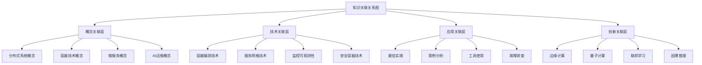
```mermaid
graph TB
    A[知识关联关系图] --> B[概念关联层]
    A --> C[技术关联层]
    A --> D[应用关联层]
    A --> E[创新关联层]
    
    B --> B1[分布式系统概念]
    B --> B2[容器技术概念]
    B --> B3[微服务概念]
    B --> B4[AI运维概念]
    
    C --> C1[容器编排技术]
    C --> C2[服务网格技术]
    C --> C3[监控可观测性]
    C --> C4[安全容器技术]
    
    D --> D1[最佳实践]
    D --> D2[案例分析]
    D --> D3[工具使用]
    D --> D4[故障排查]
    
    E --> E1[边缘计算]
    E --> E2[量子计算]
    E --> E3[联邦学习]
    E --> E4[因果推理]
```

---

## 🔗 第一部分：概念关联层 / Part 1: Concept Association Layer

### 1.1 分布式系统概念关联 / Distributed Systems Concept Association

#### 📚 一致性概念关联

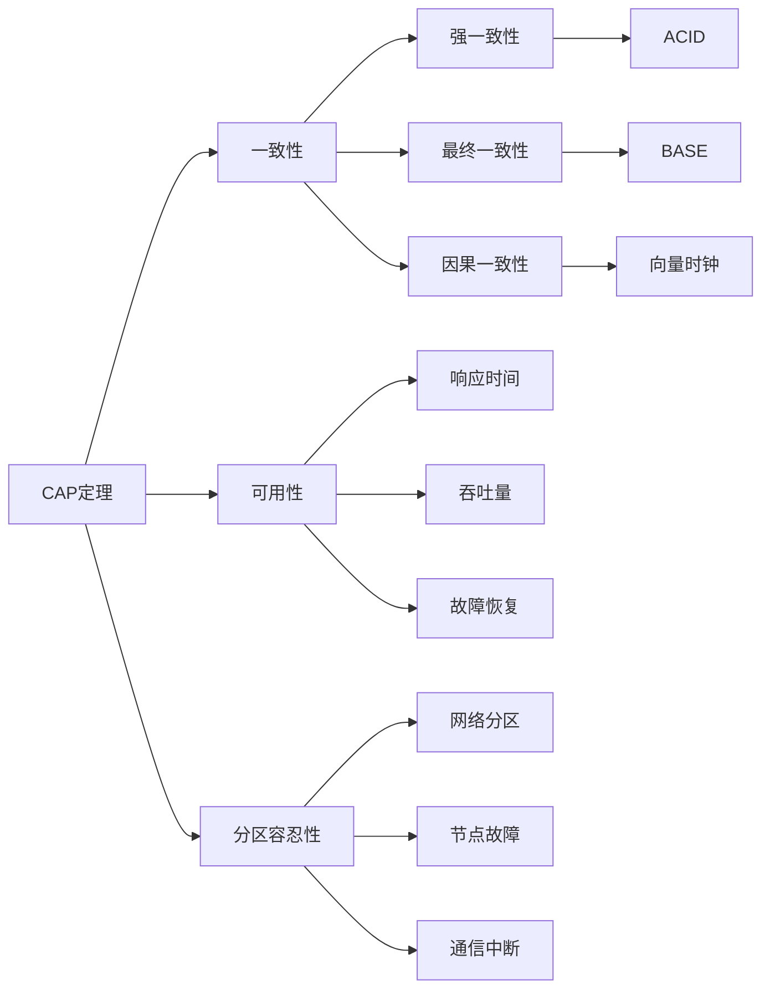
```mermaid
graph LR
    A[CAP定理] --> B[一致性]
    A --> C[可用性]
    A --> D[分区容忍性]
    
    B --> E[强一致性]
    B --> F[最终一致性]
    B --> G[因果一致性]
    
    C --> H[响应时间]
    C --> I[吞吐量]
    C --> J[故障恢复]
    
    D --> K[网络分区]
    D --> L[节点故障]
    D --> M[通信中断]
    
    E --> N[ACID]
    F --> O[BASE]
    G --> P[向量时钟]
```

#### 📚 共识算法概念关联

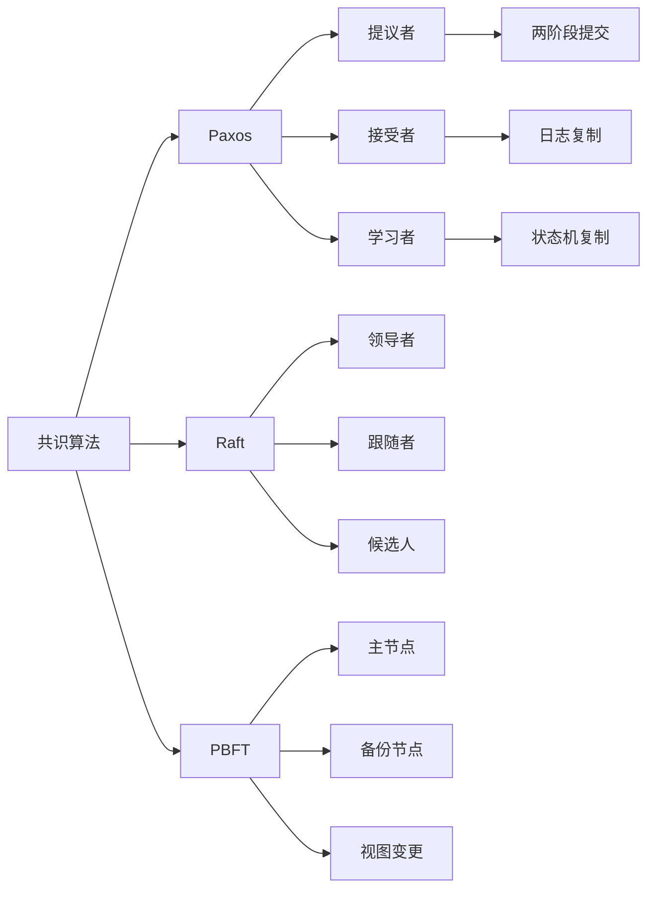
```mermaid
graph LR
    A[共识算法] --> B[Paxos]
    A --> C[Raft]
    A --> D[PBFT]
    
    B --> E[提议者]
    B --> F[接受者]
    B --> G[学习者]
    
    C --> H[领导者]
    C --> I[跟随者]
    C --> J[候选人]
    
    D --> K[主节点]
    D --> L[备份节点]
    D --> M[视图变更]
    
    E --> N[两阶段提交]
    F --> O[日志复制]
    G --> P[状态机复制]
```

#### 📚 分布式状态管理概念关联

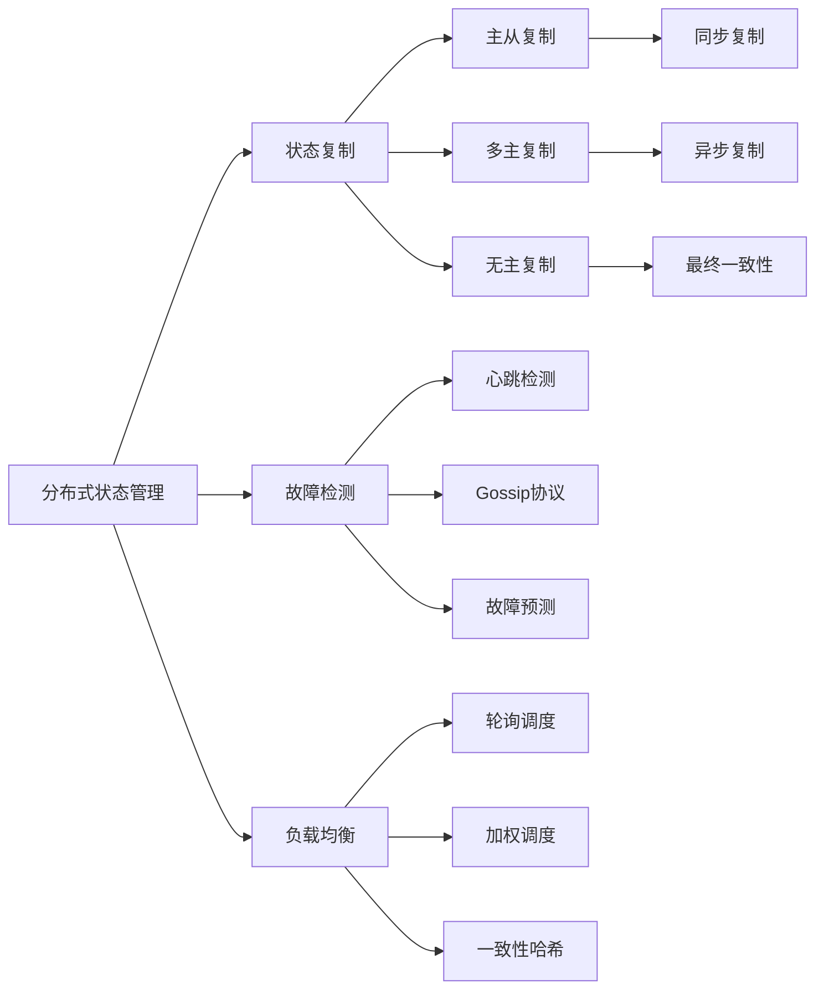
```mermaid
graph LR
    A[分布式状态管理] --> B[状态复制]
    A --> C[故障检测]
    A --> D[负载均衡]
    
    B --> E[主从复制]
    B --> F[多主复制]
    B --> G[无主复制]
    
    C --> H[心跳检测]
    C --> I[Gossip协议]
    C --> J[故障预测]
    
    D --> K[轮询调度]
    D --> L[加权调度]
    D --> M[一致性哈希]
    
    E --> N[同步复制]
    F --> O[异步复制]
    G --> P[最终一致性]
```

### 1.2 容器技术概念关联 / Container Technology Concept Association

#### 📚 隔离机制概念关联

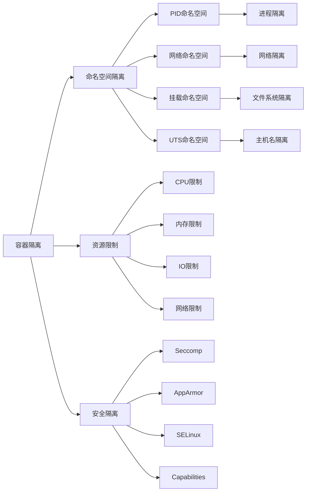
```mermaid
graph LR
    A[容器隔离] --> B[命名空间隔离]
    A --> C[资源限制]
    A --> D[安全隔离]
    
    B --> E[PID命名空间]
    B --> F[网络命名空间]
    B --> G[挂载命名空间]
    B --> H[UTS命名空间]
    
    C --> I[CPU限制]
    C --> J[内存限制]
    C --> K[IO限制]
    C --> L[网络限制]
    
    D --> M[Seccomp]
    D --> N[AppArmor]
    D --> O[SELinux]
    D --> P[Capabilities]
    
    E --> Q[进程隔离]
    F --> R[网络隔离]
    G --> S[文件系统隔离]
    H --> T[主机名隔离]
```

#### 📚 镜像理论概念关联

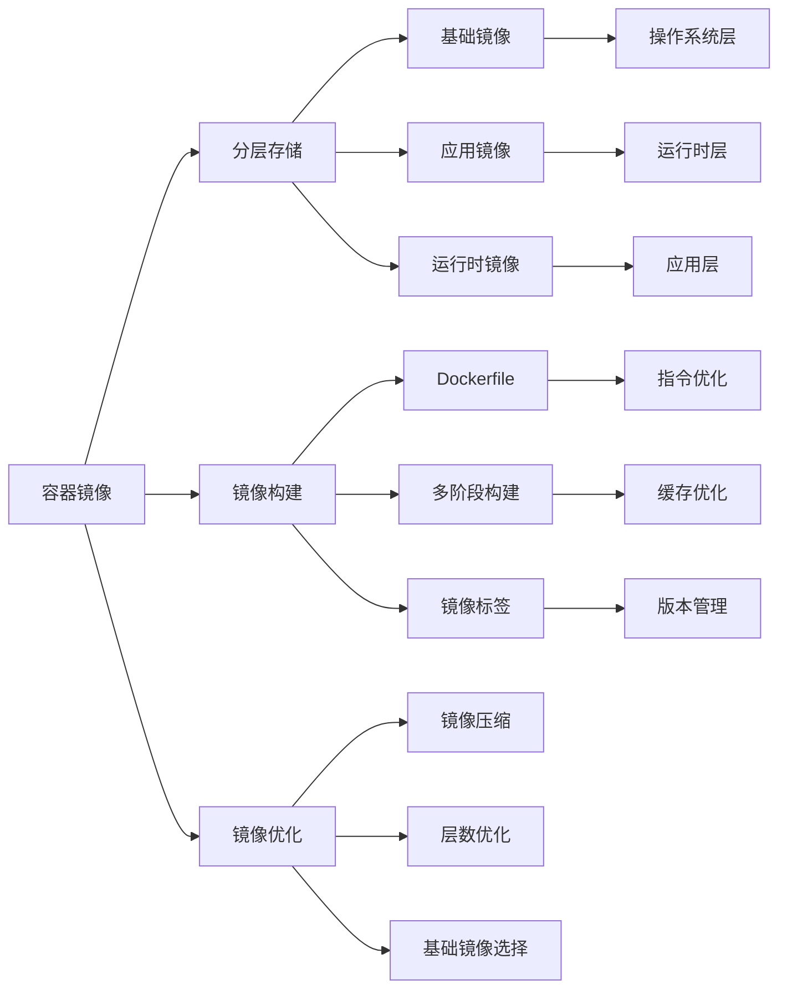
```mermaid
graph LR
    A[容器镜像] --> B[分层存储]
    A --> C[镜像构建]
    A --> D[镜像优化]
    
    B --> E[基础镜像]
    B --> F[应用镜像]
    B --> G[运行时镜像]
    
    C --> H[Dockerfile]
    C --> I[多阶段构建]
    C --> J[镜像标签]
    
    D --> K[镜像压缩]
    D --> L[层数优化]
    D --> M[基础镜像选择]
    
    E --> N[操作系统层]
    F --> O[运行时层]
    G --> P[应用层]
    
    H --> Q[指令优化]
    I --> R[缓存优化]
    J --> S[版本管理]
```

### 1.3 微服务架构概念关联 / Microservices Architecture Concept Association

#### 📚 服务设计概念关联

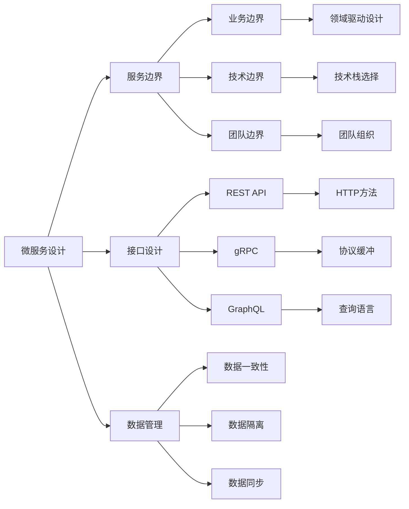
```mermaid
graph LR
    A[微服务设计] --> B[服务边界]
    A --> C[接口设计]
    A --> D[数据管理]
    
    B --> E[业务边界]
    B --> F[技术边界]
    B --> G[团队边界]
    
    C --> H[REST API]
    C --> I[gRPC]
    C --> J[GraphQL]
    
    D --> K[数据一致性]
    D --> L[数据隔离]
    D --> M[数据同步]
    
    E --> N[领域驱动设计]
    F --> O[技术栈选择]
    G --> P[团队组织]
    
    H --> Q[HTTP方法]
    I --> R[协议缓冲]
    J --> S[查询语言]
```

#### 📚 通信模式概念关联

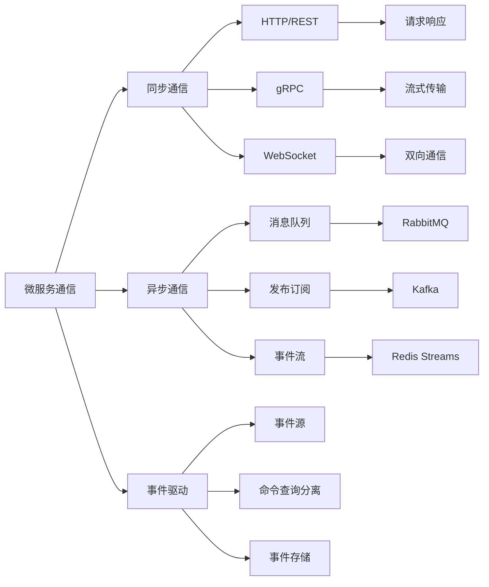
```mermaid
graph LR
    A[微服务通信] --> B[同步通信]
    A --> C[异步通信]
    A --> D[事件驱动]
    
    B --> E[HTTP/REST]
    B --> F[gRPC]
    B --> G[WebSocket]
    
    C --> H[消息队列]
    C --> I[发布订阅]
    C --> J[事件流]
    
    D --> K[事件源]
    D --> L[命令查询分离]
    D --> M[事件存储]
    
    E --> N[请求响应]
    F --> O[流式传输]
    G --> P[双向通信]
    
    H --> Q[RabbitMQ]
    I --> R[Kafka]
    J --> S[Redis Streams]
```

---

## 🛠️ 第二部分：技术关联层 / Part 2: Technical Association Layer

### 2.1 容器编排技术关联 / Container Orchestration Technology Association

#### 📚 Kubernetes技术关联

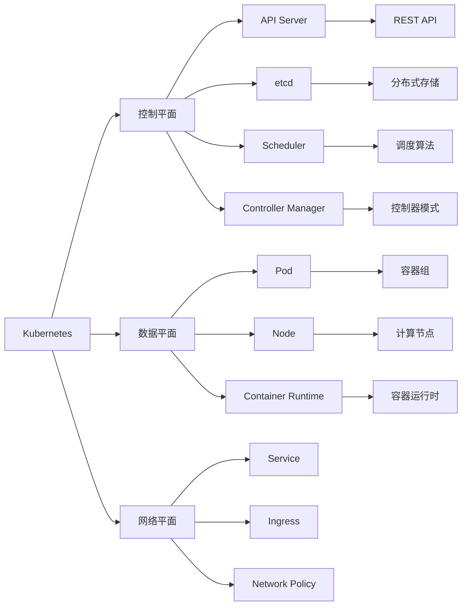
```mermaid
graph LR
    A[Kubernetes] --> B[控制平面]
    A --> C[数据平面]
    A --> D[网络平面]
    
    B --> E[API Server]
    B --> F[etcd]
    B --> G[Scheduler]
    B --> H[Controller Manager]
    
    C --> I[Pod]
    C --> J[Node]
    C --> K[Container Runtime]
    
    D --> L[Service]
    D --> M[Ingress]
    D --> N[Network Policy]
    
    E --> O[REST API]
    F --> P[分布式存储]
    G --> Q[调度算法]
    H --> R[控制器模式]
    
    I --> S[容器组]
    J --> T[计算节点]
    K --> U[容器运行时]
```

#### 📚 服务网格技术关联

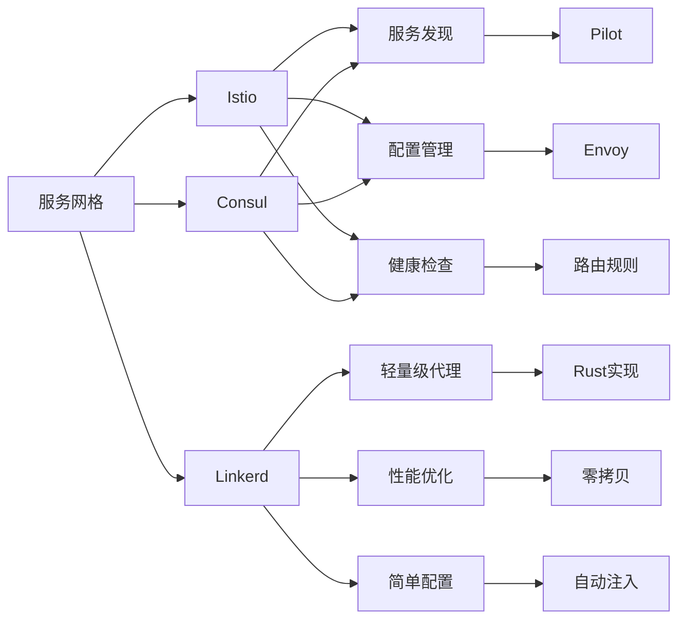
```mermaid
graph LR
    A[服务网格] --> B[Istio]
    A --> C[Linkerd]
    A --> D[Consul]
    
    B --> E[控制平面]
    B --> F[数据平面]
    B --> G[流量管理]
    
    C --> H[轻量级代理]
    C --> I[性能优化]
    C --> J[简单配置]
    
    D --> E[服务发现]
    D --> F[配置管理]
    D --> G[健康检查]
    
    E --> K[Pilot]
    F --> L[Envoy]
    G --> M[路由规则]
    
    H --> N[Rust实现]
    I --> O[零拷贝]
    J --> P[自动注入]
```

### 2.2 监控可观测性技术关联 / Monitoring Observability Technology Association

#### 📚 监控指标技术关联

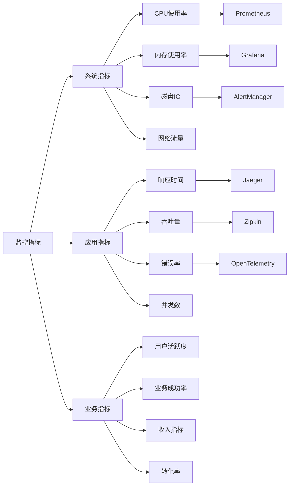
```mermaid
graph LR
    A[监控指标] --> B[系统指标]
    A --> C[应用指标]
    A --> D[业务指标]
    
    B --> E[CPU使用率]
    B --> F[内存使用率]
    B --> G[磁盘IO]
    B --> H[网络流量]
    
    C --> I[响应时间]
    C --> J[吞吐量]
    C --> K[错误率]
    C --> L[并发数]
    
    D --> M[用户活跃度]
    D --> N[业务成功率]
    D --> O[收入指标]
    D --> P[转化率]
    
    E --> Q[Prometheus]
    F --> R[Grafana]
    G --> S[AlertManager]
    
    I --> T[Jaeger]
    J --> U[Zipkin]
    K --> V[OpenTelemetry]
```

#### 📚 日志管理技术关联

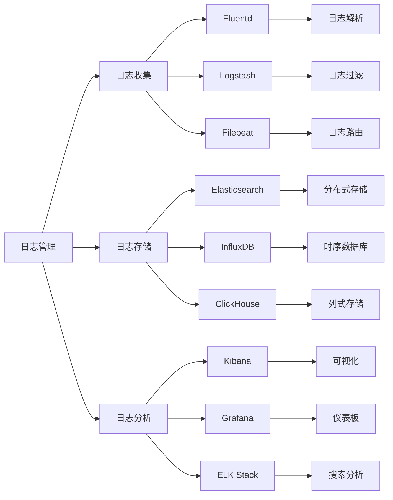
```mermaid
graph LR
    A[日志管理] --> B[日志收集]
    A --> C[日志存储]
    A --> D[日志分析]
    
    B --> E[Fluentd]
    B --> F[Logstash]
    B --> G[Filebeat]
    
    C --> H[Elasticsearch]
    C --> I[InfluxDB]
    C --> J[ClickHouse]
    
    D --> K[Kibana]
    D --> L[Grafana]
    D --> M[ELK Stack]
    
    E --> N[日志解析]
    F --> O[日志过滤]
    G --> P[日志路由]
    
    H --> Q[分布式存储]
    I --> R[时序数据库]
    J --> S[列式存储]
    
    K --> T[可视化]
    L --> U[仪表板]
    M --> V[搜索分析]
```

---

## 🎯 第三部分：应用关联层 / Part 3: Application Association Layer

### 3.1 最佳实践应用关联 / Best Practices Application Association

#### 📚 容器化实践关联

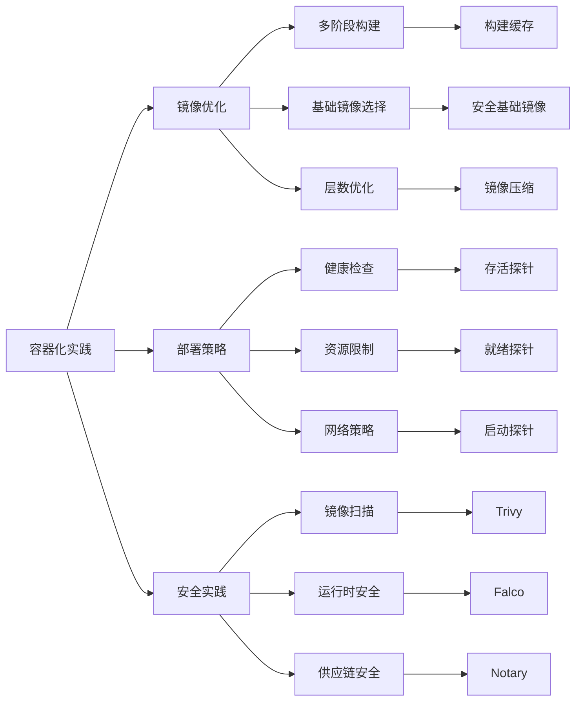
```mermaid
graph LR
    A[容器化实践] --> B[镜像优化]
    A --> C[部署策略]
    A --> D[安全实践]
    
    B --> E[多阶段构建]
    B --> F[基础镜像选择]
    B --> G[层数优化]
    
    C --> H[健康检查]
    C --> I[资源限制]
    C --> J[网络策略]
    
    D --> K[镜像扫描]
    D --> L[运行时安全]
    D --> M[供应链安全]
    
    E --> N[构建缓存]
    F --> O[安全基础镜像]
    G --> P[镜像压缩]
    
    H --> Q[存活探针]
    I --> R[就绪探针]
    J --> S[启动探针]
    
    K --> T[Trivy]
    L --> U[Falco]
    M --> V[Notary]
```

#### 📚 微服务实践关联

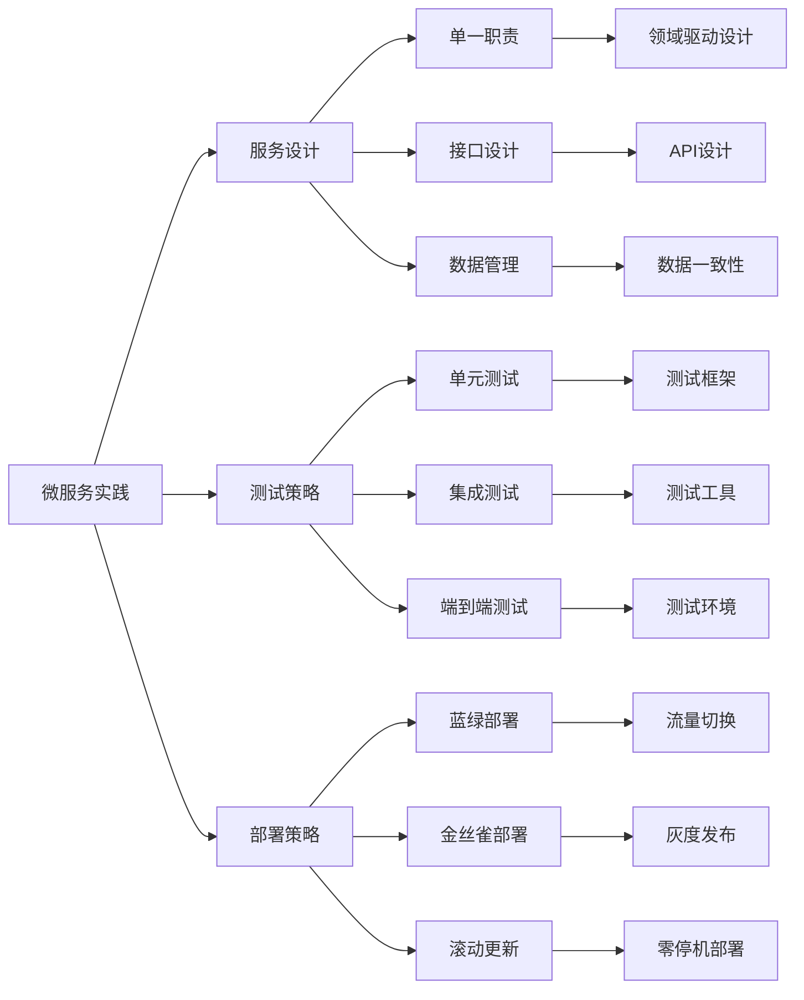
```mermaid
graph LR
    A[微服务实践] --> B[服务设计]
    A --> C[测试策略]
    A --> D[部署策略]
    
    B --> E[单一职责]
    B --> F[接口设计]
    B --> G[数据管理]
    
    C --> H[单元测试]
    C --> I[集成测试]
    C --> J[端到端测试]
    
    D --> K[蓝绿部署]
    D --> L[金丝雀部署]
    D --> M[滚动更新]
    
    E --> N[领域驱动设计]
    F --> O[API设计]
    G --> P[数据一致性]
    
    H --> Q[测试框架]
    I --> R[测试工具]
    J --> S[测试环境]
    
    K --> T[流量切换]
    L --> U[灰度发布]
    M --> V[零停机部署]
```

### 3.2 案例分析应用关联 / Case Studies Application Association

#### 📚 成功案例关联

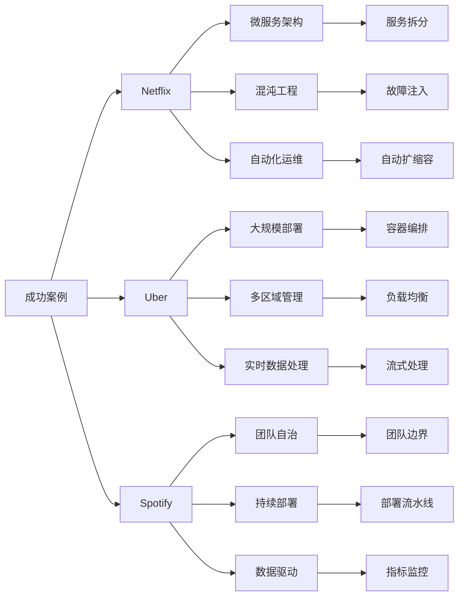
```mermaid
graph LR
    A[成功案例] --> B[Netflix]
    A --> C[Uber]
    A --> D[Spotify]
    
    B --> E[微服务架构]
    B --> F[混沌工程]
    B --> G[自动化运维]
    
    C --> H[大规模部署]
    C --> I[多区域管理]
    C --> J[实时数据处理]
    
    D --> K[团队自治]
    D --> L[持续部署]
    D --> M[数据驱动]
    
    E --> N[服务拆分]
    F --> O[故障注入]
    G --> P[自动扩缩容]
    
    H --> Q[容器编排]
    I --> R[负载均衡]
    J --> S[流式处理]
    
    K --> T[团队边界]
    L --> U[部署流水线]
    M --> V[指标监控]
```

---

## 🌟 第四部分：创新关联层 / Part 4: Innovation Association Layer

### 4.1 边缘计算创新关联 / Edge Computing Innovation Association

#### 📚 边缘AI创新关联

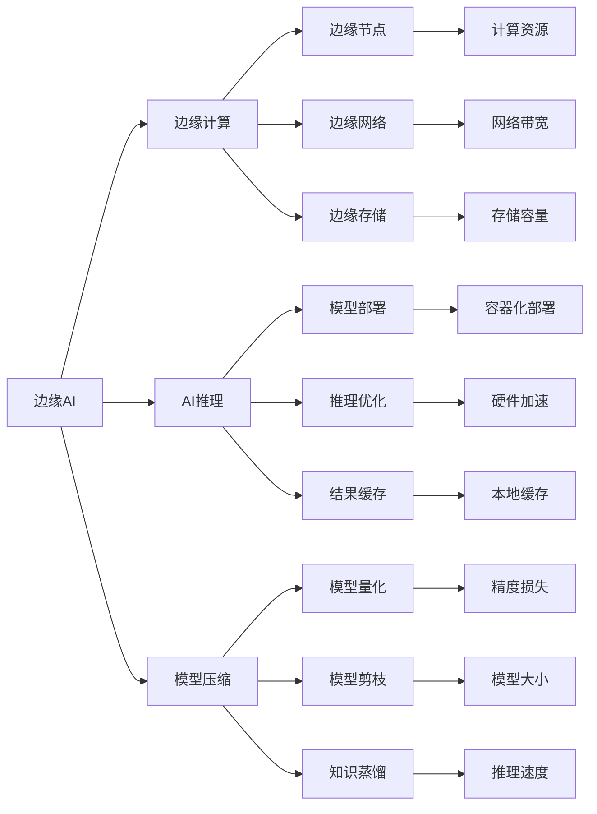
```mermaid
graph LR
    A[边缘AI] --> B[边缘计算]
    A --> C[AI推理]
    A --> D[模型压缩]
    
    B --> E[边缘节点]
    B --> F[边缘网络]
    B --> G[边缘存储]
    
    C --> H[模型部署]
    C --> I[推理优化]
    C --> J[结果缓存]
    
    D --> K[模型量化]
    D --> L[模型剪枝]
    D --> M[知识蒸馏]
    
    E --> N[计算资源]
    F --> O[网络带宽]
    G --> P[存储容量]
    
    H --> Q[容器化部署]
    I --> R[硬件加速]
    J --> S[本地缓存]
    
    K --> T[精度损失]
    L --> U[模型大小]
    M --> V[推理速度]
```

### 4.2 量子计算创新关联 / Quantum Computing Innovation Association

#### 📚 量子AI创新关联

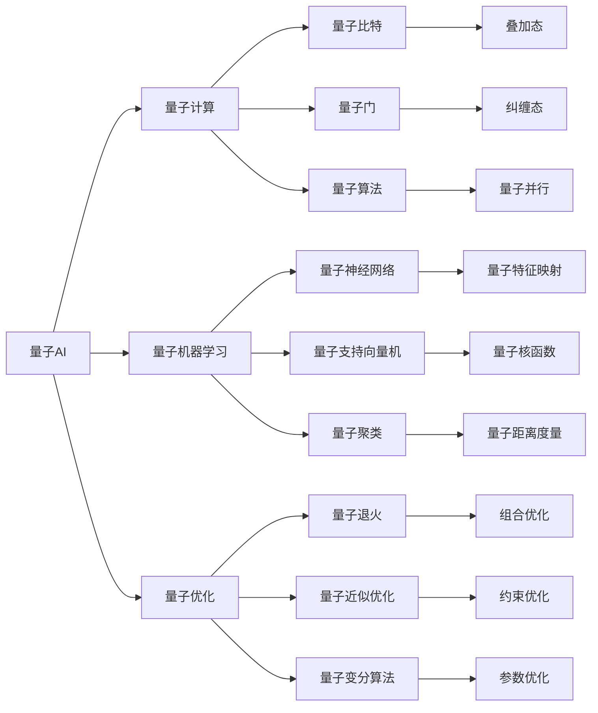
```mermaid
graph LR
    A[量子AI] --> B[量子计算]
    A --> C[量子机器学习]
    A --> D[量子优化]
    
    B --> E[量子比特]
    B --> F[量子门]
    B --> G[量子算法]
    
    C --> H[量子神经网络]
    C --> I[量子支持向量机]
    C --> J[量子聚类]
    
    D --> K[量子退火]
    D --> L[量子近似优化]
    D --> M[量子变分算法]
    
    E --> N[叠加态]
    F --> O[纠缠态]
    G --> P[量子并行]
    
    H --> Q[量子特征映射]
    I --> R[量子核函数]
    J --> S[量子距离度量]
    
    K --> T[组合优化]
    L --> U[约束优化]
    M --> V[参数优化]
```

### 4.3 联邦学习创新关联 / Federated Learning Innovation Association

#### 📚 联邦学习运维关联

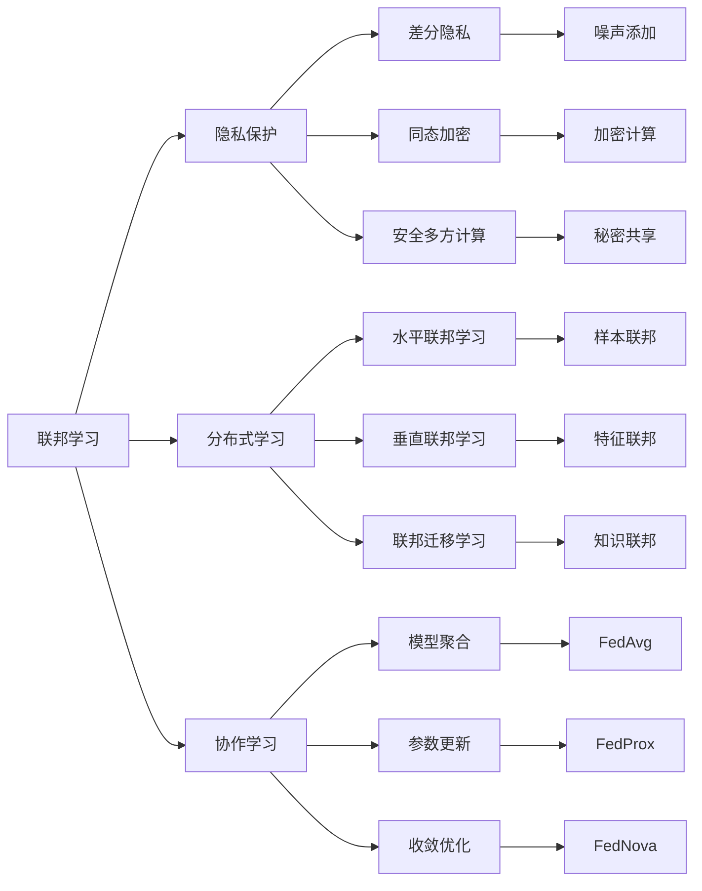
```mermaid
graph LR
    A[联邦学习] --> B[隐私保护]
    A --> C[分布式学习]
    A --> D[协作学习]
    
    B --> E[差分隐私]
    B --> F[同态加密]
    B --> G[安全多方计算]
    
    C --> H[水平联邦学习]
    C --> I[垂直联邦学习]
    C --> J[联邦迁移学习]
    
    D --> K[模型聚合]
    D --> L[参数更新]
    D --> M[收敛优化]
    
    E --> N[噪声添加]
    F --> O[加密计算]
    G --> P[秘密共享]
    
    H --> Q[样本联邦]
    I --> R[特征联邦]
    J --> S[知识联邦]
    
    K --> T[FedAvg]
    L --> U[FedProx]
    M --> V[FedNova]
```

---

## 🔗 第五部分：知识关联图谱 / Part 5: Knowledge Association Graph

### 5.1 全局关联图谱 / Global Association Graph

#### 📚 核心概念关联图

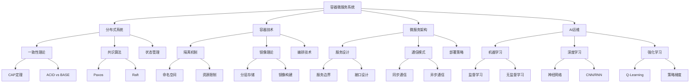
```mermaid
graph TB
    A[容器微服务系统] --> B[分布式系统]
    A --> C[容器技术]
    A --> D[微服务架构]
    A --> E[AI运维]
    
    B --> F[一致性理论]
    B --> G[共识算法]
    B --> H[状态管理]
    
    C --> I[隔离机制]
    C --> J[镜像理论]
    C --> K[编排技术]
    
    D --> L[服务设计]
    D --> M[通信模式]
    D --> N[部署策略]
    
    E --> O[机器学习]
    E --> P[深度学习]
    E --> Q[强化学习]
    
    F --> R[CAP定理]
    F --> S[ACID vs BASE]
    G --> T[Paxos]
    G --> U[Raft]
    
    I --> V[命名空间]
    I --> W[资源限制]
    J --> X[分层存储]
    J --> Y[镜像构建]
    
    L --> Z[服务边界]
    L --> AA[接口设计]
    M --> BB[同步通信]
    M --> CC[异步通信]
    
    O --> DD[监督学习]
    O --> EE[无监督学习]
    P --> FF[神经网络]
    P --> GG[CNN/RNN]
    Q --> HH[Q-Learning]
    Q --> II[策略梯度]
```

### 5.2 技术栈关联图谱 / Technology Stack Association Graph

#### 📚 CNCF技术栈关联

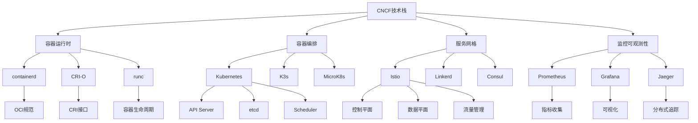
```mermaid
graph TB
    A[CNCF技术栈] --> B[容器运行时]
    A --> C[容器编排]
    A --> D[服务网格]
    A --> E[监控可观测性]
    
    B --> F[containerd]
    B --> G[CRI-O]
    B --> H[runc]
    
    C --> I[Kubernetes]
    C --> J[K3s]
    C --> K[MicroK8s]
    
    D --> L[Istio]
    D --> M[Linkerd]
    D --> N[Consul]
    
    E --> O[Prometheus]
    E --> P[Grafana]
    E --> Q[Jaeger]
    
    F --> R[OCI规范]
    G --> S[CRI接口]
    H --> T[容器生命周期]
    
    I --> U[API Server]
    I --> V[etcd]
    I --> W[Scheduler]
    
    L --> X[控制平面]
    L --> Y[数据平面]
    L --> Z[流量管理]
    
    O --> AA[指标收集]
    P --> BB[可视化]
    Q --> CC[分布式追踪]
```

---

## 📋 总结与展望 / Summary and Outlook

### 🎯 关联成果

1. **概念关联完整**: 建立了完整的概念关联关系
2. **技术关联清晰**: 明确了技术间的依赖关系
3. **应用关联具体**: 提供了具体的应用关联示例
4. **创新关联前瞻**: 建立了前瞻性的创新关联

### 🚀 发展方向

1. **关联深化**: 继续深化知识关联关系
2. **图谱完善**: 完善知识关联图谱
3. **导航优化**: 优化知识导航系统
4. **查询增强**: 增强知识查询能力

### 💪 成功信心

基于以下因素，我们对知识关联关系图充满信心：

- **理论基础扎实**: 已建立扎实的理论基础
- **关联策略清晰**: 建立了清晰的关联策略
- **技术栈完整**: 技术栈覆盖完整
- **应用场景丰富**: 应用场景非常丰富

**让我们继续完善知识关联关系图，构建完整的知识导航系统！** 🚀✨

---

**文档信息**:

- 创建日期: 2024-12-19
- 版本: v1.0
- 维护者: 项目团队
- 下次更新: 根据知识发展定期更新

**使用说明**:

1. 本文档基于知识关联关系图制定
2. 重点关注知识间的关联关系
3. 建立完整的知识关联图谱
4. 提供知识导航和查询能力
5. 支持知识的持续演进和关联
