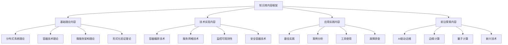

# 📚 容器微服务知识库内容框架


<!-- TOC START -->

- [📚 容器微服务知识库内容框架](#-容器微服务知识库内容框架)
  - [Container Microservices Knowledge Base Content Framework](#container-microservices-knowledge-base-content-framework)
  - [📊 设计目标 / Design Objectives](#-设计目标-design-objectives)
    - [🎯 核心目标](#-核心目标)
    - [🏗️ 内容框架架构](#-内容框架架构)
  - [🔬 第一部分：基础理论内容 / Part 1: Basic Theory Content](#-第一部分基础理论内容-part-1-basic-theory-content)
    - [1.1 分布式系统理论 / Distributed Systems Theory](#11-分布式系统理论-distributed-systems-theory)
      - [📚 一致性理论](#-一致性理论)
      - [📚 共识算法](#-共识算法)
      - [📚 分布式状态管理](#-分布式状态管理)
    - [1.2 容器技术理论 / Container Technology Theory](#12-容器技术理论-container-technology-theory)
      - [📚 隔离机制](#-隔离机制)
      - [📚 镜像理论](#-镜像理论)
      - [📚 运行时理论](#-运行时理论)
    - [1.3 微服务架构理论 / Microservices Architecture Theory](#13-微服务架构理论-microservices-architecture-theory)
      - [📚 服务设计](#-服务设计)
      - [📚 通信模式](#-通信模式)
      - [📚 部署策略](#-部署策略)
  - [🛠️ 第二部分：技术实现内容 / Part 2: Technical Implementation Content](#-第二部分技术实现内容-part-2-technical-implementation-content)
    - [2.1 容器编排技术 / Container Orchestration Technology](#21-容器编排技术-container-orchestration-technology)
      - [📚 Kubernetes](#-kubernetes)
      - [📚 Docker Swarm](#-docker-swarm)
      - [📚 Mesos](#-mesos)
    - [2.2 服务网格技术 / Service Mesh Technology](#22-服务网格技术-service-mesh-technology)
      - [📚 Istio](#-istio)
      - [📚 Linkerd](#-linkerd)
      - [📚 Consul](#-consul)
    - [2.3 监控可观测性 / Monitoring Observability](#23-监控可观测性-monitoring-observability)
      - [📚 监控指标](#-监控指标)
      - [📚 日志管理](#-日志管理)
      - [📚 分布式追踪](#-分布式追踪)
  - [🎯 第三部分：应用实践内容 / Part 3: Application Practice Content](#-第三部分应用实践内容-part-3-application-practice-content)
    - [3.1 最佳实践 / Best Practices](#31-最佳实践-best-practices)
      - [📚 容器化实践](#-容器化实践)
      - [📚 微服务实践](#-微服务实践)
    - [3.2 案例分析 / Case Studies](#32-案例分析-case-studies)
      - [📚 成功案例](#-成功案例)
      - [📚 失败案例](#-失败案例)
    - [3.3 工具使用 / Tool Usage](#33-工具使用-tool-usage)
      - [📚 开发工具](#-开发工具)
      - [📚 运维工具](#-运维工具)
    - [3.4 故障排查 / Troubleshooting](#34-故障排查-troubleshooting)
      - [📚 故障诊断](#-故障诊断)
      - [📚 性能调优](#-性能调优)
  - [🌟 第四部分：前沿探索内容 / Part 4: Frontier Exploration Content](#-第四部分前沿探索内容-part-4-frontier-exploration-content)
    - [4.1 AI驱动运维 / AI-driven Operations](#41-ai驱动运维-ai-driven-operations)
      - [📚 MLOps](#-mlops)
      - [📚 AIOps](#-aiops)
    - [4.2 边缘计算 / Edge Computing](#42-边缘计算-edge-computing)
      - [📚 边缘节点](#-边缘节点)
    - [4.3 量子计算 / Quantum Computing](#43-量子计算-quantum-computing)
      - [📚 量子算法](#-量子算法)
  - [🔗 第五部分：内容关联 / Part 5: Content Association](#-第五部分内容关联-part-5-content-association)
    - [5.1 关联机制设计 / Association Mechanism Design](#51-关联机制设计-association-mechanism-design)
      - [📚 关联原则](#-关联原则)
      - [📚 关联实现](#-关联实现)
    - [5.2 导航机制设计 / Navigation Mechanism Design](#52-导航机制设计-navigation-mechanism-design)
      - [📚 导航结构](#-导航结构)
      - [📚 导航优化](#-导航优化)
  - [🔄 第六部分：内容演进 / Part 6: Content Evolution](#-第六部分内容演进-part-6-content-evolution)
    - [6.1 内容更新机制 / Content Update Mechanism](#61-内容更新机制-content-update-mechanism)
      - [📚 更新策略](#-更新策略)
      - [📚 质量保证](#-质量保证)
    - [6.2 内容扩展机制 / Content Extension Mechanism](#62-内容扩展机制-content-extension-mechanism)
      - [📚 扩展策略](#-扩展策略)
  - [📋 总结与展望 / Summary and Outlook](#-总结与展望-summary-and-outlook)
    - [🎯 框架特点](#-框架特点)
    - [🚀 发展方向](#-发展方向)
    - [💪 成功信心](#-成功信心)

<!-- TOC END -->

## Container Microservices Knowledge Base Content Framework

---

## 📊 设计目标 / Design Objectives

### 🎯 核心目标

**内容完整**: 建立完整的容器微服务知识内容体系  
**结构清晰**: 建立清晰的知识内容组织结构  
**关联紧密**: 建立知识内容间的紧密关联关系  
**易于导航**: 提供易于导航和搜索的知识结构  

### 🏗️ 内容框架架构



---

## 🔬 第一部分：基础理论内容 / Part 1: Basic Theory Content

### 1.1 分布式系统理论 / Distributed Systems Theory

#### 📚 一致性理论

```yaml
CAP定理:
  内容: 分布式系统中一致性、可用性、分区容忍性的权衡
  关联: 与微服务架构设计、数据一致性策略关联
  应用: 指导系统架构设计和一致性模型选择
  
  ACID vs BASE:
    内容: 强一致性和最终一致性的对比
    关联: 与分布式事务、数据一致性策略关联
    应用: 指导数据一致性策略选择
  
  一致性模型:
    内容: 强一致性、弱一致性、最终一致性等
    关联: 与数据复制、故障处理策略关联
    应用: 指导数据复制策略设计
```

#### 📚 共识算法

```yaml
Paxos算法:
  内容: 分布式共识算法的经典实现
  关联: 与分布式锁、配置管理关联
  应用: 实现分布式锁、配置管理
  
  Raft算法:
    内容: 易于理解的共识算法
    关联: 与分布式存储、服务发现关联
    应用: 实现分布式存储、服务发现
  
  拜占庭容错:
    内容: 处理恶意节点的共识算法
    关联: 与区块链、安全分布式系统关联
    应用: 实现安全的分布式系统
```

#### 📚 分布式状态管理

```yaml
状态复制:
  内容: 主从复制、多主复制、无主复制
  关联: 与数据一致性、故障恢复关联
  应用: 实现高可用数据存储
  
  故障检测:
    内容: 心跳检测、Gossip协议
    关联: 与故障恢复、负载均衡关联
    应用: 实现故障检测和恢复
  
  成员管理:
    内容: 节点加入、离开、故障处理
    关联: 与集群管理、服务发现关联
    应用: 实现集群成员管理
```

### 1.2 容器技术理论 / Container Technology Theory

#### 📚 隔离机制

```yaml
命名空间隔离:
  内容: PID、网络、挂载、UTS等命名空间
  关联: 与容器安全、资源管理关联
  应用: 实现容器隔离和安全
  
  资源限制:
    内容: CPU、内存、IO、网络限制
    关联: 与资源调度、性能优化关联
    应用: 实现资源管理和优化
  
  安全策略:
    内容: Seccomp、AppArmor、SELinux
    关联: 与容器安全、合规性关联
    应用: 实现容器安全防护
```

#### 📚 镜像理论

```yaml
分层存储:
  内容: 镜像分层、联合文件系统
  关联: 与镜像构建、存储优化关联
  应用: 优化镜像构建和存储
  
  镜像构建:
    内容: Dockerfile、多阶段构建
    关联: 与CI/CD、镜像优化关联
    应用: 实现自动化镜像构建
  
  镜像分发:
    内容: 镜像仓库、镜像推送拉取
    关联: 与部署、镜像管理关联
    应用: 实现镜像分发和管理
```

#### 📚 运行时理论

```yaml
生命周期管理:
  内容: 容器创建、启动、停止、销毁
  关联: 与容器编排、资源管理关联
  应用: 实现容器生命周期管理
  
  资源调度:
    内容: CPU调度、内存管理、IO调度
    关联: 与性能优化、资源利用关联
    应用: 实现资源调度和优化
  
  网络模型:
    内容: 桥接、主机、容器网络
    关联: 与网络配置、服务通信关联
    应用: 实现容器网络配置
```

### 1.3 微服务架构理论 / Microservices Architecture Theory

#### 📚 服务设计

```yaml
服务边界:
  内容: 业务边界、技术边界、团队边界
  关联: 与系统设计、团队组织关联
  应用: 指导服务拆分和设计
  
  接口设计:
    内容: REST API、gRPC、GraphQL
    关联: 与API设计、服务通信关联
    应用: 实现服务接口设计
  
  数据一致性:
    内容: 分布式事务、最终一致性
    关联: 与数据管理、故障处理关联
    应用: 实现数据一致性策略
```

#### 📚 通信模式

```yaml
同步通信:
  内容: HTTP/REST、gRPC、WebSocket
  关联: 与API设计、性能优化关联
  应用: 实现同步服务通信
  
  异步通信:
    内容: 消息队列、事件驱动
    关联: 与解耦、扩展性关联
    应用: 实现异步服务通信
  
  事件驱动:
    内容: 发布订阅、事件溯源
    关联: 与系统解耦、状态管理关联
    应用: 实现事件驱动架构
```

#### 📚 部署策略

```yaml
蓝绿部署:
  内容: 零停机部署策略
  关联: 与高可用、风险控制关联
  应用: 实现零停机部署
  
  金丝雀部署:
    内容: 渐进式部署策略
    关联: 与风险控制、用户反馈关联
    应用: 实现渐进式部署
  
  滚动更新:
    内容: 逐步更新策略
    关联: 与资源管理、性能影响关联
    应用: 实现滚动更新
```

---

## 🛠️ 第二部分：技术实现内容 / Part 2: Technical Implementation Content

### 2.1 容器编排技术 / Container Orchestration Technology

#### 📚 Kubernetes

```yaml
架构组件:
  内容: API Server、etcd、Scheduler、Controller Manager
  关联: 与集群管理、资源调度关联
  应用: 理解Kubernetes架构
  
  资源模型:
    内容: Pod、Service、Deployment、ConfigMap
    关联: 与应用部署、配置管理关联
    应用: 设计Kubernetes资源
  
  调度算法:
    内容: 预选、优选、绑定算法
    关联: 与资源分配、性能优化关联
    应用: 优化资源调度
  
  网络模型:
    内容: Pod网络、Service网络、Ingress
    关联: 与网络配置、服务发现关联
    应用: 配置Kubernetes网络
```

#### 📚 Docker Swarm

```yaml
集群管理:
  内容: 节点管理、集群初始化
  关联: 与集群部署、管理关联
  应用: 部署Docker Swarm集群
  
  服务发现:
    内容: 服务注册、负载均衡
    关联: 与服务通信、高可用关联
    应用: 实现服务发现
  
  滚动更新:
    内容: 服务更新策略
    关联: 与部署策略、风险控制关联
    应用: 实现滚动更新
```

#### 📚 Mesos

```yaml
资源管理:
  内容: 资源抽象、资源分配
  关联: 与资源调度、利用率关联
  应用: 优化资源管理
  
  任务调度:
    内容: 任务分配、资源匹配
    关联: 与性能优化、资源利用关联
    应用: 实现任务调度
  
  框架集成:
    内容: Marathon、Chronos等框架
    关联: 与应用部署、任务管理关联
    应用: 集成Mesos框架
```

### 2.2 服务网格技术 / Service Mesh Technology

#### 📚 Istio

```yaml
控制平面:
  内容: Pilot、Citadel、Galley
  关联: 与配置管理、安全策略关联
  应用: 配置Istio控制平面
  
  数据平面:
    内容: Envoy代理、Sidecar模式
    关联: 与流量管理、可观测性关联
    应用: 部署Envoy代理
  
  流量管理:
    内容: 路由规则、负载均衡、熔断
    关联: 与流量控制、故障处理关联
    应用: 实现流量管理
  
  安全策略:
    内容: mTLS、授权策略、证书管理
    关联: 与安全防护、身份认证关联
    应用: 实现安全策略
```

#### 📚 Linkerd

```yaml
轻量级设计:
  内容: 资源占用少、启动快速
  关联: 与性能优化、资源利用关联
  应用: 选择轻量级服务网格
  
  性能优化:
    内容: 延迟优化、吞吐量优化
    关联: 与性能要求、资源限制关联
    应用: 优化服务网格性能
  
  简单配置:
    内容: 配置简单、易于使用
    关联: 与运维复杂度、学习成本关联
    应用: 简化服务网格配置
```

#### 📚 Consul

```yaml
服务发现:
  内容: 服务注册、健康检查、DNS
  关联: 与服务通信、负载均衡关联
  应用: 实现服务发现
  
  配置管理:
    内容: KV存储、配置更新
    关联: 与配置管理、动态配置关联
    应用: 管理服务配置
  
  多数据中心:
    内容: 跨数据中心部署、数据同步
    关联: 与地理分布、高可用关联
    应用: 部署多数据中心
```

### 2.3 监控可观测性 / Monitoring Observability

#### 📚 监控指标

```yaml
系统指标:
  内容: CPU、内存、磁盘、网络
  关联: 与性能监控、容量规划关联
  应用: 监控系统性能
  
  应用指标:
    内容: 响应时间、吞吐量、错误率
    关联: 与用户体验、性能优化关联
    应用: 监控应用性能
  
  业务指标:
    内容: 用户活跃度、业务成功率
    关联: 与业务监控、用户体验关联
    应用: 监控业务指标
```

#### 📚 日志管理

```yaml
日志收集:
  内容: 集中式日志收集、日志格式
  关联: 与故障诊断、安全分析关联
  应用: 实现日志收集
  
  日志分析:
    内容: 日志解析、模式识别、异常检测
    关联: 与故障诊断、性能分析关联
    应用: 分析日志数据
  
  日志存储:
    内容: 日志索引、存储策略、保留策略
    关联: 与存储成本、查询性能关联
    应用: 优化日志存储
```

#### 📚 分布式追踪

```yaml
追踪原理:
  内容: 链路追踪、Span、Trace
  关联: 与性能分析、故障诊断关联
  应用: 实现分布式追踪
  
  追踪工具:
    内容: Jaeger、Zipkin、OpenTelemetry
    关联: 与可观测性、性能分析关联
    应用: 选择追踪工具
  
  追踪集成:
    内容: 与现有系统集成、采样策略
    关联: 与系统集成、性能影响关联
    应用: 集成追踪系统
```

---

## 🎯 第三部分：应用实践内容 / Part 3: Application Practice Content

### 3.1 最佳实践 / Best Practices

#### 📚 容器化实践

```yaml
镜像优化:
  内容: 多阶段构建、基础镜像选择、层数优化
  关联: 与构建速度、镜像大小关联
  应用: 优化容器镜像
  
  部署策略:
    内容: 健康检查、资源限制、网络策略
    关联: 与部署可靠性、性能关联
    应用: 实现可靠部署
  
  监控策略:
    内容: 指标收集、日志聚合、告警机制
    关联: 与可观测性、故障处理关联
    应用: 建立监控体系
```

#### 📚 微服务实践

```yaml
服务设计:
  内容: 单一职责、接口设计、数据管理
  关联: 与系统设计、维护性关联
  应用: 设计微服务
  
  测试策略:
    内容: 单元测试、集成测试、端到端测试
    关联: 与质量保证、故障预防关联
    应用: 建立测试体系
  
  运维策略:
    内容: 自动化部署、配置管理、故障恢复
    关联: 与运维效率、系统稳定性关联
    应用: 实现自动化运维
```

### 3.2 案例分析 / Case Studies

#### 📚 成功案例

```yaml
Netflix:
  内容: 微服务架构、混沌工程、自动化运维
  关联: 与大规模部署、高可用关联
  应用: 学习成功经验
  
  Uber:
    内容: 大规模部署、多区域管理、实时数据处理
    关联: 与地理分布、实时性关联
    应用: 学习大规模部署经验
  
  Airbnb:
    内容: 容器化迁移、服务网格、监控体系
    关联: 与技术迁移、架构演进关联
    应用: 学习迁移经验
```

#### 📚 失败案例

```yaml
常见问题:
  内容: 服务拆分过度、网络复杂性、数据一致性
  关联: 与架构设计、系统复杂度关联
  应用: 避免常见问题
  
  解决方案:
    内容: 渐进式迁移、网络简化、分布式事务
    关联: 与问题解决、最佳实践关联
    应用: 解决实际问题
```

### 3.3 工具使用 / Tool Usage

#### 📚 开发工具

```yaml
IDE集成:
  内容: VS Code、IntelliJ、Eclipse插件
  关联: 与开发效率、调试能力关联
  应用: 提高开发效率
  
  调试工具:
    内容: 容器内调试、远程调试、日志调试
    关联: 与问题诊断、开发效率关联
    应用: 实现高效调试
  
  测试工具:
    内容: 单元测试框架、集成测试工具、性能测试工具
    关联: 与质量保证、性能验证关联
    应用: 建立测试体系
```

#### 📚 运维工具

```yaml
监控工具:
  内容: Prometheus、Grafana、AlertManager
  关联: 与可观测性、告警管理关联
  应用: 建立监控体系
  
  日志工具:
    内容: ELK Stack、Fluentd、Loki
    关联: 与日志管理、分析能力关联
    应用: 实现日志管理
  
  部署工具:
    内容: Helm、Kustomize、ArgoCD
    关联: 与部署自动化、配置管理关联
    应用: 实现自动化部署
```

### 3.4 故障排查 / Troubleshooting

#### 📚 故障诊断

```yaml
诊断方法:
  内容: 日志分析、指标分析、链路追踪
  关联: 与故障定位、问题解决关联
  应用: 快速定位故障
  
  常见故障:
    内容: 网络故障、存储故障、配置故障
    关联: 与故障类型、解决方案关联
    应用: 解决常见故障
  
  故障预防:
    内容: 监控告警、健康检查、故障演练
    关联: 与故障预防、系统稳定性关联
    应用: 预防故障发生
```

#### 📚 性能调优

```yaml
性能分析:
  内容: 性能瓶颈识别、性能指标分析
  关联: 与性能优化、用户体验关联
  应用: 分析性能问题
  
  调优策略:
    内容: 资源配置优化、代码优化、架构优化
    关联: 与性能提升、资源利用关联
    应用: 实现性能调优
  
  性能测试:
    内容: 压力测试、负载测试、稳定性测试
    关联: 与性能验证、容量规划关联
    应用: 验证性能优化效果
```

---

## 🌟 第四部分：前沿探索内容 / Part 4: Frontier Exploration Content

### 4.1 AI驱动运维 / AI-driven Operations

#### 📚 MLOps

```yaml
模型管理:
  内容: 模型版本管理、模型部署、模型监控
  关联: 与AI模型生命周期、运维自动化关联
  应用: 实现AI模型管理
  
  自动化流程:
    内容: 自动化训练、自动化部署、自动化监控
    关联: 与开发效率、运维效率关联
    应用: 实现AI运维自动化
  
  工具链:
    内容: MLflow、Kubeflow、Seldon Core
    关联: 与工具选择、系统集成关联
    应用: 选择合适工具
```

#### 📚 AIOps

```yaml
异常检测:
  内容: 基于机器学习的异常检测
  关联: 与故障检测、性能监控关联
  应用: 实现智能异常检测
  
  故障预测:
    内容: 基于历史数据的故障预测
    关联: 与故障预防、维护计划关联
    应用: 实现故障预测
  
  自动修复:
    内容: 基于AI的自动修复策略
    关联: 与故障恢复、运维自动化关联
    应用: 实现自动修复
```

### 4.2 边缘计算 / Edge Computing

#### 📚 边缘节点

```yaml
轻量级容器:
  内容: 边缘容器、资源优化、网络优化
  关联: 与边缘部署、资源限制关联
  应用: 部署边缘容器
  
  边缘AI:
    内容: 边缘推理、模型压缩、增量学习
    关联: 与AI部署、边缘计算关联
    应用: 实现边缘AI
  
  云边协同:
    内容: 任务分发、数据聚合、负载均衡
    关联: 与分布式计算、资源优化关联
    应用: 实现云边协同
```

### 4.3 量子计算 / Quantum Computing

#### 📚 量子算法

```yaml
量子优势:
  内容: 量子并行计算、量子模拟、量子优化
  关联: 与计算能力、算法优化关联
  应用: 理解量子计算优势
  
  后量子密码:
    内容: 格密码学、多变量密码学、基于哈希的签名
    关联: 与密码学安全、量子威胁关联
    应用: 准备后量子密码
  
  量子AI:
    内容: 量子机器学习、量子神经网络
    关联: 与AI发展、量子计算关联
    应用: 探索量子AI应用
```

---

## 🔗 第五部分：内容关联 / Part 5: Content Association

### 5.1 关联机制设计 / Association Mechanism Design

#### 📚 关联原则

```yaml
概念关联:
  内容: 建立概念间的逻辑关联关系
  关联: 与知识理解、学习效果关联
  应用: 建立概念关联
  
  技术关联:
    内容: 建立技术间的依赖关联关系
    关联: 与技术选择、系统设计关联
    应用: 建立技术关联
  
  应用关联:
    内容: 建立应用间的实践关联关系
    关联: 与实践指导、问题解决关联
    应用: 建立应用关联
```

#### 📚 关联实现

```yaml
自动关联:
  内容: 基于语义的自动关联发现
  关联: 与关联质量、发现效率关联
  应用: 实现自动关联
  
  手动关联:
    内容: 专家手动建立关联关系
    关联: 与关联准确性、专业性关联
    应用: 建立准确关联
  
  关联验证:
    内容: 验证关联关系的正确性
    关联: 与关联质量、知识准确性关联
    应用: 验证关联关系
```

### 5.2 导航机制设计 / Navigation Mechanism Design

#### 📚 导航结构

```yaml
层次导航:
  内容: 基于知识层次的导航结构
  关联: 与知识组织、学习路径关联
  应用: 建立层次导航
  
  关联导航:
    内容: 基于关联关系的导航结构
    关联: 与知识关联、学习深度关联
    应用: 建立关联导航
  
  搜索导航:
    内容: 基于搜索的导航方式
    关联: 与知识查找、学习效率关联
    应用: 实现搜索导航
```

#### 📚 导航优化

```yaml
用户体验:
  内容: 优化导航的用户体验
  关联: 与学习效果、使用满意度关联
  应用: 优化用户体验
  
  性能优化:
    内容: 优化导航的性能表现
    关联: 与响应速度、系统性能关联
    应用: 优化导航性能
  
  个性化:
    内容: 提供个性化的导航体验
    关联: 与用户需求、学习效果关联
    应用: 实现个性化导航
```

---

## 🔄 第六部分：内容演进 / Part 6: Content Evolution

### 6.1 内容更新机制 / Content Update Mechanism

#### 📚 更新策略

```yaml
定期更新:
  内容: 定期更新知识内容
  关联: 与内容时效性、准确性关联
  应用: 保持内容更新
  
  按需更新:
    内容: 根据需求更新内容
    关联: 与用户需求、内容相关性关联
    应用: 满足用户需求
  
  版本管理:
    内容: 管理内容版本
    关联: 与内容管理、变更追踪关联
    应用: 管理内容版本
```

#### 📚 质量保证

```yaml
内容审查:
  内容: 审查内容质量
  关联: 与内容准确性、专业性关联
  应用: 保证内容质量
  
  用户反馈:
    内容: 收集用户反馈
    关联: 与用户需求、内容改进关联
    应用: 改进内容质量
  
  专家评审:
    内容: 专家评审内容
    关联: 与内容权威性、专业性关联
    应用: 保证内容权威性
```

### 6.2 内容扩展机制 / Content Extension Mechanism

#### 📚 扩展策略

```yaml
横向扩展:
  内容: 扩展相关领域内容
  关联: 与知识广度、学习范围关联
  应用: 扩展知识范围
  
  纵向扩展:
    内容: 深化现有内容
    关联: 与知识深度、学习深度关联
    应用: 深化知识内容
  
  创新扩展:
    内容: 探索创新内容
    关联: 与知识创新、前沿探索关联
    应用: 探索创新内容
```

---

## 📋 总结与展望 / Summary and Outlook

### 🎯 框架特点

1. **内容完整**: 覆盖容器微服务的各个方面
2. **结构清晰**: 建立清晰的内容组织结构
3. **关联紧密**: 建立内容间的紧密关联关系
4. **易于导航**: 提供易于导航和搜索的结构

### 🚀 发展方向

1. **内容完善**: 继续完善知识内容
2. **结构优化**: 优化内容组织结构
3. **关联增强**: 增强内容关联关系
4. **导航改进**: 改进导航和搜索功能

### 💪 成功信心

基于以下因素，我们对知识库内容框架充满信心：

- **理论基础扎实**: 已建立扎实的理论基础
- **内容组织清晰**: 建立了清晰的内容组织
- **关联机制完善**: 建立了完善的关联机制
- **导航机制友好**: 建立了友好的导航机制

**让我们继续完善知识库内容框架，为用户提供更好的知识学习体验！** 🚀✨

---

**文档信息**:

- 创建日期: 2024-12-19
- 版本: v1.0
- 维护者: 项目团队
- 下次更新: 根据内容发展定期更新

**使用说明**:

1. 本文档基于知识库内容框架制定
2. 重点关注知识内容的组织和关联
3. 建立完整的知识内容体系
4. 提供友好的导航和搜索机制
5. 支持内容的持续演进和完善
