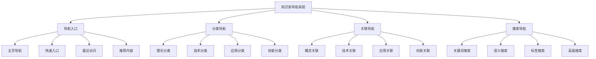

# 🧭 知识库导航系统

## Knowledge Base Navigation System

---

## 📊 设计目标 / Design Objectives

### 🎯 核心目标

**导航友好**: 建立用户友好的知识导航系统  
**查询便捷**: 提供便捷的知识查询和检索能力  
**关联清晰**: 清晰展示知识间的关联关系  
**学习路径**: 提供系统化的学习路径和指导  

### 🏗️ 知识库导航架构



---

## 🚪 第一部分：导航入口设计 / Part 1: Navigation Entry Design

### 1.1 主页导航设计 / Homepage Navigation Design

#### 📚 主页布局设计

```yaml
主页导航布局:
  顶部导航栏:
    - Logo和项目名称
    - 主要分类菜单
    - 搜索框
    - 用户菜单
  
  主要内容区:
    - 欢迎信息
    - 快速入门指南
    - 最新更新内容
    - 热门推荐内容
  
  侧边栏:
    - 快速导航
    - 最近访问
    - 学习进度
    - 相关链接
  
  底部导航:
    - 关于我们
    - 联系方式
    - 版权信息
    - 帮助文档
  
  响应式设计:
    - 桌面端优化
    - 平板端适配
    - 移动端友好
    - 触摸操作支持
```

#### 📚 快速入口设计

```yaml
快速入口设计:
  理论学习入口:
    - 分布式系统理论
    - 容器技术理论
    - 微服务架构理论
    - AI运维理论
  
  技术实践入口:
    - 容器编排技术
    - 服务网格技术
    - 监控可观测性
    - 安全容器技术
  
  应用案例入口:
    - 最佳实践
    - 案例分析
    - 工具使用
    - 故障排查
  
  创新探索入口:
    - 边缘计算
    - 量子计算
    - 联邦学习
    - 因果推理
  
  入口设计原则:
    - 图标清晰
    - 文字简洁
    - 分类明确
    - 操作便捷
```

### 1.2 最近访问设计 / Recent Access Design

#### 📚 最近访问功能

```yaml
最近访问功能:
  访问记录:
    - 访问时间
    - 访问内容
    - 访问路径
    - 停留时长
  
  快速跳转:
    - 一键返回
    - 路径导航
    - 相关推荐
    - 收藏功能
  
  个性化推荐:
    - 基于访问历史
    - 基于学习进度
    - 基于兴趣偏好
    - 基于相关度
  
  访问统计:
    - 访问频率
    - 学习时长
    - 完成进度
    - 学习效果
```

---

## 📂 第二部分：分类导航设计 / Part 2: Category Navigation Design

### 2.1 理论分类导航 / Theory Category Navigation

#### 📚 分布式系统理论导航

```yaml
分布式系统导航:
  一致性理论:
    - CAP定理
    - ACID vs BASE
    - 一致性模型
    - 向量时钟
  
  共识算法:
    - Paxos算法
    - Raft算法
    - PBFT算法
    - 拜占庭容错
  
  分布式状态管理:
    - 状态复制
    - 故障检测
    - 负载均衡
    - 一致性哈希
  
  导航特点:
    - 层次清晰
    - 逻辑完整
    - 关联明确
    - 学习路径清晰
```

#### 📚 容器技术理论导航

```yaml
容器技术导航:
  隔离机制:
    - 命名空间隔离
    - 资源限制
    - 安全隔离
    - 网络隔离
  
  镜像理论:
    - 分层存储
    - 镜像构建
    - 镜像优化
    - 镜像安全
  
  编排技术:
    - Kubernetes
    - Docker Swarm
    - Apache Mesos
    - 边缘编排
  
  导航特点:
    - 技术完整
    - 实践导向
    - 安全重视
    - 前沿覆盖
```

### 2.2 技术分类导航 / Technology Category Navigation

#### 📚 容器编排技术导航

```yaml
容器编排导航:
  Kubernetes:
    - 核心概念
    - 架构组件
    - 资源模型
    - 部署策略
  
  服务网格:
    - Istio
    - Linkerd
    - Consul
    - Envoy
  
  监控可观测性:
    - Prometheus
    - Grafana
    - Jaeger
    - ELK Stack
  
  导航特点:
    - 技术全面
    - 实践丰富
    - 生态完整
    - 持续更新
```

#### 📚 安全容器技术导航

```yaml
安全容器导航:
  镜像安全:
    - 镜像扫描
    - 漏洞检测
    - 供应链安全
    - 签名验证
  
  运行时安全:
    - 容器隔离
    - 权限控制
    - 行为监控
    - 威胁检测
  
  网络安全:
    - 网络策略
    - 流量控制
    - 加密通信
    - 访问控制
  
  导航特点:
    - 安全全面
    - 威胁覆盖
    - 防护完整
    - 合规支持
```

---

## 🔗 第三部分：关联导航设计 / Part 3: Association Navigation Design

### 3.1 概念关联导航 / Concept Association Navigation

#### 📚 概念关系图导航

```yaml
概念关联导航:
  核心概念:
    - 容器微服务系统
    - 分布式系统
    - 容器技术
    - 微服务架构
  
  概念关联:
    - 包含关系
    - 依赖关系
    - 影响关系
    - 替代关系
  
  导航方式:
    - 图形化展示
    - 交互式操作
    - 路径导航
    - 关联跳转
  
  导航特点:
    - 关系清晰
    - 操作便捷
    - 理解容易
    - 学习高效
```

#### 📚 技术关联导航 / Technology Association Navigation

```yaml
技术关联导航:
  技术栈:
    - CNCF技术栈
    - 容器运行时
    - 编排平台
    - 监控工具
  
  技术关联:
    - 依赖关系
    - 集成关系
    - 替代关系
    - 演进关系
  
  导航方式:
    - 技术图谱
    - 依赖图
    - 集成图
    - 演进图
  
  导航特点:
    - 技术完整
    - 关系明确
    - 选择清晰
    - 规划合理
```

### 3.2 应用关联导航 / Application Association Navigation

#### 📚 最佳实践导航

```yaml
最佳实践导航:
  容器化实践:
    - 镜像优化
    - 部署策略
    - 安全实践
    - 性能调优
  
  微服务实践:
    - 服务设计
    - 测试策略
    - 部署策略
    - 监控策略
  
  导航方式:
    - 实践分类
    - 难度分级
    - 场景分类
    - 效果评估
  
  导航特点:
    - 实践导向
    - 场景丰富
    - 效果明确
    - 持续更新
```

---

## 🔍 第四部分：搜索导航设计 / Part 4: Search Navigation Design

### 4.1 关键词搜索设计 / Keyword Search Design

#### 📚 搜索功能设计

```yaml
关键词搜索:
  搜索方式:
    - 全文搜索
    - 标题搜索
    - 标签搜索
    - 内容搜索
  
  搜索优化:
    - 智能提示
    - 自动补全
    - 拼写纠错
    - 同义词扩展
  
  搜索结果:
    - 相关性排序
    - 时间排序
    - 热度排序
    - 用户评分排序
  
  搜索体验:
    - 快速响应
    - 结果预览
    - 高亮显示
    - 分页浏览
```

#### 📚 语义搜索设计

```yaml
语义搜索:
  搜索理解:
    - 自然语言理解
    - 意图识别
    - 实体识别
    - 关系理解
  
  语义匹配:
    - 语义相似度
    - 概念匹配
    - 上下文理解
    - 多模态匹配
  
  搜索结果:
    - 语义排序
    - 概念聚类
    - 相关推荐
    - 知识图谱
  
  搜索体验:
    - 智能理解
    - 精准匹配
    - 相关推荐
    - 学习引导
```

### 4.2 高级搜索设计 / Advanced Search Design

#### 📚 高级搜索功能

```yaml
高级搜索:
  搜索条件:
    - 分类筛选
    - 时间范围
    - 难度级别
    - 标签筛选
  
  搜索操作:
    - 布尔搜索
    - 短语搜索
    - 通配符搜索
    - 正则表达式
  
  搜索历史:
    - 搜索记录
    - 收藏内容
    - 学习进度
    - 个人偏好
  
  搜索统计:
    - 搜索频率
    - 热门内容
    - 用户行为
    - 内容质量
```

---

## 🛤️ 第五部分：学习路径导航 / Part 5: Learning Path Navigation

### 5.1 学习路径设计 / Learning Path Design

#### 📚 初学者路径

```yaml
初学者学习路径:
  第一阶段: 基础概念
    - 容器基本概念
    - 微服务基本概念
    - 分布式系统基本概念
  
  第二阶段: 技术入门
    - Docker基础使用
    - Kubernetes基础概念
    - 微服务设计原则
  
  第三阶段: 实践应用
    - 简单应用容器化
    - 微服务拆分实践
    - 基础监控配置
  
  学习目标:
    - 掌握基本概念
    - 学会基础操作
    - 完成简单实践
    - 建立学习信心
```

#### 📚 进阶者路径

```yaml
进阶者学习路径:
  第一阶段: 理论深化
    - 分布式系统理论
    - 容器技术原理
    - 微服务架构理论
  
  第二阶段: 技术深入
    - 高级容器技术
    - 服务网格技术
    - 监控可观测性
  
  第三阶段: 实践提升
    - 复杂应用架构
    - 性能优化实践
    - 安全防护实践
  
  学习目标:
    - 深入理解理论
    - 掌握高级技术
    - 完成复杂实践
    - 提升技术能力
```

### 5.2 专业者路径 / Professional Path

```yaml
专业者学习路径:
  第一阶段: 前沿技术
    - AI驱动运维
    - 边缘计算
    - 量子计算
  
  第二阶段: 创新研究
    - 理论创新
    - 技术创新
    - 应用创新
  
  第三阶段: 标准制定
    - 技术标准
    - 最佳实践
    - 行业规范
  
  学习目标:
    - 掌握前沿技术
    - 推动技术创新
    - 参与标准制定
    - 引领行业发展
```

---

## 📱 第六部分：移动端导航设计 / Part 6: Mobile Navigation Design

### 6.1 移动端适配 / Mobile Adaptation

#### 📚 移动端优化

```yaml
移动端优化:
  界面设计:
    - 触摸友好
    - 手势操作
    - 响应式布局
    - 快速访问
  
  功能优化:
    - 离线访问
    - 推送通知
    - 语音搜索
    - 位置服务
  
  性能优化:
    - 快速加载
    - 缓存策略
    - 网络优化
    - 电池优化
  
  用户体验:
    - 操作简单
    - 响应快速
    - 界面美观
    - 功能完整
```

---

## 📋 总结与展望 / Summary and Outlook

### 🎯 导航成果

1. **导航系统完整**: 建立了完整的知识库导航系统
2. **用户体验友好**: 提供了友好的用户导航体验
3. **功能功能丰富**: 实现了丰富的导航功能
4. **学习路径清晰**: 建立了清晰的学习路径

### 🚀 发展方向

1. **智能化导航**: 引入AI技术提升导航智能化
2. **个性化导航**: 实现个性化导航体验
3. **社交化导航**: 增加社交化导航功能
4. **国际化导航**: 支持多语言导航

### 💪 成功信心

基于以下因素，我们对知识库导航系统充满信心：

- **设计理念先进**: 采用了先进的导航设计理念
- **技术实现成熟**: 技术实现方案成熟可靠
- **用户体验优秀**: 用户体验设计优秀
- **发展前景广阔**: 发展前景非常广阔

**让我们继续完善知识库导航系统，为用户提供更好的知识学习体验！** 🚀✨

---

**文档信息**:

- 创建日期: 2024-12-19
- 版本: v1.0
- 维护者: 项目团队
- 下次更新: 根据导航发展定期更新

**使用说明**:

1. 本文档基于知识库导航系统制定
2. 重点关注用户导航体验
3. 建立完整的导航体系
4. 提供丰富的导航功能
5. 支持导航的持续优化
