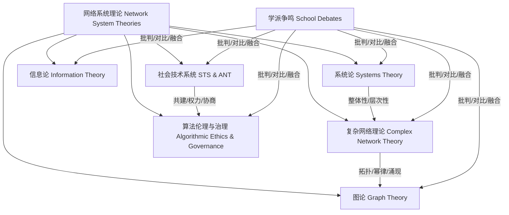

# 知识结构图谱与理论关系 Knowledge Structure Map & Theoretical Relations

- 图谱展示了网络系统各主流理论、模型、争鸣之间的结构化关系与交互影响。
- The map shows the structured relationships and interactions among major theories, models, and debates in network systems.

## 哲学批判 Philosophical Critique

- 知识结构图谱有助于整体把握理论体系，但需警惕结构化带来的简化与理论张力的遮蔽。
- Knowledge maps help grasp the overall theoretical system, but beware of simplification and the obscuring of theoretical tensions.
