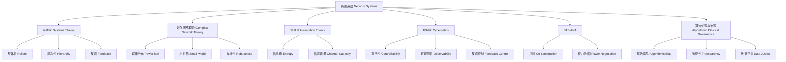

# 1.8.13 知识结构图谱与理论关系

<!-- TOC START -->

- [1.8.13 知识结构图谱与理论关系](#1813-知识结构图谱与理论关系)
  - [目录 Table of Contents](#目录-table-of-contents)
  - [1 网络系统知识结构图谱](#1-网络系统知识结构图谱)
  - [2 理论关系与批判性说明](#2-理论关系与批判性说明)

<!-- TOC END -->

Knowledge Graph & Theoretical Relations in Network Systems

## 目录 Table of Contents

- [1.8.13 知识结构图谱与理论关系](#1813-知识结构图谱与理论关系)
  - [目录 Table of Contents](#目录-table-of-contents)
  - [1 网络系统知识结构图谱](#1-网络系统知识结构图谱)
  - [2 理论关系与批判性说明](#2-理论关系与批判性说明)

---

## 1 网络系统知识结构图谱

## 2 理论关系与批判性说明

- 本图谱以理论流派为主线，展现各核心概念、推理与证明的知识关联。
- 系统论、复杂网络、信息论、控制论、STS/ANT、算法伦理等理论相互交织，形成网络系统知识的多维结构。
- 结构图有助于整体把握理论体系，发现交叉融合与批判性改进空间。
