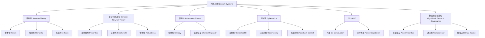

# 1.8.13 知识结构图谱与理论关系

<!-- TOC START -->

- [1.8.13 知识结构图谱与理论关系](#1813-知识结构图谱与理论关系)
  - [目录 Table of Contents](#目录-table-of-contents)
  - [1 网络系统知识结构图谱](#1-网络系统知识结构图谱)
  - [2 理论关系与批判性说明](#2-理论关系与批判性说明)
  - [国际权威来源链接 | International Authoritative Sources](#国际权威来源链接--international-authoritative-sources)

<!-- TOC END -->

Knowledge Graph & Theoretical Relations in Network Systems

## 目录 Table of Contents

- [1.8.13 知识结构图谱与理论关系](#1813-知识结构图谱与理论关系)
  - [目录 Table of Contents](#目录-table-of-contents)
  - [1 网络系统知识结构图谱](#1-网络系统知识结构图谱)
  - [2 理论关系与批判性说明](#2-理论关系与批判性说明)
  - [国际权威来源链接 | International Authoritative Sources](#国际权威来源链接--international-authoritative-sources)

---

## 1 网络系统知识结构图谱

```mermaid
graph TD
  A["网络系统 Network Systems"]
  A --> B1["系统论 Systems Theory"]
  A --> B2["复杂网络理论 Complex Network Theory"]
  A --> B3["信息论 Information Theory"]
  A --> B4["控制论 Cybernetics"]
  A --> B5["STS/ANT"]
  A --> B6["算法伦理与治理 Algorithmic Ethics & Governance"]
  B1 --> C1["整体性 Holism"]
  B1 --> C2["层次性 Hierarchy"]
  B1 --> C3["反馈 Feedback"]
  B2 --> D1["幂律分布 Power-law"]
  B2 --> D2["小世界 Small-world"]
  B2 --> D3["鲁棒性 Robustness"]
  B3 --> E1["信息熵 Entropy"]
  B3 --> E2["信道容量 Channel Capacity"]
  B4 --> F1["可控性 Controllability"]
  B4 --> F2["可观测性 Observability"]
  B4 --> F3["反馈控制 Feedback Control"]
  B5 --> G1["共建 Co-construction"]
  B5 --> G2["权力协商 Power Negotiation"]
  B6 --> H1["算法偏见 Algorithmic Bias"]
  B6 --> H2["透明性 Transparency"]
  B6 --> H3["数据正义 Data Justice"]
```

## 2 理论关系与批判性说明

- 本图谱以理论流派为主线，展现各核心概念、推理与证明的知识关联。
- 系统论、复杂网络、信息论、控制论、STS/ANT、算法伦理等理论相互交织，形成网络系统知识的多维结构。
- 结构图有助于整体把握理论体系，发现交叉融合与批判性改进空间。

## 国际权威来源链接 | International Authoritative Sources

- [ISO/IEC 7498-1 — OSI Basic Reference Model](https://www.iso.org/standard/20269.html)
- [RFC 1122 — Host Requirements](https://datatracker.ietf.org/doc/html/rfc1122)
- [RFC 791 — Internet Protocol (IPv4)](https://datatracker.ietf.org/doc/html/rfc791)
- [RFC 793 — Transmission Control Protocol (TCP)](https://datatracker.ietf.org/doc/html/rfc793)
- [RFC 8200 — Internet Protocol, Version 6 (IPv6)](https://datatracker.ietf.org/doc/html/rfc8200)
- [RFC 5681 — TCP Congestion Control](https://datatracker.ietf.org/doc/html/rfc5681)
- [IEEE 802.3-2022 — Ethernet](https://standards.ieee.org/standard/802.3-2022.html)
- [IEEE 802.1Q-2024 — VLAN Bridging](https://standards.ieee.org/standard/802.1Q-2024.html)
- [NIST AI Risk Management Framework](https://www.nist.gov/itl/ai-risk-management-framework)
- [EU AI Act](https://eur-lex.europa.eu/legal-content/EN/TXT/?uri=CELEX:32024R1689)
- [Barabási, A.-L. (2016). Network Science. Cambridge University Press.](http://networksciencebook.com/)
- [Newman, M. E. J. (2010). Networks: An Introduction. Oxford University Press.](https://academic.oup.com/book/5324)
- [Shannon, C. E. (1948). A Mathematical Theory of Communication. Bell System Technical Journal.](https://doi.org/10.1002/j.1538-7305.1948.tb01338.x)
- [Lamport, L. Specifying Systems (TLA+)](https://lamport.azurewebsites.net/tla/book.html)
- [Baier & Katoen (2008). Principles of Model Checking. MIT Press.](https://mitpress.mit.edu/9780262026499/principles-of-model-checking/)
