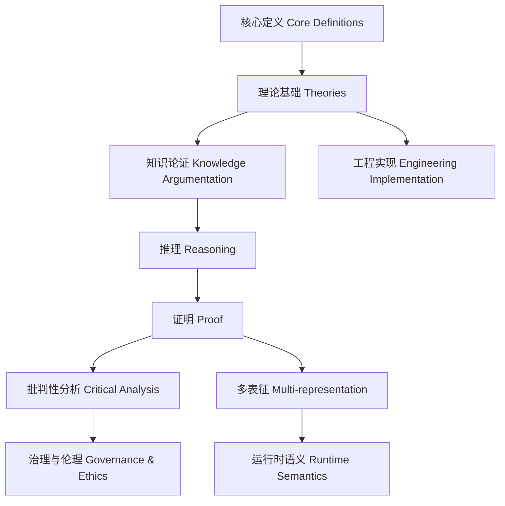

# 1.8.32 网络系统的知识结构与批判性导图

<!-- TOC START -->

- [1.8.32 网络系统的知识结构与批判性导图](#1832-网络系统的知识结构与批判性导图)
  - [目录 Table of Contents](#目录-table-of-contents)
  - [1 知识结构总览 | Overview of Knowledge Structure](#1-知识结构总览-overview-of-knowledge-structure)
  - [2 核心定义—理论—推理—证明链条 | Core Definition—Theory—Reasoning—Proof Chain](#2-核心定义理论推理证明链条-core-definitiontheoryreasoningproof-chain)
  - [3 批判性关系与结构逻辑 | Critical Relations & Structural Logic](#3-批判性关系与结构逻辑-critical-relations-structural-logic)
  - [4 可视化导图与结构说明 | Visualization & Structure Explanation](#4-可视化导图与结构说明-visualization-structure-explanation)
  - [5 参考文献 References](#5-参考文献-references)

<!-- TOC END -->

Knowledge Structure & Critical Mindmap of Network Systems

## 目录 Table of Contents

1. 1 知识结构总览 | Overview of Knowledge Structure
2. 2 核心定义—理论—推理—证明链条 | Core Definition—Theory—Reasoning—Proof Chain
3. 3 批判性关系与结构逻辑 | Critical Relations & Structural Logic
4. 4 可视化导图与结构说明 | Visualization & Structure Explanation
5. 5 参考文献 References

---

## 1 知识结构总览 | Overview of Knowledge Structure

- 中文：网络系统知识体系涵盖核心概念、关键理论、工程实现、形式化结构、证明方法、多表征、运行时语义、治理与伦理等。
- EN: The knowledge system of network systems covers core concepts, key theories, engineering implementation, formal structures, proof methods, multi-representation, runtime semantics, governance and ethics, etc.

## 2 核心定义—理论—推理—证明链条 | Core Definition—Theory—Reasoning—Proof Chain

- 中文：每一核心概念均应有明确定义、理论基础、知识论证、推理过程与形式化证明，形成完整知识链条。
- EN: Each core concept should have a clear definition, theoretical foundation, knowledge argumentation, reasoning process, and formal proof, forming a complete knowledge chain.

## 3 批判性关系与结构逻辑 | Critical Relations & Structural Logic

- 中文：
  - 概念间的层次关系、理论与工程的映射、批判性分析（如局限性、争议、工程极限等）。
  - 结构逻辑体现“定义—理论—推理—证明—批判”闭环。
- EN:
  - Hierarchical relations among concepts, mapping between theory and engineering, critical analysis (e.g., limitations, controversies, engineering limits, etc.).
  - The structural logic reflects the closed loop of "definition—theory—reasoning—proof—critique".

## 4 可视化导图与结构说明 | Visualization & Structure Explanation

- 中文：导图展示了网络系统知识的核心链条与批判性关系，强调理论与工程、形式化与多表征、运行时与治理的交互。
- EN: The diagram shows the core chain and critical relations of network systems knowledge, emphasizing the interaction between theory and engineering, formalization and multi-representation, runtime and governance.

## 5 参考文献 References

- Barabási, A.-L. (2016). Network Science.
- Milner, R. (1989). Communication and concurrency.
- Lee, E. A., & Seshia, S. A. (2017). Introduction to Embedded Systems.
