# 1.8.32 网络系统的知识结构与批判性导图

Knowledge Structure & Critical Mapping of Network Systems

## 目录 Table of Contents

1. 1 网络系统知识结构总览
2. 2 核心概念与理论关系
3. 3 工程实现与理论映射
4. 4 批判性关系与局限性分析
5. 5 Mermaid导图示例
6. 6 参考文献 References

---

## 1 网络系统知识结构总览

- 网络系统包括：基本概念、体系结构、协议、算法、模型、理论、管理、安全、治理、前沿等
- 各部分相互关联，形成多层次、跨域的知识体系

## 2 核心概念与理论关系

- 节点、链路、协议、拓扑、带宽、延迟、吞吐、容错等为基础概念
- 体系结构（OSI、TCP/IP）、协议（Ethernet、IP、TCP、HTTP等）、算法（Dijkstra、BFS等）、模型（图、FSM、Petri网等）
- 理论基础：系统论、信息论、复杂网络、图论、STS/ANT、算法伦理等

## 3 工程实现与理论映射

- 工程实现依赖理论指导，理论模型映射为协议、算法、系统架构
- 工程实践反过来推动理论发展与批判

## 4 批判性关系与局限性分析

- 标准化推动可扩展性，但带来路径依赖与治理权力分配问题
- 理论抽象提升理解与验证，但简化带来实际适用性与可扩展性挑战
- 工程实现与理论、治理、伦理之间存在持续张力

## 5 Mermaid导图示例

```mermaid
graph TD
  A["网络系统 Network Systems"]
  A --> B1["基本概念 Concepts"]
  A --> B2["体系结构 Architectures"]
  A --> B3["协议 Protocols"]
  A --> B4["算法 Algorithms"]
  A --> B5["模型 Models"]
  A --> B6["理论 Theories"]
  A --> B7["管理与安全 Management & Security"]
  A --> B8["治理与伦理 Governance & Ethics"]
  A --> B9["前沿与批判 Frontiers & Critique"]
  B1 --> C1["节点 Node"]
  B1 --> C2["链路 Link"]
  B1 --> C3["拓扑 Topology"]
  B3 --> D1["Ethernet"]
  B3 --> D2["IP"]
  B3 --> D3["TCP"]
  B3 --> D4["HTTP"]
  B4 --> E1["Dijkstra"]
  B4 --> E2["BFS"]
  B5 --> F1["图 Graph"]
  B5 --> F2["FSM"]
  B5 --> F3["Petri网"]
  B6 --> G1["系统论 Systems Theory"]
  B6 --> G2["信息论 Information Theory"]
  B6 --> G3["复杂网络 Complex Networks"]
  B6 --> G4["图论 Graph Theory"]
  B6 --> G5["STS/ANT"]
  B6 --> G6["算法伦理 Algorithmic Ethics"]
  B7 --> H1["运维 O&M"]
  B7 --> H2["安全 Security"]
  B8 --> I1["多方治理 Multi-stakeholder Governance"]
  B8 --> I2["透明性 Transparency"]
  B8 --> I3["数据正义 Data Justice"]
  B9 --> J1["量子网络 Quantum Networks"]
  B9 --> J2["绿色网络 Green Networking"]
  B9 --> J3["数字主权 Digital Sovereignty"]
```

## 6 参考文献 References

- ISO/IEC 7498-1, RFC 793, Watts & Strogatz (1998), Barabási & Albert (1999), Baier & Katoen (2008), GDPR, NIST SP 800-53
