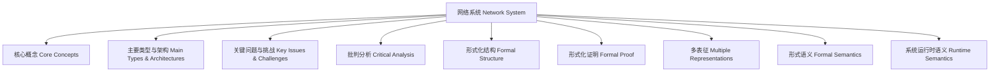

# 知识体系图谱与总结 Knowledge Map & Summary

## 网络系统知识体系图谱 Knowledge Map

## 总结 Summary

- 网络系统是技术、社会、伦理多维交织的复杂系统。
- 其发展与治理需兼顾效率、公平、创新与责任。
- 哲学批判：知识体系的建构应警惕单一视角，倡导多元、批判与反思。
- The construction of knowledge systems should avoid single perspectives and advocate pluralism, criticism, and reflection.

## 参考文献 References

- 见本章各节参考文献。
