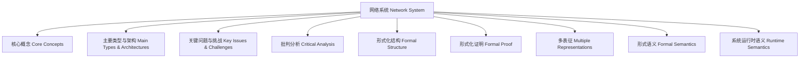

# 知识体系图谱与总结 Knowledge Map & Summary

<!-- TOC START -->

- [知识体系图谱与总结 Knowledge Map \& Summary](#知识体系图谱与总结-knowledge-map--summary)
  - [网络系统知识体系图谱 Knowledge Map](#网络系统知识体系图谱-knowledge-map)
  - [总结 Summary](#总结-summary)
  - [参考文献 References](#参考文献-references)
  - [国际权威来源链接 | International Authoritative Sources](#国际权威来源链接--international-authoritative-sources)

<!-- TOC END -->

## 网络系统知识体系图谱 Knowledge Map

```mermaid
graph TD;
  A[网络系统 Network System]
  B[核心概念 Core Concepts]
  C[主要类型与架构 Main Types & Architectures]
  D[关键问题与挑战 Key Issues & Challenges]
  E[批判分析 Critical Analysis]
  F[形式化结构 Formal Structure]
  G[形式化证明 Formal Proof]
  H[多表征 Multiple Representations]
  I[形式语义 Formal Semantics]
  J[系统运行时语义 Runtime Semantics]

  A --> B
  A --> C
  A --> D
  A --> E
  A --> F
  A --> G
  A --> H
  A --> I
  A --> J
```

## 总结 Summary

- 网络系统是技术、社会、伦理多维交织的复杂系统。
- 其发展与治理需兼顾效率、公平、创新与责任。
- 哲学批判：知识体系的建构应警惕单一视角，倡导多元、批判与反思。
- The construction of knowledge systems should avoid single perspectives and advocate pluralism, criticism, and reflection.

## 参考文献 References

- 见本章各节参考文献。

## 国际权威来源链接 | International Authoritative Sources

- [ISO/IEC 7498-1 — OSI Basic Reference Model](https://www.iso.org/standard/20269.html)
- [RFC 1122 — Host Requirements](https://datatracker.ietf.org/doc/html/rfc1122)
- [RFC 791 — Internet Protocol (IPv4)](https://datatracker.ietf.org/doc/html/rfc791)
- [RFC 793 — Transmission Control Protocol (TCP)](https://datatracker.ietf.org/doc/html/rfc793)
- [RFC 8200 — Internet Protocol, Version 6 (IPv6)](https://datatracker.ietf.org/doc/html/rfc8200)
- [RFC 5681 — TCP Congestion Control](https://datatracker.ietf.org/doc/html/rfc5681)
- [IEEE 802.3-2022 — Ethernet](https://standards.ieee.org/standard/802.3-2022.html)
- [IEEE 802.1Q-2024 — VLAN Bridging](https://standards.ieee.org/standard/802.1Q-2024.html)
- [NIST AI Risk Management Framework](https://www.nist.gov/itl/ai-risk-management-framework)
- [EU AI Act](https://eur-lex.europa.eu/legal-content/EN/TXT/?uri=CELEX:32024R1689)
- [Lamport, L. Specifying Systems (TLA+)](https://lamport.azurewebsites.net/tla/book.html)
- [RFC 793 — TCP Specification](https://datatracker.ietf.org/doc/html/rfc793)
- [Baier & Katoen (2008). Principles of Model Checking. MIT Press.](https://mitpress.mit.edu/9780262026499/principles-of-model-checking/)
- [RFC 9000 — QUIC Transport Protocol](https://datatracker.ietf.org/doc/html/rfc9000)
- [ISO/IEC 7498-1 — OSI Basic Reference Model](https://www.iso.org/standard/20269.html)
