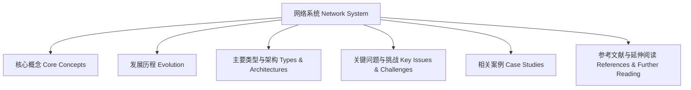

# 知识体系结构图 Knowledge System Architecture Diagram

- 该结构图展示了网络系统知识梳理的主要内容及其逻辑关系。
- This diagram shows the main contents and logical relationships of the knowledge review of network systems.

## 哲学批判 Philosophical Critique

- 体系结构图有助于整体把握知识框架，但需警惕过度简化与结构性偏见。
- Architecture diagrams help grasp the overall knowledge framework, but beware of oversimplification and structural bias.
