# 1.8.8 知识体系结构图

Knowledge Structure Diagram of Network Systems

## 目录 Table of Contents

1. 1 网络系统知识体系结构导图
2. 2 结构逻辑与批判性说明

---

## 1 网络系统知识体系结构导图

```mermaid
graph TD
  A["网络系统 Network Systems"]
  A --> B1["核心概念 Core Concepts"]
  A --> B2["发展历程 Development History"]
  A --> B3["主要类型与架构 Types & Architectures"]
  A --> B4["关键模型与公式 Models & Formulae"]
  A --> B5["关键问题与挑战 Key Issues & Challenges"]
  A --> B6["相关案例 Relevant Cases"]
  A --> B7["学派争鸣与理论批判 Schools & Critique"]
  A --> B8["参考文献与延伸阅读 References"]
  B1 --> C1["节点 Node"]
  B1 --> C2["链路 Link"]
  B1 --> C3["协议 Protocol"]
  B1 --> C4["拓扑 Topology"]
  B1 --> C5["性能指标 Performance"]
  B4 --> D1["图模型 Graph Model"]
  B4 --> D2["排队模型 Queueing Model"]
  B4 --> D3["信息论模型 Information Theory"]
  B4 --> D4["有限状态机 FSM"]
  B4 --> D5["复杂网络模型 Complex Network"]
  B5 --> E1["连通性 Connectivity"]
  B5 --> E2["扩展性 Scalability"]
  B5 --> E3["安全性 Security"]
  B5 --> E4["互操作性 Interoperability"]
  B5 --> E5["管理与自治 Management"]
  B5 --> E6["复杂性 Complexity"]
  B7 --> F1["系统论 Systems Theory"]
  B7 --> F2["复杂网络 Complex Networks"]
  B7 --> F3["信息论 Information Theory"]
  B7 --> F4["STS/ANT"]
  B7 --> F5["算法伦理 Algorithmic Ethics"]
```

## 2 结构逻辑与批判性说明

- 本结构图以“核心定义—理论—推理—证明”为主线，系统展现网络系统知识体系的层次与逻辑。
- 各领域内容相互关联，既强调理论深度，也关注工程实践与批判性反思。
- 结构图便于整体把握知识体系，发现理论空白与批判性改进空间。
