# 1.8.8 知识体系结构图

<!-- TOC START -->

- [1.8.8 知识体系结构图](#188-知识体系结构图)
  - [目录 Table of Contents](#目录-table-of-contents)
  - [1 网络系统知识体系结构导图 | Network System Knowledge Structure Diagram](#1-网络系统知识体系结构导图-network-system-knowledge-structure-diagram)
  - [2 工程应用与国际标准映射 | Engineering Applications & International Standards Mapping](#2-工程应用与国际标准映射-engineering-applications-international-standards-mapping)
  - [3 理论模型与形式化框架 | Theoretical Models & Formal Frameworks](#3-理论模型与形式化框架-theoretical-models-formal-frameworks)
  - [4 知识链条与推理路径 | Knowledge Chains & Reasoning Paths](#4-知识链条与推理路径-knowledge-chains-reasoning-paths)
  - [5 批判性分析与反思 | Critical Analysis & Reflection](#5-批判性分析与反思-critical-analysis-reflection)

<!-- TOC END -->

Knowledge Structure Diagram of Network Systems

## 目录 Table of Contents

- [1.8.8 知识体系结构图](#188-知识体系结构图)
  - [目录 Table of Contents](#目录-table-of-contents)
  - [1 网络系统知识体系结构导图 | Network System Knowledge Structure Diagram](#1-网络系统知识体系结构导图--network-system-knowledge-structure-diagram)
  - [2 工程应用与国际标准映射 | Engineering Applications \& International Standards Mapping](#2-工程应用与国际标准映射--engineering-applications--international-standards-mapping)
  - [3 理论模型与形式化框架 | Theoretical Models \& Formal Frameworks](#3-理论模型与形式化框架--theoretical-models--formal-frameworks)
  - [4 知识链条与推理路径 | Knowledge Chains \& Reasoning Paths](#4-知识链条与推理路径--knowledge-chains--reasoning-paths)
  - [5 批判性分析与反思 | Critical Analysis \& Reflection](#5-批判性分析与反思--critical-analysis--reflection)

---

## 1 网络系统知识体系结构导图 | Network System Knowledge Structure Diagram

```mermaid
graph TD
  A["网络系统 Network Systems"]
  A --> B1["核心概念 Core Concepts"]
  A --> B2["发展历程 Development History"]
  A --> B3["主要类型与架构 Types & Architectures"]
  A --> B4["关键模型与公式 Models & Formulae"]
  A --> B5["关键问题与挑战 Key Issues & Challenges"]
  A --> B6["相关案例 Relevant Cases"]
  A --> B7["学派争鸣与理论批判 Schools & Critique"]
  A --> B8["参考文献与延伸阅读 References"]
  A --> B9["工程应用与国际标准 Engineering & Standards"]
  A --> B10["形式化证明与验证 Formal Proof & Verification"]
  A --> B11["AI辅助与自动化 AI Assistance & Automation"]
  A --> B12["社会伦理与治理 Social Ethics & Governance"]
  
  B1 --> C1["节点 Node"]
  B1 --> C2["链路 Link"]
  B1 --> C3["协议 Protocol"]
  B1 --> C4["拓扑 Topology"]
  B1 --> C5["性能指标 Performance"]
  B1 --> C6["容错与鲁棒性 Fault Tolerance & Robustness"]
  
  B4 --> D1["图模型 Graph Model"]
  B4 --> D2["排队模型 Queueing Model"]
  B4 --> D3["信息论模型 Information Theory"]
  B4 --> D4["有限状态机 FSM"]
  B4 --> D5["复杂网络模型 Complex Network"]
  B4 --> D6["控制论模型 Cybernetics"]
  B4 --> D7["博弈论模型 Game Theory"]
  
  B5 --> E1["连通性 Connectivity"]
  B5 --> E2["扩展性 Scalability"]
  B5 --> E3["安全性 Security"]
  B5 --> E4["互操作性 Interoperability"]
  B5 --> E5["管理与自治 Management"]
  B5 --> E6["复杂性 Complexity"]
  B5 --> E7["可观测性 Observability"]
  B5 --> E8["可控性 Controllability"]
  
  B9 --> F1["TCP/IP协议栈 TCP/IP Stack"]
  B9 --> F2["以太网与WiFi Ethernet & WiFi"]
  B9 --> F3["5G与移动网络 5G & Mobile Networks"]
  B9 --> F4["物联网与边缘计算 IoT & Edge Computing"]
  B9 --> F5["区块链与分布式网络 Blockchain & Distributed Networks"]
  B9 --> F6["量子网络与绿色网络 Quantum & Green Networks"]
  
  B10 --> G1["定理证明 Theorem Proving"]
  B10 --> G2["模型检测 Model Checking"]
  B10 --> G3["符号执行 Symbolic Execution"]
  B10 --> G4["SAT/SMT求解器 SAT/SMT Solvers"]
  
  B11 --> H1["机器学习辅助 Machine Learning Assistance"]
  B11 --> H2["自动化证明生成 Automated Proof Generation"]
  B11 --> H3["跨模态推理 Cross-modal Reasoning"]
  B11 --> H4["可解释AI Explainable AI"]
  
  B12 --> I1["算法公平性 Algorithmic Fairness"]
  B12 --> I2["数据正义 Data Justice"]
  B12 --> I3["自动化决策可追溯性 Automated Decision Traceability"]
  B12 --> I4["AI伦理 AI Ethics"]
  B12 --> I5["社会治理 Social Governance"]
  
  B7 --> J1["系统论 Systems Theory"]
  B7 --> J2["复杂网络 Complex Networks"]
  B7 --> J3["信息论 Information Theory"]
  B7 --> J4["STS/ANT Social-Technical Systems"]
  B7 --> J5["算法伦理 Algorithmic Ethics"]
  B7 --> J6["控制论 Cybernetics"]
  B7 --> J7["博弈论 Game Theory"]
```

## 2 工程应用与国际标准映射 | Engineering Applications & International Standards Mapping

- 中文：
  - **工程应用映射**：将理论概念与实际技术实现（TCP/IP、以太网、5G、物联网、区块链、量子网络）建立对应关系，体现理论与实践的统一。
  - **国际标准映射**：IETF（RFC系列）、IEEE（802系列）、3GPP（5G标准）、ISO/IEC（OSI模型）、ITU-T（电信标准）等国际标准组织推动知识体系的标准化。
  - **技术演进映射**：从传统网络到智能化、绿色化、量子化网络的演进路径，反映技术发展的连续性与创新性。

- EN:
  - **Engineering Application Mapping**: Establishes correspondence between theoretical concepts and actual technical implementations (TCP/IP, Ethernet, 5G, IoT, blockchain, quantum networks), reflecting the unity of theory and practice.
  - **International Standards Mapping**: International standards organizations such as IETF (RFC series), IEEE (802 series), 3GPP (5G standards), ISO/IEC (OSI model), ITU-T (telecommunications standards) promote standardization of the knowledge system.
  - **Technology Evolution Mapping**: Evolution path from traditional networks to intelligent, green, and quantum networks, reflecting the continuity and innovation of technological development.

## 3 理论模型与形式化框架 | Theoretical Models & Formal Frameworks

- 中文：
  - **数学基础**：图论、排队论、信息论、控制论、博弈论等数学工具为网络系统提供形式化建模基础。
  - **形式化框架**：有限状态机、Petri网、π演算、时序逻辑等为协议验证和系统分析提供严格的形式化方法。
  - **复杂系统理论**：复杂网络理论、系统论、混沌理论等为网络系统的复杂性和不可预测性提供理论解释。

- EN:
  - **Mathematical Foundation**: Mathematical tools such as graph theory, queueing theory, information theory, cybernetics, and game theory provide formal modeling foundation for network systems.
  - **Formal Frameworks**: Finite state machines, Petri nets, π-calculus, temporal logic, etc. provide rigorous formal methods for protocol verification and system analysis.
  - **Complex Systems Theory**: Complex network theory, systems theory, chaos theory, etc. provide theoretical explanations for the complexity and unpredictability of network systems.

## 4 知识链条与推理路径 | Knowledge Chains & Reasoning Paths

- 中文：
  - **定义—理论—方法—应用—批判**：从核心概念定义出发，通过理论建模、方法设计、工程应用，最终达到批判性反思的完整知识链条。
  - **多维度推理**：结合数学推理、逻辑推理、实验验证、仿真分析等多种推理方式，确保知识论证的严密性和可靠性。
  - **跨学科融合**：计算机科学、数学、物理学、社会学、哲学等多学科知识的交叉融合，形成网络系统的综合性知识体系。

- EN:
  - **Definition—Theory—Method—Application—Critique**: Complete knowledge chain from core concept definition, through theoretical modeling, method design, engineering application, to critical reflection.
  - **Multi-dimensional Reasoning**: Combines mathematical reasoning, logical reasoning, experimental verification, simulation analysis, and other reasoning methods to ensure rigor and reliability of knowledge argumentation.
  - **Interdisciplinary Integration**: Cross-disciplinary integration of computer science, mathematics, physics, sociology, philosophy, and other disciplines forms a comprehensive knowledge system for network systems.

## 5 批判性分析与反思 | Critical Analysis & Reflection

- 中文：
  - **理论局限性**：现有理论模型在处理网络系统的复杂性、不可预测性、社会技术性等方面的局限性。
  - **工程挑战**：实际工程实现中面临的可扩展性、安全性、互操作性、管理复杂性等挑战。
  - **社会影响**：网络技术发展对社会的深刻影响，包括权力分配、隐私保护、数字鸿沟、算法偏见等问题。
  - **未来展望**：面向智能化、绿色化、量子化、人性化等未来发展趋势的理论创新和技术突破。

- EN:
  - **Theoretical Limitations**: Limitations of existing theoretical models in handling complexity, unpredictability, and socio-technical aspects of network systems.
  - **Engineering Challenges**: Challenges faced in actual engineering implementation including scalability, security, interoperability, and management complexity.
  - **Social Impact**: Profound social impact of network technology development, including power distribution, privacy protection, digital divide, algorithmic bias, and other issues.
  - **Future Prospects**: Theoretical innovation and technological breakthroughs oriented toward intelligent, green, quantum, and humanized future development trends.
