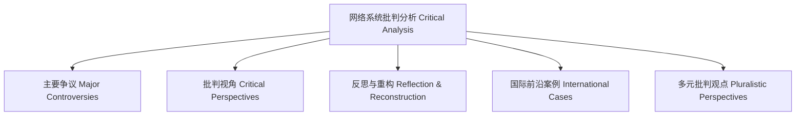

# 批判分析知识图谱 Critical Analysis Knowledge Graph

- 知识图谱揭示了批判分析各主题间的关联与逻辑。
- The knowledge graph reveals the connections and logic among critical analysis topics.

## 哲学批判 Philosophical Critique

- 图谱化有助于梳理复杂议题，但需警惕节点选择与关系设定的主观性。
- Graphical representation helps organize complex issues, but beware of subjectivity in node selection and relationship setting.
