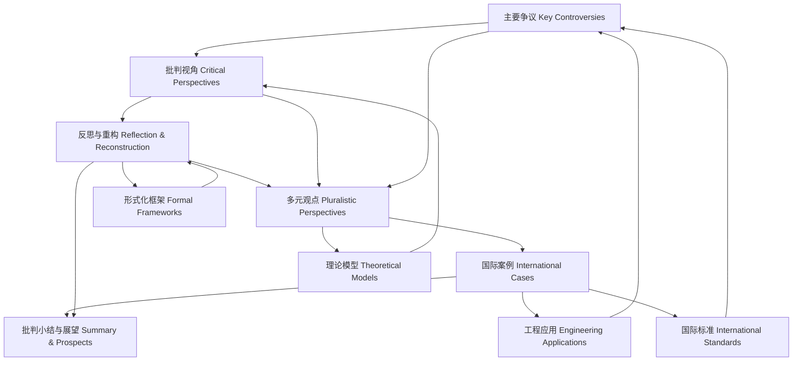

# 8.2.7 批判分析知识图谱

Critical Analysis Knowledge Graph

## 目录 Table of Contents

1. 1 知识图谱结构与核心概念 | Structure & Core Concepts of the Knowledge Graph
2. 2 工程应用与国际标准映射 | Engineering Applications & International Standards Mapping
3. 3 理论模型与形式化框架 | Theoretical Models & Formal Frameworks
4. 4 争议与批判关系链 | Controversy & Critical Relations Chain
5. 5 知识链条与推理路径 | Knowledge Chains & Reasoning Paths
6. 6 可视化导图与结构说明 | Visualization & Structure Explanation
7. 7 批判性分析与反思 | Critical Analysis & Reflection

---

## 1 知识图谱结构与核心概念 | Structure & Core Concepts of the Knowledge Graph

- 中文：
  - **核心结构**：知识图谱以"争议—批判视角—反思重构—多元观点—案例—总结"为主线，节点包括理论、工程、治理、伦理等核心概念。
  - **层次结构**：分为概念层（核心定义）、理论层（批判理论）、方法层（分析工具）、应用层（工程实践）、反思层（批判总结）五个层次。
  - **关系类型**：包括因果关系、逻辑关系、对比关系、演化关系、冲突关系等多种关系类型。

- EN:
  - **Core Structure**: The knowledge graph is organized around the main line of "controversy—critical perspectives—reflection & reconstruction—pluralistic viewpoints—cases—summary", with nodes including core concepts of theory, engineering, governance, and ethics.
  - **Hierarchical Structure**: Divided into five levels: concept level (core definitions), theoretical level (critical theories), methodological level (analysis tools), application level (engineering practice), and reflection level (critical summary).
  - **Relationship Types**: Includes various relationship types such as causal relationships, logical relationships, comparative relationships, evolutionary relationships, and conflict relationships.

## 2 工程应用与国际标准映射 | Engineering Applications & International Standards Mapping

- 中文：
  - **5G技术争议映射**：5G标准制定中的技术路线争议、地缘政治因素、供应链安全等问题在知识图谱中的映射关系。
  - **区块链治理映射**：区块链项目的治理模式争议、环境成本、社会影响等问题与批判分析框架的对应关系。
  - **AI伦理标准映射**：AI伦理标准制定中的文化差异、利益冲突、执行困难等问题在知识图谱中的体现。
  - **数据保护法规映射**：GDPR、CCPA等法规的局限性、执行差异、跨境冲突等问题与批判视角的关联。

- EN:
  - **5G Technology Controversy Mapping**: Mapping relationships of technical route controversies, geopolitical factors, and supply chain security issues in 5G standard setting within the knowledge graph.
  - **Blockchain Governance Mapping**: Correspondence between governance model controversies, environmental costs, and social impacts of blockchain projects and the critical analysis framework.
  - **AI Ethics Standards Mapping**: Embodiment of cultural differences, interest conflicts, and implementation difficulties in AI ethics standard setting within the knowledge graph.
  - **Data Protection Regulations Mapping**: Association between limitations, implementation differences, and cross-border conflicts of regulations like GDPR and CCPA and critical perspectives.

## 3 理论模型与形式化框架 | Theoretical Models & Formal Frameworks

- 中文：
  - **复杂网络理论框架**：复杂网络模型在批判分析中的应用，包括网络结构分析、动力学建模、鲁棒性评估等。
  - **博弈论分析框架**：博弈论在网络争议分析中的应用，包括策略分析、均衡计算、合作机制等。
  - **社会网络分析框架**：社会网络分析在批判分析中的应用，包括权力结构分析、信息流动分析、影响力评估等。
  - **伦理规范形式化框架**：伦理原则的形式化建模，包括价值判断、道德推理、伦理决策等。

- EN:
  - **Complex Network Theory Framework**: Application of complex network models in critical analysis, including network structure analysis, dynamic modeling, and robustness assessment.
  - **Game Theory Analysis Framework**: Application of game theory in network controversy analysis, including strategy analysis, equilibrium calculation, and cooperation mechanisms.
  - **Social Network Analysis Framework**: Application of social network analysis in critical analysis, including power structure analysis, information flow analysis, and influence assessment.
  - **Ethical Norm Formalization Framework**: Formal modeling of ethical principles, including value judgments, moral reasoning, and ethical decision-making.

## 4 争议与批判关系链 | Controversy & Critical Relations Chain

- 中文：
  - **争议节点关联**：争议节点通过批判视角与多元观点相互关联，形成理论与工程、全球与本地、创新与规范等张力链条。
  - **批判视角映射**：不同批判视角（技术决定论、社会建构论、权力批判、伦理批判等）与争议问题的映射关系。
  - **多元观点网络**：不同利益相关者（政府、企业、公民社会、技术社区）的观点网络及其相互关系。
  - **演化关系链**：争议与批判观点的历史演化、发展趋势、影响路径等关系链。

- EN:
  - **Controversy Node Relations**: Controversy nodes are interconnected through critical perspectives and pluralistic viewpoints, forming chains of tension between theory and engineering, global and local, innovation and regulation, etc.
  - **Critical Perspective Mapping**: Mapping relationships between different critical perspectives (technological determinism, social constructivism, power critique, ethical critique, etc.) and controversy issues.
  - **Pluralistic Viewpoint Network**: Viewpoint networks of different stakeholders (government, business, civil society, technical community) and their interrelationships.
  - **Evolutionary Relationship Chain**: Historical evolution, development trends, and influence paths of controversies and critical viewpoints.

## 5 知识链条与推理路径 | Knowledge Chains & Reasoning Paths

- 中文：
  - **定义—理论—方法—应用—批判链条**：每一争议或批判节点均有完整的知识链条，支持系统性批判分析。
  - **多维度推理路径**：包括技术推理、社会推理、经济推理、伦理推理、政治推理等多种推理路径。
  - **证据链构建**：通过数据、案例、理论、实验等多种证据构建完整的论证链条。
  - **逻辑一致性验证**：确保知识链条的逻辑一致性，包括理论逻辑、工程逻辑、治理逻辑的统一。

- EN:
  - **Definition—Theory—Method—Application—Critique Chain**: Each controversy or critical node has a complete knowledge chain supporting systematic critical analysis.
  - **Multi-dimensional Reasoning Paths**: Includes various reasoning paths such as technical reasoning, social reasoning, economic reasoning, ethical reasoning, and political reasoning.
  - **Evidence Chain Construction**: Constructs complete argumentation chains through various evidence such as data, cases, theories, and experiments.
  - **Logical Consistency Verification**: Ensures logical consistency of knowledge chains, including unity of theoretical logic, engineering logic, and governance logic.

## 6 可视化导图与结构说明 | Visualization & Structure Explanation

- 中文：
  - **核心链条**：导图展示了批判分析的核心链条与关系，强调争议、批判、反思、观点、案例、总结的系统性关联。
  - **工程映射**：工程应用与国际标准节点与争议节点的映射关系，体现理论与实践的结合。
  - **理论支撑**：理论模型与形式化框架对批判视角和反思重构的支撑关系。
  - **多维关联**：通过多维度关联展示批判分析的复杂性和系统性。

- EN:
  - **Core Chain**: The diagram shows the core chain and relations of critical analysis, emphasizing the systematic connections among controversies, critique, reflection, perspectives, cases, and summary.
  - **Engineering Mapping**: Mapping relationships between engineering applications and international standards nodes with controversy nodes, reflecting the integration of theory and practice.
  - **Theoretical Support**: Support relationships of theoretical models and formal frameworks for critical perspectives and reflection reconstruction.
  - **Multi-dimensional Relations**: Shows the complexity and systematicity of critical analysis through multi-dimensional relationships.

## 7 批判性分析与反思 | Critical Analysis & Reflection

- 中文：
  - **知识图谱价值**：知识图谱有助于梳理批判分析的逻辑结构，揭示争议与批判的多维关系，促进理论与工程的持续完善。
  - **结构完整性**：通过系统化的知识图谱结构，确保批判分析的完整性和系统性，避免碎片化和片面性。
  - **动态演化性**：知识图谱具有动态演化特性，能够随着理论发展、工程实践、社会变化而不断更新和完善。
  - **应用指导性**：知识图谱为批判分析提供方法论指导，支持多维度、多层次的系统性分析。

- EN:
  - **Knowledge Graph Value**: The knowledge graph helps clarify the logical structure of critical analysis, reveals the multidimensional relations of controversies and critique, and promotes ongoing improvement of theory and engineering.
  - **Structural Completeness**: Ensures the completeness and systematicity of critical analysis through systematic knowledge graph structure, avoiding fragmentation and one-sidedness.
  - **Dynamic Evolution**: The knowledge graph has dynamic evolutionary characteristics, able to continuously update and improve with theoretical development, engineering practice, and social changes.
  - **Application Guidance**: The knowledge graph provides methodological guidance for critical analysis, supporting multi-dimensional and multi-level systematic analysis.
