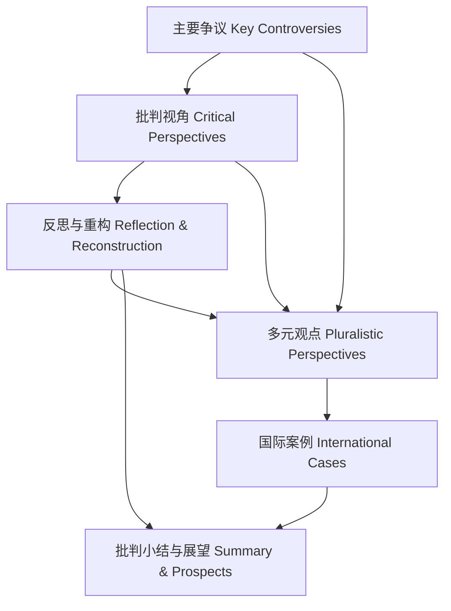

# 8.2.7 批判分析知识图谱

Critical Analysis Knowledge Graph

## 目录 Table of Contents

1. 1 知识图谱结构与核心概念 | Structure & Core Concepts of the Knowledge Graph
2. 2 争议与批判关系链 | Controversy & Critical Relations Chain
3. 3 知识链条与推理路径 | Knowledge Chains & Reasoning Paths
4. 4 可视化导图与结构说明 | Visualization & Structure Explanation
5. 5 批判性分析与反思 | Critical Analysis & Reflection

---

## 1 知识图谱结构与核心概念 | Structure & Core Concepts of the Knowledge Graph

- 中文：
  - 知识图谱以“争议—批判视角—反思重构—多元观点—案例—总结”为主线，节点包括理论、工程、治理、伦理等核心概念。
- EN:
  - The knowledge graph is organized around the main line of "controversy—critical perspectives—reflection & reconstruction—pluralistic viewpoints—cases—summary", with nodes including core concepts of theory, engineering, governance, and ethics.

## 2 争议与批判关系链 | Controversy & Critical Relations Chain

- 中文：
  - 争议节点通过批判视角与多元观点相互关联，形成理论与工程、全球与本地、创新与规范等张力链条。
- EN:
  - Controversy nodes are interconnected through critical perspectives and pluralistic viewpoints, forming chains of tension between theory and engineering, global and local, innovation and regulation, etc.

## 3 知识链条与推理路径 | Knowledge Chains & Reasoning Paths

- 中文：
  - 每一争议或批判节点均有定义、论证、推理、证明、批判等知识链条，支持系统性批判分析。
- EN:
  - Each controversy or critical node has a knowledge chain of definition, argumentation, reasoning, proof, and critique, supporting systematic critical analysis.

## 4 可视化导图与结构说明 | Visualization & Structure Explanation

- 中文：导图展示了批判分析的核心链条与关系，强调争议、批判、反思、观点、案例、总结的系统性关联。
- EN: The diagram shows the core chain and relations of critical analysis, emphasizing the systematic connections among controversies, critique, reflection, perspectives, cases, and summary.

## 5 批判性分析与反思 | Critical Analysis & Reflection

- 中文：
  - 知识图谱有助于梳理批判分析的逻辑结构，揭示争议与批判的多维关系，促进理论与工程的持续完善。
- EN:
  - The knowledge graph helps clarify the logical structure of critical analysis, reveals the multidimensional relations of controversies and critique, and promotes ongoing improvement of theory and engineering.
