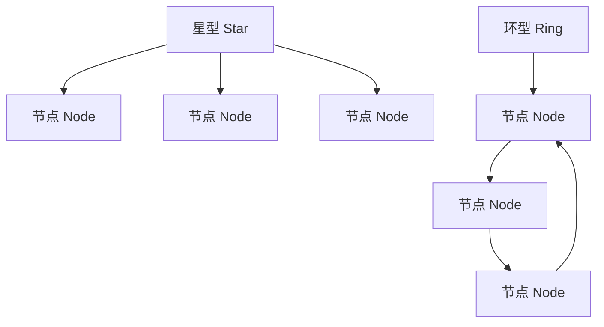

# 结构图与表 Structure Diagrams & Tables

## 典型网络拓扑图 Typical Network Topologies

- 星型拓扑：中心节点连接所有其他节点，易于管理但中心故障风险高。
- Star topology: Central node connects all others, easy to manage but central failure risk.
- 环型拓扑：节点首尾相连，数据沿环传递，容错性较好但扩展性有限。
- Ring topology: Nodes connected in a ring, data circulates, good fault tolerance but limited scalability.

## 结构对比表 Structure Comparison Table

| 拓扑类型 | 英文 | 优点 | 缺点 |
|---|---|---|---|
| 星型 | Star | 易于管理、扩展 | 中心节点故障风险高 |
| 环型 | Ring | 容错性好 | 扩展性有限 |
| 总线型 | Bus | 结构简单、成本低 | 易冲突、带宽有限 |
| 网状型 | Mesh | 高鲁棒性、无单点故障 | 成本高、复杂度大 |

## 哲学批判 Philosophical Critique

- 结构图与表有助于标准化理解，但可能简化了网络的动态性与社会属性。
- Diagrams and tables help standardize understanding, but may oversimplify network dynamics and social attributes.

## 参考文献 References

- [Wikipedia: Network topology](https://en.wikipedia.org/wiki/Network_topology)
