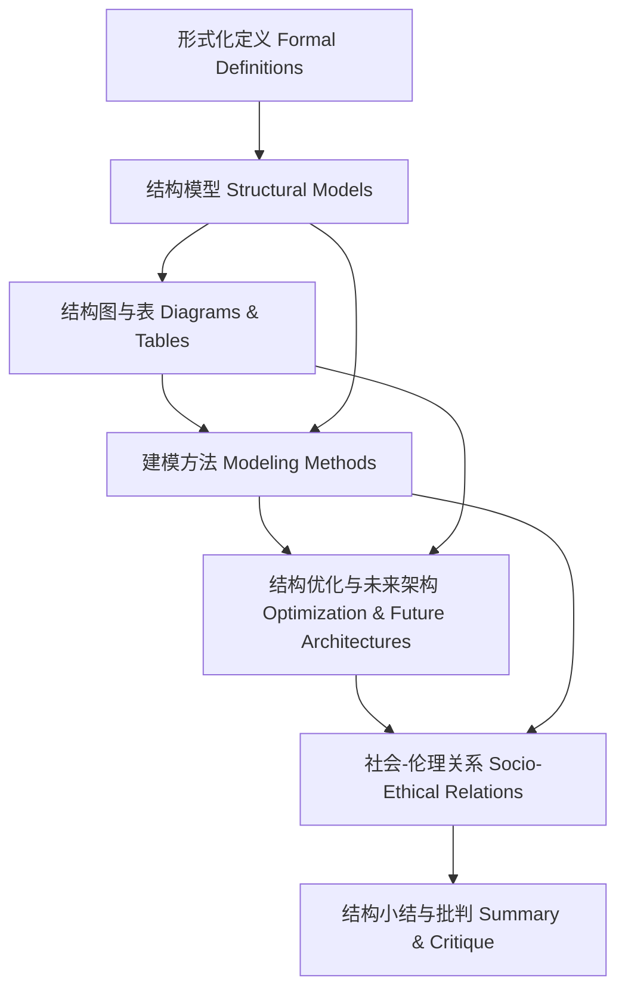

# 8.3.7 结构知识图谱

<!-- TOC START -->

- [8.3.7 结构知识图谱](#837-结构知识图谱)
  - [目录 Table of Contents](#目录-table-of-contents)
  - [1 知识图谱结构与核心概念 | Structure & Core Concepts of the Knowledge Graph](#1-知识图谱结构与核心概念-structure-core-concepts-of-the-knowledge-graph)
  - [2 结构关系链与层次逻辑 | Structural Relations & Hierarchical Logic](#2-结构关系链与层次逻辑-structural-relations-hierarchical-logic)
  - [3 知识链条与推理路径 | Knowledge Chains & Reasoning Paths](#3-知识链条与推理路径-knowledge-chains-reasoning-paths)
  - [4 可视化导图与结构说明 | Visualization & Structure Explanation](#4-可视化导图与结构说明-visualization-structure-explanation)
  - [5 批判性分析与反思 | Critical Analysis & Reflection](#5-批判性分析与反思-critical-analysis-reflection)

<!-- TOC END -->

Structural Knowledge Graph

## 目录 Table of Contents

- [8.3.7 结构知识图谱](#837-结构知识图谱)
  - [目录 Table of Contents](#目录-table-of-contents)
  - [1 知识图谱结构与核心概念 | Structure \& Core Concepts of the Knowledge Graph](#1-知识图谱结构与核心概念--structure--core-concepts-of-the-knowledge-graph)
  - [2 结构关系链与层次逻辑 | Structural Relations \& Hierarchical Logic](#2-结构关系链与层次逻辑--structural-relations--hierarchical-logic)
  - [3 知识链条与推理路径 | Knowledge Chains \& Reasoning Paths](#3-知识链条与推理路径--knowledge-chains--reasoning-paths)
  - [4 可视化导图与结构说明 | Visualization \& Structure Explanation](#4-可视化导图与结构说明--visualization--structure-explanation)
  - [5 批判性分析与反思 | Critical Analysis \& Reflection](#5-批判性分析与反思--critical-analysis--reflection)

---

## 1 知识图谱结构与核心概念 | Structure & Core Concepts of the Knowledge Graph

- 中文：
  - 知识图谱以“形式化定义—结构模型—可视化表达—建模方法—优化与未来架构—社会伦理关系—总结”为主线，节点涵盖拓扑、分层、协议、模块、优化、社会影响等核心概念。
- EN:
  - The knowledge graph is organized around the main line of "formal definitions—structural models—visualization—modeling methods—optimization & future architectures—socio-ethical relations—summary", with nodes covering core concepts such as topology, layering, protocols, modules, optimization, and social impact.

## 2 结构关系链与层次逻辑 | Structural Relations & Hierarchical Logic

- 中文：
  - 各节点通过结构关系链相互关联，体现从抽象定义到工程实现、从结构优化到社会影响的层次递进。
- EN:
  - Nodes are interconnected through structural relation chains, reflecting hierarchical progression from abstract definitions to engineering implementation, and from structural optimization to social impact.

## 3 知识链条与推理路径 | Knowledge Chains & Reasoning Paths

- 中文：
  - 每一结构节点均有定义、论证、推理、证明、批判等知识链条，支持系统性结构分析。
- EN:
  - Each structural node has a knowledge chain of definition, argumentation, reasoning, proof, and critique, supporting systematic structural analysis.

## 4 可视化导图与结构说明 | Visualization & Structure Explanation

- 中文：导图展示了结构知识的核心链条与层次逻辑，强调从定义、模型、表达、方法到优化、社会影响、总结的系统性关联。
- EN: The diagram shows the core chain and hierarchical logic of structural knowledge, emphasizing systematic connections from definitions, models, representations, and methods to optimization, social impact, and summary.

## 5 批判性分析与反思 | Critical Analysis & Reflection

- 中文：
  - 结构知识图谱有助于梳理结构分析的逻辑体系，揭示结构决策对工程与社会的多维影响，促进理论与实践的持续完善。
- EN:
  - The structural knowledge graph helps clarify the logical system of structural analysis, reveals the multidimensional impact of structural decisions on engineering and society, and promotes ongoing improvement of theory and practice.
