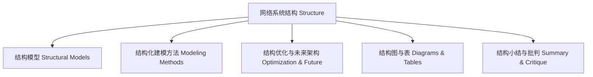

# 结构知识图谱 Structure Knowledge Graph

- 结构知识图谱展示了结构相关主题的层次与联系。
- The structure knowledge graph shows the hierarchy and connections of structure-related topics.

## 哲学批判 Philosophical Critique

- 图谱有助于结构化理解，但结构划分本身即带有理论假设。
- Graphs help structured understanding, but the division of structure itself carries theoretical assumptions.
