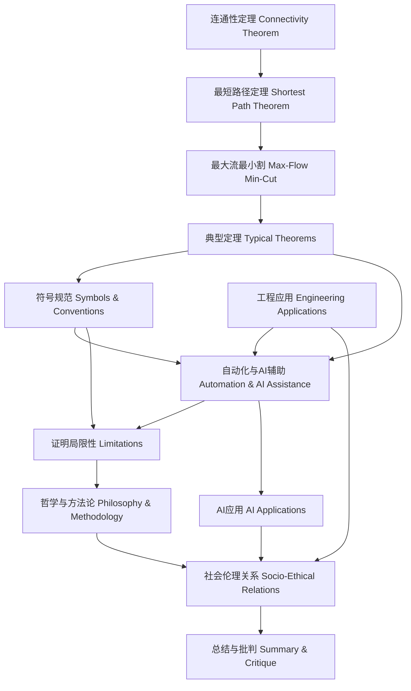

# 8.4.8 证明知识图谱

<!-- TOC START -->

- [8.4.8 证明知识图谱](#848-证明知识图谱)
  - [目录 Table of Contents](#目录-table-of-contents)
  - [1 知识图谱结构与核心概念 | Structure & Core Concepts of the Knowledge Graph](#1-知识图谱结构与核心概念-structure-core-concepts-of-the-knowledge-graph)
  - [2 证明关系链与层次逻辑 | Proof Relations & Hierarchical Logic](#2-证明关系链与层次逻辑-proof-relations-hierarchical-logic)
  - [3 工程与AI应用节点 | Engineering & AI Application Nodes](#3-工程与ai应用节点-engineering-ai-application-nodes)
  - [4 社会伦理与治理节点 | Societal, Ethical & Governance Nodes](#4-社会伦理与治理节点-societal-ethical-governance-nodes)
  - [5 知识链条与推理路径 | Knowledge Chains & Reasoning Paths](#5-知识链条与推理路径-knowledge-chains-reasoning-paths)
  - [6 可视化导图与结构说明 | Visualization & Structure Explanation](#6-可视化导图与结构说明-visualization-structure-explanation)
  - [7 批判性分析与反思 | Critical Analysis & Reflection](#7-批判性分析与反思-critical-analysis-reflection)

<!-- TOC END -->

Proof Knowledge Graph

## 目录 Table of Contents

- [8.4.8 证明知识图谱](#848-证明知识图谱)
  - [目录 Table of Contents](#目录-table-of-contents)
  - [1 知识图谱结构与核心概念 | Structure \& Core Concepts of the Knowledge Graph](#1-知识图谱结构与核心概念--structure--core-concepts-of-the-knowledge-graph)
  - [2 证明关系链与层次逻辑 | Proof Relations \& Hierarchical Logic](#2-证明关系链与层次逻辑--proof-relations--hierarchical-logic)
  - [3 工程与AI应用节点 | Engineering \& AI Application Nodes](#3-工程与ai应用节点--engineering--ai-application-nodes)
  - [4 社会伦理与治理节点 | Societal, Ethical \& Governance Nodes](#4-社会伦理与治理节点--societal-ethical--governance-nodes)
  - [5 知识链条与推理路径 | Knowledge Chains \& Reasoning Paths](#5-知识链条与推理路径--knowledge-chains--reasoning-paths)
  - [6 可视化导图与结构说明 | Visualization \& Structure Explanation](#6-可视化导图与结构说明--visualization--structure-explanation)
  - [7 批判性分析与反思 | Critical Analysis \& Reflection](#7-批判性分析与反思--critical-analysis--reflection)

---

## 1 知识图谱结构与核心概念 | Structure & Core Concepts of the Knowledge Graph

- 中文：
  - 知识图谱以“连通性定理—最短路径定理—最大流最小割—典型定理—符号规范—自动化与AI辅助—局限性—哲学与方法论—社会伦理关系—总结”为主线，节点涵盖网络理论、算法、工程工具、AI辅助、社会影响等核心概念，形成理论—方法—应用—规范—批判的系统链条。
- EN:
  - The knowledge graph is organized around the main line of "connectivity theorem—shortest path theorem—max-flow min-cut—typical theorems—symbolic conventions—automation & AI assistance—limitations—philosophy & methodology—socio-ethical relations—summary", with nodes covering core concepts such as network theory, algorithms, engineering tools, AI assistance, and social impact, forming a systematic chain from theory, method, application, convention to critique.

## 2 证明关系链与层次逻辑 | Proof Relations & Hierarchical Logic

- 中文：
  - 各节点通过证明关系链相互关联，体现从基础定理到工程工具、从理论局限到社会伦理的层次递进，支持系统性知识推理与批判。
- EN:
  - Nodes are interconnected through proof relation chains, reflecting hierarchical progression from basic theorems to engineering tools, and from theoretical limitations to social ethics, supporting systematic knowledge reasoning and critique.

## 3 工程与AI应用节点 | Engineering & AI Application Nodes

- 中文：
  - 工程节点包括协议验证、分布式一致性、网络安全、拓扑优化、调度分配、自动化验证工具、AI辅助证明等，突出理论与工程的深度结合。
- EN:
  - Engineering nodes include protocol verification, distributed consistency, network security, topology optimization, scheduling/allocation, automated verification tools, AI-assisted proof, etc., highlighting the deep integration of theory and engineering.

## 4 社会伦理与治理节点 | Societal, Ethical & Governance Nodes

- 中文：
  - 社会伦理节点涵盖算法公正、数据正义、自动化决策可追溯性、标准化与合规、社会信任与治理等，强调证明在社会治理与伦理规范中的作用。
- EN:
  - Societal and ethical nodes cover algorithmic fairness, data justice, traceability of automated decisions, standardization and compliance, social trust and governance, etc., emphasizing the role of proof in social governance and ethical norms.

## 5 知识链条与推理路径 | Knowledge Chains & Reasoning Paths

- 中文：
  - 每一证明节点均有定义、论证、推理、证明、批判等知识链条，支持系统性证明分析与工程应用。
- EN:
  - Each proof node has a knowledge chain of definition, argumentation, reasoning, proof, and critique, supporting systematic proof analysis and engineering application.

## 6 可视化导图与结构说明 | Visualization & Structure Explanation

- 中文：导图展示了证明知识的核心链条、工程与AI应用节点、社会伦理节点及其层次逻辑，强调理论、工程、AI与社会治理的系统关联。
- EN: The diagram shows the core chain of proof knowledge, engineering & AI application nodes, societal & ethical nodes, and their hierarchical logic, emphasizing the systematic connection of theory, engineering, AI, and social governance.

## 7 批判性分析与反思 | Critical Analysis & Reflection

- 中文：
  - 证明知识图谱有助于梳理理论、方法、工程、AI与社会伦理的多维影响，促进理论与实践的持续完善。但在大规模系统、跨学科协作、伦理冲突等方面仍面临挑战，需持续推动AI辅助、标准化、工程创新与社会治理协同。
- EN:
  - The proof knowledge graph helps clarify the multidimensional impact of theory, methods, engineering, AI, and social ethics, promoting ongoing improvement of theory and practice. However, challenges remain in large-scale systems, interdisciplinary collaboration, and ethical conflicts; ongoing efforts in AI assistance, standardization, engineering innovation, and social governance synergy are needed.
