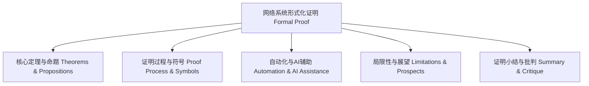

# 证明知识图谱 Proof Knowledge Graph

- 证明知识图谱梳理了理论、方法、工具与批判的关系。
- The proof knowledge graph organizes the relationships among theory, methods, tools, and critique.

## 哲学批判 Philosophical Critique

- 知识图谱提升了理论体系的可视化，但也可能遮蔽理论间的张力与争议。
- Knowledge graphs enhance the visualization of theoretical systems, but may obscure tensions and controversies among theories.
