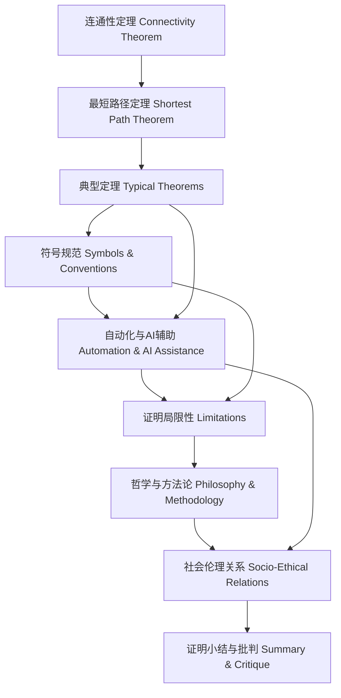

# 8.4.8 证明知识图谱

Proof Knowledge Graph

## 目录 Table of Contents

1. 1 知识图谱结构与核心概念 | Structure & Core Concepts of the Knowledge Graph
2. 2 证明关系链与层次逻辑 | Proof Relations & Hierarchical Logic
3. 3 知识链条与推理路径 | Knowledge Chains & Reasoning Paths
4. 4 可视化导图与结构说明 | Visualization & Structure Explanation
5. 5 批判性分析与反思 | Critical Analysis & Reflection

---

## 1 知识图谱结构与核心概念 | Structure & Core Concepts of the Knowledge Graph

- 中文：
  - 知识图谱以“连通性定理—最短路径定理—典型定理—符号规范—自动化与AI辅助—局限性—哲学与方法论—社会伦理关系—总结”为主线，节点涵盖网络理论、算法、工具、社会影响等核心概念。
- EN:
  - The knowledge graph is organized around the main line of "connectivity theorem—shortest path theorem—typical theorems—symbolic conventions—automation & AI assistance—limitations—philosophy & methodology—socio-ethical relations—summary", with nodes covering core concepts such as network theory, algorithms, tools, and social impact.

## 2 证明关系链与层次逻辑 | Proof Relations & Hierarchical Logic

- 中文：
  - 各节点通过证明关系链相互关联，体现从基础定理到工程工具、从理论局限到社会伦理的层次递进。
- EN:
  - Nodes are interconnected through proof relation chains, reflecting hierarchical progression from basic theorems to engineering tools, and from theoretical limitations to social ethics.

## 3 知识链条与推理路径 | Knowledge Chains & Reasoning Paths

- 中文：
  - 每一证明节点均有定义、论证、推理、证明、批判等知识链条，支持系统性证明分析。
- EN:
  - Each proof node has a knowledge chain of definition, argumentation, reasoning, proof, and critique, supporting systematic proof analysis.

## 4 可视化导图与结构说明 | Visualization & Structure Explanation

- 中文：导图展示了证明知识的核心链条与层次逻辑，强调从基础定理、工具、局限到社会伦理的系统性关联。
- EN: The diagram shows the core chain and hierarchical logic of proof knowledge, emphasizing systematic connections from basic theorems, tools, and limitations to social ethics.

## 5 批判性分析与反思 | Critical Analysis & Reflection

- 中文：
  - 证明知识图谱有助于梳理证明分析的逻辑体系，揭示理论、工具与社会伦理的多维影响，促进理论与实践的持续完善。
- EN:
  - The proof knowledge graph helps clarify the logical system of proof analysis, reveals the multidimensional impact of theory, tools, and social ethics, and promotes ongoing improvement of theory and practice.
