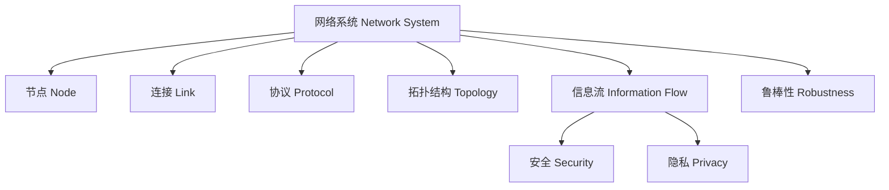

# 概念图 Concept Map

## 网络系统核心概念关系图

- 哲学批判：概念图揭示了网络系统的多维度本质，既有技术结构，也有社会与伦理维度。
- The concept map reveals the multidimensional nature of network systems, including technical, social, and ethical dimensions.

## 参考文献 References

- [Wikipedia: Concept map](https://en.wikipedia.org/wiki/Concept_map)
