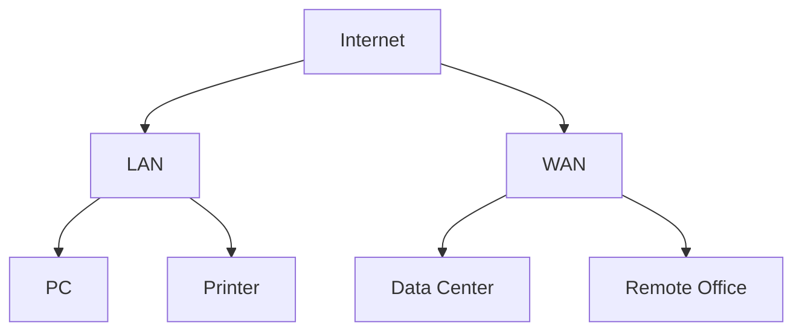

# 典型图表与可视化 Typical Charts & Visualizations

## 网络拓扑可视化 Network Topology Visualization

- 可视化有助于理解网络结构、流量分布与瓶颈。
- Visualization helps understand network structure, traffic distribution, and bottlenecks.

## 协议栈分层图 Protocol Stack Layer Diagram

| 层级 | 英文 | 典型协议 |
|---|---|---|
| 应用层 | Application | HTTP, FTP, SMTP |
| 传输层 | Transport | TCP, UDP |
| 网络层 | Network | IP, ICMP |
| 数据链路层 | Data Link | Ethernet, PPP |
| 物理层 | Physical | 光纤, 双绞线 |

## 哲学批判 Philosophical Critique

- 图表与可视化提升了知识的直观性与传播力，但也可能简化复杂性、遮蔽动态与社会维度。
- Charts and visualizations enhance intuitiveness and communication, but may oversimplify complexity and obscure dynamics and social dimensions.

## 参考文献 References

- [Wikipedia: Network topology](https://en.wikipedia.org/wiki/Network_topology)
- [Wikipedia: OSI model](https://en.wikipedia.org/wiki/OSI_model)
