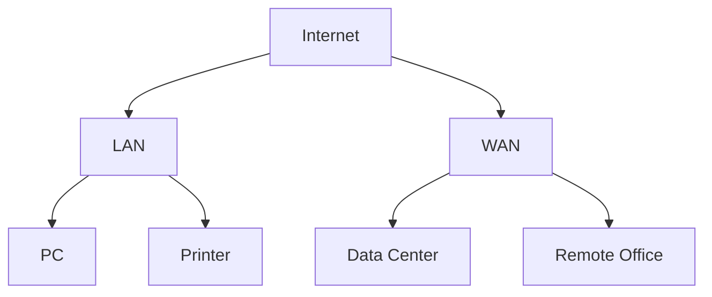

# 典型图表与可视化 Typical Charts & Visualizations

<!-- TOC START -->

- [典型图表与可视化 Typical Charts & Visualizations](#典型图表与可视化-typical-charts--visualizations)
  - [网络拓扑可视化 Network Topology Visualization](#网络拓扑可视化-network-topology-visualization)
  - [协议栈分层图 Protocol Stack Layer Diagram](#协议栈分层图-protocol-stack-layer-diagram)
  - [哲学批判 Philosophical Critique](#哲学批判-philosophical-critique)
  - [参考文献 References](#参考文献-references)
  - [国际权威来源链接 | International Authoritative Sources](#国际权威来源链接--international-authoritative-sources)

<!-- TOC END -->

## 网络拓扑可视化 Network Topology Visualization

```mermaid
graph TD;
  A[Internet] --> B[LAN]
  A --> C[WAN]
  B --> D[PC]
  B --> E[Printer]
  C --> F[Data Center]
  C --> G[Remote Office]
```

- 可视化有助于理解网络结构、流量分布与瓶颈。
- Visualization helps understand network structure, traffic distribution, and bottlenecks.

## 协议栈分层图 Protocol Stack Layer Diagram

| 层级 | 英文 | 典型协议 |
|---|---|---|
| 应用层 | Application | HTTP, FTP, SMTP |
| 传输层 | Transport | TCP, UDP |
| 网络层 | Network | IP, ICMP |
| 数据链路层 | Data Link | Ethernet, PPP |
| 物理层 | Physical | 光纤, 双绞线 |

## 哲学批判 Philosophical Critique

- 图表与可视化提升了知识的直观性与传播力，但也可能简化复杂性、遮蔽动态与社会维度。
- Charts and visualizations enhance intuitiveness and communication, but may oversimplify complexity and obscure dynamics and social dimensions.

## 参考文献 References

- [Wikipedia: Network topology](https://en.wikipedia.org/wiki/Network_topology)
- [Wikipedia: OSI model](https://en.wikipedia.org/wiki/OSI_model)

## 国际权威来源链接 | International Authoritative Sources

- [ISO/IEC 7498-1 — OSI Basic Reference Model](https://www.iso.org/standard/20269.html)
- [RFC 1122 — Host Requirements](https://datatracker.ietf.org/doc/html/rfc1122)
- [RFC 791 — Internet Protocol (IPv4)](https://datatracker.ietf.org/doc/html/rfc791)
- [RFC 793 — Transmission Control Protocol (TCP)](https://datatracker.ietf.org/doc/html/rfc793)
- [RFC 8200 — Internet Protocol, Version 6 (IPv6)](https://datatracker.ietf.org/doc/html/rfc8200)
- [RFC 5681 — TCP Congestion Control](https://datatracker.ietf.org/doc/html/rfc5681)
- [IEEE 802.3-2022 — Ethernet](https://standards.ieee.org/standard/802.3-2022.html)
- [IEEE 802.1Q-2024 — VLAN Bridging](https://standards.ieee.org/standard/802.1Q-2024.html)
- [NIST AI Risk Management Framework](https://www.nist.gov/itl/ai-risk-management-framework)
- [EU AI Act](https://eur-lex.europa.eu/legal-content/EN/TXT/?uri=CELEX:32024R1689)
- [Newman, M. E. J. (2010). Networks: An Introduction. Oxford University Press.](https://academic.oup.com/book/5324)
- [RFC 9110 — HTTP Semantics](https://datatracker.ietf.org/doc/html/rfc9110)
