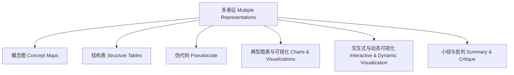

# 多表征知识图谱 Knowledge Graph of Multiple Representations

- 知识图谱展示了多表征方法的多样性及其内在联系。
- The knowledge graph shows the diversity and internal connections of multiple representation methods.

## 哲学批判 Philosophical Critique

- 图谱化有助于梳理表达方式，但需警惕形式多样性掩盖内容深度。
- Graphical representation helps organize expression methods, but beware that diversity of forms may obscure content depth.
