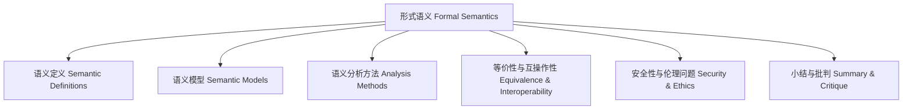

# 语义知识图谱 Knowledge Graph of Semantics

- 语义知识图谱梳理了定义、模型、方法、挑战等主题的逻辑关系。
- The semantics knowledge graph organizes the logical relationships among definitions, models, methods, and challenges.

## 哲学批判 Philosophical Critique

- 图谱化提升了语义体系的条理性，但需警惕过度结构化带来的僵化。
- Graphical representation enhances the orderliness of the semantic system, but beware of rigidity caused by over-structuring.
