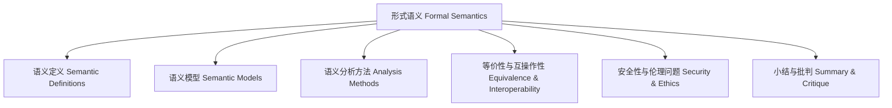

# 语义知识图谱 Knowledge Graph of Semantics

<!-- TOC START -->

- [语义知识图谱 Knowledge Graph of Semantics](#语义知识图谱-knowledge-graph-of-semantics)
  - [哲学批判 Philosophical Critique](#哲学批判-philosophical-critique)
  - [国际权威来源链接 | International Authoritative Sources](#国际权威来源链接-international-authoritative-sources)

<!-- TOC END -->

```mermaid
graph TD;
  F[形式语义 Formal Semantics]
  F1[语义定义 Semantic Definitions]
  F2[语义模型 Semantic Models]
  F3[语义分析方法 Analysis Methods]
  F4[等价性与互操作性 Equivalence & Interoperability]
  F5[安全性与伦理问题 Security & Ethics]
  F6[小结与批判 Summary & Critique]
  F --> F1
  F --> F2
  F --> F3
  F --> F4
  F --> F5
  F --> F6
```

- 语义知识图谱梳理了定义、模型、方法、挑战等主题的逻辑关系。
- The semantics knowledge graph organizes the logical relationships among definitions, models, methods, and challenges.

## 哲学批判 Philosophical Critique

- 图谱化提升了语义体系的条理性，但需警惕过度结构化带来的僵化。
- Graphical representation enhances the orderliness of the semantic system, but beware of rigidity caused by over-structuring.

## 国际权威来源链接 | International Authoritative Sources

- [ISO/IEC 7498-1 — OSI Basic Reference Model](https://www.iso.org/standard/20269.html)
- [RFC 1122 — Host Requirements](https://datatracker.ietf.org/doc/html/rfc1122)
- [RFC 791 — Internet Protocol (IPv4)](https://datatracker.ietf.org/doc/html/rfc791)
- [RFC 793 — Transmission Control Protocol (TCP)](https://datatracker.ietf.org/doc/html/rfc793)
- [RFC 8200 — Internet Protocol, Version 6 (IPv6)](https://datatracker.ietf.org/doc/html/rfc8200)
- [RFC 5681 — TCP Congestion Control](https://datatracker.ietf.org/doc/html/rfc5681)
- [IEEE 802.3-2022 — Ethernet](https://standards.ieee.org/standard/802.3-2022.html)
- [IEEE 802.1Q-2024 — VLAN Bridging](https://standards.ieee.org/standard/802.1Q-2024.html)
- [NIST SP 800-207 — Zero Trust Architecture](https://csrc.nist.gov/publications/detail/sp/800/207/final)
- [NIST Cybersecurity Framework](https://www.nist.gov/cyberframework)
- [RFC 8446 — TLS 1.3](https://datatracker.ietf.org/doc/html/rfc8446)
- [NIST AI Risk Management Framework](https://www.nist.gov/itl/ai-risk-management-framework)
- [EU AI Act](https://eur-lex.europa.eu/legal-content/EN/TXT/?uri=CELEX:32024R1689)
- [RFC 793 — TCP Specification](https://datatracker.ietf.org/doc/html/rfc793)
- [RFC 9000 — QUIC Transport Protocol](https://datatracker.ietf.org/doc/html/rfc9000)
