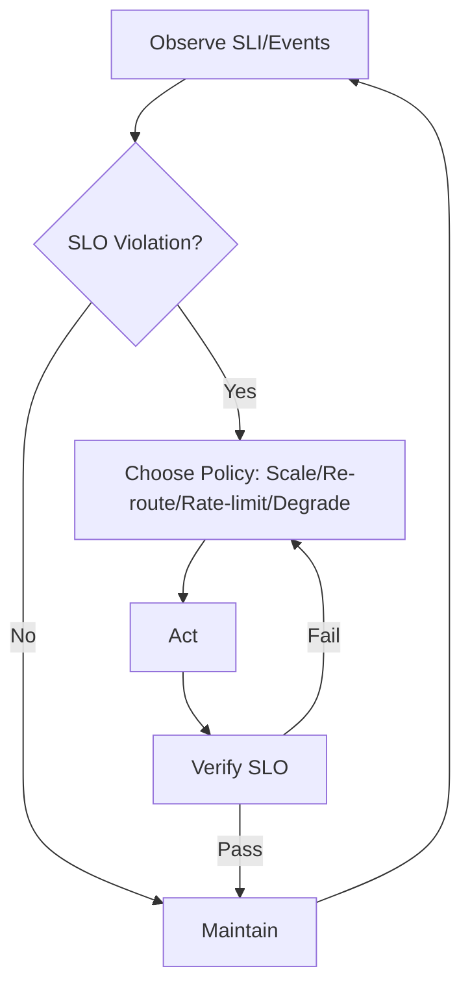

# 8.7.2 运行时监控与动态分析

Runtime Monitoring & Dynamic Analysis

## 目录 Table of Contents

1. 1 运行时监控与动态分析定义 | Definition of Runtime Monitoring & Dynamic Analysis
2. 2 主要方法 | Main Methods
3. 3 工程应用与案例 | Engineering Applications & Cases
4. 4 知识论证与推理 | Knowledge Argumentation & Reasoning
5. 5 形式化分析与证明 | Formal Analysis & Proof
6. 6 批判性分析 | Critical Analysis
7. 7 SLI/SLO 体系与监控闭环 | SLI/SLO Framework & Control Loop
8. 8 策略选择矩阵 | Strategy Selection Matrix
9. 9 伪代码示例 | Pseudocode Examples

---

## 1 运行时监控与动态分析定义 | Definition of Runtime Monitoring & Dynamic Analysis

- **定义 Definition**：
  - 中文：运行时监控与动态分析是指在系统实际运行过程中，通过自动化工具实时收集、分析和验证系统行为与状态的方法体系。
  - EN: Runtime monitoring and dynamic analysis refer to the methodological system of collecting, analyzing, and verifying system behaviors and states in real time during actual system operation using automated tools.

## 2 主要方法 | Main Methods

- 中文：
  - 日志分析、事件追踪、时序逻辑监控、异常检测、动态插桩、分布式监控、实时告警等。
- EN:
  - Log analysis, event tracing, temporal logic monitoring, anomaly detection, dynamic instrumentation, distributed monitoring, real-time alerting, etc.

## 3 工程应用与案例 | Engineering Applications & Cases

- 中文：
  - 网络协议运行时验证、分布式系统健康监控、入侵检测与响应、性能瓶颈定位等。
  - 典型案例：HTTP服务运行时监控、分布式数据库动态一致性分析、云平台安全事件追踪等。
- EN:
  - Runtime verification of network protocols, health monitoring of distributed systems, intrusion detection and response, performance bottleneck localization, etc.
  - Typical cases: Runtime monitoring of HTTP services, dynamic consistency analysis of distributed databases, security event tracing in cloud platforms, etc.

## 4 知识论证与推理 | Knowledge Argumentation & Reasoning

- 中文：
  - 运行时监控与动态分析提升了系统可观测性与故障响应能力，是高可用性与安全性工程的基础。
  - 采用归纳与演绎推理，结合实际工程案例。
- EN:
  - Runtime monitoring and dynamic analysis improve system observability and fault response capability, forming the foundation of high availability and security engineering.
  - Use of inductive and deductive reasoning, combined with real engineering cases.

## 5 形式化分析与证明 | Formal Analysis & Proof

- 中文：
  - 利用时序逻辑监控、自动化告警、异常检测算法等工具对系统运行时行为的正确性与安全性进行分析与证明。
- EN:
  - Use of temporal logic monitoring, automated alerting, anomaly detection algorithms, etc., for analysis and proof of correctness and security of system runtime behaviors.

## 6 批判性分析 | Critical Analysis

- 中文：
  - 运行时监控与动态分析提升了系统的可维护性与安全性，但在大规模系统中面临数据量大、实时性与误报率等挑战，需结合智能分析与分层监控。
- EN:
  - Runtime monitoring and dynamic analysis enhance system maintainability and security, but face challenges such as large data volume, real-time requirements, and false positive rates in large-scale systems; should be combined with intelligent analysis and hierarchical monitoring.

## 7 SLI/SLO 体系与监控闭环 | SLI/SLO Framework & Control Loop

- 中文（SLI 示例）：丢包率、P99 往返时延、吞吐、重传率、重路由事件、错误预算消耗率、连接建立失败率。
- EN (SLI examples): packet loss, P99 RTT, throughput, retransmission rate, reroute events, error budget burn rate, connection failure rate.
- 中文（SLO 示例）：丢包率 < 0.1%，P99 RTT < 120ms，可用性 ≥ 99.95%。
- EN (SLO examples): packet loss < 0.1%, P99 RTT < 120ms, availability ≥ 99.95%.
- 闭环 Loop：观测 Observe → 诊断 Diagnose → 策略 Policy（扩缩/重路由/限流/降级）→ 执行 Act → 验证 Verify → 回滚/巩固 Rollback/Consolidate。



## 8 策略选择矩阵 | Strategy Selection Matrix

| 场景 Scenario | 首选策略 Primary | 备选 Alternative | 权衡 Trade-off |
|---|---|---|---|
| 链路拥塞 Link Congestion | 重路由+ECN Re-route+ECN | 限流 Rate-limit | 路径稳定 vs 吞吐 |
| 脉冲攻击 Pulse Attack | 限速+黑洞 Rate-limit+Blackhole | 清洗 Scrubbing | 误杀 vs 可用 |
| 边缘抖动 Edge Jitter | 亲和放置+缓存 Affinity+Cache | 重试 Retry | 一致性 vs 时延 |
| 跨域瓶颈 Inter-domain | 本地化/压缩 Localize/Compress | 复制 Replication | 成本 vs 冗余 |

## 9 伪代码示例 | Pseudocode Examples

```pseudo
// ALERT: RTT升高 + 丢包上升 -> 重路由优先
if P99_RTT > target && loss_rate > threshold:
    if exist_low_congestion_path():
        re_route()
    else:
        rate_limit(priority=low)

// 动态阈值：以窗口回归的自适应阈值
theta = baseline_window(past=10min).p95 * alpha
if metric > theta:
    trigger_alert()
```
