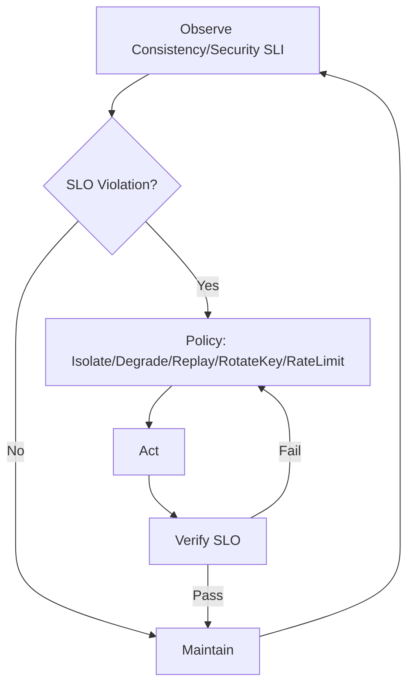

# 8.7.3 运行时一致性与安全性


<!-- TOC START -->

- [8.7.3 运行时一致性与安全性](#873-运行时一致性与安全性)
  - [目录 Table of Contents](#目录-table-of-contents)
  - [1 运行时一致性与安全性定义 | Definition of Runtime Consistency & Security](#1-运行时一致性与安全性定义-definition-of-runtime-consistency-security)
  - [2 主要理论与方法 | Main Theories & Methods](#2-主要理论与方法-main-theories-methods)
  - [3 工程应用与案例 | Engineering Applications & Cases](#3-工程应用与案例-engineering-applications-cases)
  - [4 知识论证与推理 | Knowledge Argumentation & Reasoning](#4-知识论证与推理-knowledge-argumentation-reasoning)
  - [5 形式化分析与证明 | Formal Analysis & Proof](#5-形式化分析与证明-formal-analysis-proof)
  - [6 批判性分析 | Critical Analysis](#6-批判性分析-critical-analysis)
  - [7 SLI/SLO 体系与治理闭环 | SLI/SLO Framework & Control Loop](#7-slislo-体系与治理闭环-slislo-framework-control-loop)
  - [8 策略选择矩阵 | Strategy Selection Matrix](#8-策略选择矩阵-strategy-selection-matrix)
  - [9 伪代码示例 | Pseudocode Examples](#9-伪代码示例-pseudocode-examples)

<!-- TOC END -->

Runtime Consistency & Security

## 目录 Table of Contents

1. 1 运行时一致性与安全性定义 | Definition of Runtime Consistency & Security
2. 2 主要理论与方法 | Main Theories & Methods
3. 3 工程应用与案例 | Engineering Applications & Cases
4. 4 知识论证与推理 | Knowledge Argumentation & Reasoning
5. 5 形式化分析与证明 | Formal Analysis & Proof
6. 6 批判性分析 | Critical Analysis
7. 7 SLI/SLO 体系与治理闭环 | SLI/SLO Framework & Control Loop
8. 8 策略选择矩阵 | Strategy Selection Matrix
9. 9 伪代码示例 | Pseudocode Examples

---

## 1 运行时一致性与安全性定义 | Definition of Runtime Consistency & Security

- **定义 Definition**：
  - 中文：运行时一致性是指系统在实际运行过程中各组件状态与行为保持逻辑一致，无违背协议规范。运行时安全性是指系统在运行中能有效防御攻击、检测异常并保障数据与服务安全。
  - EN: Runtime consistency refers to the logical consistency of component states and behaviors during actual system operation, without violating protocol specifications. Runtime security means the system can effectively defend against attacks, detect anomalies, and ensure data and service security during operation.

## 2 主要理论与方法 | Main Theories & Methods

- 中文：
  - 一致性协议（如Paxos、Raft）、分布式事务、运行时访问控制、动态安全策略、异常检测与响应、实时加密与认证等。
- EN:
  - Consistency protocols (e.g., Paxos, Raft), distributed transactions, runtime access control, dynamic security policies, anomaly detection and response, real-time encryption and authentication, etc.

## 3 工程应用与案例 | Engineering Applications & Cases

- 中文：
  - 分布式数据库运行时一致性保障、云平台动态安全防护、入侵检测系统、实时访问控制与加密等。
  - 典型案例：Raft协议运行时一致性分析、云服务动态安全策略、分布式系统异常检测与响应等。
- EN:
  - Runtime consistency assurance in distributed databases, dynamic security protection in cloud platforms, intrusion detection systems, real-time access control and encryption, etc.
  - Typical cases: Runtime consistency analysis of Raft protocol, dynamic security policies in cloud services, anomaly detection and response in distributed systems, etc.

## 4 知识论证与推理 | Knowledge Argumentation & Reasoning

- 中文：
  - 运行时一致性与安全性是高可用性与可靠性系统的核心，直接影响服务质量与用户信任。
  - 采用归纳与演绎推理，结合实际工程案例。
- EN:
  - Runtime consistency and security are core to highly available and reliable systems, directly affecting service quality and user trust.
  - Use of inductive and deductive reasoning, combined with real engineering cases.

## 5 形式化分析与证明 | Formal Analysis & Proof

- 中文：
  - 利用模型检测、异常检测算法、实时安全验证等工具对系统运行时一致性与安全性进行分析与证明。
- EN:
  - Use of model checking, anomaly detection algorithms, real-time security verification, etc., for analysis and proof of runtime consistency and security of systems.

## 6 批判性分析 | Critical Analysis

- 中文：
  - 运行时一致性与安全性提升了系统的健壮性与抗攻击能力，但在大规模分布式环境下面临复杂性、实时性与误报率等挑战，需结合智能检测与分层防护。
- EN:
  - Runtime consistency and security enhance system robustness and attack resistance, but face challenges such as complexity, real-time requirements, and false positive rates in large-scale distributed environments; should be combined with intelligent detection and layered protection.

## 7 SLI/SLO 体系与治理闭环 | SLI/SLO Framework & Control Loop

- 中文（SLI 示例）：线性一致读失败率、复制滞后、冲突率、P99 提交延迟、异常登录/扫描事件、错误预算消耗率。
- EN (SLI examples): linearizable read failure rate, replication lag, conflict rate, P99 commit latency, abnormal login/scan events, error budget burn rate.
- 中文（SLO 示例）：复制滞后 < 100ms、P99 提交 < 200ms、一致读成功率 ≥ 99.9%、0 高危告警未处置时长 < 5min。
- EN (SLO examples): replication lag < 100ms, P99 commit < 200ms, linearizable read success ≥ 99.9%, no untreated critical alerts > 5min.
- 闭环 Loop：观测 → 诊断（一致性/安全根因）→ 策略（隔离/降级/重放/密钥轮换/限流）→ 执行 → 验证 → 回滚/巩固。



## 8 策略选择矩阵 | Strategy Selection Matrix

| 场景 Scenario | 首选策略 Primary | 备选 Alternative | 权衡 Trade-off |
|---|---|---|---|
| 复制滞后升高 Replication Lag | 减少写放大+优先复制 | 读降级到从一致性 | 一致性 vs 可用 |
| 冲突激增 Conflicts | 序列化/乐观转悲观 | 重放与合并 | 吞吐 vs 延迟 |
| 可疑流量 Suspicious | 限速+验证码 | 阻断/IP黑名单 | 误伤 vs 防护 |
| 凭据泄露 Credential Leak | 密钥轮换+会话失效 | 风险控制 | 可用 vs 安全 |

## 9 伪代码示例 | Pseudocode Examples

```pseudo
// 一致性：复制滞后阈值
if replication_lag > lag_threshold:
    暂缓读的线性一致性
    提升复制优先级

// 安全：异常登录阈值
if abnormal_login_rate > theta:
    触发二次验证
    限速(可疑来源)
```
