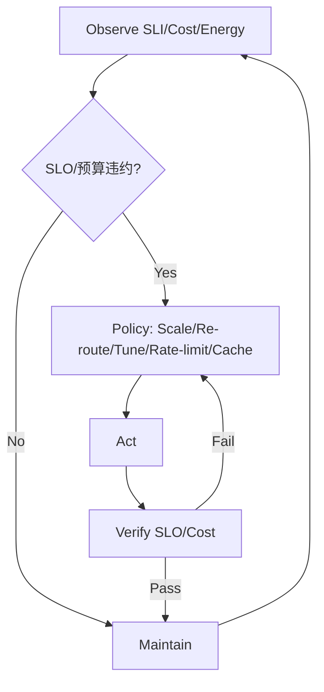

# 8.7.4 运行时优化与自适应机制


<!-- TOC START -->

- [8.7.4 运行时优化与自适应机制](#874-运行时优化与自适应机制)
  - [目录 Table of Contents](#目录-table-of-contents)
  - [1 运行时优化与自适应机制定义 | Definition of Runtime Optimization & Adaptive Mechanisms](#1-运行时优化与自适应机制定义-definition-of-runtime-optimization-adaptive-mechanisms)
  - [2 主要机制与方法 | Main Mechanisms & Methods](#2-主要机制与方法-main-mechanisms-methods)
  - [3 工程应用与案例 | Engineering Applications & Cases](#3-工程应用与案例-engineering-applications-cases)
  - [4 知识论证与推理 | Knowledge Argumentation & Reasoning](#4-知识论证与推理-knowledge-argumentation-reasoning)
  - [5 形式化分析与证明 | Formal Analysis & Proof](#5-形式化分析与证明-formal-analysis-proof)
  - [6 批判性分析 | Critical Analysis](#6-批判性分析-critical-analysis)
  - [7 SLI/SLO 体系与优化闭环 | SLI/SLO Framework & Optimization Loop](#7-slislo-体系与优化闭环-slislo-framework-optimization-loop)
  - [8 策略选择矩阵 | Strategy Selection Matrix](#8-策略选择矩阵-strategy-selection-matrix)
  - [9 伪代码示例 | Pseudocode Examples](#9-伪代码示例-pseudocode-examples)

<!-- TOC END -->

Runtime Optimization & Adaptive Mechanisms

## 目录 Table of Contents

1. 1 运行时优化与自适应机制定义 | Definition of Runtime Optimization & Adaptive Mechanisms
2. 2 主要机制与方法 | Main Mechanisms & Methods
3. 3 工程应用与案例 | Engineering Applications & Cases
4. 4 知识论证与推理 | Knowledge Argumentation & Reasoning
5. 5 形式化分析与证明 | Formal Analysis & Proof
6. 6 批判性分析 | Critical Analysis
7. 7 SLI/SLO 体系与优化闭环 | SLI/SLO Framework & Optimization Loop
8. 8 策略选择矩阵 | Strategy Selection Matrix
9. 9 伪代码示例 | Pseudocode Examples

---

## 1 运行时优化与自适应机制定义 | Definition of Runtime Optimization & Adaptive Mechanisms

- **定义 Definition**：
  - 中文：运行时优化与自适应机制是指系统在实际运行过程中根据环境变化、负载波动等动态调整资源分配、参数配置与行为策略，以提升性能与鲁棒性的方法体系。
  - EN: Runtime optimization and adaptive mechanisms refer to the methodological system by which a system dynamically adjusts resource allocation, parameter configuration, and behavioral strategies during actual operation in response to environmental changes and load fluctuations, to improve performance and robustness.

## 2 主要机制与方法 | Main Mechanisms & Methods

- 中文：
  - 动态负载均衡、自适应路由、弹性伸缩、实时参数调优、故障自愈、AI驱动自适应控制等。
- EN:
  - Dynamic load balancing, adaptive routing, elastic scaling, real-time parameter tuning, self-healing, AI-driven adaptive control, etc.

## 3 工程应用与案例 | Engineering Applications & Cases

- 中文：
  - 云平台弹性伸缩、SDN自适应流量调度、分布式系统自愈、AI驱动网络优化等。
  - 典型案例：Kubernetes弹性伸缩、SDN控制器自适应流量调度、AI优化的网络自愈机制等。
- EN:
  - Elastic scaling in cloud platforms, adaptive traffic scheduling in SDN, self-healing in distributed systems, AI-driven network optimization, etc.
  - Typical cases: Elastic scaling in Kubernetes, adaptive traffic scheduling in SDN controllers, AI-optimized network self-healing mechanisms, etc.

## 4 知识论证与推理 | Knowledge Argumentation & Reasoning

- 中文：
  - 运行时优化与自适应机制提升了系统的性能、鲁棒性与资源利用率，是现代网络系统智能化的基础。
  - 采用归纳与演绎推理，结合实际工程案例。
- EN:
  - Runtime optimization and adaptive mechanisms improve system performance, robustness, and resource utilization, forming the foundation of intelligent modern network systems.
  - Use of inductive and deductive reasoning, combined with real engineering cases.

## 5 形式化分析与证明 | Formal Analysis & Proof

- 中文：
  - 利用性能建模、控制理论、AI算法等工具对优化与自适应机制的有效性与稳定性进行分析与证明。
- EN:
  - Use of performance modeling, control theory, AI algorithms, etc., for analysis and proof of the effectiveness and stability of optimization and adaptive mechanisms.

## 6 批判性分析 | Critical Analysis

- 中文：
  - 运行时优化与自适应机制提升了系统智能化与自管理能力，但在复杂环境下面临策略冲突、收敛性与可解释性等挑战，需结合工程验证与多层次优化。
- EN:
  - Runtime optimization and adaptive mechanisms enhance system intelligence and self-management, but face challenges such as policy conflicts, convergence, and interpretability in complex environments; should be combined with engineering validation and multi-level optimization.

## 7 SLI/SLO 体系与优化闭环 | SLI/SLO Framework & Optimization Loop

- 中文（SLI 示例）：P99 RTT、吞吐、丢包、重传、ECN 标记率、错误预算消耗率、能效（性能/瓦）。
- EN (SLI examples): P99 RTT, throughput, loss, retransmission, ECN mark rate, error budget burn, performance-per-watt.
- 中文（SLO 示例）：P99 < 120ms、丢包 < 0.1%、可用性 ≥ 99.95%、能效提升 ≥ 20%。
- EN (SLO examples): P99 < 120ms, loss < 0.1%, availability ≥ 99.95%, ≥20% energy efficiency improvement.
- 闭环 Loop：观测 → 诊断（瓶颈/成本/能效）→ 策略（伸缩/重路由/参数/限流/缓存）→ 执行 → 验证 → 回滚。



## 8 策略选择矩阵 | Strategy Selection Matrix

| 场景 Scenario | 首选策略 Primary | 备选 Alternative | 权衡 Trade-off |
|---|---|---|---|
| 突发高峰 Burst | 水平扩容+限流 Scale+Rate-limit | 短期垂直扩容 Vertical Scale | 成本 vs SLA |
| 链路拥塞 Congestion | 重路由+ECN Re-route+ECN | 压缩/本地化 Compress/Localize | 稳定性 vs 吞吐 |
| 成本超标 Cost | 夜间缩容+本地化 | 合并批处理 | 成本 vs 延迟 |
| 能效不足 Energy | 动态频率+绿色路由 | 低优先关闭 | 能耗 vs 可用 |

## 9 伪代码示例 | Pseudocode Examples

```pseudo
// 预测驱动伸缩
if forecast(load, 10min) > upper:
    scale_out()
elif forecast(load, 10min) < lower:
    scale_in()

// ECN/队列联合优化
if ECN_mark_rate 上升 且 队列长度上升:
    调整AQM参数
    启用压缩或本地化
```
