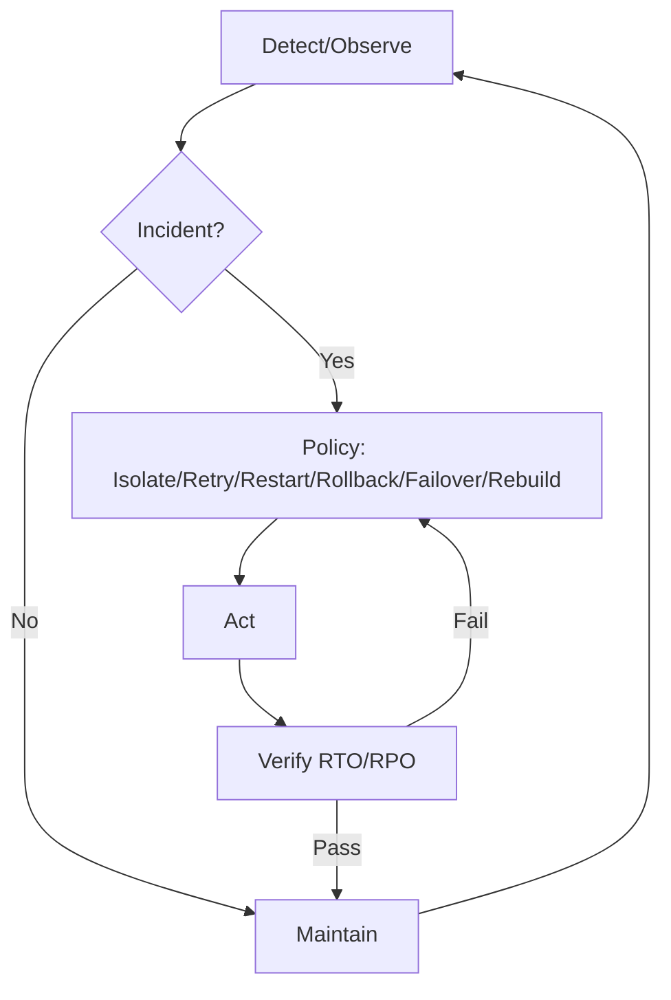

# 8.7.5 运行时异常与故障恢复

Runtime Exceptions & Fault Recovery

## 目录 Table of Contents

1. 1 运行时异常与故障恢复定义 | Definition of Runtime Exceptions & Fault Recovery
2. 2 主要机制与方法 | Main Mechanisms & Methods
3. 3 工程应用与案例 | Engineering Applications & Cases
4. 4 知识论证与推理 | Knowledge Argumentation & Reasoning
5. 5 形式化分析与证明 | Formal Analysis & Proof
6. 6 批判性分析 | Critical Analysis
7. 7 SLI/SLO 体系与恢复闭环 | SLI/SLO Framework & Recovery Loop
8. 8 策略选择矩阵 | Strategy Selection Matrix
9. 9 伪代码示例 | Pseudocode Examples

---

## 1 运行时异常与故障恢复定义 | Definition of Runtime Exceptions & Fault Recovery

- **定义 Definition**：
  - 中文：运行时异常是指系统在实际运行过程中出现的非预期错误或异常状态。故障恢复是指系统在发生异常或故障后，通过自动或人工机制恢复正常服务与数据一致性的过程。
  - EN: Runtime exceptions refer to unexpected errors or abnormal states occurring during actual system operation. Fault recovery is the process by which a system restores normal service and data consistency after an exception or failure, through automatic or manual mechanisms.

## 2 主要机制与方法 | Main Mechanisms & Methods

- 中文：
  - 异常检测与告警、自动重试、检查点与回滚、冗余与备份、故障转移、分布式一致性恢复、人工干预等。
- EN:
  - Exception detection and alerting, automatic retry, checkpointing and rollback, redundancy and backup, failover, distributed consistency recovery, manual intervention, etc.

## 3 工程应用与案例 | Engineering Applications & Cases

- 中文：
  - 云平台高可用架构、分布式数据库故障恢复、网络服务自动重启、数据一致性回滚等。
  - 典型案例：Kubernetes故障自愈、分布式存储系统多副本恢复、云服务自动故障转移等。
- EN:
  - High-availability architecture in cloud platforms, fault recovery in distributed databases, automatic restart of network services, data consistency rollback, etc.
  - Typical cases: Self-healing in Kubernetes, multi-replica recovery in distributed storage systems, automatic failover in cloud services, etc.

## 4 知识论证与推理 | Knowledge Argumentation & Reasoning

- 中文：
  - 运行时异常与故障恢复机制是保障系统高可用性与业务连续性的关键，直接影响用户体验与数据安全。
  - 采用归纳与演绎推理，结合实际工程案例。
- EN:
  - Runtime exception and fault recovery mechanisms are key to ensuring high availability and business continuity, directly affecting user experience and data security.
  - Use of inductive and deductive reasoning, combined with real engineering cases.

## 5 形式化分析与证明 | Formal Analysis & Proof

- 中文：
  - 利用异常检测算法、故障恢复协议、数据一致性验证等工具对系统恢复能力与正确性进行分析与证明。
- EN:
  - Use of exception detection algorithms, fault recovery protocols, data consistency verification, etc., for analysis and proof of system recovery capability and correctness.

## 6 批判性分析 | Critical Analysis

- 中文：
  - 运行时异常与故障恢复机制提升了系统的鲁棒性与可靠性，但在大规模分布式环境下面临检测延迟、恢复一致性与资源消耗等挑战，需结合智能调度与多层次容错机制。
- EN:
  - Runtime exception and fault recovery mechanisms enhance system robustness and reliability, but face challenges such as detection latency, recovery consistency, and resource consumption in large-scale distributed environments; should be combined with intelligent scheduling and multi-level fault tolerance mechanisms.

## 7 SLI/SLO 体系与恢复闭环 | SLI/SLO Framework & Recovery Loop

- 中文（SLI 示例）：MTTR、MTBF、故障率、P99 恢复时延、误报/漏报率、数据恢复点目标 RPO、数据恢复时间目标 RTO。
- EN (SLI examples): MTTR, MTBF, failure rate, P99 recovery latency, false-positive/false-negative rate, RPO, RTO.
- 中文（SLO 示例）：RTO ≤ 5min、RPO ≤ 1min、关键服务可用性 ≥ 99.95%。
- EN (SLO examples): RTO ≤ 5min, RPO ≤ 1min, availability of critical services ≥ 99.95%.
- 闭环 Loop：观测 → 诊断（故障定位）→ 策略（隔离/重试/重启/回滚/切换/重建）→ 执行 → 验证 → 回滚/巩固。



## 8 策略选择矩阵 | Strategy Selection Matrix

| 场景 Scenario | 首选策略 Primary | 备选 Alternative | 权衡 Trade-off |
|---|---|---|---|
| 单节点故障 Single-node | 重启/迁移 Restart/Migrate | 隔离+自愈 Isolate+Heal | 恢复速度 vs 稳定 |
| 多副本故障 Multi-replica | 读降级+回放 Read-degrade+Replay | 只读模式 Read-only | 一致性 vs 可用 |
| 配置回退 Config | 回滚 Rollback | 灰度切换 Canary | 风险 vs 时间 |
| 数据损坏 Data Corrupt | 备份恢复 Restore | 逻辑修复 Repair | RPO vs 数据丢失 |

## 9 伪代码示例 | Pseudocode Examples

```pseudo
// 探活失败 -> 重启/迁移
if liveness_failures >= N:
    restart()
    if node_unhealthy:
        migrate_to_healthy()

// RPO/RTO 校验
if rto > rto_target or rpo > rpo_target:
    escalate_incident()
```
