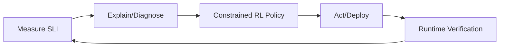

# 8.7.6 运行时语义的前沿挑战与发展趋势

Frontier Challenges & Trends of Runtime Semantics

## 目录 Table of Contents

1. 1 前沿挑战定义 | Definition of Frontier Challenges
2. 2 主要挑战与难题 | Main Challenges & Problems
3. 3 前沿方向与发展趋势 | Frontier Directions & Trends
4. 4 工程创新与应用 | Engineering Innovations & Applications
5. 5 知识论证与批判性分析 | Knowledge Argumentation & Critical Analysis
6. 6 研究议题与路线 | Research Topics & Roadmap
7. 7 伪代码与通用闭环 | Pseudocode & Generic Loop

---

## 1 前沿挑战定义 | Definition of Frontier Challenges

- **定义 Definition**：
  - 中文：运行时语义的前沿挑战是指在大规模、异构、智能化网络系统中，动态行为建模、实时监控与自适应等方面面临的理论与工程难题。
  - EN: Frontier challenges of runtime semantics refer to the theoretical and engineering problems faced in dynamic behavior modeling, real-time monitoring, and adaptation in large-scale, heterogeneous, and intelligent network systems.

## 2 主要挑战与难题 | Main Challenges & Problems

- 中文：
  - 状态空间爆炸、实时性与一致性冲突、异构系统集成、智能化异常检测、自动化自愈、可解释性与可验证性等。
- EN:
  - State space explosion, conflicts between real-time and consistency, heterogeneous system integration, intelligent anomaly detection, automated self-healing, interpretability and verifiability, etc.

## 3 前沿方向与发展趋势 | Frontier Directions & Trends

- 中文：
  - AI驱动的运行时分析、分层与分布式监控、跨域自适应机制、可解释性增强、自动化故障恢复、数字孪生与仿真等。
- EN:
  - AI-driven runtime analysis, hierarchical and distributed monitoring, cross-domain adaptive mechanisms, enhanced interpretability, automated fault recovery, digital twin and simulation, etc.

## 4 工程创新与应用 | Engineering Innovations & Applications

- 中文：
  - 智能运维平台、云原生自愈系统、分布式实时监控、AI辅助异常检测与响应、数字孪生网络仿真等。
- EN:
  - Intelligent operation and maintenance platforms, cloud-native self-healing systems, distributed real-time monitoring, AI-assisted anomaly detection and response, digital twin network simulation, etc.

## 5 知识论证与批判性分析 | Knowledge Argumentation & Critical Analysis

- 中文：
  - 运行时语义的前沿挑战推动了理论创新与工程实践，但也带来复杂性、可扩展性与安全性等新问题，需持续推进跨学科融合与智能化发展。
- EN:
  - Frontier challenges of runtime semantics drive theoretical innovation and engineering practice, but also bring new issues such as complexity, scalability, and security, requiring continuous interdisciplinary integration and intelligent development.

## 6 研究议题与路线 | Research Topics & Roadmap

- 中文（议题 Topics）：
  - SLI/SLO 可解释优化、约束强化学习调度、运行时验证（RV）与 CI/CD 融合、SLO 语义化策略语言、跨域自适应能效优化、零信任运行时安全。
- EN (Topics):
  - Interpretable SLI/SLO optimization, constrained RL scheduling, RV with CI/CD, semantic SLO policy language, cross-domain adaptive energy optimization, zero-trust runtime security.



## 7 伪代码与通用闭环 | Pseudocode & Generic Loop

```pseudo
// Research loop: SLO-aware policy synthesis
while true:
    slis = observe()
    root_causes = explain(slis)
    policy = synthesize_policy(root_causes, constraints)
    act(policy)
    assert runtime_verify(spec) // RV/Model-check-in-the-loop
```
