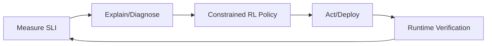

# 8.7.6 运行时语义的前沿挑战与发展趋势


<!-- TOC START -->

- [8.7.6 运行时语义的前沿挑战与发展趋势](#876-运行时语义的前沿挑战与发展趋势)
  - [目录 Table of Contents](#目录-table-of-contents)
  - [1 前沿挑战定义 | Definition of Frontier Challenges](#1-前沿挑战定义--definition-of-frontier-challenges)
  - [2 主要挑战与难题 | Main Challenges & Problems](#2-主要挑战与难题--main-challenges--problems)
  - [3 前沿方向与发展趋势 | Frontier Directions & Trends](#3-前沿方向与发展趋势--frontier-directions--trends)
  - [4 工程创新与应用 | Engineering Innovations & Applications](#4-工程创新与应用--engineering-innovations--applications)
  - [5 知识论证与批判性分析 | Knowledge Argumentation & Critical Analysis](#5-知识论证与批判性分析--knowledge-argumentation--critical-analysis)
  - [6 研究议题与路线 | Research Topics & Roadmap](#6-研究议题与路线--research-topics--roadmap)
  - [7 伪代码与通用闭环 | Pseudocode & Generic Loop](#7-伪代码与通用闭环--pseudocode--generic-loop)
  - [国际权威来源链接 | International Authoritative Sources](#国际权威来源链接--international-authoritative-sources)

<!-- TOC END -->

Frontier Challenges & Trends of Runtime Semantics

## 目录 Table of Contents

- [8.7.6 运行时语义的前沿挑战与发展趋势](#876-运行时语义的前沿挑战与发展趋势)
  - [目录 Table of Contents](#目录-table-of-contents)
  - [1 前沿挑战定义 | Definition of Frontier Challenges](#1-前沿挑战定义--definition-of-frontier-challenges)
  - [2 主要挑战与难题 | Main Challenges \& Problems](#2-主要挑战与难题--main-challenges--problems)
  - [3 前沿方向与发展趋势 | Frontier Directions \& Trends](#3-前沿方向与发展趋势--frontier-directions--trends)
  - [4 工程创新与应用 | Engineering Innovations \& Applications](#4-工程创新与应用--engineering-innovations--applications)
  - [5 知识论证与批判性分析 | Knowledge Argumentation \& Critical Analysis](#5-知识论证与批判性分析--knowledge-argumentation--critical-analysis)
  - [6 研究议题与路线 | Research Topics \& Roadmap](#6-研究议题与路线--research-topics--roadmap)
  - [7 伪代码与通用闭环 | Pseudocode \& Generic Loop](#7-伪代码与通用闭环--pseudocode--generic-loop)

---

## 1 前沿挑战定义 | Definition of Frontier Challenges

- **定义 Definition**：
  - 中文：运行时语义的前沿挑战是指在大规模、异构、智能化网络系统中，动态行为建模、实时监控与自适应等方面面临的理论与工程难题。
  - EN: Frontier challenges of runtime semantics refer to the theoretical and engineering problems faced in dynamic behavior modeling, real-time monitoring, and adaptation in large-scale, heterogeneous, and intelligent network systems.

## 2 主要挑战与难题 | Main Challenges & Problems

- 中文：
  - 状态空间爆炸、实时性与一致性冲突、异构系统集成、智能化异常检测、自动化自愈、可解释性与可验证性等。
- EN:
  - State space explosion, conflicts between real-time and consistency, heterogeneous system integration, intelligent anomaly detection, automated self-healing, interpretability and verifiability, etc.

## 3 前沿方向与发展趋势 | Frontier Directions & Trends

- 中文：
  - AI驱动的运行时分析、分层与分布式监控、跨域自适应机制、可解释性增强、自动化故障恢复、数字孪生与仿真等。
- EN:
  - AI-driven runtime analysis, hierarchical and distributed monitoring, cross-domain adaptive mechanisms, enhanced interpretability, automated fault recovery, digital twin and simulation, etc.

## 4 工程创新与应用 | Engineering Innovations & Applications

- 中文：
  - 智能运维平台、云原生自愈系统、分布式实时监控、AI辅助异常检测与响应、数字孪生网络仿真等。
- EN:
  - Intelligent operation and maintenance platforms, cloud-native self-healing systems, distributed real-time monitoring, AI-assisted anomaly detection and response, digital twin network simulation, etc.

## 5 知识论证与批判性分析 | Knowledge Argumentation & Critical Analysis

- 中文：
  - 运行时语义的前沿挑战推动了理论创新与工程实践，但也带来复杂性、可扩展性与安全性等新问题，需持续推进跨学科融合与智能化发展。
- EN:
  - Frontier challenges of runtime semantics drive theoretical innovation and engineering practice, but also bring new issues such as complexity, scalability, and security, requiring continuous interdisciplinary integration and intelligent development.

## 6 研究议题与路线 | Research Topics & Roadmap

- 中文（议题 Topics）：
  - SLI/SLO 可解释优化、约束强化学习调度、运行时验证（RV）与 CI/CD 融合、SLO 语义化策略语言、跨域自适应能效优化、零信任运行时安全。
- EN (Topics):
  - Interpretable SLI/SLO optimization, constrained RL scheduling, RV with CI/CD, semantic SLO policy language, cross-domain adaptive energy optimization, zero-trust runtime security.


```mermaid
flowchart LR
    A[Measure SLI] --> B[Explain/Diagnose]
    B --> C[Constrained RL Policy]
    C --> D[Act/Deploy]
    D --> E[Runtime Verification]
    E --> A
```

## 7 伪代码与通用闭环 | Pseudocode & Generic Loop

```pseudo
// Research loop: SLO-aware policy synthesis
while true:
    slis = observe()
    root_causes = explain(slis)
    policy = synthesize_policy(root_causes, constraints)
    act(policy)
    assert runtime_verify(spec) // RV/Model-check-in-the-loop
```

## 国际权威来源链接 | International Authoritative Sources

- [ISO/IEC 7498-1 — OSI Basic Reference Model](https://www.iso.org/standard/20269.html)
- [RFC 1122 — Host Requirements](https://datatracker.ietf.org/doc/html/rfc1122)
- [RFC 791 — Internet Protocol (IPv4)](https://datatracker.ietf.org/doc/html/rfc791)
- [RFC 793 — Transmission Control Protocol (TCP)](https://datatracker.ietf.org/doc/html/rfc793)
- [RFC 8200 — Internet Protocol, Version 6 (IPv6)](https://datatracker.ietf.org/doc/html/rfc8200)
- [RFC 5681 — TCP Congestion Control](https://datatracker.ietf.org/doc/html/rfc5681)
- [IEEE 802.3-2022 — Ethernet](https://standards.ieee.org/standard/802.3-2022.html)
- [IEEE 802.1Q-2024 — VLAN Bridging](https://standards.ieee.org/standard/802.1Q-2024.html)
- [NIST SP 800-207 — Zero Trust Architecture](https://csrc.nist.gov/publications/detail/sp/800/207/final)
- [NIST Cybersecurity Framework](https://www.nist.gov/cyberframework)
- [RFC 8446 — TLS 1.3](https://datatracker.ietf.org/doc/html/rfc8446)
- [NIST AI Risk Management Framework](https://www.nist.gov/itl/ai-risk-management-framework)
- [EU AI Act](https://eur-lex.europa.eu/legal-content/EN/TXT/?uri=CELEX:32024R1689)
- [RFC 793 — TCP Specification](https://datatracker.ietf.org/doc/html/rfc793)
- [RFC 9000 — QUIC Transport Protocol](https://datatracker.ietf.org/doc/html/rfc9000)
