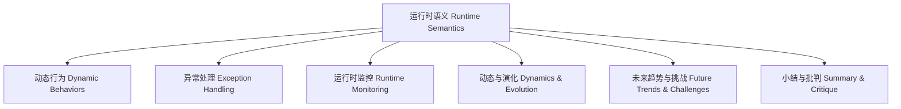

# 运行时语义知识图谱 Knowledge Graph of Runtime Semantics

<!-- TOC START -->

- [运行时语义知识图谱 Knowledge Graph of Runtime Semantics](#运行时语义知识图谱-knowledge-graph-of-runtime-semantics)
  - [哲学批判 Philosophical Critique](#哲学批判-philosophical-critique)

<!-- TOC END -->

- 运行时语义知识图谱揭示了动态、异常、监控、演化等主题的关联。
- The runtime semantics knowledge graph reveals the connections among dynamics, exceptions, monitoring, evolution, and other topics.

## 哲学批判 Philosophical Critique

- 图谱化有助于梳理运行时复杂性，但需警惕对多维挑战的简化。
- Graphical representation helps organize runtime complexity, but beware of oversimplifying multidimensional challenges.
