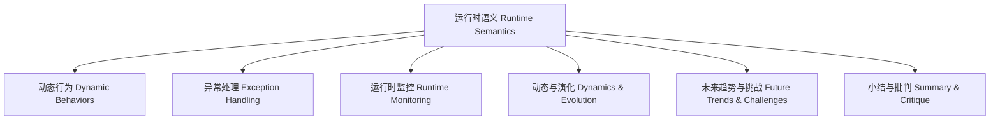

# 运行时语义知识图谱 Knowledge Graph of Runtime Semantics

<!-- TOC START -->

- [运行时语义知识图谱 Knowledge Graph of Runtime Semantics](#运行时语义知识图谱-knowledge-graph-of-runtime-semantics)
  - [哲学批判 Philosophical Critique](#哲学批判-philosophical-critique)
  - [国际权威来源链接 | International Authoritative Sources](#国际权威来源链接--international-authoritative-sources)

<!-- TOC END -->

```mermaid
graph TD;
  G[运行时语义 Runtime Semantics]
  G1[动态行为 Dynamic Behaviors]
  G2[异常处理 Exception Handling]
  G3[运行时监控 Runtime Monitoring]
  G4[动态与演化 Dynamics & Evolution]
  G5[未来趋势与挑战 Future Trends & Challenges]
  G6[小结与批判 Summary & Critique]
  G --> G1
  G --> G2
  G --> G3
  G --> G4
  G --> G5
  G --> G6
```

- 运行时语义知识图谱揭示了动态、异常、监控、演化等主题的关联。
- The runtime semantics knowledge graph reveals the connections among dynamics, exceptions, monitoring, evolution, and other topics.

## 哲学批判 Philosophical Critique

- 图谱化有助于梳理运行时复杂性，但需警惕对多维挑战的简化。
- Graphical representation helps organize runtime complexity, but beware of oversimplifying multidimensional challenges.

## 国际权威来源链接 | International Authoritative Sources

- [ISO/IEC 7498-1 — OSI Basic Reference Model](https://www.iso.org/standard/20269.html)
- [RFC 1122 — Host Requirements](https://datatracker.ietf.org/doc/html/rfc1122)
- [RFC 791 — Internet Protocol (IPv4)](https://datatracker.ietf.org/doc/html/rfc791)
- [RFC 793 — Transmission Control Protocol (TCP)](https://datatracker.ietf.org/doc/html/rfc793)
- [RFC 8200 — Internet Protocol, Version 6 (IPv6)](https://datatracker.ietf.org/doc/html/rfc8200)
- [RFC 5681 — TCP Congestion Control](https://datatracker.ietf.org/doc/html/rfc5681)
- [IEEE 802.3-2022 — Ethernet](https://standards.ieee.org/standard/802.3-2022.html)
- [IEEE 802.1Q-2024 — VLAN Bridging](https://standards.ieee.org/standard/802.1Q-2024.html)
- [NIST AI Risk Management Framework](https://www.nist.gov/itl/ai-risk-management-framework)
- [EU AI Act](https://eur-lex.europa.eu/legal-content/EN/TXT/?uri=CELEX:32024R1689)
- [RFC 793 — TCP Specification](https://datatracker.ietf.org/doc/html/rfc793)
- [RFC 9000 — QUIC Transport Protocol](https://datatracker.ietf.org/doc/html/rfc9000)
- [ISO/IEC 7498-1 — OSI Basic Reference Model](https://www.iso.org/standard/20269.html)
- [RFC 793 — TCP State Machine](https://datatracker.ietf.org/doc/html/rfc793)
- [RFC 9000 — QUIC Connection State Machine](https://datatracker.ietf.org/doc/html/rfc9000)
