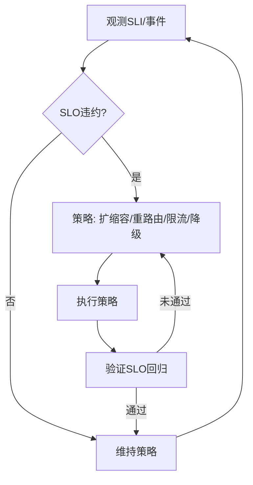

# 网络系统运行时语义


<!-- TOC START -->

- [网络系统运行时语义](#网络系统运行时语义)
  - [概述](#概述)
  - [目录结构](#目录结构)
  - [核心概念](#核心概念)
    - [运行时行为](#运行时行为)
    - [调度模型](#调度模型)
    - [语义建模](#语义建模)
  - [SLO/SLI 驱动的运行时闭环](#slosli-驱动的运行时闭环)
  - [Mermaid 运行时治理闭环](#mermaid-运行时治理闭环)
  - [伪代码示例](#伪代码示例)
  - [策略选择矩阵（示例）](#策略选择矩阵示例)
  - [学习目标](#学习目标)
  - [应用领域](#应用领域)
  - [相关资源](#相关资源)
  - [实践项目](#实践项目)

<!-- TOC END -->

## 概述

网络系统运行时语义研究网络系统在运行过程中的行为特征、状态转换、资源调度和动态特性，为网络系统的运行时行为分析和优化提供理论基础。

## 目录结构

- **8.7.1 运行时语义定义与类型** - 网络系统运行时语义的基本定义和类型
- **8.7.2 运行时监控与动态分析** - 网络系统的运行时监控和动态分析
- **8.7.3 运行时一致性与安全性** - 运行时的一致性和安全性保证
- **8.7.4 运行时优化与自适应机制** - 运行时的优化和自适应机制
- **8.7.5 运行时异常与故障恢复** - 运行时异常处理和故障恢复
- **8.7.6 运行时语义的前沿挑战与发展趋势** - 运行时语义的发展趋势和挑战

## 核心概念

### 运行时行为

- **网络状态**：网络系统在不同状态间的转换规律
- **流量调度**：网络流量的动态调度机制
- **协议行为**：网络协议的运行时行为
- **服务质量**：网络服务质量的保证机制

### 调度模型

- **流量调度**：网络流量的调度策略和算法
- **带宽分配**：网络带宽的动态分配
- **路由优化**：网络路由的优化策略
- **负载均衡**：网络负载的均衡分配

### 语义建模

- **网络语义**：网络操作的语义定义
- **协议语义**：网络协议的语义描述
- **流量语义**：网络流量的语义建模
- **服务语义**：网络服务的语义定义

## SLO/SLI 驱动的运行时闭环

- SLI：丢包率、P99 往返时延、吞吐、重传率、重路由事件、错误预算消耗率。
- SLO：如丢包率 < 0.1%、P99 RTT < 120ms、可用性 99.95%。
- 闭环：观测 → 诊断 → 策略选择（扩缩/重路由/限流/降级）→ 执行 → 验证 → 回滚/巩固。

## Mermaid 运行时治理闭环



## 伪代码示例

```pseudo
// 链路重路由与速率限制
if P99_RTT > 目标 或 丢包率 > 阈值:
    if 存在低拥塞路径: 重路由()
    else: 启用限流(基于优先级)

// 带宽自适应分配
if 队列长度持续上升 且 丢包率上升:
    动态调整(队列/速率/ECN)
```

## 策略选择矩阵（示例）

| 场景 | 首选策略 | 备选 | 权衡 |
|---|---|---|---|
| 链路拥塞 | 重路由 + ECN | 限流 | 路径稳定性 vs. 吞吐 |
| DDoS 脉冲 | 速率限制 + 黑洞 | 清洗/调度隔离 | 误杀与可用性 |
| 边缘抖动 | 拓扑亲和 + 缓存 | 重试/回退 | 一致性与时延 |
| 跨域瓶颈 | 本地化/压缩 | 复制策略优化 | 成本与冗余 |

## 学习目标

1. **理解网络系统运行时语义的基本概念**
2. **掌握网络系统的运行时行为建模方法**
3. **学会分析和设计网络调度算法**
4. **了解形式化验证技术在网络系统中的应用**
5. **掌握网络系统的监控和优化机制**
6. **理解网络系统的异常处理和故障恢复**

## 应用领域

- **互联网基础设施**
- **数据中心网络**
- **移动通信网络**
- **物联网网络**
- **软件定义网络**
- **网络虚拟化**

## 相关资源

- **经典文献**：《Computer Networks》、《Network Science》
- **学术期刊**：IEEE Transactions on Networking、ACM Computing Surveys
- **会议论文**：SIGCOMM、INFOCOM、ICDCS等顶级会议
- **在线资源**：网络协议文档、网络分析工具

## 实践项目

1. **网络调度器实现**：实现基本的网络流量调度算法
2. **带宽管理系统**：设计网络带宽的动态管理
3. **路由优化系统**：实现网络路由的优化策略
4. **网络监控平台**：构建网络系统的监控平台
