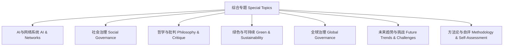

# 综合专题批判性知识地图与未来行动框架 Critical Knowledge Map & Future Action Framework for Special Topics

<!-- TOC START -->

- [综合专题批判性知识地图与未来行动框架 Critical Knowledge Map & Future Action Framework for Special Topics](#综合专题批判性知识地图与未来行动框架-critical-knowledge-map-future-action-framework-for-special-topics)
  - [批判性知识地图 Critical Knowledge Map](#批判性知识地图-critical-knowledge-map)
  - [未来行动框架 Future Action Framework](#未来行动框架-future-action-framework)
  - [哲学批判 Philosophical Critique](#哲学批判-philosophical-critique)

<!-- TOC END -->

## 批判性知识地图 Critical Knowledge Map

- 知识地图展示了综合专题各核心议题的逻辑结构与相互联系。
- The knowledge map shows the logical structure and interconnections of core topics in special topics.

## 未来行动框架 Future Action Framework

1. 建立动态知识更新与共享平台，促进学科交叉与全球协作。
   - Establish a dynamic knowledge updating and sharing platform to promote interdisciplinary and global collaboration.
2. 推动批判性专题研讨与社会参与，提升公众认知与责任意识。
   - Promote critical seminars and social participation to enhance public awareness and sense of responsibility.
3. 加强理论创新与实践反馈的双向循环，推动知识体系自我进化。
   - Strengthen the two-way cycle of theoretical innovation and practical feedback to drive the self-evolution of the knowledge system.
4. 制定伦理、治理与可持续发展的行动准则，指导网络系统健康发展。
   - Develop action guidelines for ethics, governance, and sustainability to guide the healthy development of network systems.

## 哲学批判 Philosophical Critique

- 知识地图与行动框架应避免形式主义，强调实质性创新与社会价值。
- Knowledge maps and action frameworks should avoid formalism and emphasize substantive innovation and social value.
