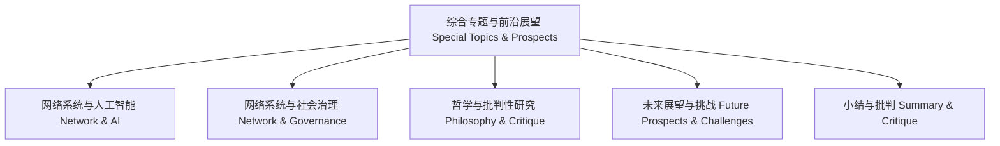

# 综合专题知识图谱 Knowledge Graph of Special Topics & Prospects

<!-- TOC START -->

- [综合专题知识图谱 Knowledge Graph of Special Topics & Prospects](#综合专题知识图谱-knowledge-graph-of-special-topics-prospects)
  - [哲学批判 Philosophical Critique](#哲学批判-philosophical-critique)

<!-- TOC END -->

- 知识图谱展示了综合专题各主题的逻辑结构与内在联系。
- The knowledge graph shows the logical structure and internal connections of special topics.

## 哲学批判 Philosophical Critique

- 图谱化有助于梳理前沿议题，但需警惕热点聚焦下的理论深度缺失。
- Graphical representation helps organize frontier topics, but beware of the lack of theoretical depth under the focus on hot issues.
