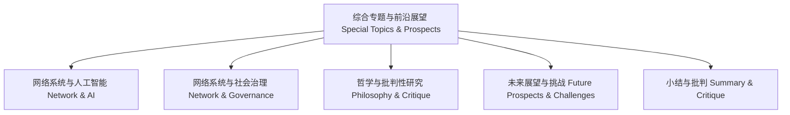

# 综合专题知识图谱 Knowledge Graph of Special Topics & Prospects

<!-- TOC START -->

- [综合专题知识图谱 Knowledge Graph of Special Topics & Prospects](#综合专题知识图谱-knowledge-graph-of-special-topics-prospects)
  - [哲学批判 Philosophical Critique](#哲学批判-philosophical-critique)
  - [国际权威来源链接 | International Authoritative Sources](#国际权威来源链接-international-authoritative-sources)

<!-- TOC END -->

```mermaid
graph TD;
  H[综合专题与前沿展望 Special Topics & Prospects]
  H1[网络系统与人工智能 Network & AI]
  H2[网络系统与社会治理 Network & Governance]
  H3[哲学与批判性研究 Philosophy & Critique]
  H4[未来展望与挑战 Future Prospects & Challenges]
  H5[小结与批判 Summary & Critique]
  H --> H1
  H --> H2
  H --> H3
  H --> H4
  H --> H5
```

- 知识图谱展示了综合专题各主题的逻辑结构与内在联系。
- The knowledge graph shows the logical structure and internal connections of special topics.

## 哲学批判 Philosophical Critique

- 图谱化有助于梳理前沿议题，但需警惕热点聚焦下的理论深度缺失。
- Graphical representation helps organize frontier topics, but beware of the lack of theoretical depth under the focus on hot issues.

## 国际权威来源链接 | International Authoritative Sources

- [ISO/IEC 7498-1 — OSI Basic Reference Model](https://www.iso.org/standard/20269.html)
- [RFC 1122 — Host Requirements](https://datatracker.ietf.org/doc/html/rfc1122)
- [RFC 791 — Internet Protocol (IPv4)](https://datatracker.ietf.org/doc/html/rfc791)
- [RFC 793 — Transmission Control Protocol (TCP)](https://datatracker.ietf.org/doc/html/rfc793)
- [RFC 8200 — Internet Protocol, Version 6 (IPv6)](https://datatracker.ietf.org/doc/html/rfc8200)
- [RFC 5681 — TCP Congestion Control](https://datatracker.ietf.org/doc/html/rfc5681)
- [IEEE 802.3-2022 — Ethernet](https://standards.ieee.org/standard/802.3-2022.html)
- [IEEE 802.1Q-2024 — VLAN Bridging](https://standards.ieee.org/standard/802.1Q-2024.html)
- [NIST AI Risk Management Framework](https://www.nist.gov/itl/ai-risk-management-framework)
- [EU AI Act](https://eur-lex.europa.eu/legal-content/EN/TXT/?uri=CELEX:32024R1689)
